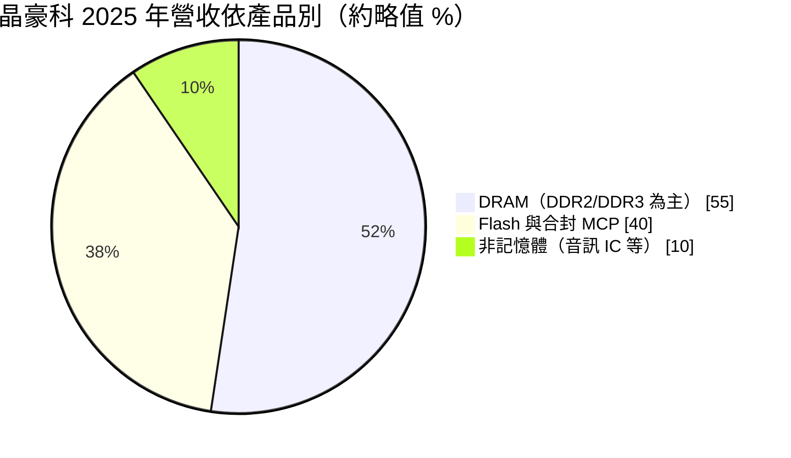
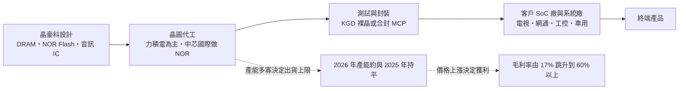
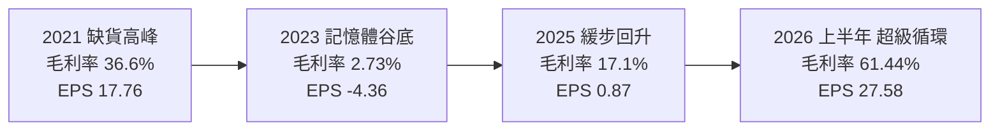
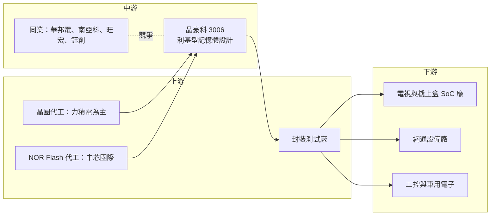

# 3006 晶豪科

> 上市｜[[產業索引-半導體業|半導體業]]｜上市（櫃）日期 2002/03/04

# 第一章：企業模式與商業藍圖

> [!info] 撰寫說明
> 本文由 Claude 依公開資料整理，架構比照 [[2330台積電]] 的四章研究，資料截至 2026-10-08。財務數字來源：Goodinfo 台灣股市資訊網年度經營績效（2020 至 2025 年）、晶豪科 2025 年年報與 2026 年 3 月法說會資料（公司官網）、富果研究 2026 年 3 月法說整理、工商時報 2026 年 7 月財報報導、理財周刊、LINE TODAY 財經新聞、nstock 公司概況；產業描述為整理性內容，尚未逐條比對原始文件。#待校對

在評估單一個股的長期投資價值時，首要步驟是拆解企業的底層獲利邏輯。本章針對晶豪科技股份有限公司（股票代號：3006，以下簡稱晶豪科）的商業模式進行定性分析，說明一家沒有晶圓廠的利基型記憶體設計公司，如何在國際大廠退出舊世代產品後，迎來 2026 年獲利的爆發。

## 一、核心定位：無晶圓廠的利基型記憶體設計公司

晶豪科成立於 1998 年 5 月，2002 年上市，屬於 [[Fabless]] IC 設計公司，自己設計記憶體晶片，委託晶圓代工廠生產。主力產品是[[利基型記憶體]]，也就是容量較小、規格較舊、但在電視、網通設備、機上盒、工控與車用電子中仍大量使用的 [[DRAM]] 與 [[NOR Flash]]。

和 [[2408南亞科]]、[[005930三星電子]] 這類自有晶圓廠的記憶體大廠相比，晶豪科的商業模式有兩個特點：

* **輕資產：** 不需自建晶圓廠，資本支出遠低於記憶體 IDM，景氣差時不必承擔龐大折舊。代價是產能取決於代工夥伴，景氣好時能拿到多少產能是最大變數。
* **專攻大廠不做的市場：** 三星、SK 海力士、美光把產能集中在 [[DDR5]]、[[HBM]] 等主流產品，DDR3、DDR2、SDRAM 等舊規格逐步停產，留下的需求就由晶豪科、華邦電等利基型廠商供應。這個市場規模雖然不大，但大廠退出後供給減少，留下來的廠商反而擁有較好的定價能力。

晶豪科多以[[KGD]]（已測試良品裸晶）形式出貨，客戶再把裸晶和自己的控制晶片封裝在一起，這種出貨方式在電視與網通 SoC 中很常見。

## 二、終端應用與產品板塊：DRAM 過半，Flash 與合封約四成

依富果研究整理的 2026 年 3 月法說會內容，2025 年的營收結構如下（公司口徑為約略值，合計略超過 100%）：

* **DRAM（約 55%）：** 其中 DDR2 與 DDR3 合計約占營收 40%，[[DDR4]] 低於 10%，另有 SDRAM、[[PSRAM]] 與行動 DRAM。主要用於電視、機上盒、網通與消費性電子。
* **Flash 與合封（約 40%）：** [[NOR Flash]] 用來存放開機程式碼，另有 SLC NAND 與多晶片封裝（MCP）產品，把 DRAM 與 Flash 封在一起，節省客戶的電路板空間。NOR Flash 的需求與網通、車用與工控設備的數量直接相關，是晶豪科僅次於 DRAM 的營收支柱。
* **非記憶體（約 10%）：** 電視用的音訊放大器、電源管理與類比 IC。這部分營收規模較小，但能讓晶豪科在電視客戶中提供記憶體以外的產品，增加客戶黏著度。

依出貨顆數計算，2025 年總出貨約 15 億顆，NOR Flash 超過 30%、DDR2/DDR3 約 30%、音訊 IC 近 15%、SDRAM 超過 10%。

## 三、資本轉化邏輯：設計加外包產能的價格槓桿

* **代工夥伴集中：** 依法說會內容，[[6770力積電]]是晶豪科最主要的代工廠，晶豪科也是力積電最大客戶；NOR Flash 則主要由中芯國際代工。雙方綁定深，產能分配上有一定優勢。
* **價格是獲利關鍵：** 晶豪科不能自行擴產，2026 年產能與 2025 年大致相當，營收成長幾乎全部來自售價上漲。依工商時報報導，合約價從 2025 年第四季開始上漲，2026 年第二季部分產品價格季增幅度達一倍。由於成本相對固定，漲價幾乎直接轉為毛利。

## 四、企業長期藍圖：製程微縮、邊緣 AI 與車用

依 2025 年年報揭露的 2026 年策略：

* **製程微縮：** 擴充 25 奈米與 21 奈米利基型 DRAM 產品線，加快 19 奈米 DRAM 商品化，降低單位成本並延長產品生命週期。製程微縮能讓同一片晶圓切出更多晶片，是晶豪科在不自建晶圓廠的情況下提高成本競爭力的主要方法。
* **邊緣 AI：** 推出 aiPIM（記憶體內運算）架構，鎖定邊緣 AI 裝置。AI 應用擴展到終端裝置，推估會推升小容量、低功耗記憶體的需求。
* **車用記憶體：** 擴充通過 ISO 26262 功能安全認證的車規記憶體，切入驗證期長、價格穩定的車用市場。車用記憶體的驗證期長、產品生命週期長，一旦導入可以穩定供貨多年，能降低晶豪科對消費性市場價格循環的依賴。
* **非記憶體產品：** 開發物聯網無線晶片、馬達驅動 IC 與感測器，降低對記憶體價格循環的依賴。依 nstock 公司概況，晶豪科也曾合併集新科技與宜揚科技擴充研發能力。

# 第二章：護城河深度與競爭優勢

在長期價值投資中，「護城河」指企業抵禦競爭、維持超額利潤的保護機制。本章分析晶豪科在利基型記憶體市場的競爭地位，以及這一波由供給缺口帶來的超額利潤能維持多久。

## 一、晶豪科護城河的核心組成要素

記憶體是標準化程度很高的商品，晶豪科的護城河屬於「窄護城河」，而且具有明顯的週期性，主要由以下三個要素組成：

* **1. 舊規格產品的長期供貨承諾：** 電視、網通、工控與車用客戶的產品生命週期長，一旦設計採用某顆 DDR3 或 NOR Flash，就希望供應商能持續供貨五到十年。國際大廠退出後，晶豪科成為少數願意長期供應的廠商，這是一種「留下來的人」優勢。
* **2. 與代工夥伴的深度綁定：** 晶豪科是力積電最大客戶，在產能吃緊時，長期合作關係比新客戶更容易拿到產能。對無晶圓廠的設計公司而言，產能就是出貨上限，這種長期綁定在景氣高峰期的價值特別明顯。
* **3. 產品組合與 KGD 能力：** 同時提供 DRAM、NOR、NAND、合封與音訊 IC，加上 KGD 測試能力，可以滿足 SoC 客戶一次採購多種記憶體的需求。KGD 需要在裸晶階段就完成完整測試，技術與品管要求高於一般封裝產品，是晶豪科與小型同業的區隔。

## 二、全球主要競爭對手格局

| 對手 | 定位 | 對晶豪科的威脅 |
|---|---|---|
| [[005930三星電子]]、SK 海力士、美光 | 全球記憶體三大廠 | 轉向 HBM 與 DDR5，逐步退出舊規格，反而讓出市場 |
| [[2344華邦電]] | 台灣利基型 DRAM 與 Flash IDM | 自有晶圓廠，產品線重疊；法說會提到華邦逐步退出 DDR3 以下市場 |
| [[2408南亞科]] | 台灣標準型與利基型 DRAM IDM | 產能大，DDR4 與 DDR3 直接競爭 |
| [[2337旺宏]]、兆易創新 | NOR Flash 大廠 | 在 NOR Flash 市占與價格上的主要對手 |
| [[5351鈺創]]、ISSI、中國利基型記憶體廠 | 利基型 DRAM 設計公司 | 搶同一批電視、網通客戶，中國廠以價格競爭 |

## 三、優勢轉化：哪些市場守得住、哪些守不住

* **守得住：** 國際大廠退出後的 DDR3、DDR2 與小容量 NOR Flash，以及需要長期供貨與車規認證的客戶。在供給缺口存在的期間，晶豪科有很強的定價能力。
* **守不住：** 一旦價格高到足以吸引新產能，中國利基型記憶體廠可能擴產進入；另外，晶豪科沒有自己的晶圓廠，產能擴充受限於代工夥伴，無法在高峰期大幅放量。記憶體的進入門檻主要是資金與製程，只要價格夠高，新產能遲早會出現，這是利基型記憶體超額利潤難以長期維持的原因。
* **觀察重點：** 一是國際大廠退出舊規格的速度，這決定利基型記憶體供給缺口能維持多久；二是在景氣高峰時能從力積電與其他代工廠取得多少產能；三是 21 奈米、19 奈米新產品與車用記憶體的進度，這決定晶豪科在下一次價格下行時能否守住比過去更高的毛利率。這三點合起來，決定晶豪科在一個完整循環中的平均獲利水準。

# 第三章：財務體質與盈利規模

資料日期：2026-10-08。年度數字取自 Goodinfo 台灣股市資訊網的年度經營績效（合併報表），2026 年上半年取自工商時報與理財周刊報導，表格是撰寫當時的快照；最新月營收、毛利率、累計 EPS 由自動排程寫在本筆記的屬性欄位（月營收、毛利率、累計EPS 等）。#待校對

財務報表是檢驗護城河是否真實存在的最終標準。本章用多年度的三率、ROE、現金流與資本報酬，檢視晶豪科在記憶體價格循環中的獲利彈性。對晶豪科這類公司，單一年度的數字幾乎沒有意義，必須看完整循環。

## 一、獲利能力的基石：三率

| 年度 | 營收（億元） | [[毛利率]] | [[營業利益率]] | EPS（元） | [[ROE]] |
|---|---|---|---|---|---|
| 2021 | 238 | 36.6% | 24.6% | 17.76 | 48.5% |
| 2022 | 162 | 18.4% | 4.89% | 3.71 | 9.16% |
| 2023 | 119 | 2.73% | -13.8% | -4.36 | -11.3% |
| 2024 | 135 | 12.1% | -2.93% | 1.80 | 4.99% |
| 2025 | 146 | 17.1% | 2.36% | 0.87 | 2.39% |
| 2026 上半年 | 212.13 | 61.44% | 44.44% | 27.58 | 未查得 |

註：2020 年營收 153 億元、毛利率 17.4%、EPS 3.85 元，作為循環起點參考。2024 年營業虧損但 EPS 為正，推估來自業外收益。

這張表是理解晶豪科最重要的資料，它呈現了利基型記憶體設計公司典型的「暴漲暴跌」獲利模式。

第一，**毛利率的振幅極大。** 2021 年缺貨時毛利率 36.6%，兩年後的 2023 年只剩 2.73%，等於幾乎沒有毛利；2026 年上半年又衝上 61.44%。晶豪科的產能取決於代工夥伴、出貨量變化有限，毛利率的大起大落幾乎完全來自記憶體報價。

第二，**營業利益率的振幅比毛利率更大。** 研發與管理費用相對固定，毛利率一旦低於約 15%，營業利益就轉為虧損，2023 年營業利益率為 -13.8%；反之毛利率超過 30% 以後，大部分增加的毛利都直接轉為營業利益。這種高[[營運槓桿]]讓晶豪科在景氣高峰時獲利暴增，在谷底時連續虧損。

第三，**營收長期沒有明顯成長。** 2020 年營收 153 億元，2025 年 146 億元，五年間幾乎持平，2021 年的 238 億元則是缺貨推升的高點。晶豪科的長期價值不在於營收逐年成長，而在於每一次循環高峰能賺到多少、低谷時能否守住不大幅虧損。

## 二、[[ROE]]：資本效率

2021 至 2025 年的 ROE 分別為 48.5%、9.16%、-11.3%、4.99%、2.39%，五年平均約 10.7%（推算）。五年平均看起來中等，但實際上幾乎全部來自 2021 年一年。這說明評估晶豪科不能用某一年的 ROE 外推，而應看一個完整循環的平均值。

晶豪科是無晶圓廠的輕資產公司，股本約 28.6 億元多年未變，每股淨值在 2021 年高點約 46.6 元，2025 年約 37.8 元。經營層在高峰期累積的現金，幫助公司撐過 2023 年的虧損，沒有因此辦理增資，這是輕資產模式在下行期的優勢。

## 三、資本支出與自由現金流

晶豪科沒有晶圓廠，資本支出主要是測試設備、光罩與研發，相對營收很小（推估，具體金額未查得）。對這類公司而言，影響現金流的關鍵不是資本支出，而是營運資金：景氣上行時要預付代工費用、建立庫存，營業現金流可能落後於獲利；景氣反轉時則可能出現[[存貨跌價損失]]，使帳面獲利與現金流同時惡化。

股利方面，2025 年度配發現金股利 1 元，高於當年 EPS 0.87 元。晶豪科的股利隨獲利大幅波動，缺乏穩定性，這與記憶體循環的特性一致。投資人不宜把高峰年度的股利當成可持續的殖利率。

## 四、[[ROIC]] 與 [[WACC]]：價值創造利差

**ROIC 推算：** 本文未查得來源直接揭露的 ROIC，因此用「稅後營業利益 ÷ 投入資本」推算。晶豪科是 IC 設計公司，本文未查得有息負債明細，推估借款不多，因此以股東權益近似投入資本。2025 年營業利益約 3.45 億元，以稅率 20% 計算，稅後營業利益約 2.8 億元；股東權益以每股淨值 37.8 元 × 約 2.86 億股推算約 108 億元，ROIC 約 2.5%（推算）。以同樣方法計算 2021 年，稅後營業利益約 46.8 億元（238 億元 × 24.6% × 80%），股東權益約 133 億元，ROIC 約 35%（推算）；2023 年營業虧損，ROIC 為負值。

**WACC 推算：** 以 CAPM 估算，假設台灣 10 年期公債殖利率約 1.75%、市場風險溢酬約 6%、β 值取記憶體類股常見的 1.3（本文未查得晶豪科的 β 值，此為假設），股東要求報酬率約 1.75% + 1.3 × 6% = 9.55%。由於推估幾乎沒有有息負債，WACC 約等於股東要求報酬率，約 9.5%（推算）。

**解讀：** 晶豪科的 ROIC 在循環高峰遠高於 WACC，在谷底則明顯低於 WACC，2022 至 2025 年連續四年 ROIC 低於 WACC，屬於價值毀損期；2026 年價格暴漲後，ROIC 將再度遠高於 WACC（推估）。判斷晶豪科是否長期創造價值，要看一個完整循環的平均 ROIC 是否高於約 9.5% 的資金成本。以 2021 至 2025 年粗估，平均值大致與 WACC 相當，代表晶豪科能否為股東創造超額價值，取決於 2026 年這一波高峰能持續多久，以及高峰期的盈餘如何配置。

# 第四章：總體風險與地緣政治

任何企業都無法脫離宏觀環境獨立存在。本章分析晶豪科長期必須面對的地緣政治、產業週期與營運風險，以及記憶體技術演進帶來的挑戰。

## 一、地緣政治風險

晶豪科的地緣政治風險有兩個來源。第一是生產端：NOR Flash 主要委由中芯國際代工，若美國擴大對中國半導體的管制，可能影響供貨或增加合規成本，晶豪科需要準備其他代工來源。第二是客戶端：電視與網通客戶有相當比例在中國，2025 年年報提到中國電視市場面臨「國產替代的嚴酷挑戰」，中國品牌在政策引導下會逐步改用本土記憶體。

更長期的威脅來自中國記憶體產業的崛起。中國政府以政策與資金扶植本土記憶體廠，若這些廠商大舉進入利基型 DRAM 與 NOR Flash，將成為下一輪價格下跌的主要來源，也會壓縮晶豪科在中國以外市場的報價。此外，主要代工夥伴力積電位於台灣，晶豪科與其他台灣半導體廠一樣面臨兩岸風險。

## 二、產業週期與市場結構風險

記憶體是全球週期性最強的半導體產品之一，晶豪科的獲利幾乎完全由價格循環決定。2021 年缺貨時毛利率 36.6%，2023 年跌到 2.73%，2026 年上半年又衝上 61.44%。這種振幅代表投資人必須把晶豪科視為循環股，在高峰期評估時要預想價格反轉後的獲利水準，而不是把高峰獲利當作常態。

[[長鞭效應]]會放大這個循環。缺貨時客戶擔心拿不到貨，會重複下單、超額備貨，使需求被高估；景氣反轉時客戶同時去化庫存，訂單下滑速度比終端需求更快。晶豪科作為上游記憶體供應商，承受的波動比終端產品廠商大得多。

產能限制則是晶豪科特有的結構問題。晶豪科不擁有晶圓廠，在高峰期能出貨多少，取決於代工夥伴願意分配多少產能。2026 年法說會就指出產能供給是當年最大變數，這代表晶豪科在最賺錢的時期反而可能因拿不到產能而錯失訂單。

## 三、營運環境的隱性風險

代工夥伴集中是晶豪科最大的營運風險。力積電是最主要的 DRAM 代工廠，晶豪科也是力積電最大客戶，雙方關係緊密，但若力積電調整產能配置、轉向其他產品或營運出現問題，晶豪科短期內缺乏替代方案。

存貨評價是記憶體設計公司在景氣反轉時最常見的損失來源。高價時建立的庫存，在價格下跌時必須依會計規定提列[[存貨跌價損失]]，這會讓帳面獲利比營收下滑得更快，2023 年的虧損就有相當部分來自這個因素（推估）。

匯率也會影響獲利。晶豪科營收以美元計價為主，新台幣升值會壓縮以台幣計算的營收與毛利，在毛利率偏低的谷底年度，匯率變動的影響會更明顯。

## 四、科技演進風險

利基型記憶體的需求來自舊規格產品的長尾，但終端產品會持續升級。DDR3 終究會被 [[DDR4]]、[[LPDDR]] 取代，晶豪科需要持續推進 21 奈米、19 奈米製程與新規格產品，才能在舊產品需求萎縮時接續成長，並降低單位成本以應對中國同業的價格競爭。

另一個長期變數是系統架構的改變。若 SoC 廠改用內建記憶體、或採用其他封裝整合方式，外掛 [[KGD]] 的需求可能下降。晶豪科推出的 aiPIM 記憶體內運算架構，是把記憶體從「被動儲存元件」轉為「具備運算能力的元件」的嘗試，能否形成實際營收，是判斷晶豪科長期技術競爭力的觀察點。

# 專有名詞解析

## 半導體

- **[[利基型記憶體]]**：容量較小、規格較舊的記憶體，主要用於電視、網通、工控與車用等產品，國際大廠逐步退出後由中小型廠供應。
- **[[DRAM]]**：動態隨機存取記憶體，斷電後資料會消失，是電腦與各類電子產品的主要工作記憶體。
- **[[NOR Flash]]**：可直接執行程式碼的非揮發性記憶體，容量小、讀取快，常用來存放開機程式。
- **[[PSRAM]]**：偽靜態隨機存取記憶體，以 DRAM 結構模擬 SRAM 介面，功耗低、介面簡單，常用於物聯網裝置。
- **[[KGD]]**：已測試良品裸晶，晶片在封裝前就完成測試確認可用，客戶可直接與自家晶片合封。
- **[[DDR4]]**：第四代雙倍資料率 DRAM 規格，2014 年起成為 PC 與伺服器主流，目前逐步被 DDR5 取代。
- **[[DDR5]]**：第五代雙倍資料率 DRAM 規格，頻寬與容量高於 DDR4，是目前 PC 與伺服器的主流規格。
- **[[LPDDR]]**：低功耗 DRAM 規格，主要用於手機、平板與輕薄筆電。
- **[[Fabless]]**：無晶圓廠的 IC 設計公司，只負責設計與銷售，生產委由晶圓代工廠。
- **[[HBM]]**：高頻寬記憶體，把多顆 DRAM 垂直堆疊，主要用於 AI 加速器，三大記憶體廠把產能優先投入此產品。

## 金融

- **[[營運槓桿]]**：固定成本比重高的企業，營收小幅成長就能帶動營業利益大幅成長；反之營收下滑時獲利也衰退更快。
- **[[存貨跌價損失]]**：存貨的市價低於帳面成本時，依會計規定須認列的損失，記憶體價格下跌時常見。
- **[[長鞭效應]]**：終端需求的小幅變動，沿供應鏈往上游傳遞時被逐級放大，造成上游庫存與訂單劇烈波動。

# 核心供應鏈

## 1. 上游：晶圓代工與封測
- DRAM 主要代工夥伴：[[6770力積電]]（晶豪科為其最大客戶）
- NOR Flash 代工：中芯國際
- 封裝測試：公司未揭露具體合作對象

## 2. 中游：晶豪科本身與同業
- 利基型記憶體 IDM：[[2344華邦電]]、[[2408南亞科]]
- NOR Flash 對手：[[2337旺宏]]、兆易創新
- 利基型 DRAM 設計同業：[[5351鈺創]]、ISSI
- 國際大廠（逐步退出舊規格）：[[005930三星電子]]、SK 海力士、美光

## 3. 下游：應用市場
- 電視、機上盒與多媒體 SoC 廠：例如 [[3034聯詠]]、[[2379瑞昱]] 屬此類應用的 SoC 廠（推估，非公司揭露客戶）
- 網通設備、工控與車用電子廠

## 最新新聞
<!-- news:start（自動產生，請勿手動編輯此範圍） -->
- 2026-10-05 📰 媒體 17:00｜晶豪科(3006)9月營收年增470%已是去年全年近3倍，記憶體漲價行情還能走多久？｜[鉅亨網](https://news.cnyes.com/news/id/6621790)
- 2026-10-05 📰 媒體 12:31｜晶豪科(3006)產能幾乎沒增加，9月營收卻年增470%！第三季暴增59%，關鍵全在記憶體漲價｜[鉅亨網](https://news.cnyes.com/news/id/6621628)

完整紀錄：[[3006晶豪科 新聞]]
<!-- news:end -->

## 相關連結
- [公開資訊觀測站](https://mopsov.twse.com.tw/mops/web/t05st03?step=1&firstin=1&co_id=3006)
- [Goodinfo](https://goodinfo.tw/tw/StockDetail.asp?STOCK_ID=3006)
- [Yahoo 股市](https://tw.stock.yahoo.com/quote/3006)
- [鉅亨網新聞](https://www.cnyes.com/twstock/3006/news)
