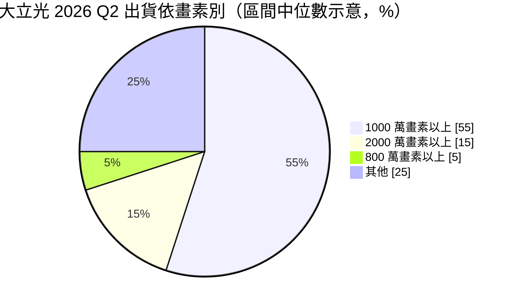
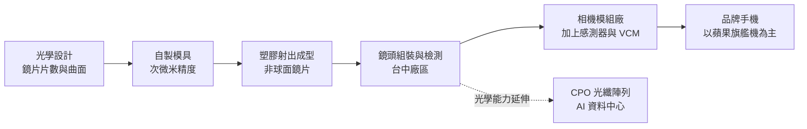
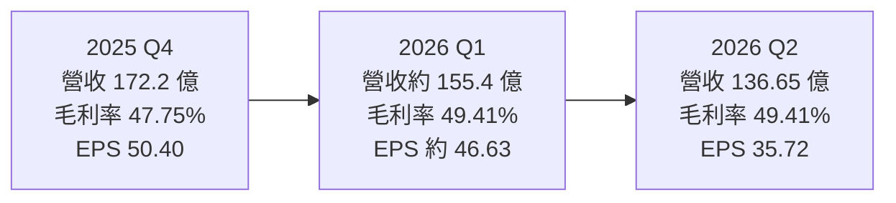
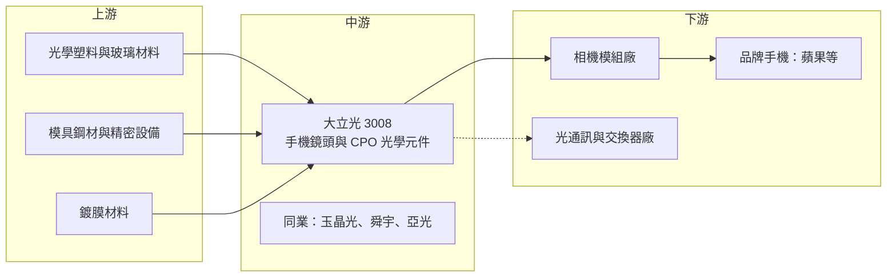

# 3008 大立光

> 上市｜[[產業索引-光電業|光電業]]｜上市（櫃）日期 2002/03/11

# 第一章：企業模式與商業藍圖

> [!info] 撰寫說明
> 本文由 Claude 依公開資料整理，架構比照 [[2330台積電]] 的四章研究，資料截至 2026-10-07。財務數字來源：ETtoday 財經雲 2026 年第二季法說會報導、優分析 2025 年第四季法說會報導、理財周刊 2026 年 7 月報導、Yahoo 股市公司基本資料、股感知識庫；產業描述為整理性內容，尚未逐條比對原始文件。#待校對

在評估單一個股的長期投資價值時，首要步驟是拆解企業的底層獲利邏輯。本章針對大立光電（股票代號：3008，以下簡稱大立光）的商業模式進行定性分析，說明它如何在手機鏡頭這個看似標準化的零組件市場維持近五成的毛利率，以及為何開始把光學能力延伸到 AI 資料中心的光通訊。

## 一、核心定位：全球高階手機鏡頭龍頭

大立光成立於 1987 年 4 月 17 日，總部在台中，2002 年上市，現任董事長為林恩平。公司 1991 年開始量產塑膠鏡片，2000 年後搭上照相手機浪潮，依股感整理的資料，全球手機鏡頭市占率超過三成，是少數能量產 8P、9P 高階鏡頭的廠商（P 代表一顆鏡頭中塑膠鏡片的片數）。

大立光的產品是「鏡頭」本身，也就是把多片[[非球面鏡片]]、間隔環與鏡筒組裝成一個光學模組，再交給相機模組廠和感測器、音圈馬達（[[VCM]]）一起組成手機相機。它的商業模式有兩個特點：

* **以精密製造換取高毛利：** 鏡片的形狀精度要求在次微米等級，模具設計、射出成型與組裝都是自製。良率高的廠商可以把成本壓到同業之下，這是大立光長期毛利率遠高於同業的原因。
* **高度集中於旗艦機：** 主要客戶是 [[AAPL蘋果]]，產品集中在高畫素主鏡頭與[[潛望式鏡頭]]，營收與旗艦手機的拉貨週期高度連動。

## 二、終端應用板塊：高畫素鏡頭為主

大立光不揭露應用別營收，但會公布畫素別出貨比重。依 2026 年第二季法說會，1,000 萬畫素以上占 50% 至 60%，2,000 萬畫素以上占 10% 至 20%，800 萬畫素以上占 0% 至 10%，其餘占 20% 至 30%。由於公司只給區間，這裡以區間中位數示意：

* **手機主鏡頭與潛望鏡：** 營收主體，畫素與光圈升級推動鏡片片數增加，有利於大立光的高階製程。
* **前鏡頭、超廣角與其他：** 單價較低，競爭較激烈。
* **新事業：** [[CPO]] 用的光纖陣列（FA）與微稜鏡準直鏡頭，2026 年已取得首張 FA 量產訂單，尚未對營收有明顯貢獻。

## 三、資本轉化邏輯：模具與良率就是利潤

* **垂直整合製程：** 從光學設計、模具、射出、鍍膜到組裝都在內部完成，生產集中在台中。2026 年法說會提到製程精度已達 0.3 微米以下，並持續推動自動化。
* **良率決定毛利：** 新機種量產初期良率較低，毛利率會下滑，隨良率爬坡回升。2026 年第二季法說會再次強調新機種良率是毛利率的關鍵。
* **高現金、無負擔：** 大立光長年保有大量現金，資本支出以廠房與自動化設備為主，獲利大部分可以配發股利，採一年兩次配息。

## 四、企業長期藍圖：從手機鏡頭跨入光通訊

* **CPO 新事業：** 林恩平在 2026 年第二季法說會表示已收到量產型客戶的正式規格文件，預計 7 月送樣，順利的話第三季底試產，最快 2027 年年中放量。理財周刊報導公司近期在台中購地約 25.68 億元，用於新事業產能。
* **手機鏡頭規格升級：** 潛望式長焦、可變光圈與更大感測器，持續提高鏡片片數與精度門檻。
* **新應用：** 車用鏡頭、AR/VR 等光學應用，屬長期選項，目前比重未揭露。

# 第二章：護城河深度與競爭優勢

在長期價值投資中，「護城河」指企業抵禦競爭、維持超額利潤的保護機制。本章分析大立光的護城河構成、全球主要競爭對手，以及這些優勢在中國鏡頭廠追趕下能守住多少。

## 一、大立光護城河的核心組成要素

大立光是台灣電子零組件中少數擁有「寬護城河」特徵的公司，由三個要素組成：

* **1. 製程 know-how 與良率：** 高階鏡頭的片數越多，累積公差越難控制。大立光自製模具並長期累積製程參數，能在高階規格維持較高良率，這是同業最難複製的部分。
* **2. 專利布局：** 大立光擁有大量光學設計專利，過去曾對同業提起專利訴訟，提高對手進入高階規格的法律成本。
* **3. 旗艦客戶的信任：** 高階手機每年的鏡頭規格都要提前一兩年共同開發，大立光長期是旗艦機主鏡頭的主要供應商，新規格往往由它先量產。

## 二、全球主要競爭對手格局

| 對手 | 定位 | 對大立光的威脅 |
|---|---|---|
| 舜宇光學 | 中國最大手機鏡頭與模組廠 | 出貨量大，深耕中國品牌，逐步切入高階 |
| [[3406玉晶光]] | 台灣鏡頭廠，蘋果供應商 | 在蘋果部分鏡頭分食份額 |
| 瑞聲科技 | 中國聲學與光學廠，發展玻塑混合鏡頭 | 以不同技術路線爭取高階規格 |
| [[3019亞光]] | 台灣光學廠 | 在車用與安控鏡頭競爭 |

## 三、優勢轉化：哪些市場守得住、哪些守不住

* **守得住：** 旗艦機高畫素主鏡頭與潛望鏡，規格門檻高、量產良率是關鍵，大立光仍居領先。
* **守不住：** 中低階手機鏡頭與中國品牌訂單，中國廠以規模與在地優勢取得主導地位。
* **觀察重點：** 毛利率已從過去接近七成，降到 2025 年的 50.4% 與 2026 年上半年的 49.4%，顯示定價能力逐步受壓。理財周刊也指出[[玻塑混合鏡頭]]與純塑膠鏡頭的技術路線選擇是一大變數。CPO 能否在 2027 年如期放量，是大立光能否建立第二支柱的關鍵。

# 第三章：財務體質與盈利規模

資料日期：2026-10-07。數字取自公司法說會相關報導（ETtoday、優分析、理財周刊），表格是撰寫當時的快照；最新月營收、毛利率、累計 EPS 由自動排程寫在本筆記的屬性欄位（月營收、毛利率、累計EPS 等）。#待校對

財務報表是檢驗護城河是否真實存在的最終標準。本章用三率、ROE、現金流與資本報酬，檢視大立光在手機週期中的獲利品質。

## 一、獲利能力的基石：三率

| 項目 | 2025 全年 | 2025 Q4 | 2026 Q1 | 2026 Q2 |
|---|---|---|---|---|
| 營收（新台幣） | 611.48 億 | 172.18 億 | 約 155.4 億（推算） | 136.65 億 |
| [[毛利率]] | 50.37% | 47.75% | 49.41% | 49.41% |
| [[營業利益率]] | 未查得 | 未查得 | 約 37.4%（推算） | 約 37.7%（推算） |
| 稅後淨利 | 212.82 億 | 67.27 億 | 約 61.2 億（推算） | 46.7 億 |
| EPS（元） | 159.46 | 50.40 | 約 46.63（推算） | 35.72 |

* **[[毛利率]]：** 2026 年第二季營收年增 17.1%，但毛利率較去年同期下滑 4.22 個百分點，營業利益只年增 5.5%。理財周刊形容為「多做一塊錢生意，利潤卻變薄」，反映產品組合與價格壓力。
* **[[營業利益率]]：** 第二季營業利益 51.48 億元，換算營益率約 37.7%，仍屬零組件業極高水準。
* **業外與匯率：** 大立光持有大量美元資產，匯率波動對淨利影響大。2026 年第二季淨利年增 452%，主要是 2025 年同期出現大額匯兌損失、基期偏低，並非本業大幅成長。評估本業時應以營業利益為準。

## 二、[[ROE]]：資本效率

大立光幾乎沒有金融負債，但保有龐大現金，權益基數大，ROE 因此被現金稀釋。以 2025 年 EPS 159.46 元推估，ROE 仍在雙位數，但低於 2010 年代高峰（具體數值未查得）。

## 三、資本支出與自由現金流

* **[[CapEx]]：** 以台中廠房與自動化設備為主，2026 年新增 CPO 相關購地約 25.68 億元。
* **[[自由現金流]]：** 營業現金流長年遠高於資本支出，自由現金流充裕，採一年兩次發放現金股利，配息金額隨獲利波動。

## 四、[[ROIC]] 與 [[WACC]]：價值創造利差

若扣除大量閒置現金，大立光本業的投入資本報酬率推估遠高於資金成本，這是寬護城河的財務特徵。風險在於毛利率持續下滑，以及 CPO 新事業在 2028 年前難以反映到財報，期間新廠投資會先拉低資本報酬。

# 第四章：總體風險與地緣政治

任何企業都無法脫離宏觀環境獨立存在。本章分析大立光未來必須面對的地緣政治、產業週期與營運風險。

## 一、地緣政治風險

* **中國市場與客戶：** 理財周刊指出華為等客戶受美國禁令影響，中國品牌也傾向扶植本土鏡頭廠，大立光在中國市場的份額受限。
* **生產集中台灣：** 主要產能在台中，面臨兩岸風險；美國關稅政策對手機供應鏈的影響也會間接傳導。

## 二、產業週期與市場結構風險

* **手機市場成熟：** 全球智慧型手機出貨已進入低成長，成長只能靠規格升級。
* **客戶集中：** 營收高度依賴蘋果，新機銷售、規格決策與供應商分配直接影響營收，產生明顯的季節性：下半年拉貨旺季，上半年淡季。
* **[[長鞭效應]]：** 品牌廠調整庫存時，零組件廠的訂單波動會被放大。

## 三、營運環境的隱性風險

* **新機種良率：** 每年新規格量產初期良率低，是毛利率波動的主因。
* **匯率：** 以美元計價營收與大量美元資產，新台幣升值會同時影響營收與業外損益。
* **資源分散：** CPO 是全新事業，客戶、技術與製程都不同，理財周刊列為轉型風險之一。

## 四、科技演進風險

* **技術路線：** 玻塑混合鏡頭、超透鏡（[[Metalens]]）等新技術若成為主流，可能削弱純塑膠鏡片的製程優勢。
* **光通訊路線：** CPO 的標準與架構仍在演進，若主流方案改變，大立光的 FA 產品可能需要重新開發。

# 專有名詞解析

## 半導體

- **[[良率]]**：合格產品占總產出的比例，新機種量產初期良率是大立光毛利率的主要變數。

## 應用

- **[[CPO]]**：共同封裝光學，把光學收發元件和交換器晶片封裝在一起，可降低高速傳輸的耗電。
- **[[光纖陣列]]**：FA，把多條光纖精準排列固定的元件，是 CPO 與光模組中光纖對準晶片的關鍵零件。

## 金融

- **[[CapEx]]**：資本支出，企業購買土地、廠房與設備的支出。
- **[[自由現金流]]**：營業活動現金流減去資本支出，代表企業可自由用於配息、還債或併購的現金。
- **[[長鞭效應]]**：終端需求的小幅變動，沿供應鏈往上游傳遞時被逐級放大，造成上游庫存與訂單劇烈波動。

## 產業

- **[[非球面鏡片]]**：表面曲率不是單一球面的鏡片，可用較少片數修正像差，是手機鏡頭小型化的關鍵。
- **[[潛望式鏡頭]]**：把光路以稜鏡轉折 90 度、在手機內部橫向排列鏡片的長焦鏡頭，可在薄機身內實現高倍光學變焦。
- **[[玻塑混合鏡頭]]**：同一鏡頭中混用玻璃與塑膠鏡片，兼顧玻璃的光學性能與塑膠的輕薄和成本。
- **[[VCM]]**：音圈馬達，推動鏡頭前後移動以完成自動對焦的小型馬達。
- **[[Metalens]]**：超透鏡，以奈米結構在平面上操控光線的光學元件，可能取代部分傳統曲面鏡片。

# 核心供應鏈

## 1. 上游：材料與設備
- 光學級塑膠與玻璃材料：多為日本化學廠，大立光未揭露具體供應商
- 精密模具與射出設備：以自製模具為主

## 2. 中游：鏡頭同業
- [[3406玉晶光]]、[[3019亞光]]、舜宇光學、瑞聲科技

## 3. 下游：手機品牌與模組
- 品牌手機：[[AAPL蘋果]]
- 影像感測器搭配：[[SONY索尼]]（產業搭配關係，非大立光直接客戶）

## 4. 新事業：光通訊
- CPO 光纖陣列客戶未揭露，終端為 AI 資料中心交換器

## 最新新聞
<!-- news:start（自動產生，請勿手動編輯此範圍） -->
- 2026-10-05 📰 媒體 22:11｜鉅亨速報 - Factset 最新調查：大立光(3008-TW)EPS預估下修至187.88元，預估目標價為5300元｜[鉅亨網](https://news.cnyes.com/news/id/6622073)
- 2026-10-05 📰 媒體 18:22｜大立光9月營收57.79億元月增15.31% 仍處市場拉貨旺季｜[鉅亨網](https://news.cnyes.com/news/id/6621857)

完整紀錄：[[3008大立光 新聞]]
<!-- news:end -->

## 相關連結
- [公開資訊觀測站](https://mopsov.twse.com.tw/mops/web/t05st03?step=1&firstin=1&co_id=3008)
- [Goodinfo](https://goodinfo.tw/tw/StockDetail.asp?STOCK_ID=3008)
- [Yahoo 股市](https://tw.stock.yahoo.com/quote/3008)
- [鉅亨網新聞](https://www.cnyes.com/twstock/3008/news)
