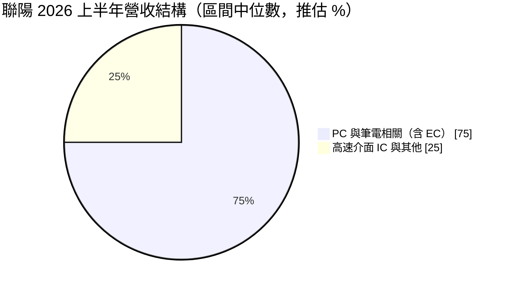
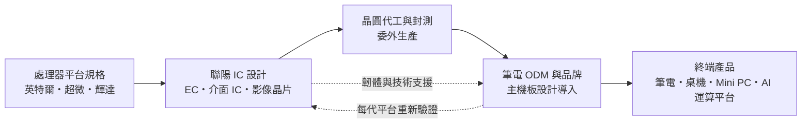
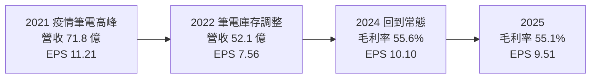
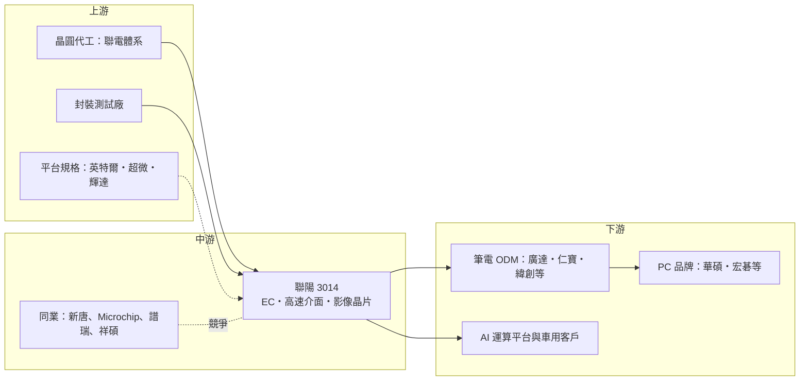

# 3014 聯陽

> 上市｜[[產業索引-半導體業|半導體業]]｜上市（櫃）日期 2002/10/29

# 第一章：企業模式與商業藍圖

> [!info] 撰寫說明
> 本文由 Claude 依公開資料整理，架構比照 [[2330台積電]] 的四章研究，資料截至 2026-10-08。財務數字來源：Goodinfo 台灣股市資訊網年度經營績效（2020 至 2025 年）、富果研究 2026 年 5 月與 9 月法說整理、玩股網財報彙整、科技新報月營收報導、經濟日報、旺得富（中時）股利報導、nstock 公司概況；產業描述為整理性內容，尚未逐條比對原始文件。#待校對

在評估單一個股的長期投資價值時，首要步驟是拆解企業的底層獲利邏輯。本章針對聯陽半導體股份有限公司（股票代號：3014，以下簡稱聯陽）的商業模式進行定性分析，說明一家營收高度依賴筆電的 IC 設計公司，為何能長期維持五成以上的毛利率，以及它如何嘗試跨出 PC 市場。

## 一、核心定位：全球筆電嵌入式控制器龍頭

聯陽於 1996 年 5 月在新竹科學園區設立，屬於聯電集團體系的 [[Fabless]] IC 設計公司，2002 年上市。依經濟日報報導，聯陽的[[EC]]（嵌入式控制器）占營收約五成，在全球筆電 EC 市場的市占率超過 45%。

EC 是筆電主機板上的一顆小型控制晶片，負責鍵盤掃描、電池充放電管理、風扇轉速、電源開關與開機時序等工作。它不是筆電中最昂貴的晶片，卻是每一台筆電都必須有的元件。這種產品有兩個商業特性：

* **韌體與平台綁定：** EC 需要配合 [[INTC英特爾]] 與 [[AMD超微]] 每一代處理器平台的電源規格，並由筆電品牌與 ODM 撰寫大量韌體。換供應商就要重寫韌體、重新驗證，轉換成本高。
* **量大但高度集中：** 全球筆電一年出貨約一億多台，聯陽客戶涵蓋全球主要 NB 與 PC 品牌以及關鍵 ODM，市場集中度高，龍頭廠商的定價能力強。市場集中代表客戶數量有限，失去任何一家大客戶的影響都很大，但也代表龍頭廠商一旦站穩，地位很難被撼動。

## 二、終端應用與產品板塊：PC 與筆電占七到八成

依富果研究整理的 2026 年 9 月法說會內容，PC 與筆電相關產品占營收 70% 至 80%，高速傳輸介面 IC 與其他產品占 20% 至 30%。下圖以區間中位數繪製，屬推估：

* **EC 嵌入式控制器：** 占營收約五成，是獲利核心。已導入輝達代理式 AI 運算平台，依經濟日報報導，市場推測新客戶為 [[NVDA輝達]] 的 RTX Spark 平台，聯陽在該平台取得多數設計案（Design Win），公司未正式確認客戶名稱。
* **高速傳輸介面 IC：** 包括 HDMI 2.1 [[Retimer]] 等訊號重整晶片，獲美系代理式 AI 平台參考設計採用，預計最快 2026 年下半年量產。Retimer 的技術門檻與單價都高於 EC，若能放量，可以提高聯陽的產品組合與平均毛利。
* **影像擷取與編碼晶片：** 影像擷取與 DVB-T 數位電視編碼晶片，其中 DVB-T 編碼器毛利率超過 70%。這類產品營收規模不大，但毛利率高，能小幅拉高公司整體的獲利水準。
* **車用 SoC：** 新業務，已獲印度摩托車廠採用，2026 年下半年開始貢獻營收。車用產品的驗證期長、生命週期長，是聯陽降低 PC 市場依賴的長期布局，營收貢獻需要多年時間累積。

## 三、資本轉化邏輯：高毛利的晶片設計與韌體服務

* **輕資產、高毛利：** 聯陽不擁有晶圓廠，主要成本是晶圓代工與封測，2025 年[[毛利率]]約 55%（依玩股網財報數字推算），2026 年上半年 57.21%。高毛利率反映的是 EC 市場的高集中度與轉換成本，而不是單純的技術領先，這也是聯陽毛利率多年穩定的原因。
* **平台週期帶動出貨：** 每當英特爾或超微推出新平台，筆電廠就要重新設計主機板並驗證 EC，聯陽藉此維持高市占。換句話說，聯陽的出貨節奏跟著處理器平台世代與筆電換機週期走，單一年度的拉貨或去化只是短期波動。
* **庫存策略：** 依 2026 年 5 月法說，聯陽在 2025 年底提前建立 DRAM 相關庫存約 9 億元，2026 年第一季底增至約 10 億元。公司表示提前備貨成為爭取新客戶訂單的關鍵優勢，但在成本上漲時「放棄維持毛利率，轉而盡力維持毛利」。

## 四、企業長期藍圖：AI PC、AI 運算平台與車用

* **AI PC 與 AI 運算平台：** EC 從傳統筆電延伸到 [[AI PC]]、Mini PC 與桌上型 AI 運算平台。公司認為 AI PC 短期仍屬高階市場，長期潛力看好。
* **高速介面：** HDMI 2.1 Retimer 等產品讓聯陽從「控制晶片」延伸到「高速訊號」領域，產品單價與技術門檻較高。高速介面是 AI 運算平台與高階筆電的必要元件，市場成長性高於傳統 EC。
* **車用 SoC：** 先從印度摩托車市場切入，再逐步擴大到其他車用電子，目標是降低對 PC 市場的依賴。摩托車的電子化程度較汽車低、驗證門檻也較低，適合作為切入車用市場的第一步。

# 第二章：護城河深度與競爭優勢

在長期價值投資中，「護城河」指企業抵禦競爭、維持超額利潤的保護機制。本章分析聯陽在筆電 EC 市場的護城河，以及它在 PC 市場萎縮時的防守能力。

## 一、聯陽護城河的核心組成要素

聯陽在筆電 EC 市場擁有「中等寬度護城河」，主要由以下三個要素組成：

* **1. 韌體生態與轉換成本：** EC 韌體與 BIOS、電源管理、鍵盤矩陣高度整合，品牌與 ODM 的工程團隊多年來以聯陽 EC 為基礎開發。改用其他供應商需要重寫並重新驗證韌體，對追求上市時程的筆電廠而言成本很高。
* **2. 規模與市占：** 市占超過 45%，代表聯陽能分攤研發成本、取得較好的代工條件，並在每一代新平台推出時最早取得規格、最早完成驗證。在平台規格每一兩年就更新的 PC 產業，最早完成驗證的供應商往往能拿下大部分的設計案。
* **3. 長期客戶關係：** 客戶涵蓋全球主要 NB 與 PC 品牌與 ODM，新的 AI 運算平台也選用聯陽 EC，顯示其在新平台上仍具優勢。能在新平台延續設計案，代表聯陽的優勢不只來自既有客戶的慣性，也來自持續的技術能力。

## 二、全球主要競爭對手格局

| 對手 | 定位 | 對聯陽的威脅 |
|---|---|---|
| [[4919新唐]] | 台灣 MCU 與 EC 供應商 | 筆電 EC 市場的主要對手，部分品牌採雙供應商 |
| Microchip | 美國 MCU 與 EC 大廠 | 在商用筆電與桌機 EC 有長期地位 |
| 處理器廠的整合方案 | 英特爾、超微平台整合更多電源管理功能 | 若部分 EC 功能被整合進處理器或晶片組，會壓縮獨立 EC 需求 |
| [[4966譜瑞-KY]]、[[5269祥碩]] | 高速介面 IC 設計公司 | 在 Retimer 與高速傳輸晶片直接競爭 |

## 三、優勢轉化：哪些市場守得住、哪些守不住

* **守得住：** 消費型與商用筆電的 EC 主流市場，以及新興 AI 運算平台的 EC。轉換成本高，即使筆電總量下滑，聯陽的市占不易被侵蝕。
* **守不住：** 聯陽無法控制筆電總出貨量。全球筆電市場已進入成熟期，出貨量隨換機週期與零組件成本起伏，任何一年出貨衰退，市占再高也難以完全抵銷總量下滑。
* **觀察重點：** 一是 AI 運算平台與 Retimer 的量產時程；二是車用 SoC 能否從印度摩托車延伸到更多客戶；三是 DRAM 等成本上升時，毛利率能否守在 55% 以上。這三點決定聯陽能否把高 ROIC 延伸到筆電以外的市場。

# 第三章：財務體質與盈利規模

資料日期：2026-10-08。年度數字取自 Goodinfo 台灣股市資訊網的年度經營績效（合併報表），2026 年上半年取自富果研究法說整理，表格是撰寫當時的快照；最新月營收、毛利率、累計 EPS 由自動排程寫在本筆記的屬性欄位（月營收、毛利率、累計EPS 等）。#待校對

財務報表是檢驗護城河是否真實存在的最終標準。本章用多年度的三率、ROE、現金流與資本報酬，檢視聯陽在筆電市場起伏中的獲利品質。

## 一、獲利能力的基石：三率

| 年度 | 營收（億元） | [[毛利率]] | [[營業利益率]] | EPS（元） | [[ROE]] |
|---|---|---|---|---|---|
| 2021 | 71.8 | 52.7% | 29.2% | 11.21 | 32.6% |
| 2022 | 52.1 | 52.3% | 25.9% | 7.56 | 20.9% |
| 2023 | 62.8 | 54.6% | 28.1% | 9.86 | 26.9% |
| 2024 | 66.3 | 55.6% | 27.7% | 10.10 | 24.7% |
| 2025 | 69.5 | 55.1% | 26.0% | 9.51 | 22.2% |
| 2026 上半年 | 35.69 | 57.21% | 28.48% | 5.88 | 未查得 |

註：2020 年營收 48.2 億元、毛利率 51.0%、EPS 5.83 元，作為比較基準。

聯陽的財務數字有一個很明顯的特色：營收隨筆電市場起伏，但毛利率和營業利益率幾乎不受影響。

第一，**毛利率穩定在 51% 至 56% 之間，而且逐年小幅上升。** 2022 年筆電市場經歷疫情後的庫存調整，營收從 71.8 億元掉到 52.1 億元、減少約 27%，毛利率卻仍維持 52.3%。這是 EC 市場高度集中、轉換成本高的直接證據：客戶即使減少採購量，也不會因此壓低聯陽的價格。

第二，**營業利益率維持在 26% 至 29%。** 即使在 2022 年的谷底，營業利益率仍有 25.9%，代表聯陽的費用結構與營收規模相當匹配，景氣差時也能維持高獲利。這和需要大量固定資產的製造業截然不同。

第三，**營收成長溫和。** 2020 至 2025 年營收年複合成長率約 7.6%（推算），但若從 2021 年疫情高峰起算則接近零成長。聯陽的營收天花板受到全球筆電出貨量的限制，未來成長要靠 AI 運算平台、高速介面 IC 與車用 SoC 等新產品擴大。

## 二、[[ROE]]：資本效率

2021 至 2025 年的 ROE 分別為 32.6%、20.9%、26.9%、24.7%、22.2%，五年平均約 25.5%（推算），即使在筆電景氣最差的 2022 年也有兩成以上。這是一家資本效率很高的公司。

高 ROE 的來源有三個：高營業利益率、幾乎不需要固定資產投資的輕資產模式，以及高配息。高配息讓股東權益不會無限累積，每股淨值五年來維持在 30 元至 43 元之間，ROE 因此不會被閒置現金稀釋。

## 三、資本支出與自由現金流

聯陽是 IC 設計公司，資本支出主要是研發設備與光罩，相對營收很低（推估，具體金額未查得），長期而言營業現金流大部分可以轉為[[自由現金流]]。比較需要留意的是營運資金：2025 年底至 2026 年初，公司為因應 DRAM 漲價提前建立庫存，存貨金額約 9 億至 10 億元，短期會占用現金，但也是爭取新客戶的籌碼。

股利方面，2025 年度配發 8.5 元（盈餘配發現金股利 7.5 元加資本公積 1 元），以 EPS 9.51 元計算，配發率約 89%（推算）。聯陽長期把大部分獲利以現金股利發還股東，經營層的資本配置風格偏向「高配息、少擴張」，這適合追求穩定現金流的投資人，但也意味公司較少進行大型併購或轉型投資。

## 四、[[ROIC]] 與 [[WACC]]：價值創造利差

**ROIC 推算：** 本文未查得來源直接揭露的 ROIC，因此用「稅後營業利益 ÷ 投入資本」推算。聯陽是 IC 設計公司，本文未查得有息負債明細，推估借款極少，因此以股東權益近似投入資本。2025 年營業利益約 18.1 億元，以稅率 20% 計算，稅後營業利益約 14.5 億元；股東權益以每股淨值 42.52 元 × 約 1.66 億股推算約 70.6 億元，ROIC 約 20.5%（推算）。以同樣方法計算 2021 年，稅後營業利益約 16.8 億元，股東權益約 62.6 億元，ROIC 約 27%（推算）。由於股東權益中含有現金，若扣除現金計算，實際營運資產的報酬率會更高。

**WACC 推算：** 以 CAPM 估算，假設台灣 10 年期公債殖利率約 1.75%、市場風險溢酬約 6%、β 值取成熟型 IC 設計公司常見的 0.9（本文未查得聯陽的 β 值，此為假設），股東要求報酬率約 1.75% + 0.9 × 6% ≈ 7.2%。推估幾乎沒有有息負債，WACC 約 7.2%（推算）。

**解讀：** 聯陽的 ROIC 長期在 20% 以上，約為 WACC 的三倍，即使在 2022 年筆電谷底也明顯高於資金成本。這代表聯陽是長期穩定創造價值的公司，護城河確實反映在財務數字上。它的主要限制不是資本效率，而是可投入資本的規模：筆電市場不再成長，高 ROIC 無法套用在更大的營收基礎上，因此公司選擇以高配息把現金還給股東。新產品能否成功，決定聯陽能否把高 ROIC 延伸到更大的市場。

# 第四章：總體風險與地緣政治

任何企業都無法脫離宏觀環境獨立存在。本章分析聯陽長期必須面對的地緣政治、產業週期與營運風險，以及 PC 平台技術演進帶來的挑戰。

## 一、地緣政治風險

聯陽的地緣政治風險主要透過客戶的生產布局間接傳導。筆電組裝過去高度集中在中國，美國關稅促使品牌與 ODM 把產線移往越南、泰國、墨西哥等地。EC 本身由台灣設計，但客戶生產地轉移會改變出貨地點、物流與技術支援的安排，聯陽需要跟著客戶在新的生產基地提供服務。

美國關稅與出口管制也可能影響終端需求。若美國對筆電或特定晶片加徵關稅，筆電售價上升會壓抑消費者換機意願，進而減少 EC 出貨。此外，聯陽的研發與主要代工都在台灣，面臨與其他台灣半導體公司相同的兩岸風險。

## 二、產業週期與市場結構風險

聯陽最大的結構性風險是單一市場依賴。PC 與筆電相關產品占營收七到八成，而全球筆電市場已進入成熟期，出貨量主要受換機週期、作業系統更新與零組件成本影響，長期沒有明顯成長。2021 年疫情帶動筆電需求，聯陽營收達 71.8 億元；2022 年需求回落，營收立刻減少約 27%，正說明聯陽的營收天花板由筆電市場決定。

[[長鞭效應]]會讓聯陽的季度營收比筆電實際銷售更不穩定。當零組件預期漲價時，品牌與 ODM 會提前備貨，使某幾季營收偏高、之後的季度偏低；需求轉弱時則同時去化庫存。投資人評估聯陽時，應以年度或跨年度的平均表現為準，而不是單季的拉貨或去化。

## 三、營運環境的隱性風險

成本上升是近年浮現的風險。DRAM 等零組件漲價時，聯陽在 2026 年法說會表示選擇維持毛利金額而非毛利率，這代表在成本快速上升的期間，毛利率可能出現下滑壓力，雖然實際獲利金額不一定減少。

庫存策略是一把雙面刃。聯陽在 2025 年底至 2026 年初提前建立約 9 億至 10 億元的 DRAM 相關庫存，成為爭取新客戶的籌碼；但若之後遇到需求下滑或價格回落，這些庫存就可能需要提列跌價損失。

匯率也會影響毛利率。聯陽營收以美元計價為主，2026 年上半年毛利率的改善部分來自新台幣貶值，若匯率反轉，這部分效益會消失。

## 四、科技演進風險

處理器平台持續整合更多功能，是 EC 市場長期的不確定因素。若英特爾、超微或 Arm 架構筆電把 EC 的部分功能整合進處理器或電源管理晶片，獨立 EC 的需求可能下降。同時，Arm 架構 PC 與新的 AI 運算平台改變了 EC 的規格要求，聯陽需要同時支援 x86 與 Arm 兩種生態，研發負擔增加。

高速介面規格也快速演進。HDMI、[[USB4]] 與 PCIe 每一代都需要重新開發 [[Retimer]] 等訊號處理晶片，聯陽要在這個領域與專業廠商競爭，研發投入不能中斷。高速介面能否成為第二支柱，是聯陽能否擺脫筆電市場天花板的關鍵。

# 專有名詞解析

## 半導體

- **[[EC]]**：嵌入式控制器，筆電主機板上負責鍵盤、電池、風扇與電源管理的控制晶片。
- **[[Retimer]]**：訊號重整晶片，在高速傳輸線路中把衰減的訊號重新整理並重新計時，延長可傳輸距離。
- **[[Fabless]]**：無晶圓廠的 IC 設計公司，只負責設計與銷售，生產委由晶圓代工廠。
- **[[SoC]]**：系統單晶片，把處理器、記憶體控制、介面等多種功能整合在同一顆晶片上。
- **[[韌體]]**：燒錄在晶片中、控制硬體運作的底層程式，EC 的韌體需要與筆電主機板一起開發驗證。

## 應用

- **[[AI PC]]**：內建 NPU 等 AI 加速單元、可在本機執行 AI 模型的個人電腦。
- **[[USB4]]**：USB 第四代傳輸規格，最高傳輸速度 40Gbps 以上，可同時傳輸資料、影像與電力。
- **[[代理式 AI]]**：能自主規劃並執行多步驟任務的 AI 應用，帶動桌上型 AI 運算平台需求。

## 金融

- **[[配發率]]**：現金股利占每股盈餘的比例，代表公司把多少獲利以股利發還股東。
- **[[自由現金流]]**：營業活動現金流減去資本支出，代表企業可自由用於配息、還債或併購的現金。
- **[[長鞭效應]]**：終端需求的小幅變動，沿供應鏈往上游傳遞時被逐級放大，造成上游庫存與訂單劇烈波動。

## 產業

- **[[ODM]]**：原始設計製造商，替品牌廠設計並生產產品，筆電主要由台灣 ODM 代工。

# 核心供應鏈

## 1. 上游：晶圓代工、封測與平台規格
- 晶圓代工：聯陽屬聯電集團體系，[[2303聯電]] 為主要代工夥伴之一（推估，公司未揭露代工比重）
- 平台規格：[[INTC英特爾]]、[[AMD超微]]、[[NVDA輝達]]

## 2. 中游：聯陽本身與同業
- EC 競爭者：[[4919新唐]]、Microchip
- 高速介面競爭者：[[4966譜瑞-KY]]、[[5269祥碩]]

## 3. 下游：筆電 ODM 與品牌
- 筆電 ODM：[[2382廣達]]、[[2324仁寶]]、[[3231緯創]]（應用端代表廠商，推估，公司未揭露客戶名單）
- PC 品牌：[[2357華碩]]、[[2353宏碁]]（同上，推估）
- 新應用：輝達 AI 運算平台、印度摩托車廠（車用 SoC）

## 最新新聞
<!-- news:start -->
<!-- news:end -->

## 相關連結
- [公開資訊觀測站](https://mopsov.twse.com.tw/mops/web/t05st03?step=1&firstin=1&co_id=3014)
- [Goodinfo](https://goodinfo.tw/tw/StockDetail.asp?STOCK_ID=3014)
- [Yahoo 股市](https://tw.stock.yahoo.com/quote/3014)
- [鉅亨網新聞](https://www.cnyes.com/twstock/3014/news)
