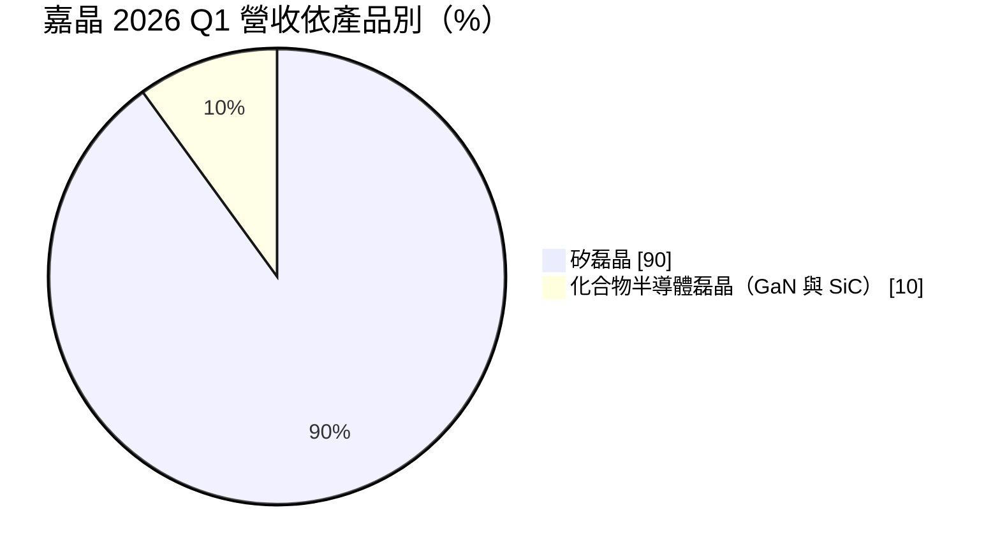
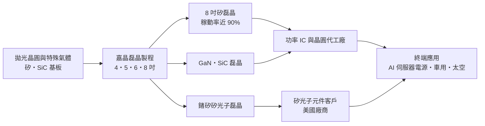
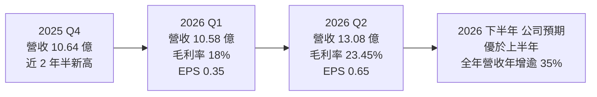
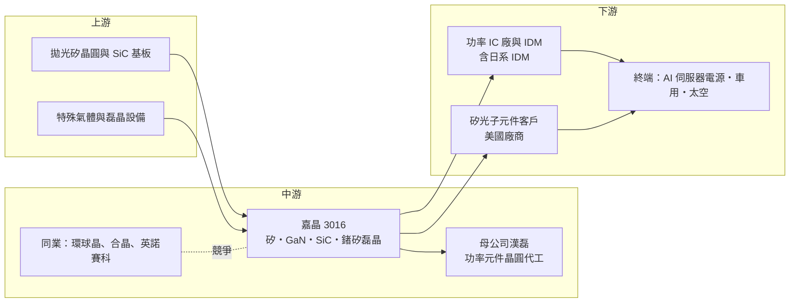

# 3016 嘉晶

> 上市｜[[產業索引-半導體業|半導體業]]｜上市（櫃）日期 2002/12/24

# 第一章：企業模式與商業藍圖

> [!info] 撰寫說明
> 本文由 Claude 依公開資料整理，架構比照 [[2330台積電]] 的四章研究，資料截至 2026-10-07。財務數字來源：富果研究 2026 年 4 月與 9 月法說整理、工商時報 2026 年 1 月與 8 月報導、理財周刊；產業描述為整理性內容，尚未逐條比對原始文件。#待校對

在評估單一個股的長期投資價值時，首要步驟是拆解企業的底層獲利邏輯。本章針對嘉晶電子股份有限公司（股票代號：3016，以下簡稱嘉晶）的商業模式進行定性分析，說明一家長期在小尺寸矽磊晶市場掙扎的材料廠，如何藉由 8 吋產能、AI 伺服器電源與[[矽光子]]磊晶，在 2026 年迎來近 20 年來最好的毛利率。

## 一、核心定位：半導體上游的磊晶代工廠

嘉晶是漢磊集團旗下的[[磊晶]]晶圓供應商，與母公司 [[3707漢磊]]（功率元件晶圓代工）形成上下游關係。[[磊晶]]是在拋光矽晶圓表面，以化學氣相沉積再「長」一層成分與厚度精準控制的單晶薄膜。功率元件需要這層薄膜來承受高電壓，因此磊晶晶圓是 [[MOSFET]]、[[IGBT]]、二極體與電源管理 IC 的關鍵材料。

嘉晶的商業模式可以理解為「磊晶代工」：

* **客戶提供規格：** 功率 IC 廠指定磊晶層的厚度、電阻率與均勻度，嘉晶負責製程與品質。
* **產品依尺寸與材料區分：** 傳統主力是 4、5、6 吋的小尺寸矽磊晶，近年轉向 8 吋矽磊晶、[[化合物半導體]]磊晶（[[GaN]]、[[SiC]]），以及矽光子用的鍺矽（Ge-on-Si）磊晶。

## 二、終端應用與產品板塊：矽磊晶九成、化合物一成

依富果研究整理的 2026 年 4 月法說會內容，營收結構如下：

* **矽磊晶（約 90%）：** 供應功率 IC 製造商，應用於 AI 伺服器電源、車用、工控與消費性電子。依 2026 年 9 月法說，8 吋產品占比已由 59% 提升到 71%，上半年矽磊晶營收年增 28%。
* **[[GaN]] 磊晶：** 連續四季成長並已轉虧為盈。依工商時報報導，GaN 磊晶客戶成功打入 AI 伺服器與太空供應鏈。
* **[[SiC]] 磊晶：** 2025 年仍虧損，2026 年隨日系 [[IDM]] 新客戶量產，虧損明顯收斂。
* **矽光子磊晶：** 2026 年上半年約占營收 1%，公司預估年底達 3% 至 5%，2027 年再成長 3.5 至 4 倍，毛利率高於公司平均。

依 9 月法說，AI 相關營收占比由 2025 年的 17%，提升到 2026 年 30% 以上，公司預期 2027 年達 40% 以上。

## 三、資本轉化邏輯：騰籠換鳥，把資源移到 8 吋

* **產能結構調整：** 依 2026 年 4 月法說，8 吋產線稼動率接近 90%，4、5 吋產線低於 60%。公司採「騰籠換鳥」策略，逐步淘汰小尺寸產能，把資源集中在 8 吋矽磊晶與矽光子。
* **[[產能利用率]]決定毛利：** 磊晶設備與廠房屬固定成本，8 吋產線滿載後，毛利率由 2025 年上半年的 6% 跳升到 2026 年第二季的 23.45%，是 19 年來新高。
* **客戶分攤成本：** SiC 擴產部分成本由客戶分攤，降低嘉晶在新材料上的投資風險。

## 四、企業長期藍圖：AI 電源、矽光子與非紅供應鏈

* **AI 伺服器電源：** AI 伺服器耗電量大，電源模組需要更多功率元件，帶動 8 吋矽磊晶需求超出預期，訂單能見度延長到 2 至 3 季。
* **矽光子：** 矽光子客戶是一家在該領域經營超過 15 年的美國公司。矽光子用於 AI 資料中心的光通訊，是嘉晶毛利率最高的新產品線。
* **[[非紅供應鏈]]：** 依 4 月法說，客戶要求「非紅供應鏈」，也就是不含中國製造的供應來源；公司對中國市場則採「China for China」策略，由當地供應當地。
* **擴產：** 2026 年資本支出追加到原預算的三倍，上半年已投入約 9 億元，用於 8 吋與矽光子產能。

# 第二章：護城河深度與競爭優勢

在長期價值投資中，「護城河」指企業抵禦競爭、維持超額利潤的保護機制。本章分析嘉晶在磊晶市場的競爭地位，以及它能否把 2026 年的高稼動率轉為長期優勢。

## 一、嘉晶護城河的核心組成要素

磊晶屬於資本與製程經驗並重的材料產業，嘉晶的護城河屬於「窄護城河」，主要由以下三個要素組成：

* **1. 客戶認證與製程參數綁定：** 功率元件的耐壓與可靠度直接取決於磊晶層品質，客戶一旦完成驗證，更換磊晶供應商需要重新認證整個元件，轉換成本高。車用與太空應用的驗證時間更長。
* **2. 集團垂直整合：** 嘉晶與母公司漢磊形成「磊晶加晶圓代工」的組合，可以一起開發 GaN、SiC 等新材料的製程，縮短開發時間。
* **3. 非中國產能：** 在地緣政治下，國際客戶需要非中國的磊晶來源，台灣的嘉晶是少數具備矽、GaN、SiC 與鍺矽多種磊晶能力的廠商。

## 二、全球主要競爭對手格局

| 對手 | 定位 | 對嘉晶的威脅 |
|---|---|---|
| [[6488環球晶]] | 全球矽晶圓大廠，具磊晶與 SiC 能力 | 規模與成本優勢，可整包供應拋光片與磊晶片 |
| [[6182合晶]] | 台灣矽晶圓與磊晶片廠 | 在功率元件用 8 吋磊晶片直接競爭 |
| Innoscience（英諾賽科） | 中國 GaN 整合元件廠 | 法說會點名的主要競爭對手，以低價與大產能搶 GaN 市場 |
| Wolfspeed、Resonac | SiC 基板與磊晶大廠 | 在 SiC 磊晶擁有規模與技術領先 |
| IQE | 英國化合物半導體磊晶廠 | 在 GaN 與光電磊晶競爭國際客戶 |

## 三、優勢轉化：哪些市場守得住、哪些守不住

* **守得住：** 已完成驗證的 8 吋功率元件矽磊晶、要求非中國來源的 GaN 客戶，以及矽光子這類新興、規格高度客製的產品。
* **守不住：** 4、5 吋小尺寸矽磊晶。這部分技術成熟、需求萎縮，稼動率不到六成，公司已主動縮減。SiC 磊晶的規模也遠不及國際大廠，需要靠日系 IDM 客戶支撐。
* **觀察重點：** 一是矽光子營收比重能否如期達到 3% 至 5%，並在 2027 年放大；二是擴產後 8 吋產線能否維持高稼動率；三是 GaN 與 SiC 能否同時獲利，而不是只靠矽磊晶撐起毛利率。

# 第三章：財務體質與盈利規模

資料日期：2026-10-07。數字取自法說會整理與工商時報報導，表格是撰寫當時的快照；最新月營收、毛利率、累計 EPS 由自動排程寫在本筆記的屬性欄位（月營收、毛利率、累計EPS 等）。#待校對

財務報表是檢驗護城河是否真實存在的最終標準。本章用三率、ROE、現金流與資本報酬，檢視嘉晶從谷底翻身的獲利品質。

## 一、獲利能力的基石：三率

| 項目 | 2025 全年 | 2025 Q4 | 2026 Q1 | 2026 Q2 | 2026 上半年 |
|---|---|---|---|---|---|
| 營收（新台幣） | 38.91 億 | 10.64 億 | 10.58 億 | 13.08 億 | 23.67 億 |
| [[毛利率]] | 未查得（上半年 6%） | 未查得 | 18% | 23.45% | 20.91% |
| [[營業利益率]] | 未查得 | 未查得 | 11% | 16.92% | 14.09% |
| [[淨利率]] | 未查得 | 未查得 | 約 9.5%（推算） | 約 14.3%（推算） | 約 12.2%（推算） |
| EPS（元） | 0.07 | 未查得 | 0.35 | 0.65 | 1.00 |

註：2026 年第二季稅後淨利 1.87 億元、上半年 2.88 億元，淨利率依此推算；第一季淨利由上半年減第二季推算。

* **[[毛利率]]：** 由 2025 年上半年的 6% 升到 2026 年第二季的 23.45%，主要來自 8 吋稼動率提升與化合物磊晶虧損收斂。
* **[[營業利益率]]：** 第二季 16.92% 是近 19 年半新高，營業利益 2.21 億元為歷史第二高。
* **年度比較：** 2025 年營收 38.91 億元，是近 6 年最低，EPS 僅 0.07 元。2026 年上半年 EPS 1.00 元，已是 2025 年全年的 14 倍。理財周刊引述的預估，2026 年營收可挑戰 50 億元、EPS 約 2.0 至 2.1 元（推估，非公司財測）。

## 二、[[ROE]]：資本效率

2025 年 EPS 0.07 元，ROE 接近零。2026 年獲利大幅改善，ROE 將明顯回升（推估，具體數值未查得）。嘉晶屬資本密集產業，ROE 的高低主要取決於稼動率：稼動率低時折舊吃掉大部分毛利，稼動率高時獲利快速放大。

## 三、資本支出與自由現金流

* **[[CapEx]]：** 2026 年資本支出追加為原預算的三倍，上半年已支出約 9 億元，占上半年營收約 38%（推算），用於 8 吋矽磊晶與矽光子擴產。
* **[[自由現金流]]：** 大幅擴產期間，自由現金流可能轉弱甚至為負（推估），需要依賴營業現金流與借款支應。SiC 部分由客戶分攤成本，減輕資金壓力。
* **股利：** 2025 年度配發現金股利 0.5 元，高於當年 EPS，代表動用部分保留盈餘配發。

## 四、[[ROIC]] 與 [[WACC]]：價值創造利差

2023 至 2025 年的庫存調整期間，嘉晶稼動率低、化合物磊晶虧損，ROIC 明顯低於 WACC（推估）。2026 年 8 吋滿載、毛利率回到 20% 以上，利差開始轉正。關鍵在於大規模擴產完成後，新產能能否在需求高峰期間填滿；如果擴產完成時需求轉弱，新增折舊會再次壓低 ROIC。

# 第四章：總體風險與地緣政治

任何企業都無法脫離宏觀環境獨立存在。本章分析嘉晶未來必須面對的地緣政治、產業週期與營運風險。

## 一、地緣政治風險

* **非紅供應鏈的機會與風險：** 國際客戶要求非中國來源，是嘉晶的接單優勢；但若美中關係緩和，這項優勢可能減弱。
* **中國 GaN 競爭：** 中國 GaN 廠商如英諾賽科大舉擴產並以低價搶市，在不受地緣政治限制的市場會壓縮嘉晶的價格與市占。
* **台灣集中：** 主要產能位於台灣，面臨兩岸風險與供電穩定性問題。

## 二、產業週期與市場結構風險

* **功率元件庫存循環：** 2023 至 2025 年功率元件經歷長時間的[[庫存調整]]，嘉晶營收在 2025 年降到 6 年低點。目前的復甦主要靠 AI 伺服器電源，若 AI 資本支出放緩，8 吋稼動率可能回落。
* **電動車需求：** SiC 磊晶的主要應用是電動車，全球電動車成長放緩會延後 SiC 的獲利時程。
* **[[長鞭效應]]：** 磊晶位在供應鏈最上游，終端需求變化經過元件廠、模組廠層層放大，對嘉晶的訂單波動影響最大。

## 三、營運環境的隱性風險

* **擴產折舊：** 資本支出擴大三倍，未來折舊增加，若稼動率下滑，毛利率會快速回落。
* **客戶集中：** 矽光子目前主要依賴一家美國客戶，SiC 依賴日系 IDM 新客戶，客戶集中度高。
* **小尺寸產能處置：** 4、5 吋產能淘汰過程中可能需要認列資產減損。

## 四、科技演進風險

功率元件材料正從矽轉向 [[GaN]] 與 [[SiC]]，晶圓尺寸也從 6 吋往 8 吋甚至 12 吋發展。嘉晶的優勢在 8 吋矽磊晶，若 AI 電源與電動車更快轉向化合物半導體，或大型矽晶圓廠把 12 吋功率元件磊晶做出規模，嘉晶需要持續投資才能跟上。矽光子技術路線仍在演進，若主流方案改變磊晶需求，現有布局也可能需要調整。

# 專有名詞解析

## 半導體

- **[[磊晶]]**：在晶圓表面以氣相沉積長出一層成分與厚度精準控制的單晶薄膜，是功率元件與光電元件的關鍵製程。
- **[[化合物半導體]]**：由兩種以上元素組成的半導體材料，例如氮化鎵、碳化矽、砷化鎵，適合高頻、高壓或光電應用。
- **[[GaN]]**：氮化鎵，寬能隙半導體材料，切換速度快，常用於快充、資料中心電源與射頻元件。
- **[[SiC]]**：碳化矽，寬能隙半導體材料，耐高壓、耐高溫，用於電動車與充電樁的功率元件。
- **[[矽光子]]**：在矽晶片上製作光學元件，以光取代電傳輸資料，可降低 AI 資料中心的傳輸耗電。
- **[[MOSFET]]**：金屬氧化物半導體場效電晶體，用電壓控制電流開關，是電源轉換電路中最常用的功率元件。
- **[[IGBT]]**：絕緣閘雙極電晶體，適合高電壓、大電流的功率元件，用於電動車馬達驅動與工業變頻器。
- **[[IDM]]**：整合元件製造商，從設計、晶圓製造到封裝測試都自己完成的半導體公司。

## 應用

- **[[AI伺服器]]**：搭載 GPU 或 AI 加速晶片的伺服器，耗電量遠高於一般伺服器，對電源與散熱元件的需求大增。

## 金融

- **[[產能利用率]]**：實際生產量占總產能的比例，製造業的毛利率高度取決於此數字。
- **[[長鞭效應]]**：終端需求的小幅變動，沿供應鏈往上游傳遞時被逐級放大，造成上游庫存與訂單劇烈波動。

## 產業

- **[[非紅供應鏈]]**：不含中國製造或中資企業的供應來源，是歐美客戶因應地緣政治的採購要求。
- **[[庫存調整]]**：下游客戶與代理商減少備貨、消化既有庫存的期間，上游供應商的訂單會明顯減少。

# 核心供應鏈

## 1. 上游：基板、氣體與設備
- 拋光矽晶圓：[[6488環球晶]]、[[5483中美晶]]、[[3436勝高]]、[[4063信越化學]]（推估為可能供應來源，公司未揭露）
- SiC 基板：國際 SiC 基板廠（公司未揭露）
- 磊晶設備：國際 CVD 設備商（公司未揭露）

## 2. 中游：嘉晶本身、母公司與同業
- 母公司：[[3707漢磊]]（功率元件與化合物半導體晶圓代工）
- 矽磊晶同業：[[6488環球晶]]、[[6182合晶]]
- 化合物磊晶同業：英諾賽科、IQE、Wolfspeed

## 3. 下游：功率元件與光電客戶
- 功率 IC 廠與 IDM：包含日系 IDM 大廠（公司未揭露名稱）
- 矽光子：美國矽光子元件公司（公司未揭露名稱）
- 終端應用：AI 伺服器電源、車用電子、太空供應鏈

## 最新新聞
<!-- news:start（自動產生，請勿手動編輯此範圍） -->
- 2026-10-06 📰 媒體 11:00｜矽晶圓重啟漲價循環，景氣全面復甦？環球晶、台勝科、合晶、嘉晶，受惠程度大不同！｜[鉅亨網](https://news.cnyes.com/news/id/6622551)

完整紀錄：[[3016嘉晶 新聞]]
<!-- news:end -->

## 相關連結
- [公開資訊觀測站](https://mopsov.twse.com.tw/mops/web/t05st03?step=1&firstin=1&co_id=3016)
- [Goodinfo](https://goodinfo.tw/tw/StockDetail.asp?STOCK_ID=3016)
- [Yahoo 股市](https://tw.stock.yahoo.com/quote/3016)
- [鉅亨網新聞](https://www.cnyes.com/twstock/3016/news)
