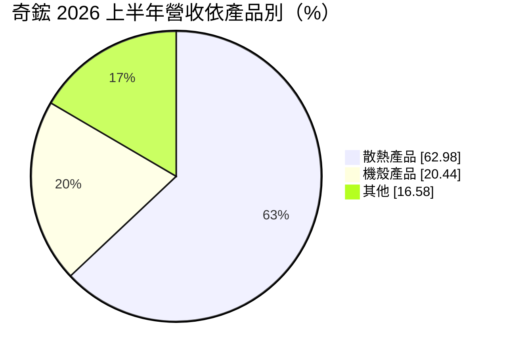
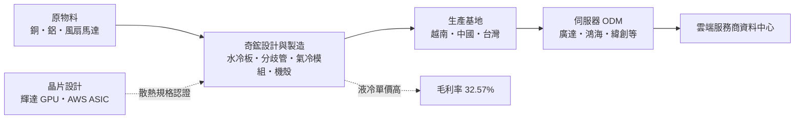
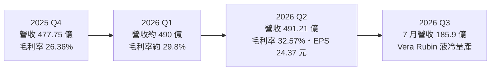
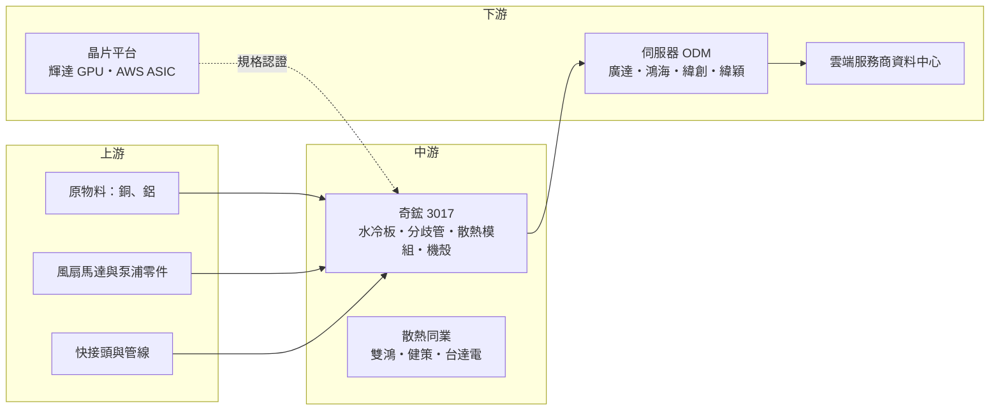

# 3017 奇鋐

> 上市｜[[產業索引-電腦及週邊設備業|電腦及週邊設備業]]｜上市（櫃）日期 2002/09/27

# 第一章：企業模式與商業藍圖

> [!info] 撰寫說明
> 本文由 Claude 依公開資料整理，架構比照 [[2330台積電]] 的四章研究，資料截至 2026-10-07。財務數字來源：奇鋐 2025 年財報報導（優分析）、2026 年第二季法說會摘要（富果研究）、第二季財報新聞（旺得富）；產業描述為整理性內容，尚未逐條比對原始文件。#待校對

在評估單一個股的長期投資價值時，首要步驟是拆解企業的底層獲利邏輯。本章針對奇鋐科技（股票代號：3017，以下簡稱奇鋐）的商業模式進行定性分析，說明這家從筆電風扇起家的散熱廠，如何隨 [[AI伺服器]] 功耗暴增轉型為[[液冷]]散熱的主要供應商，以及為何它的營收在兩年內翻倍、毛利率還能同步上升。

## 一、核心定位：AI 伺服器散熱與機殼的一站式供應商

奇鋐（英文名 AVC）是全球主要的電子散熱解決方案廠商之一，產品從風扇、熱導管、[[均熱板]]，到 AI 伺服器使用的[[水冷板]]、[[分歧管]]與機殼。2025 年營收 1,396.39 億元，年增 94.59%，EPS 49.17 元，創歷史新高。

奇鋐的定位有三個特點：

* **AI 伺服器占比快速拉高：** 2026 年第二季伺服器與網通營收占比達 66%，2025 年同期僅 51%。依 2025 年資料，AI 伺服器相關營收中 GPU 平台約七成、[[ASIC]] 平台約兩至三成。
* **散熱加機殼的整合能力：** 除了散熱模組，奇鋐也生產伺服器機殼與滑軌，可提供客戶散熱與機構件的整合方案，縮短客戶的開發與組裝時間。
* **液冷轉型的領先者：** AI 晶片功耗動輒超過 1,000 瓦，傳統[[氣冷]]已不足以散熱。奇鋐 2026 年下半年將水冷板月產能由 20 萬組提升到 100 萬組，分歧管月產能由 1,000 組提升到 7,000 組。

## 二、終端應用板塊：產品結構

* **散熱產品（約 63%）：** 包括 AI 伺服器水冷板、分歧管、[[CDU]] 相關零組件，以及氣冷散熱模組、風扇與均熱板，2026 年上半年年增 96%。
* **機殼產品（約 20%）：** 伺服器機殼與機構件，2026 年上半年年增 134%，受惠 AI 伺服器出貨放量。
* **其他（約 17%）：** 筆電、手機與消費性電子的散熱元件等，手機與平板的均熱板占比低於 5%。

依應用別，2026 年上半年伺服器與網通營收 649.19 億元，占 66.14%，年增 153%。

## 三、資本轉化邏輯：跟著 AI 晶片功耗走

* **規格由晶片廠決定：** 奇鋐的散熱設計必須通過 [[NVDA輝達]] 或雲端業者 ASIC 平台的規格認證，之後再由伺服器 ODM 採購。進入晶片廠的參考設計名單，等於取得後續大量訂單的門票。
* **液冷提升單機價值：** 一台液冷 AI 伺服器需要水冷板、分歧管、[[快接頭]]與管線，散熱價值遠高於傳統氣冷伺服器，這是奇鋐營收與毛利率同步上升的原因。
* **產能就是市占：** 輝達新平台與 ASIC 專案的交期緊，誰能先擴好產能、通過驗證，誰就能拿到最大份額。

## 四、企業長期藍圖：液冷全面滲透與全球擴產

* **新平台量產：** 輝達 Vera Rubin GPU 液冷專案 2026 年第三季量產，AWS Trainium 3 液冷 ASIC 專案第四季放量。
* **擴產：** 越南 V5 至 V8 廠區 2026 年第二季起陸續投產。2025 年資本支出約 150 億元，2026 年規劃約 150 億至 170 億元（不同報導口徑不同）。
* **液冷滲透率：** 公司將 2026 年視為「ASIC 年」，法人預期 2027 年資料中心液冷滲透率將超過 50%，液冷從高階 GPU 擴散到 ASIC 與一般伺服器。

# 第二章：護城河深度與競爭優勢

在長期價值投資中，「護城河」指企業抵禦競爭、維持超額利潤的保護機制。本章分析奇鋐的護城河構成、主要競爭對手，以及這些優勢在液冷市場快速擴張、對手紛紛擴產時能守住多少。

## 一、奇鋐護城河的核心組成要素

* **1. 晶片廠認證與早期參與：** AI 伺服器散熱需要在晶片設計階段就參與熱設計，奇鋐長期與 GPU 與 ASIC 平台合作，每一代新平台都能較早取得規格並完成驗證。
* **2. 散熱與機構件整合：** 同時提供散熱模組、機殼與滑軌，能替伺服器 ODM 簡化供應鏈管理，提高客戶黏著度。
* **3. 大規模量產與越南產能：** 水冷板與分歧管需要精密加工、焊接與嚴格的洩漏測試，大量生產時良率與交期是關鍵。奇鋐在越南的大規模產能也符合客戶「中國以外」的供應鏈要求。

## 二、主要競爭對手格局

| 對手 | 定位 | 對奇鋐的威脅 |
|---|---|---|
| [[3324雙鴻]] | 台灣主要散熱廠，積極布局液冷 | 水冷板與 CDU 直接競爭 |
| [[3653健策]] | 均熱片與液冷零組件 | 在 GPU 均熱片與水冷板部分重疊 |
| [[2308台達電]] | 電源與散熱整合，CDU 與液冷機櫃 | 以系統級液冷方案切入 |
| Cooler Master（訊凱） | 散熱與液冷模組 | 輝達平台的水冷板供應商之一 |
| 中國散熱廠 | 價格競爭 | 在中國市場與非 AI 產品搶單 |

## 三、優勢轉化：哪些市場守得住、哪些守不住

* **守得住：** 高階 GPU 與 ASIC 平台的水冷板與分歧管。2026 年第二季[[毛利率]] 32.57%、營業利益率 27.4%，年增 8 至 10 個百分點，顯示目前仍有定價能力。
* **守不住：** 一般氣冷散熱與消費性產品。這些產品技術門檻較低，價格競爭激烈。
* **觀察重點：** 液冷產品隨著對手擴產是否出現價格競爭、Vera Rubin 與 Trainium 3 專案的份額，以及越南新廠的良率與產能利用率。

# 第三章：財務體質與盈利規模

資料日期：2026-10-07。數字取自公司財報新聞與財經媒體整理，表格是撰寫當時的快照；最新月營收、毛利率、累計 EPS 由自動排程寫在本筆記的屬性欄位（月營收、毛利率、累計EPS 等）。#待校對

財務報表是檢驗護城河是否真實存在的最終標準。本章用三率、ROE、現金流與資本報酬，檢視奇鋐在 AI 散熱需求爆發期的獲利品質。

## 一、獲利能力的基石：三率

| 項目 | 2025 全年 | 2025 Q4 | 2026 Q1 | 2026 Q2 |
|---|---|---|---|---|
| 營收（新台幣） | 1,396.39 億 | 477.75 億 | 約 490.4 億（推算） | 491.21 億 |
| [[毛利率]] | 25.81% | 26.36% | 約 29.8%（推算） | 32.57% |
| [[營業利益率]] | 19.73% | 20.96% | 未查得 | 27.44% |
| 稅後純益 | 191.86 億 | 66.36 億 | 約 79 億（推算） | 95.67 億 |
| EPS（元） | 49.17 | 16.92 | 約 20.17（推算） | 24.37 |

註：2026 年第一季數字以上半年累計（營收 981.59 億元、EPS 44.54 元）減第二季推算，毛利率依「季增 2.8 個百分點」反推。

* **[[毛利率]]：** 從 2025 年的 25.81% 升到 2026 年第二季的 32.57%，主因是液冷產品比重提高。第二季營收幾乎持平，但毛利率與獲利持續成長，說明產品組合改善比營收規模更重要。
* **[[營業利益率]]：** 2026 年第二季 27.44%，創單季新高，營業費用占營收比重下降。
* **[[淨利率]]：** 第二季稅後淨利率約 19.5%（推算），一般散熱廠過去約在個位數。

## 二、[[ROE]]：資本效率

2025 年 EPS 49.17 元、2026 年上半年 EPS 44.54 元，獲利快速擴張推升 ROE 至歷史高檔（具體數值未查得）。需注意的是，奇鋐 2026 年 6 月底[[負債比]] 68.07%，ROE 有部分來自財務槓桿，主要是應付帳款與營運資金增加，以及擴產所需借款（推估）。

## 三、資本支出與自由現金流

* **[[CapEx]]：** 2025 年約 150 億元，2026 年規劃 150 億至 170 億元，主要用於越南新廠與液冷產能。
* **[[自由現金流]]：** 2026 年上半年營業現金流 262.91 億元，自由現金流 191.79 億元，即使在大幅擴產期間，自由現金流仍為正，顯示獲利有實際現金支撐。
* **現金部位：** 2026 年 6 月底現金約 777.15 億元。
* **股利政策：** 未查得 2025 年度配息資料，待校對。

## 四、[[ROIC]] 與 [[WACC]]：價值創造利差

散熱與機殼屬於中度資本密集產業，奇鋐在營收翻倍、營業利益率升到 27% 的情況下，推估 ROIC 遠高於 WACC。關鍵在於液冷產品的高毛利能維持多久；一旦液冷成為標準品、對手產能到位，ROIC 可能從高檔回落（推估）。

# 第四章：總體風險與地緣政治

任何企業都無法脫離宏觀環境獨立存在。本章分析奇鋐未來必須面對的地緣政治、產業週期與營運風險。

## 一、地緣政治風險

* **美國關稅與供應鏈重組：** 奇鋐產品最終多出貨到美國資料中心，美國對越南、中國與台灣的關稅政策會影響成本與報價。
* **生產集中於越南與中國：** 越南是主要擴產地，若越南與美國的貿易關係變化，或越南出現電力、勞動力瓶頸，出貨會受影響。
* **AI 晶片出口管制：** 美國對中國的 AI 晶片管制會影響部分伺服器專案的出貨地區。

## 二、產業週期與市場結構風險

* **雲端資本支出循環：** 奇鋐的成長高度依賴雲端業者 AI 資本支出，一旦投資放緩，液冷需求成長會跟著放慢。
* **客戶與平台集中：** GPU 平台約占 AI 伺服器營收七成，若單一平台換代延遲或份額改變，營收會出現明顯波動。
* **競爭者擴產：** 雙鴻、台達電、Cooler Master 等對手同步擴充液冷產能，2027 年後可能出現價格競爭。

## 三、營運環境的隱性風險

* **品質風險：** 液冷系統一旦洩漏可能損壞昂貴的 AI 伺服器，品質事故的賠償與商譽損失遠高於傳統散熱產品。
* **原物料價格：** 銅、鋁價格上漲會推高水冷板與散熱模組成本。
* **擴產執行：** 越南多座新廠同時投產，人力訓練與良率爬坡需要時間。

## 四、科技演進風險

* **散熱技術路線：** 目前主流是單相水冷板，未來可能演進到[[浸沒式冷卻]]或兩相冷卻。若技術路線轉換，奇鋐需要重新投資與認證。
* **晶片封裝改變：** 先進封裝與晶片背面供電等技術會改變熱源分布，散熱設計必須跟著重做，研發投入會增加。

# 專有名詞解析

## 半導體

- **[[ASIC]]**：特殊應用積體電路，為特定用途設計的晶片，例如 Google TPU、AWS Trainium。

## 應用

- **[[AI伺服器]]**：搭載 GPU 或 AI 加速器、用於訓練與推論 AI 模型的伺服器，功耗遠高於一般伺服器。

## 金融

- **[[自由現金流]]**：營業活動現金流減去資本支出，代表企業可自由用於配息、還債或併購的現金。
- **[[負債比]]**：總負債占總資產的比例，用來衡量企業財務槓桿與償債壓力。

## 產業

- **[[液冷]]**：以冷卻液流經晶片上方的冷板帶走熱量的散熱方式，散熱效率遠高於風扇氣冷，用於高功耗 AI 伺服器。
- **[[氣冷]]**：以風扇與散熱鰭片帶走熱量的傳統散熱方式，成本低但難以應付千瓦級晶片。
- **[[水冷板]]**：貼在晶片上、內部有冷卻液流道的金屬板，是液冷系統中直接吸收晶片熱量的元件。
- **[[分歧管]]**：把冷卻液分配到機櫃內各台伺服器水冷板的管路元件，英文 Manifold。
- **[[CDU]]**：冷卻液分配單元，負責液冷系統中冷卻液的循環、降溫與壓力控制。
- **[[均熱板]]**：內部有工作流體、利用相變化把熱量快速攤平的薄板散熱元件，英文 Vapor Chamber。
- **[[快接頭]]**：液冷管路中可快速插拔且不漏液的接頭，方便伺服器維修更換，英文 Quick Disconnect。
- **[[浸沒式冷卻]]**：把整台伺服器浸入不導電的冷卻液中散熱的技術，散熱效率更高但維護較複雜。

# 核心供應鏈

## 1. 上游：原物料與零組件
- 銅、鋁等金屬原料
- 風扇馬達、泵浦、快接頭與管線供應商

## 2. 中游：奇鋐本身與同業
- 散熱同業：[[3324雙鴻]]、[[3653健策]]、[[2308台達電]]、Cooler Master

## 3. 下游：晶片平台與伺服器 ODM
- 晶片平台：[[NVDA輝達]]（Vera Rubin）、[[AMZN亞馬遜]]（Trainium 3）
- 伺服器 ODM：[[2382廣達]]、[[2317鴻海]]、[[3231緯創]]、[[6669緯穎]]（推估合作對象）

## 4. 下游：雲端服務商
- 美國大型雲端服務商的 AI 資料中心

延伸閱讀：[[台積電供應鏈]]

## 最新新聞
<!-- news:start（自動產生，請勿手動編輯此範圍） -->
- 2026-10-07 📰 媒體 20:33｜奇鋐、富世達新莊廠區遭調查局搜索 與富世達2023年申請上市有關｜[鉅亨網](https://news.cnyes.com/news/id/6624007)
- 2026-10-07 🏛️ 重訊 18:55｜公告法務部調查局至本公司新莊廠區對員工進行搜索及調查。｜[觀測站](https://mops.twse.com.tw/mops/#/web/t05st01)
- 2026-10-07 📰 媒體 11:50｜營收速報 - 奇鋐(3017)9月營收210.18億元年增率高達44.92％｜[鉅亨網](https://news.cnyes.com/news/id/6623531)

完整紀錄：[[3017奇鋐 新聞]]
<!-- news:end -->

## 相關連結
- [公開資訊觀測站](https://mopsov.twse.com.tw/mops/web/t05st03?step=1&firstin=1&co_id=3017)
- [Goodinfo](https://goodinfo.tw/tw/StockDetail.asp?STOCK_ID=3017)
- [Yahoo 股市](https://tw.stock.yahoo.com/quote/3017)
- [鉅亨網新聞](https://www.cnyes.com/twstock/3017/news)
