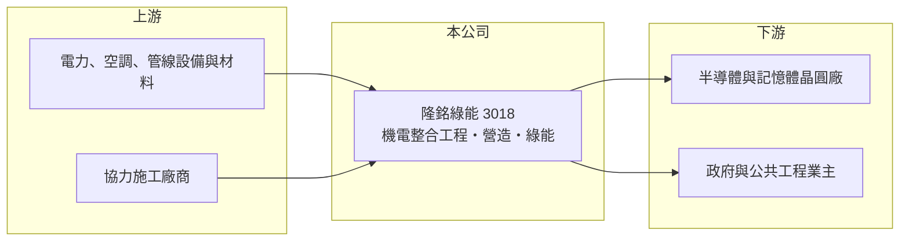

# 3018 隆銘綠能

> 上市｜[[產業索引-其他電子業|其他電子業]]｜上市（櫃）日期 2002/08/26

# 第一章：企業模式與商業藍圖

> [!info] 撰寫說明
> 精簡版，由 Claude 依公開資料整理，架構比照 [[2330台積電]]，資料截至 2026-10-07。來源：富果研究隆銘綠能 2025 年 12 月法說會筆記、nStock 隆銘綠能公司簡介、winvest 營收快訊。#待校對

隆銘綠能前身為 1996 年成立的同開科技工程，2022 年更名，主要承攬科技廠房與公共工程的機電系統整合。

- **核心業務：** 承攬科技廠房、工業廠房與住宅的[[機電工程]]，包含[[無塵室]]、一般機電、特殊系統與太陽能工程；另有營造與廢棄物處理業務。
- **營收結構：** 機電事業體占營收九成以上，營造事業由 100% 子公司同開營造（甲級營造廠）負責，綠能事業為中長期發展方向。
- **營運據點：** 以台灣為主，長期承攬美商記憶體晶圓廠林口廠區擴建工程，也承建八德外役監獄與中科院修繕工程等公共工程。
- **長期方向：** 採「固本增源」策略，鞏固機電與營造本業，並爭取離岸風電維運中心、高科技廠房與綠能環保工程。

# 第二章：護城河深度與競爭優勢

隆銘綠能的競爭力在於半導體廠機電經驗，但規模遠小於大型廠務工程商。

- **競爭優勢：** 與美商記憶體晶圓廠長期合作，具半導體廠房機電施工經驗，並以 [[BIM]] 3D 技術整合機電設計與施工。
- **主要對手：** 大型無塵室與廠務工程商 [[2404漢唐]]、[[6139亞翔]]、[[5536聖暉]]，規模與接單能力都大於隆銘綠能。
- **觀察重點：** 與鴻森營造的訴訟與仲裁結果，以及風電維運中心等新案能否接到，決定營收能否回到 2024 年水準。

# 第三章：財務體質與盈利規模

資料日期：2026-10-07，以下數字是撰寫當時的快照；最新月營收、毛利率、累計 EPS 由自動排程寫在本筆記的屬性欄位（月營收、毛利率、累計EPS 等）。#待校對

隆銘綠能近兩年連續虧損，工程毛利為負，財務壓力偏大。

- **營收規模：** 2025 年全年營收 4.58 億元；2026 年 1 至 8 月累計 2.08 億元、年減 38.15%，8 月營收 3,966 萬元。
- **獲利：** 2025 年全年 EPS -2.16 元；2026 年第二季 EPS -1.5 元，[[毛利率]] -30.22%、營業利益率 -70.45%。
- **財務特色：** 2025 年第三季負債比率 65.47%，近五年無配息；2025 年曾預計認列約 6,000 萬元處分利益以挹注淨值。

# 第四章：總體風險與地緣政治

隆銘綠能的風險集中在工程虧損、訴訟與接單斷層。

- **產業週期：** 機電工程營收取決於科技廠與公共工程的發包週期，大案完工後若沒有新案接續，營收會大幅下滑。
- **營運風險：** 工程合約多為固定總價，材料與人工上漲或工期延誤會造成虧損，2026 年第二季毛利率已轉為負值。
- **其他風險：** 鴻森營造訴訟與仲裁結果不確定，可能需認列損失；負債比率偏高，持續虧損會增加籌資壓力。

# 專有名詞解析

## 金融

- **[[毛利率]]**：毛利除以營收，反映產品本身的定價能力與成本控制。

## 產業

- **[[機電工程]]**：廠房與建築的電力、空調、給排水、消防與管線系統的設計與施工。
- **[[無塵室]]**：控制空氣中微粒、溫濕度與壓力的密閉空間，半導體製程必須在高等級無塵室中進行。
- **[[BIM]]**：建築資訊模型，以 3D 模型整合建築、結構與機電資料，可在施工前找出管線衝突。

# 核心供應鏈

- 上游：電力、空調與管線設備材料商，以及協力施工廠商（推估）
- 下游／客戶：美商記憶體晶圓廠林口廠區（推估為美光）、法務部與中科院等公共工程業主
- 同業：[[2404漢唐]]、[[6139亞翔]]、[[5536聖暉]]

## 最新新聞
<!-- news:start -->
<!-- news:end -->

## 相關連結
- [公開資訊觀測站](https://mopsov.twse.com.tw/mops/web/t05st03?step=1&firstin=1&co_id=3018)
- [Goodinfo](https://goodinfo.tw/tw/StockDetail.asp?STOCK_ID=3018)
- [Yahoo 股市](https://tw.stock.yahoo.com/quote/3018)
- [鉅亨網新聞](https://www.cnyes.com/twstock/3018/news)
