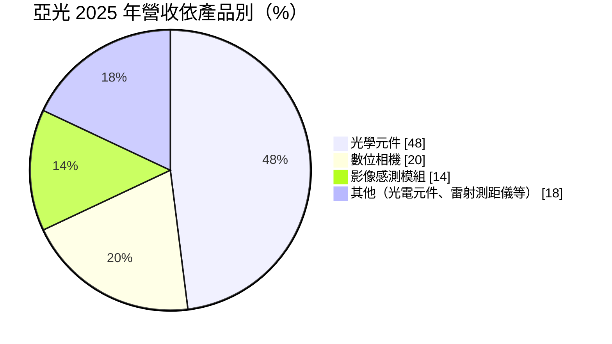
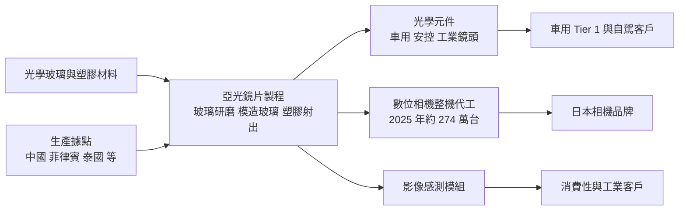
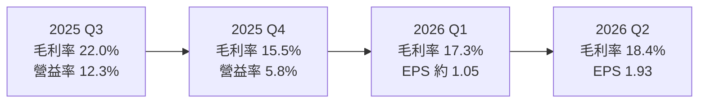
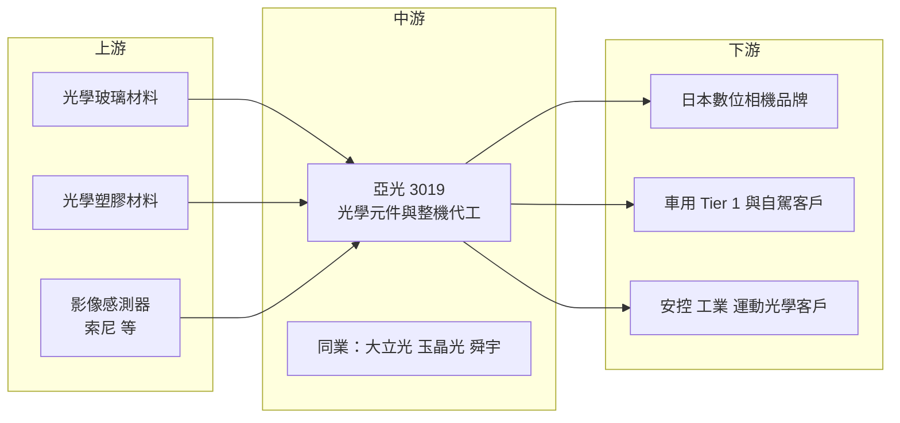

# 3019 亞光

> 上市｜[[產業索引-光電業|光電業]]｜上市（櫃）日期 2002/08/26

# 第一章：企業模式與商業藍圖

> [!info] 撰寫說明
> 本文由 Claude 依公開資料整理，架構比照 [[2330台積電]] 的四章研究，資料截至 2026-10-07。財務數字來源：富果研究（亞光 2025 年度法說會摘要）、優分析（2025 年獲利、資本支出與 2026 年上半年獲利報導）、Poorstock（2026 年第二季法說會整理）、HiStock（季度利潤比率）、nStock 公司簡介；產業描述為整理性內容，尚未逐條比對原始文件。#待校對

在評估單一個股的長期投資價值時，首要步驟是拆解企業的底層獲利邏輯。本章針對亞洲光學（股票代號：3019，以下簡稱亞光）的商業模式進行定性分析，說明一家以玻璃與塑膠鏡片起家的光學廠，如何在數位相機、車用鏡頭與新興光學應用之間配置產能。

## 一、核心定位：玻璃與塑膠兼具的光學代工廠

亞光成立於 1980 年 10 月，總部位於台中潭子，是台灣老牌光學元件廠，2002 年 8 月上市。產品從早期的照相機、影印機與光碟機鏡片，延伸到數位相機整機代工、影像感測模組、車用鏡頭與雷射測距儀。

和以手機鏡頭為主的 [[3008大立光]]、[[3406玉晶光]] 相比，亞光的定位有兩個特色：

* **玻璃加塑膠的[[玻塑混合鏡頭]]能力：** 亞光同時具備玻璃研磨、模造玻璃與塑膠射出成形技術，能做需要耐高溫、高解析度的車用與工業鏡頭，而不只是手機用的塑膠鏡片。
* **從鏡片到整機：** 亞光不只賣鏡片，也替日本品牌代工數位相機整機，產品附加價值與營收規模因此擴大，但整機代工的毛利率較低。

## 二、終端應用與產品板塊：光學元件近半

2025 年營收依產品別如下：

* **光學元件：** 營收占 48%，包括車用鏡頭、安控鏡頭、投影與工業用鏡頭等。2025 年車用鏡頭出貨約 773 萬顆，年減 26%，但自動駕駛相關客戶已有 5 家。
* **數位相機：** 營收占 20%，2025 年出貨約 274 萬台，比 2024 年的約 136 萬台倍增。年輕族群重新帶動小型數位相機需求，公司規劃 2026 年月產能 25 萬至 30 萬台。
* **影像感測模組（[[CIS]]）：** 營收占 14%，提供影像感測器的組裝與模組化。
* **其他：** 光電元件與雷射測距儀等，用於運動、狩獵與工業量測。

## 三、資本轉化邏輯：精密光學能力轉成多元出海口

* **生產據點：** 亞光主要產能位於中國與東南亞，2025 年起投資約 6 億元在菲律賓建新廠（含無塵室與設備），預計 2026 年第四季量產；泰國新廠也在規劃啟動中。分散產能可以降低關稅與地緣政治風險。
* **資本支出紀律：** 2025 年資本支出約 10.5 億元，2026 年規劃維持約 10.5 億元，相對於營收規模不算高。
* **財務體質：** 2026 年第二季現金與流動金融資產約 129.35 億元，沒有短期銀行借款，流動比率 215%。

## 四、企業長期藍圖：人形機器人與新型光學

* **人形機器人鏡頭：** 董事長賴以仁在 2025 年度法說會提到，人形機器人鏡頭已進入打樣階段，是長期成長機會。
* **AR／VR 與超穎透鏡：** 運用玻塑混合技術開發 AR／VR 光學，並評估導入 [[Metalens]] 與晶圓級光學（[[WLO]]）技術。
* **車用鏡頭：** 自動駕駛與 [[ADAS]] 需要更多鏡頭，車用鏡頭需求回溫是 2026 年的成長動能之一。

# 第二章：護城河深度與競爭優勢

在長期價值投資中，「護城河」指企業抵禦競爭、維持超額利潤的保護機制。本章分析亞光的護城河構成、全球主要光學競爭對手，以及這些優勢在中國光學廠崛起下能守住多少。

## 一、亞光護城河的核心組成要素

亞光的護城河屬於「窄護城河」，由三個要素組成：

* **1. 玻璃光學與玻塑混合技術：** 玻璃鏡片的研磨與模造需要長期累積的製程經驗，車用與工業鏡頭對耐溫、耐候與解析度要求高，塑膠鏡片廠不易跨入。
* **2. 日系品牌的長期代工關係：** 數位相機整機代工需要光學、機構與電子整合，日本相機品牌更換代工廠的成本高，合作關係維持多年。
* **3. 車規驗證：** 車用鏡頭須通過[[車規驗證]]，認證期長，一旦導入車型會供貨多年。

## 二、全球主要競爭對手格局

| 對手 | 定位 | 對亞光的威脅 |
|---|---|---|
| 舜宇光學（中國） | 全球最大手機與車用鏡頭廠 | 車用鏡頭市占領先，價格與規模優勢 |
| 聯創電子（中國） | 車用鏡頭與影像模組 | 搶中國與國際車廠車用鏡頭訂單 |
| [[3008大立光]]、[[3406玉晶光]] | 手機塑膠鏡頭 | 主要在手機領域，若跨入車用將形成競爭 |
| [[3441聯一光]]、[[4976佳凌]] | 台灣中小型光學廠 | 在安控、車用與投影鏡頭部分重疊 |
| 日本光學廠 | 高階相機與工業鏡頭 | 在高階鏡頭具品牌與技術優勢 |

## 三、優勢轉化：哪些市場守得住、哪些守不住

* **守得住：** 高規格車用與工業鏡頭、日系品牌數位相機代工。這些產品重視技術與長期關係。
* **守不住：** 一般安控與消費性鏡頭的價格。中國光學廠規模大、成本低，在標準品上價格競爭激烈。
* **觀察重點：** 數位相機熱潮能否延續、車用鏡頭出貨能否回升、菲律賓新廠能否如期在 2026 年第四季量產，以及人形機器人鏡頭能否從打樣走到量產。

# 第三章：財務體質與盈利規模

資料日期：2026-10-07。數字取自法說會摘要與財經資料網站，表格是撰寫當時的快照；最新月營收、毛利率、累計 EPS 由自動排程寫在本筆記的屬性欄位（月營收、毛利率、累計EPS 等）。#待校對

財務報表是檢驗護城河是否真實存在的最終標準。本章用三率、ROE、現金流與資本報酬，檢視亞光在產品組合變化下的獲利品質。

## 一、獲利能力的基石：三率

| 項目 | 2025 全年 | 2025 Q4 | 2026 Q1 | 2026 Q2 | 2026 上半年 |
|---|---|---|---|---|---|
| 營收（新台幣） | 264.4 億 | 未查得 | 約 62.1 億（推算） | 80.3 億 | 142.4 億 |
| [[毛利率]] | 未查得 | 15.5% | 17.3% | 18.4% | 未查得 |
| [[營業利益率]] | 未查得 | 5.8% | 7.8% | 10.1% | 未查得 |
| 稅後淨利 | 18.46 億 | 未查得 | 未查得 | 未查得 | 8.31 億 |
| EPS（元） | 6.60 | 未查得 | 約 1.05（推算） | 1.93 | 2.98 |

* **[[毛利率]]：** 2025 年第四季降到 15.5%，公司說明是產品組合改變與年底存貨調整。2026 年第一、二季回升到 17.3% 與 18.4%，落在公司預估的 18% 至 20% 區間下緣。數位相機整機比重提高會拉低整體毛利率，但能放大營收規模。
* **[[營業利益率]]：** 2026 年第二季 10.1%，營收季增 29%，營業利益季增 67%，顯示營運槓桿明顯。
* **[[淨利率]]與業外：** 2025 年第二季稅後淨利率 12.5%，明顯高於營業利益率，推估有業外收益；2026 年上半年 EPS 2.98 元比前一年同期減少 18%，主要是業外收支減少，本業其實成長。
* **營收動能：** 2026 年前 9 月累計營收約 220.83 億元，推算第三季營收約 78.5 億元，與第二季相近。

## 二、[[ROE]]：資本效率

亞光股本約 27.92 億元，2025 年 EPS 6.6 元，以帳上大量現金來看，ROE 推估約在一成上下（推估，具體數值未查得）。帳上淨現金約 123 億元，若扣除現金，本業的資本報酬率會更高。

## 三、資本支出與自由現金流

* **[[CapEx]]：** 2025 年約 10.5 億元，2026 年規劃約 10.5 億元，主要用於菲律賓新廠與產能升級。
* **[[自由現金流]]：** 公司無短期銀行借款且持有大量現金，自由現金流長期為正（推估）。2026 年第二季存貨周轉天數升至 85 天，高於前期的 76 天，需觀察是否為備貨或需求放緩。
* **股利政策：** 2024 年度現金股利 4 元，2025 年度 4.6 元，近五年平均約 3.2 元。

## 四、[[ROIC]] 與 [[WACC]]：價值創造利差

以本業營業利益率約一成、資本支出不高且有大量現金來推估，亞光本業 ROIC 應高於資金成本（推估，具體數值未查得）。主要變數是數位相機熱潮退燒後，整機代工產能能否轉作其他用途。

# 第四章：總體風險與地緣政治

任何企業都無法脫離宏觀環境獨立存在。本章分析亞光未來必須面對的地緣政治、產業週期與營運風險。

## 一、地緣政治風險

* **中國產能比重：** 亞光主要產能位於中國，面對美國關稅與供應鏈「中國加一」要求。菲律賓與泰國新廠是分散風險的主要布局。
* **日本客戶與匯率：** 數位相機客戶以日本品牌為主，日圓匯率變化會影響客戶的定價與下單。

## 二、產業週期與市場結構風險

* **數位相機熱潮：** 2025 年數位相機出貨倍增，帶動營收創高，但這類消費熱潮可能退燒，屆時營收會明顯回落。
* **車市景氣：** 車用鏡頭 2025 年出貨年減 26%，顯示車用需求同樣有週期，ADAS 普及的速度也受車廠成本控制影響。
* **存貨與[[長鞭效應]]：** 存貨天數上升到 85 天，若終端需求轉弱，可能出現存貨跌價。

## 三、營運環境的隱性風險

* **新廠爬坡：** 菲律賓新廠初期效率與良率需要時間建立。
* **產品組合：** 整機代工比重上升會拉低毛利率，管理層需在營收規模與毛利率之間取捨。
* **業外收益波動：** 帳上大量現金與金融資產，使業外收益受利率與金融市場影響，2026 年上半年就因業外減少而獲利年減。

## 四、科技演進風險

* **手機取代相機：** 手機影像能力持續提升，數位相機的需求長期仍面臨被取代的壓力。
* **新型光學技術：** Metalens 與晶圓級光學若成熟，可能改變傳統鏡片的製造方式，亞光需要持續投資才不會被技術轉變淘汰。
* **車用感測路線：** 自動駕駛若更依賴光達或雷達，鏡頭需求的成長幅度可能不如預期。

# 專有名詞解析

## 半導體

- **[[CIS]]**：CMOS 影像感測器，把光線轉為電子訊號的晶片，是相機與手機鏡頭模組的核心。

## 應用

- **[[ADAS]]**：先進駕駛輔助系統，以鏡頭、雷達等感測器協助車道維持、緊急煞車等功能。
- **[[車規驗證]]**：車用零組件須通過可靠度測試與車廠認證，流程常需數年，因此轉換成本高。

## 金融

- **[[毛利率]]**：毛利除以營收，反映產品售價扣除直接生產成本後的獲利空間。
- **[[營業利益率]]**：營業利益除以營收，反映扣除管銷研發費用後的本業獲利能力。
- **[[自由現金流]]**：營業活動現金流減去資本支出，代表企業可自由用於配息、還債或併購的現金。

## 產業

- **[[玻塑混合鏡頭]]**：同時使用玻璃與塑膠鏡片的鏡頭，兼顧玻璃的耐溫與光學性能，以及塑膠的輕量與低成本。
- **[[Metalens]]**：超穎透鏡，以奈米結構在平面上控制光線，可取代多片傳統鏡片，讓光學模組更薄。
- **[[WLO]]**：晶圓級光學，用半導體製程在晶圓上一次製作大量微型光學元件。
- **[[長鞭效應]]**：終端需求的小幅變動沿供應鏈往上游傳遞時被逐級放大，造成上游庫存與訂單劇烈波動。

# 核心供應鏈

## 1. 上游：光學材料與感測器
- 光學玻璃與光學塑膠材料供應商
- 影像感測器：[[SONY索尼]] 等

## 2. 中游：亞光本身
- 玻璃與塑膠鏡片、鏡頭模組、數位相機整機代工
- 生產據點：中國、菲律賓（新廠）、泰國（規劃中）

## 3. 下游：主要客戶
- 日本數位相機品牌
- 車用 Tier 1 與自動駕駛客戶（公司表示有 5 家）
- 安控、工業與運動光學客戶

## 4. 同業
- [[3008大立光]]、[[3406玉晶光]]、[[3441聯一光]]、舜宇光學

## 最新新聞
<!-- news:start -->
<!-- news:end -->

## 相關連結
- [公開資訊觀測站](https://mopsov.twse.com.tw/mops/web/t05st03?step=1&firstin=1&co_id=3019)
- [Goodinfo](https://goodinfo.tw/tw/StockDetail.asp?STOCK_ID=3019)
- [Yahoo 股市](https://tw.stock.yahoo.com/quote/3019)
- [鉅亨網新聞](https://www.cnyes.com/twstock/3019/news)
