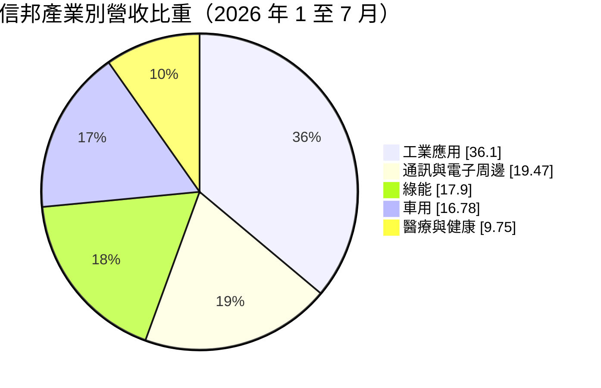
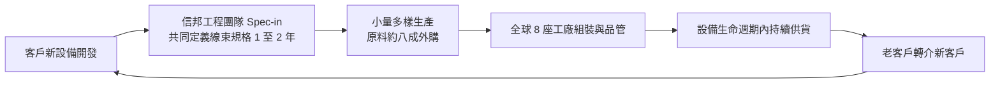
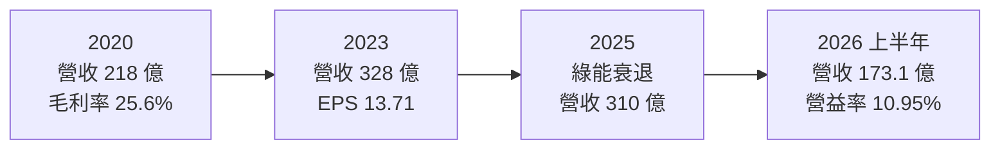
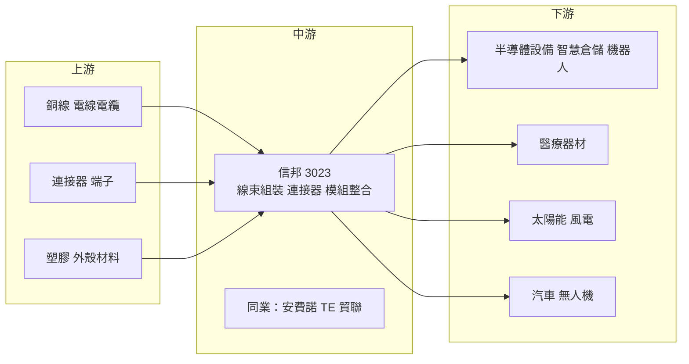

# 3023 信邦

> 上市｜[[產業索引-電子零組件業|電子零組件業]]｜上市（櫃）日期 2002/08/26

# 第一章：企業模式與商業藍圖

> [!info] 撰寫說明
> 本文由 Claude 依公開資料整理，架構比照 [[2330台積電]] 的四章研究，資料截至 2026-10-08。財務數字來源：Goodinfo 經營績效頁（2020 至 2025 年度）、證交所開放資料快照（2026 年上半年損益、資產負債、股利）、富果 2025 年 9 月法說會摘要、工商時報 2026 年 8 月報導；產業描述為整理性內容，尚未逐條比對原始文件。#待校對

在評估單一個股的長期投資價值時，首要步驟是拆解企業的底層獲利邏輯。本章針對信邦電子（股票代號：3023，以下簡稱信邦）的商業模式進行定性分析，說明一家做線束與連接器的公司，為什麼能長期維持 20% 以上的 ROE，以及它如何選擇市場。

## 一、核心定位

信邦成立於 1989 年，主要產品是[[線束]]（把多條電線、連接器與端子組合成的整套配線）與連接器零組件。依工商時報 2026 年 8 月報導，2026 年前七月線束組裝占合併營收 77.85%，連接器與零組件占 22.15%。

信邦對自己的定位不是傳統代工廠，而是「設計服務公司」：提供少量多樣的客製化方案，從線材、模組到機櫃整合都能做（富果 2025 年法說摘要）。這個定位決定了它的市場選擇：信邦刻意避開手機、筆電等大量生產、價格競爭激烈的消費電子，專注在工業設備、醫療器材、綠能、汽車等「量小、規格多、認證嚴」的領域。在這些市場，客戶更在意可靠度與共同開發能力，而不是單價。

## 二、終端應用／產品板塊

依工商時報整理的 2026 年前七月營收結構：

* **工業應用（36.10%）：** 最大板塊，客戶包括半導體設備、智慧倉儲、無人商店與人形機器人廠商。2026 年前七月年增 30.51%，是成長最快的領域之一。AI 半導體設備客戶從 2 家增加到 6 家，部分透過供應鏈間接供貨給日本設備廠（富果法說摘要）。
* **通訊與電子周邊（19.47%）：** 多為代理業務，毛利率約 13% 至 15%，會稀釋整體毛利率。2026 年前七月年減 9.41%。
* **綠能（17.90%）：** 太陽能與風電的線束，2025 年上半年因主要太陽能客戶訂單減少約 20 億元而大幅衰退，風電業務在中國與東南亞成長但未能補上缺口。
* **車用（16.78%）：** 包括油電車電控模組與快充相關產品，2026 年前七月年增 25.40%。
* **醫療與健康（9.75%）：** 醫療器材用線束與模組，2026 年前七月年增 26.28%，需要醫療法規認證，是毛利率較高的板塊。

此外，信邦鎖定商用運輸無人機，公司預期 2026 年無人機相關業務將比 2025 年成長數倍（工商時報）。

## 三、資本轉化邏輯（營運模式）

信邦的核心是「規格導入」（[[Spec-in]]）：在客戶開發新設備的初期，就以 1 至 2 年時間和客戶共同定義線束與連接器的規格。一旦規格寫進客戶的設計，信邦就成為該設備整個生命週期的供應商，客戶要換供應商就得重新設計與認證。

這套模式有三個特點。第一是客戶黏著度高：前 100 大客戶平均合作接近 10 年，44% 合作超過 10 年，約三分之一的新業務來自老客戶轉介（富果法說摘要）。第二是輕資產：約 80% 原料外購，信邦專注最終組裝與品質控管，資本支出長年只有每年 5 至 6 億元。第三是全球布局：全球 8 座工廠橫跨歐、亞、美，2025 年墨西哥新廠完工、美國廠擴建，可以就近服務客戶並降低地緣政治風險。

## 四、企業長期藍圖

信邦的長期目標是在正常市況下，讓自有線束產品維持每年 10% 至 15% 的複合成長，並隨工業、醫療與車用快充產品放大而提升毛利率。新的成長引擎包括 AI 半導體設備、人形機器人、智慧倉儲、無人商店與商用無人機。公司規劃在銅鑼科學園區興建約 40 億元的新廠服務半導體需求，未來 3 至 4 年每年資本支出將從 5 至 6 億元提高到 8 至 10 億元。

在資本配置上，信邦的目標現金股利配發率約 70%，屬於「穩定成長加高配息」的經營風格。它不追求單一爆發性題材，而是同時經營多個利基市場，讓不同產業的景氣循環互相抵銷。

# 第二章：護城河深度與競爭優勢

本章分析信邦的護城河構成、全球主要競爭對手，以及這些優勢在線束產業中能守住多少。

## 一、信邦護城河的核心組成要素

信邦的護城河屬於「窄到中等」，主要由以下三個要素組成：

* **1. Spec-in 帶來的轉換成本：** 工業設備、醫療器材與半導體設備的線束必須依設備內部空間、訊號與耐用性量身設計，客戶一旦採用就很難更換，換廠需要重新認證。這是信邦能長期維持約 25% 毛利率的主因。
* **2. 少量多樣的生產能力：** 大型線束廠擅長大量生產，小廠缺乏工程設計能力。信邦能同時處理數千種料號、少量多次交貨，這種能力需要長年累積的工程與管理經驗。
* **3. 多產業分散與長期客戶關係：** 工業、通訊、綠能、車用、醫療五大領域彼此景氣不同步，單一產業衰退時其他產業可以補上。長期合作的客戶群也讓營收較穩定。

## 二、全球主要競爭對手格局

| 對手 | 定位 | 對信邦的威脅 |
|---|---|---|
| 安費諾（Amphenol）、TE Connectivity、Molex | 全球連接器與線束大廠 | 產品線完整、技術領先，在車用與工業市場直接競爭 |
| [[3665貿聯-KY]] | 高階線束、伺服器與電動車線材 | 在工業與車用線束競爭，規模相近 |
| [[2392正崴]]、[[3533嘉澤]] | 連接器大廠 | 在部分連接器產品競爭 |
| 中國線束廠 | 中低階線束 | 以低價搶食標準化產品 |

## 三、優勢轉化：哪些市場守得住、哪些守不住

* **守得住：** 醫療、半導體設備、智慧倉儲等需要客製化與長期認證的產品。這些市場的客戶重視可靠度，價格敏感度低，信邦的 Spec-in 模式能發揮最大效果。
* **守不住：** 通訊與電子周邊的代理業務，以及綠能中的太陽能線束。代理業務毛利率只有 13% 至 15%，太陽能則受單一大客戶訂單影響，2025 年上半年綠能營收衰退 28%。
* **觀察重點：** 其一，工業與醫療的高毛利產品比重能否持續提高。其二，人形機器人、無人機等新應用能否從小量出貨走向規模化。其三，銅鑼新廠與資本支出提高後，信邦能否維持輕資產模式下的高 ROE。

# 第三章：財務體質與盈利規模

資料日期：2026-10-08。數字取自 Goodinfo 經營績效頁與證交所開放資料快照，表格是撰寫當時的快照；最新月營收、毛利率、累計 EPS 由自動排程寫在本筆記的屬性欄位（月營收、毛利率、累計EPS 等）。#待校對

財務報表是檢驗護城河是否真實存在的最終標準。本章用多年度的三率、ROE、現金流與資本報酬，檢視信邦的獲利品質。

## 一、獲利能力的基石：三率

| 年度 | 營收（新台幣） | [[毛利率]] | [[營業利益率]] | EPS（元） | [[ROE]] |
|---|---|---|---|---|---|
| 2020 | 218 億 | 25.6% | 12.2% | 9.08 | 24.9% |
| 2021 | 255 億 | 25.1% | 10.9% | 10.00 | 23.8% |
| 2022 | 306 億 | 25.3% | 10.9% | 12.22 | 24.6% |
| 2023 | 328 億 | 25.7% | 10.4% | 13.71 | 22.6% |
| 2024 | 331 億 | 24.9% | 10.8% | 14.70 | 24.0% |
| 2025 | 310 億 | 24.0% | 10.5% | 13.02 | 19.4% |
| 2026 上半年 | 173.1 億 | 24.53% | 10.95% | 7.37 | 未查得 |

* **毛利率極為穩定：** 2020 至 2025 年毛利率都在 24.0% 至 25.7% 之間，營業利益率維持在 10% 至 12%，六年間的波動幅度遠小於一般電子零組件廠。這是 Spec-in 模式與多產業分散的直接成果。
* **營收穩定成長：** 2020 至 2025 年營收年複合成長率約 7.3%（推算），EPS 從 9.08 元成長到 2024 年的 14.70 元。2025 年因太陽能大客戶訂單減少，營收與 EPS 小幅下滑，2026 年上半年營收 173.1 億元、EPS 7.37 元（證交所資料），恢復成長。
* **毛利率的組合效應：** 公司指出代理業務比重從 18% 升到 23% 時，整體毛利率會被稀釋；管理層預期近期毛利率約 25% 上下 1 個百分點（富果法說摘要）。

## 二、[[ROE]]：資本效率

2021 至 2025 年平均 ROE 約 22.9%（推算），Goodinfo 統計的長期平均 ROE 約 19%。對一家線束組裝廠來說，這是非常突出的資本效率。高 ROE 來自三個因素：穩定的 10% 以上營業利益率、原料外購的輕資產模式（資本支出低），以及約 70% 的高配息率讓股東權益不會過度累積。2025 年 ROE 降到 19.4%，主因是獲利下滑。

## 三、資本支出與[[自由現金流]]

信邦過去每年資本支出約 5 至 6 億元，相對於 300 億元以上的營收，資本密集度很低，營業現金流大多能轉成自由現金流。富果法說摘要提到，公司從 2024 年底開始降低庫存，金融負債從超過 50 億元的高點下降。未來 3 至 4 年資本支出將提高到每年 8 至 10 億元，加上銅鑼新廠約 40 億元的投資，自由現金流可能暫時減少，但仍在營業現金流可支應的範圍內（推估）。

股利方面，2025 年度配發現金股利 9.1 元（證交所股利資料），以當年 EPS 13.02 元計算，配息率約 70%（推算），與公司目標一致。

## 四、[[ROIC]] 與 [[WACC]]：價值創造利差

* **ROIC（推算）：** 2025 年營業利益約 32.6 億元（310 億 × 10.5%），稅後營業利益約 26.0 億元。投入資本以 2026 年第二季底權益總計約 165.3 億元，加上有息負債估計約 40 億元（金融負債已從 50 億元以上下降，精確金額未查得），合計約 205 億元，ROIC 約 12.7%（推算）。2020 至 2024 年 ROE 長期在 22% 以上，同期 ROIC 推估約在 13% 至 16%。
* **WACC（推算）：** 以 CAPM 推估，無風險利率 1.75%，市場風險溢酬 6%，β 未查得來源，採工業零組件同業常見值 0.8，股東權益成本約 6.55%。負債成本假設 2%，稅後約 1.6%；資本結構以權益 80%、負債 20% 計算，WACC 約 5.6%（推算）。
* **結論：** 信邦的 ROIC 長期約為 WACC 的兩倍，利差約 7 個百分點（推算），是本批分析中價值創造最穩定的公司之一。這個利差來自 Spec-in 帶來的定價能力與輕資產模式。未來要觀察的是資本支出提高後，新增資本能否維持相同的報酬率。

# 第四章：總體風險與地緣政治

任何企業都無法脫離宏觀環境獨立存在。本章分析信邦未來必須面對的地緣政治、產業週期與營運風險。

## 一、地緣政治風險

* **全球布局的雙面性：** 信邦在歐、亞、美有 8 座工廠，墨西哥新廠與美國廠擴建能配合北美客戶的在地化需求，降低關稅衝擊。但多國營運也代表要面對各國不同的勞動法規、稅制與匯率。
* **中國產能比重：** 部分產能仍在中國（比重未查得），美中關稅與出口管制若擴大到工業與醫療產品，會影響客戶的訂單分配。

## 二、產業週期與市場結構風險

* **綠能政策與大客戶風險：** 太陽能與風電受各國補貼政策影響大，2025 年單一太陽能大客戶訂單減少就讓綠能營收衰退 28%，說明信邦在個別產業仍有客戶集中問題。
* **半導體設備週期：** 工業應用中半導體設備的比重提高，半導體資本支出的週期性會傳導到信邦。
* **[[長鞭效應]]：** 工業與車用客戶在景氣反轉時調整庫存，線束廠的訂單波動會比終端需求更大。

## 三、營運環境的隱性風險

* **原物料價格：** 銅是線束最主要的原料，銅價上漲若無法即時轉嫁，會壓縮毛利率。
* **新事業的不確定性：** 人形機器人、無人機目前仍屬小量出貨，市場規模與時程不確定，過度投入可能拖累資本報酬率。
* **代理業務稀釋：** 低毛利的代理業務比重若持續上升，會降低整體毛利率與 ROE。

## 四、科技或法規演進風險

醫療器材與車用產品的法規認證是信邦的護城河來源，但法規改變也會增加合規成本。電動車的高壓線束與快充規格持續演進，需要持續投入研發。長期而言，若設備內部連接逐步改用無線傳輸或高度整合的電路板，部分線束需求可能被取代，但在工業、醫療與高功率應用中，實體線束仍難以替代（推估）。

# 專有名詞解析

## 應用

- **[[人形機器人]]**：外型與動作模仿人類的機器人，內部需要大量線束、馬達與感測器。
- **[[無人機]]**：不需駕駛員搭乘的飛行器，商用運輸無人機需通過航空法規認證，門檻較高。

## 金融

- **[[配息率]]**：現金股利占每股盈餘的比例，反映公司把多少獲利發還給股東。
- **[[自由現金流]]**：營業活動現金流減去資本支出，代表企業可自由用於配息、還債或併購的現金。
- **[[長鞭效應]]**：終端需求的小幅變動，沿供應鏈往上游傳遞時被逐級放大，造成上游庫存與訂單劇烈波動。
- **[[ROIC]]**：投入資本報酬率，衡量公司每投入一元營運資本能賺多少稅後營業利益。
- **[[WACC]]**：加權平均資金成本，股東與債權人要求報酬率的加權平均，是企業投資的最低報酬門檻。

## 產業

- **[[線束]]**：把多條電線、端子與連接器組合成整套配線，用來在設備內部傳輸電力與訊號。
- **[[連接器]]**：讓電路之間可插拔連接、傳遞電力或訊號的零件，例如 USB 接頭與伺服器內部的高速連接器。
- **[[Spec-in]]**：在客戶產品設計初期就參與規格制定，讓自家零件成為設計的一部分，提高轉換成本。
- **[[少量多樣]]**：同時生產許多種類、每種數量不大的產品，需要彈性產線與高工程管理能力。
- **[[代理業務]]**：替其他品牌銷售產品、賺取價差的業務，營收貢獻大但毛利率低。

# 核心供應鏈

## 1. 上游：線材與零件
- 銅材與電線：[[1605華新]]、[[1603華電]]（供應關係依產業常識整理，待校對）
- 連接器與端子：國際連接器品牌與台灣零件廠（未查得具體名單）

## 2. 中游：信邦本身與同業
- 同業：[[3665貿聯-KY]]、[[2392正崴]]；安費諾、TE Connectivity、Molex

## 3. 下游：主要應用客戶
- 半導體設備：國際半導體設備廠，部分透過供應鏈間接供應日本設備廠（公司未公開客戶名稱）
- 醫療器材、智慧倉儲、太陽能與風電、汽車與無人機的國際客戶（公司未公開客戶名稱）

## 最新新聞
<!-- news:start -->
<!-- news:end -->

## 相關連結
- [公開資訊觀測站](https://mopsov.twse.com.tw/mops/web/t05st03?step=1&firstin=1&co_id=3023)
- [Goodinfo](https://goodinfo.tw/tw/StockDetail.asp?STOCK_ID=3023)
- [Yahoo 股市](https://tw.stock.yahoo.com/quote/3023)
- [鉅亨網新聞](https://www.cnyes.com/twstock/3023/news)
