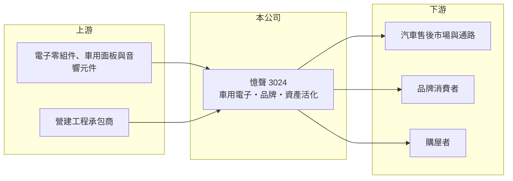

# 3024 憶聲

> 上市｜[[產業索引-光電業|光電業]]｜上市（櫃）日期 2002/08/26

# 第一章：企業模式與商業藍圖

> [!info] 撰寫說明
> 精簡版，由 Claude 依公開資料整理，架構比照 [[2330台積電]]，資料截至 2026-10-07。來源：winvest.tw 營收快訊（憶聲 2026 年 5 至 8 月營收）。公開資料有限，產品比重未查到。#待校對

憶聲以車用電子與品牌經營為本業，另透過不動產開發取得不固定的收入。

- **核心業務：** 憶聲電子成立於 1976 年，2002 年上市，屬光電類股。公司把業務分成車用電子事業體系、品牌經營事業體系與[[資產活化]]事業體系三塊。
- **營收結構：** 本次未查到各事業體的營收比重。從公司說明來看，2025 年營收中有一部分來自[[建案交屋]]，2026 年沒有交屋收入，因此營收明顯下滑。
- **營運據點：** 公開資料未查到詳細的生產據點，本文不推測。
- **長期方向：** 車用電子與品牌經營是本業，資產活化帶來的收入不固定，未來營收高低很大程度取決於是否有建案交屋。

# 第二章：護城河深度與競爭優勢

憶聲的優勢是經營年資與土地資產，本業的技術門檻相對有限。

- **競爭優勢：** 公司經營年資長，在車用影音與品牌通路有一定基礎；資產活化讓公司除了本業外，還能透過土地與建案取得收益。
- **主要對手：** 車用電子領域可對照 [[2497怡利電]] 等車用影音與顯示廠商，以及中國大陸的車用電子供應商。
- **觀察重點：** 下一個建案的交屋時點、車用電子本業能否在沒有建案收入時維持獲利。

# 第三章：財務體質與盈利規模

資料日期：2026-10-07，表格是撰寫當時的快照；最新月營收、毛利率、累計 EPS 由自動排程寫在本筆記的屬性欄位（月營收、毛利率、累計EPS 等）。#待校對

憶聲 2026 年因缺少建案收入，營收與獲利都大幅年減。

- **營收規模：** 2026 年 8 月營收 7,639.9 萬元，年減 44.12%；1 至 8 月累計 6.50 億元，年減 52.84%。7 月營收 1.14 億元，是今年較高的月份。
- **獲利：** 2026 年第二季 EPS 0.03 元，上半年累計 EPS 0.05 元，年減 83%；2025 年全年 EPS 0.28 元。
- **財務特色：** 資本額約 27.72 億元，營收與獲利受建案入帳時點影響大，單看年增率容易誤判本業趨勢。

# 第四章：總體風險與地緣政治

憶聲的風險在於本業獲利薄，整體表現高度依賴房市與建案進度。

- **產業週期：** 車用電子跟著汽車銷售與換車週期走；不動產收入則受房市景氣與建案進度影響。
- **營運風險：** 本業獲利薄，若缺少建案收入，整體 EPS 可能接近損益兩平。
- **其他風險：** 房地產相關法規與[[信用管制]]可能影響資產活化進度；車用零組件價格競爭激烈。

# 專有名詞解析

## 金融

- **[[建案交屋]]**：建設公司在房屋交屋給買方時才一次認列銷售收入，因此營收集中在交屋期間。
- **[[信用管制]]**：央行限制購屋貸款成數或土地融資，以抑制房市過熱的政策工具。

## 產業

- **[[資產活化]]**：把閒置土地或廠房拿來開發、出租或出售，以取得本業以外的收益。

# 核心供應鏈

- 上游：電子零組件、車用面板與音響元件供應商；營建工程承包商（建案部分）
- 下游／客戶：汽車售後市場與通路、品牌消費者、購屋者
- 同業：[[2497怡利電]]

## 最新新聞
<!-- news:start -->
<!-- news:end -->

## 相關連結
- [公開資訊觀測站](https://mopsov.twse.com.tw/mops/web/t05st03?step=1&firstin=1&co_id=3024)
- [Goodinfo](https://goodinfo.tw/tw/StockDetail.asp?STOCK_ID=3024)
- [Yahoo 股市](https://tw.stock.yahoo.com/quote/3024)
- [鉅亨網新聞](https://www.cnyes.com/twstock/3024/news)
