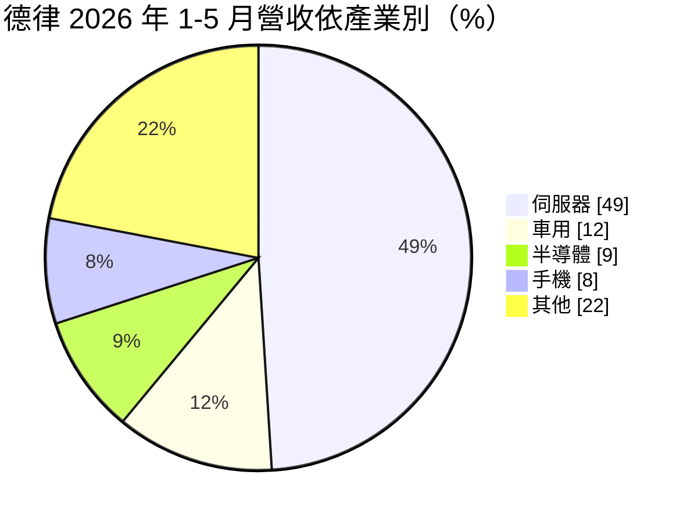
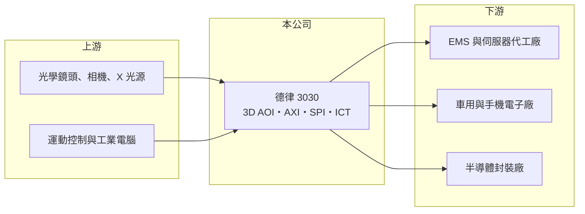

# 3030 德律

> 上市｜[[產業索引-其他電子業|其他電子業]]｜上市（櫃）日期 2002/10/29

# 第一章：企業模式與商業藍圖

> [!info] 撰寫說明
> 精簡版，由 Claude 依公開資料整理，架構比照 [[2330台積電]]，資料截至 2026-10-07。來源：Poorstock 德律法說會整理、nStock 德律公司簡介。#待校對

德律科技成立於 1989 年，是台灣電子製造檢測設備龍頭，產品用於電路板組裝與半導體封裝的品質檢測。

- **核心業務：** 生產 3D [[AOI]]（自動光學檢測）、[[AXI]]（自動 X 光檢測）、錫膏檢測與電路板線上測試機（ICT）等設備，主要用於 [[SMT]] 產線。
- **營收結構：** 2026 年 1 至 5 月依產業別，伺服器占 49%（前一年同期 27%）、車用 12%、半導體 9%、手機 8%，其餘為網通、PC 與消費電子；高毛利的先進檢測設備占 2026 年上半年營收 84%。
- **營運據點：** 總部與研發在台灣，設備銷往全球電子組裝廠，客戶多為 EMS 與伺服器代工廠（推估）。
- **長期方向：** 短期受惠 [[AI伺服器]] 主機板檢測需求，長期切入 Chiplet、[[HBM]] 與 TSV 等半導體先進封裝檢測，爭取國產替代。

# 第二章：護城河深度與競爭優勢

德律的護城河來自檢測演算法與大量客戶產線資料，毛利率接近六成。

- **競爭優勢：** 同時提供光學、X 光與電性測試，可整合整條 SMT 產線檢測；AI 伺服器主機板層數多、元件密集，對 3D AOI 與 AXI 的需求特別高。
- **主要對手：** 韓國 Koh Young、Pemtron，日本 Omron、Yamaha，美國 Keysight，半導體檢測則有以色列 Camtek。
- **觀察重點：** 伺服器占比近半，觀察 AI 伺服器出貨能否在 2027 年延續，以及半導體先進封裝檢測的接單進度。

# 第三章：財務體質與盈利規模

資料日期：2026-10-07，以下數字是撰寫當時的快照；最新月營收、毛利率、累計 EPS 由自動排程寫在本筆記的屬性欄位（月營收、毛利率、累計EPS 等）。#待校對

德律 2025 年營收與獲利創新高，2026 年營收持續成長。

- **營收規模：** 2025 年全年營收 84.67 億元；2026 年 1 至 9 月累計 82.87 億元、年增 29.76%，9 月營收 8.68 億元、年增 54.02%。
- **獲利：** 2025 年 EPS 10.49 元，首度突破 10 元（2024 年 7.78 元）；2026 年上半年 EPS 7.36 元，其中第二季 3.86 元、[[毛利率]] 58.7%、營業利益率 38.95%。
- **財務特色：** 輕資產設備商，毛利率約六成；2025 年度配發現金股利 7 元，近五年平均填息率 100%。

# 第四章：總體風險與地緣政治

德律的風險集中在單一產業過度集中與電子業資本支出循環。

- **產業週期：** 檢測設備屬資本支出，若 AI 伺服器組裝產能擴充放緩，設備訂單會快速下滑。
- **營運風險：** 伺服器占營收近五成，客戶與產業集中度提高，未來需求轉弱時波動會放大。
- **其他風險：** 營收以外幣計價，新台幣升值壓縮獲利；美國關稅與供應鏈移轉會改變客戶設廠地點與採購節奏。

# 專有名詞解析

## 半導體

- **[[AOI]]**：自動光學檢測，用相機拍攝產品並以影像演算法自動找出瑕疵，取代人工目檢。
- **[[AXI]]**：自動 X 光檢測，以 X 光穿透電路板或封裝，檢查焊點內部與元件底部等光學看不到的缺陷。
- **[[HBM]]**：高頻寬記憶體，把多顆 DRAM 垂直堆疊並以 TSV 連接，提供 AI 晶片所需的大量資料頻寬。

## 應用

- **[[AI伺服器]]**：搭載 GPU 或 AI 加速器、用於訓練與推論 AI 模型的伺服器，功耗遠高於一般伺服器。

## 金融

- **[[毛利率]]**：毛利除以營收，反映產品本身的定價能力與成本控制。

## 產業

- **[[SMT]]**：表面黏著技術，以自動化設備把電子元件直接貼焊在電路板表面，是電子產品組裝最核心的製程。

# 核心供應鏈

- 上游：光學鏡頭、工業相機、X 光源、運動控制與工業電腦供應商（推估）
- 下游／客戶：EMS 與伺服器代工廠，例如 [[2317鴻海]]、[[2382廣達]]、[[3231緯創]]（推估），以及車用電子與半導體封裝廠
- 同業：Koh Young、Pemtron、Omron、Yamaha、Keysight、Camtek

## 最新新聞
<!-- news:start -->
<!-- news:end -->

## 相關連結
- [公開資訊觀測站](https://mopsov.twse.com.tw/mops/web/t05st03?step=1&firstin=1&co_id=3030)
- [Goodinfo](https://goodinfo.tw/tw/StockDetail.asp?STOCK_ID=3030)
- [Yahoo 股市](https://tw.stock.yahoo.com/quote/3030)
- [鉅亨網新聞](https://www.cnyes.com/twstock/3030/news)
