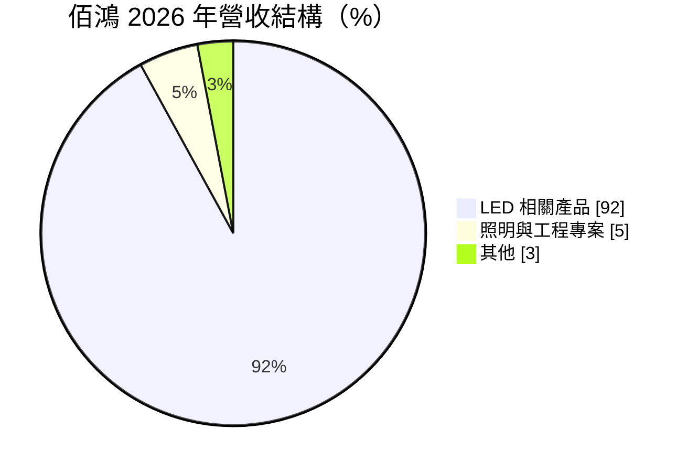
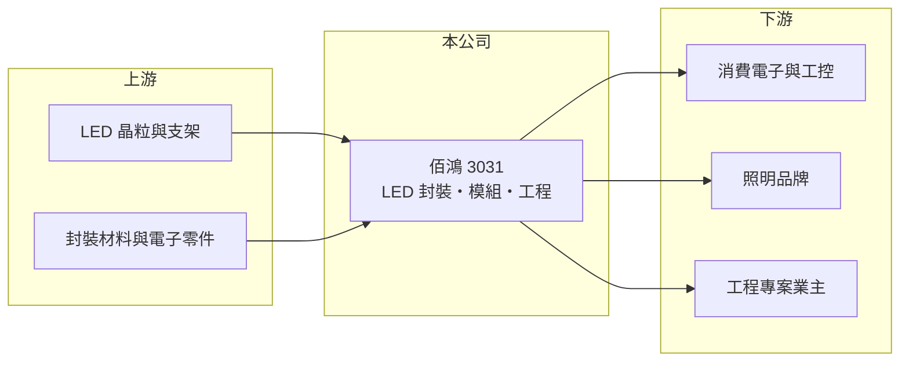

# 3031 佰鴻

> 上市｜[[產業索引-光電業|光電業]]｜上市（櫃）日期 2002/08/26

# 第一章：企業模式與商業藍圖

> [!info] 撰寫說明
> 精簡版，由 Claude 依公開資料整理，架構比照 [[2330台積電]]，資料截至 2026-10-07。來源：富果研究佰鴻 2026 年 9 月法說會摘要、winvest.tw 營收快訊。#待校對

佰鴻以 LED 相關產品為主體，靠利基市場的客製化接單維持獲利。

- **核心業務：** 佰鴻工業的業務橫跨 LED 產業鏈，從上游晶片與支架、中游[[LED封裝]]與模組，到下游照明與工程專案都有涉獵。
- **營收結構：** 依 2026 年法說會資料，LED 相關產品約占營收 92%，照明與工程專案約 5%，其他約 3%。
- **營運據點：** 公開摘要未詳列廠區，本文不推測。
- **長期方向：** 公司強調利基市場客製化、自動化整合與 ESG；對光通訊機會態度審慎樂觀，但因上游競爭擁擠，優先發展後段封裝。

# 第二章：護城河深度與競爭優勢

佰鴻的護城河在於完整的產業鏈布局與客製化彈性，而非規模。

- **競爭優勢：** 產業鏈布局完整，可以替客戶做客製化的 LED 元件與 [[PCBA]] 模組，接單彈性高。
- **主要對手：** [[2393億光]]、[[3714富采]]、[[6168宏齊]]，以及中國大陸的大型 LED 封裝廠。
- **觀察重點：** LED PCBA 業務能否延續回溫、工程專案的新接單，以及光通訊相關布局是否帶來實際營收。

# 第三章：財務體質與盈利規模

資料日期：2026-10-07，表格是撰寫當時的快照；最新月營收、毛利率、累計 EPS 由自動排程寫在本筆記的屬性欄位（月營收、毛利率、累計EPS 等）。#待校對

佰鴻 2026 年本業獲利明顯改善，但淨利受業外與匯兌拖累。

- **營收規模：** 2026 年上半年合併營收約 6.42 億元，年增 20%；8 月營收 1.19 億元，年增 27.82%。
- **獲利：** 2026 年上半年營業利益約 5,951 萬元，年增 81%；EPS 0.57 元。稅後淨利因[[業外收益]]減少與匯率影響，年減 24%。
- **財務特色：** 本業獲利改善明顯，但淨利受業外與匯兌波動影響，看獲利時宜區分本業與業外。

# 第四章：總體風險與地緣政治

佰鴻身處成熟的 LED 封裝產業，主要風險是價格競爭與成長幅度有限。

- **產業週期：** LED 封裝已是成熟產業，價格競爭激烈，需求跟著消費電子、照明與工控景氣起伏。
- **營運風險：** 管理層預估 2026 年下半年與上半年相近，成長幅度有限；中國同業低價競爭持續壓縮 [[毛利率]]。
- **其他風險：** 新台幣匯率波動影響業外損益；工程專案收入認列時點不固定。

# 專有名詞解析

## 半導體

- **[[LED封裝]]**：把 LED 晶粒固定在支架或基板上，接線並以膠體保護，做成可焊接使用的元件。

## 金融

- **[[業外收益]]**：本業以外的收益，例如投資、處分資產或匯兌利益，通常不具持續性。

## 產業

- **[[PCBA]]**：已焊上電子零件的印刷電路板組裝品，可直接裝進終端產品使用。

# 核心供應鏈

- 上游：LED 晶粒、支架、封裝材料與電子零件供應商
- 下游／客戶：消費電子、工控、照明品牌與工程專案業主
- 同業：[[2393億光]]、[[3714富采]]、[[6168宏齊]]

## 最新新聞
<!-- news:start -->
<!-- news:end -->

## 相關連結
- [公開資訊觀測站](https://mopsov.twse.com.tw/mops/web/t05st03?step=1&firstin=1&co_id=3031)
- [Goodinfo](https://goodinfo.tw/tw/StockDetail.asp?STOCK_ID=3031)
- [Yahoo 股市](https://tw.stock.yahoo.com/quote/3031)
- [鉅亨網新聞](https://www.cnyes.com/twstock/3031/news)
