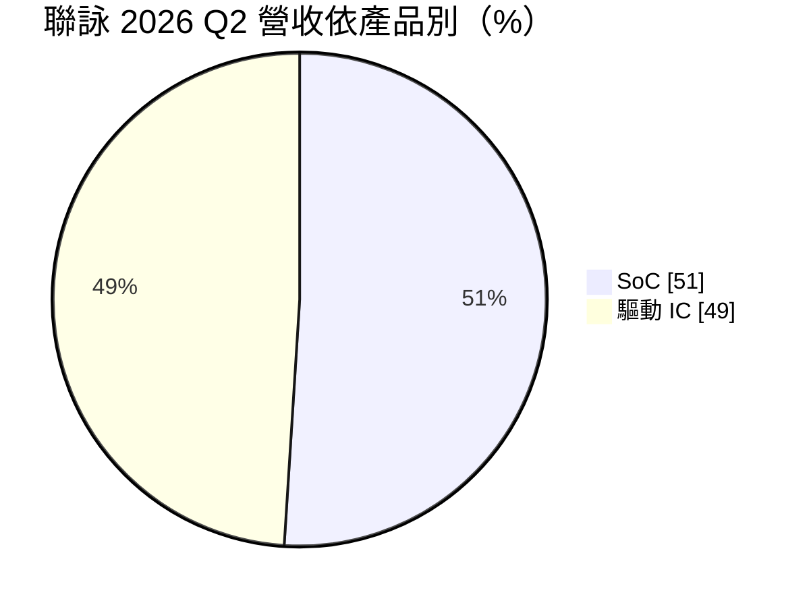
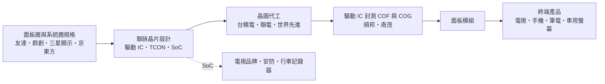
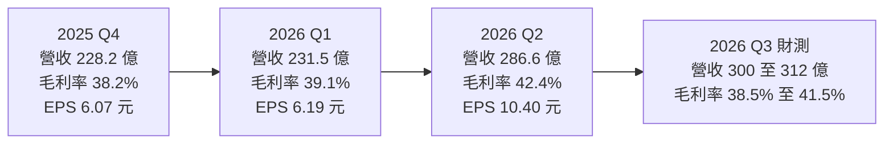
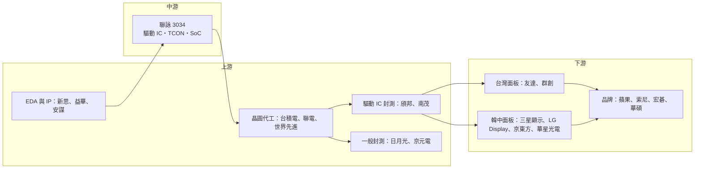

# 3034 聯詠

> 上市｜[[產業索引-半導體業|半導體業]]｜上市（櫃）日期 2002/08/26

# 第一章：企業模式與商業藍圖

> [!info] 撰寫說明
> 本文由 Claude 依公開資料整理，架構比照 [[2330台積電]] 的四章研究，資料截至 2026-10-07。財務數字來源：聯詠 2025 年第四季、2026 年第一季與第二季法說會相關報導（旺得富、經濟日報、工商時報、財訊快報、富果研究、poorstock 法說整理）、roo.cash 股利整理；產業描述為整理性內容，尚未逐條比對原始文件。#待校對

在評估單一個股的長期投資價值時，首要步驟是拆解企業的底層獲利邏輯。本章針對聯詠科技（股票代號：3034，以下簡稱聯詠）的商業模式進行定性分析，說明這家顯示驅動 IC 龍頭如何把營收重心轉向系統單晶片，以及這個轉型對獲利結構的意義。

## 一、核心定位：全球顯示驅動 IC 龍頭，轉型為 SoC 公司

聯詠是台灣 [[Fabless]] IC 設計公司，源自 [[2303聯電]] 的商用產品事業部門，總部位於新竹科學園區。聯詠最為人熟知的是顯示驅動 IC（[[DDI]]）：每一片液晶或 [[OLED]] 面板都需要驅動晶片把影像訊號轉成每個畫素的電壓，聯詠是全球市占率居前的供應商，客戶涵蓋台灣、中國、韓國與日本的主要面板廠。

過去十年，聯詠逐步把重心從驅動 IC 延伸到系統單晶片（[[SoC]]）：

* **電視與顯示器 SoC：** 負責影像處理、畫質調校與系統控制。
* **影像處理晶片：** 行車記錄器與監控攝影機使用的影像訊號處理器（[[ISP]]）。
* **邊緣 AI 視覺晶片：** 近期推出，聚焦影像處理與機器視覺應用。

2026 年第二季，SoC 單季營收約 147 億元、占比達 51%，首度超越驅動 IC 的 49%，代表聯詠的營收結構已從「面板周邊」轉為「影像與顯示系統晶片」。

## 二、終端應用／產品板塊：SoC 首度過半

* **SoC 產品：** 電視與顯示器 SoC、ISP、行車記錄器與安防監控晶片、邊緣 AI 視覺晶片。2026 年第一季 SoC 占比 44%，4 月單月一度達 53.7%，第二季平均 51%。
* **大尺寸驅動 IC：** 用於電視、顯示器與筆電面板，與面板廠的稼動率高度連動。
* **中小尺寸驅動 IC：** 包含手機用 [[TDDI]]（觸控與顯示驅動整合）與 OLED 驅動 IC，以及車用、平板面板驅動 IC。OLED 驅動 IC 的單價與毛利高於傳統 LCD 驅動 IC。

驅動 IC 內部大尺寸與中小尺寸的個別比重，本次未查得。

## 三、資本轉化邏輯：與面板廠共同設計的輕資產模式

* **晶圓代工：** 聯詠的晶片主要委由 [[2330台積電]]、[[2303聯電]] 等晶圓代工廠生產，驅動 IC 多使用高壓製程，SoC 則使用較先進的邏輯製程。
* **專用封裝：** 驅動 IC 封裝以玻璃覆晶（COG）、薄膜覆晶（[[COF]]）為主，主要委託 [[6147頎邦]]、南茂等廠商。
* **營運據點：** 聯詠以新竹為研發與營運總部，在中國等地設有技術支援據點，以就近服務當地面板廠與系統廠。依富果研究整理的 2026 年第一季法說內容，公司正在銅鑼科學園區投資資料中心相關基礎設施，並擴大研發支出，特別是先進製程相關投入。

## 四、企業長期藍圖：OLED、邊緣 AI 與車用顯示

* **OLED 驅動 IC：** 手機 OLED 面板持續滲透，聯詠積極擴大 OLED 驅動 IC 布局，並推出折疊手機與筆電 OLED 方案。外資報告提到，聯詠在 iPhone OLED 供應鏈的參與擴大是中長期成長動能之一。
* **[[邊緣 AI]] 與影像處理：** 總經理王守仁表示，公司積極發展邊緣 AI 技術，聚焦影像處理與機器視覺應用，已推出邊緣 AI 視覺晶片。
* **高階顯示：** 電競顯示器、高解析度與高更新率面板帶動驅動 IC 與時序控制晶片（[[TCON]]）規格升級。
* **車用顯示：** 車載螢幕大型化與多螢幕化，帶動車用驅動 IC 與 SoC 需求，是第三季展望中與 SoC 並列的支撐力量。

# 第二章：護城河深度與競爭優勢

在長期價值投資中，「護城河」指企業抵禦競爭、維持超額利潤的保護機制。本章分析聯詠的護城河構成、全球主要競爭對手，以及這些優勢在中國國產化與面板週期中能守住多少。

## 一、聯詠護城河的核心組成要素

聯詠的護城河屬於「中等寬度」，由四個要素組成：

* **1. 規模與客戶關係：** 驅動 IC 必須與面板廠共同設計、驗證，聯詠長期與各國主要面板廠合作，熟悉其製程與規格，新進者不易取得同等的合作深度。
* **2. 產品線完整：** 從大尺寸到中小尺寸、從 LCD 到 OLED、從驅動 IC 到時序控制與 SoC，聯詠能提供面板與電視系統廠整套方案，降低客戶的整合成本。
* **3. 影像處理技術累積：** SoC 業務累積多年的影像訊號處理、編解碼與顯示技術，是跨入邊緣 AI 視覺的基礎。
* **4. 財務體質：** 聯詠長期維持低負債、高現金部位，有能力在景氣低點持續投入研發。

## 二、全球主要競爭對手格局

| 對手 | 重疊產品 | 對聯詠的威脅 |
|---|---|---|
| LX Semicon（LG 集團） | 驅動 IC，尤其 OLED | 與韓系面板廠關係緊密 |
| [[005930三星電子]] System LSI | OLED 驅動 IC | 綁定三星顯示面板 |
| [[4961天鈺]]、[[8016矽創]]、[[3545敦泰]] | 驅動 IC、TDDI | 台灣同業在中小尺寸與利基產品競爭 |
| 集創北方、奕斯偉 | 驅動 IC | 受中國面板廠扶植，在成熟規格以價格競爭 |
| [[2454聯發科]]、[[2379瑞昱]]、晶晨（Amlogic） | 電視 SoC | 聯發科規模大，壓制聯詠在電視 SoC 的空間 |
| 海思、星宸科技 | 安防與行車記錄器影像晶片 | 中國業者在安防市場具優勢 |

## 三、優勢轉化：哪些市場守得住、哪些守不住

* **守得住：** 大尺寸驅動 IC 與高階 OLED 驅動 IC，聯詠的規模、[[良率]]與客戶關係仍有優勢；2026 年第二季[[毛利率]]回升到 42.4%，顯示產品組合改善與漲價效益。
* **守不住：** 中國面板廠在採購上偏向扶植本土驅動 IC 廠，成熟規格的 LCD 驅動 IC 價格競爭激烈；電視 SoC 則受聯發科的規模壓制。
* **AI 曝險有限：** 外資報告指出聯詠與其他半導體同業相比，直接受惠 AI 的程度相對有限，這是市場給予評價較保守的主因之一。
* **觀察重點：** SoC 占比能否維持在五成以上、OLED 驅動 IC 在國際手機品牌的出貨進展，以及邊緣 AI 視覺晶片能否形成新的營收支柱。

# 第三章：財務體質與盈利規模

資料日期：2026-10-07。數字取自法說會相關財經報導（旺得富、經濟日報、財訊快報、富果研究、poorstock），表格是撰寫當時的快照；最新月營收、毛利率、累計 EPS 由自動排程寫在本筆記的屬性欄位（月營收、毛利率、累計EPS 等）。#待校對

財務報表是檢驗護城河是否真實存在的最終標準。本章用三率、ROE、資本支出與資本報酬，檢視聯詠在面板與消費性電子週期中的獲利品質。

## 一、獲利能力的基石：三率

| 項目 | 2025 全年 | 2025 Q4 | 2026 Q1 | 2026 Q2 | 2026 Q3 財測 |
|---|---|---|---|---|---|
| 營收（新台幣） | 1,006.6 億 | 228.2 億 | 231.5 億 | 286.6 億 | 300～312 億 |
| [[毛利率]] | 未查得 | 38.2% | 39.1% | 42.4% | 38.5%～41.5% |
| [[營業利益率]] | 未查得 | 未查得 | 約 17.4% | 22.6% | 19%～22% |
| 稅後淨利 | 163.5 億 | 未查得 | 未查得 | 63.3 億 | — |
| EPS（元） | 26.87 | 6.07 | 6.19 | 10.40 | — |

* **2025 年回顧：** 營收年減 2%，為近五年低點；稅後淨利年減 19.6%，EPS 由 2024 年的 33.43 元降至 26.87 元，主因消費性電子需求疲弱與記憶體漲價抑制終端需求。
* **[[毛利率]]：** 2026 年第二季回升到 42.4%，但第三季財測區間 38.5% 至 41.5%，中位數低於第二季，反映成本上升與產品組合變化。
* **[[營業利益率]]：** 第二季 22.6%，第三季財測 19% 至 22%。
* **獲利品質：** 2026 年第二季營收季增 23.8%、年增 9.6%，EPS 10.40 元季增 68%，上半年 EPS 合計 16.59 元（2025 年同期 14.80 元）。財經報導指出第二季獲利有部分來自業外收益，且客戶因預期記憶體漲價而提前拉貨，下半年需留意需求回檔。
* **存貨：** 第二季底存貨約 133.1 億元，存貨週轉天數升至約 67 天，處於相對高檔，若需求放緩可能出現跌價損失。

## 二、[[ROE]]：資本效率

聯詠屬輕資產的 IC 設計公司，景氣正常時 ROE 長期維持在偏高水準（本次未查得具體數值）。獲利波動主要來自面板與消費性電子的庫存週期，而非資本支出。高配發率也讓股東權益不至於過度累積，有助維持 ROE。

## 三、資本支出與自由現金流

* **[[CapEx]]：** 主要用於研發設備、光罩與辦公研發據點，2026 年另有銅鑼科學園區的資料中心相關投資（金額未查得）。
* **[[自由現金流]]：** 營業現金流充沛，足以支應研發與股利；但存貨上升會暫時占用營運資金。
* **股利：** 聯詠以高配發率著稱，政策為穩定配發現金股利、盈餘成長時同步提高股利。依 roo.cash 整理，2024 年度與 2025 年配息均為每股 28 元，除息通常在 7 月中旬、發放在 8 月中旬。以 2025 年 EPS 26.87 元觀之，後續股利可能隨獲利調整（推估）。

## 四、[[ROIC]] 與 [[WACC]]：價值創造利差

輕資產的設計公司投入資本小，聯詠在營業利益率二成上下時，ROIC 推估明顯高於 WACC（具體數值未查得）。先進製程 SoC 與邊緣 AI 晶片的光罩與研發投入金額持續上升，若新產品無法放量，新增投入的報酬率會低於既有驅動 IC 業務，這是未來資本報酬的主要變數。

# 第四章：總體風險與地緣政治

任何企業都無法脫離宏觀環境獨立存在。本章分析聯詠未來必須面對的地緣政治、產業週期、營運與技術風險。

## 一、地緣政治風險

* **中國面板產業的依賴與替代：** 全球 LCD 面板產能大幅集中在中國，聯詠的驅動 IC 客戶有相當比例是中國面板廠。中國推動半導體國產化，面板廠逐步把成熟規格驅動 IC 轉向本土供應商，是長期的市占流失風險。
* **美中關稅：** 電視、顯示器與手機等終端產品若被課徵高關稅，會影響品牌廠出貨與面板需求，財經報導也提到中國關稅可能侵蝕毛利。
* **台灣供應鏈集中：** 晶圓代工與封測主要在台灣，面臨與其他台灣半導體廠相同的兩岸風險。

## 二、產業週期與市場結構風險

* **面板與消費性電子週期：** 驅動 IC 需求取決於面板廠稼動率，面板產業每隔數年就會經歷一次庫存修正，聯詠的營收與毛利會隨之波動。
* **[[長鞭效應]]與提前拉貨：** 第二季的強勁表現部分來自客戶提前備貨，下半年若出現需求回補不足，營收可能回落。
* **記憶體漲價排擠：** 2026 年記憶體大漲，手機與 PC 品牌為了控制整機成本而壓縮其他零組件預算或減少出貨，對聯詠形成間接壓力。
* **匯率：** 新台幣升值會壓縮以台幣計價的營收與毛利，2025 年第四季則受惠匯率而毛利優於預期。

## 三、營運環境的隱性風險

* **庫存水位：** 存貨約 133 億元、週轉天數上升，若終端需求轉弱，可能需要提列庫存跌價損失。
* **晶圓與封測成本上漲：** 成熟製程晶圓、封測與記憶體成本上漲，若無法完全轉嫁，毛利率會回落，這也是第三季毛利率財測下修到 38.5% 至 41.5% 的原因之一（推估）。
* **研發支出擴大：** 先進製程 SoC 與邊緣 AI 晶片的光罩與研發成本高，若新產品放量不如預期，費用將先侵蝕獲利。

## 四、科技演進風險

* **顯示技術轉換：** 面板技術從 LCD 往 OLED、[[Micro LED]] 演進，每一次轉換都會重新洗牌驅動 IC 供應商，聯詠需要持續跟上新技術的設計導入。
* **邊緣 AI 競爭：** 邊緣 AI 晶片市場參與者眾多，包括國際大廠與中國新創，聯詠能否建立足夠的軟體與生態系優勢，仍有不確定性（推估）。

# 專有名詞解析

## 半導體

- **[[Fabless]]**：無晶圓廠的 IC 設計公司，只負責設計晶片，生產交給晶圓代工廠，代表廠商為聯發科、瑞昱。
- **[[DDI]]**：顯示驅動 IC，負責控制面板每個像素的電壓，需要高壓製程，聯詠、奇景為主要設計公司。
- **[[SoC]]**：系統單晶片，把處理器、記憶體控制、影像與介面等多種功能整合在一顆晶片上。
- **[[TDDI]]**：觸控與顯示驅動整合晶片，把觸控感測與面板驅動做在同一顆晶片，可降低成本與厚度。
- **[[TCON]]**：時序控制晶片，負責把影像訊號依時序分配給各個驅動 IC，高解析度與高更新率面板對其規格要求更高。
- **[[ISP]]**：影像訊號處理器，把感測器擷取的原始影像做降噪、色彩校正等處理，用於攝影機與行車記錄器。
- **[[COF]]**：薄膜覆晶封裝，把驅動 IC 封裝在可撓式薄膜上再接到面板，適合窄邊框與高解析度面板。
- **[[良率]]**：一片晶圓上合格晶片所占的比例，直接影響每顆晶片的成本。

## 應用

- **[[邊緣 AI]]**：在終端裝置本身執行 AI 運算，而不是把資料傳回雲端處理，可降低延遲與保護隱私。

## 金融

- **[[長鞭效應]]**：終端需求的小幅變動，沿供應鏈往上游傳遞時被逐級放大，造成上游庫存與訂單劇烈波動。
- **[[自由現金流]]**：營業活動現金流減去資本支出，代表企業可自由用於配息、還債或併購的現金。

## 產業

- **[[OLED]]**：有機發光二極體顯示技術，每個像素自行發光、不需背光，對比高且可做成可彎折面板。
- **[[Micro LED]]**：以微米級 LED 作為像素的新世代顯示技術，亮度與壽命優於 OLED，但量產成本仍高。

# 核心供應鏈

## 1. 上游：晶圓代工、封測與 IP
- 晶圓代工：[[2330台積電]]、[[2303聯電]]、[[5347世界先進]]
- 驅動 IC 封測（COF／COG）：[[6147頎邦]]、[[8150南茂]]
- 一般封測：[[3711日月光投控]]、[[2449京元電子]]
- EDA 與 IP：[[SNPS新思科技]]、[[CDNS益華電腦]]、[[ARM安謀]]

## 2. 中游：聯詠本身
- 驅動 IC、時序控制與 SoC 設計

## 3. 下游：面板廠與系統廠
- 台灣面板廠：[[2409友達]]、[[3481群創]]
- 韓國與中國面板廠：[[005930三星電子]]（三星顯示）、LG Display、京東方、華星光電
- 手機與終端品牌：[[AAPL蘋果]]
- 電視與顯示器品牌與代工：[[SONY索尼]]、[[2353宏碁]]、[[2357華碩]]

## 4. 同業與競爭者
- 驅動 IC：[[4961天鈺]]、[[8016矽創]]、[[3545敦泰]]、LX Semicon、集創北方
- SoC：[[2454聯發科]]、[[2379瑞昱]]、晶晨

延伸閱讀：[[台積電供應鏈]]

## 最新新聞
<!-- news:start -->
<!-- news:end -->

## 相關連結
- [公開資訊觀測站](https://mopsov.twse.com.tw/mops/web/t05st03?step=1&firstin=1&co_id=3034)
- [Goodinfo](https://goodinfo.tw/tw/StockDetail.asp?STOCK_ID=3034)
- [Yahoo 股市](https://tw.stock.yahoo.com/quote/3034)
- [鉅亨網新聞](https://www.cnyes.com/twstock/3034/news)
