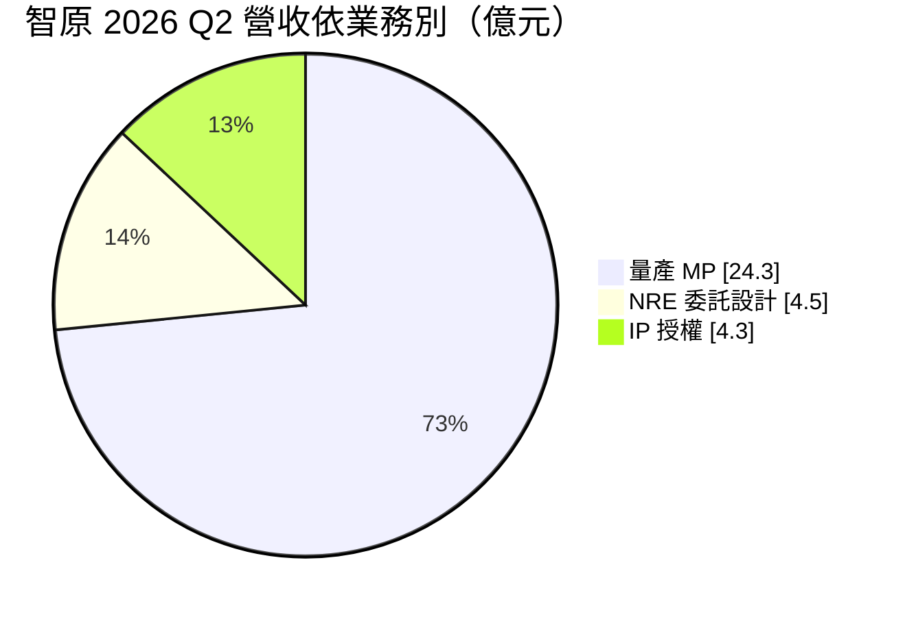
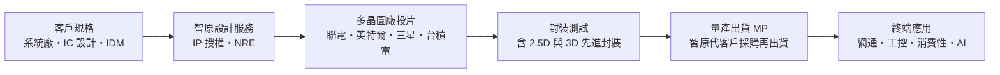
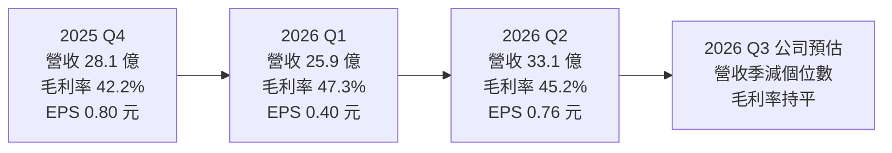
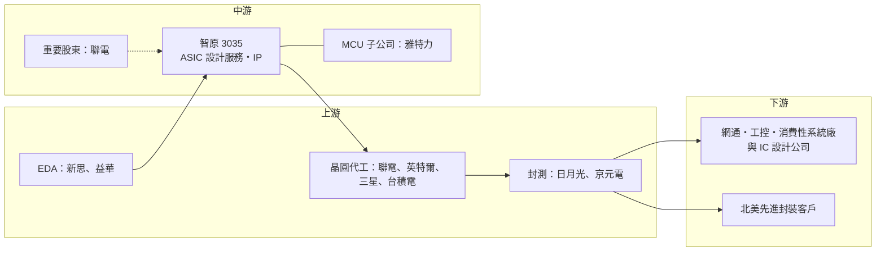

# 3035 智原

> 上市｜[[產業索引-半導體業|半導體業]]｜上市（櫃）日期 2002/08/26

# 第一章：企業模式與商業藍圖

> [!info] 撰寫說明
> 本文由 Claude 依公開資料整理，架構比照 [[2330台積電]] 的四章研究，資料截至 2026-10-07。財務數字來源：智原 2025 年第四季、2026 年第一季與第二季法說會報導（科技新報、工商時報）；產業描述為整理性內容，尚未逐條比對原始文件。#待校對

在評估單一個股的長期投資價值時，首要步驟是拆解企業的底層獲利邏輯。本章針對智原科技（股票代號：3035，以下簡稱智原）的商業模式進行定性分析，說明 ASIC 設計服務公司的三種營收來源如何影響營收與毛利率，以及智原如何以多晶圓廠中立的定位，在台積電體系之外尋找成長空間。

## 一、核心定位：聯電體系的 ASIC 設計服務與矽智財公司

智原是 [[2303聯電]] 轉投資的 [[ASIC]]（特殊應用積體電路）[[設計服務]]公司，聯電至今仍是重要股東。智原本身不賣自有品牌晶片，而是替系統廠、IC 設計公司與 [[IDM]] 把晶片從規格、設計、驗證、投片一路做到量產出貨，並授權自家開發的矽智財（[[IP]]）。

設計服務公司的商業模式可以想成「晶片的代工設計加代工管理」：客戶提出需求，智原負責實體設計與後段流程，接著代客戶向晶圓廠下單、安排封測，最後以晶片成品出貨給客戶。因此智原的營收有三種來源：

* **IP 授權：** 授權基礎元件庫、記憶體編譯器、介面 IP（如 USB、PCIe、DDR）給客戶使用，毛利率最高。
* **[[NRE]]（委託設計服務）：** 一次性的設計與光罩費用，代表新專案的數量與規模，是未來量產的領先指標。
* **量產（MP）：** 專案進入量產後，智原代客戶採購晶圓與封測再出貨，營收規模最大，但因包含晶圓成本，毛利率最低。

## 二、終端應用／產品板塊：量產比重高、波動大

2026 年第二季營收依業務別如下：

* **2025 年：** 合併營收約 180 億元，年增 63%，創歷史新高。其中量產營收 141.8 億元（年增 96%）、NRE 營收 22.9 億元（連續五年成長、創新高）、IP 營收 15.2 億元（年減 3%）。量產營收大增主要來自 2025 年上半年的大型量產專案，這也讓全年毛利率被稀釋到約 27%。
* **2026 年：** 量產營收回落，第一季營收 25.9 億元，年減 65%，但毛利率回升到 47.3%，創 13 季新高。第二季營收回升到 33.1 億元。

這說明智原的營收規模與毛利率高度取決於「量產專案的大小與時點」：量產多時營收高、毛利率低；量產少時營收低、毛利率高。投資人看智原時，NRE 與 IP 的趨勢往往比單季營收更能反映競爭力。

## 三、資本轉化邏輯：從聯電成熟製程延伸到先進製程

智原過去以聯電[[成熟製程]]為主要設計平台，近年積極擴展到多家晶圓廠的先進製程：

* **先進製程專案：** 2025 年第四季 NRE 營收中有 56% 來自先進製程，全年占比 49%。2025 年首次取得 4 奈米 AI 專案，2026 年第一季再取得 5 奈米網通晶片專案。
* **英特爾 18A：** 智原透過英特爾晶圓代工夥伴計畫，前一年以測試晶片取得 18A [[PDK]]，目前支援 18A-P 試產，是台灣少數能提供英特爾先進製程設計服務的公司。
* **[[先進封裝]]：** 智原提供 2.5D／3D 先進封裝整合服務，2026 年第一季再獲北美客戶新案，公司預期先進封裝業務 2026 年下半年開始貢獻、2027 年明顯放量。

## 四、企業長期藍圖：ASIC 與 MCU 雙軌，聚焦 AI

智原在 2026 年第二季法說會提出「ASIC 與 MCU 雙軌發展」：

* **ASIC：** 聚焦「雲、邊、端」三層級 AI，包括專用 AI 加速器、[[NPU]] 與網通晶片，搭配先進製程與先進封裝。
* **[[MCU]]：** 透過子公司雅特力（Artery）經營高效能 MCU，鎖定智慧[[IoT]] 市場，雅特力預期 2026 年營收倍增。
* **營收目標：** 公司維持 2026 年全年營收成長約 10% 的目標。

# 第二章：護城河深度與競爭優勢

在長期價值投資中，「護城河」指企業抵禦競爭、維持超額利潤的保護機制。本章分析智原的護城河構成、全球主要競爭對手，以及這些優勢在 AI ASIC 競賽中能守住多少。

## 一、智原護城河的核心組成要素

智原的護城河屬於「窄護城河」，由四個要素組成：

* **1. 大量自有 IP 與元件庫：** 智原長年累積基礎元件庫、記憶體編譯器與介面 IP，能降低客戶的授權成本與設計時間，對中小型客戶尤其有吸引力。
* **2. 多晶圓廠中立性：** 不綁定單一晶圓廠，能在聯電、英特爾、三星等多家晶圓廠之間替客戶選擇最適合的製程，這是與台積電體系設計服務公司最大的差異。
* **3. 聯電與英特爾關係：** 聯電是重要股東，且聯電與英特爾合作開發 12 奈米平台；智原同時是英特爾晶圓代工夥伴，在「非台積電」的先進製程供應鏈中占有一席之地。
* **4. 專案經驗與客戶黏著：** 一個 ASIC 從 NRE 到量產往往要兩到三年，客戶一旦在智原完成設計，量產階段通常會延續合作。

## 二、全球主要競爭對手格局

| 對手 | 定位 | 對智原的威脅 |
|---|---|---|
| [[3443創意]] | 台積電體系設計服務龍頭 | 在 7 奈米以下與 [[CoWoS]] 封裝的 AI ASIC 遠比智原強勢 |
| [[3661世芯-KY]] | 先進製程 AI 與 HPC ASIC | 客戶以北美雲端業者為主，搶高階 AI 專案 |
| [[AVGO博通]]、[[MRVL邁威爾]] | 全球客製化 AI 晶片主要供應商 | 規模與技術領先，服務大型雲端客戶 |
| [[6643M31]]、[[3529力旺]] | 矽智財 | 在 IP 授權領域部分重疊 |
| 中國設計服務公司 | 成熟製程 ASIC | 以價格競爭成熟製程專案 |

## 三、優勢轉化：哪些市場守得住、哪些守不住

* **守得住：** 成熟與中階製程的 ASIC（工控、網通、消費性、邊緣 AI）是智原的主場，大量 IP 與多晶圓廠彈性讓它在這些市場有競爭力。
* **守不住：** 最先進的雲端 AI ASIC 多集中在台積電先進製程與 CoWoS 封裝，創意與世芯在這塊有明顯優勢，智原要正面競爭並不容易。
* **執行力是關鍵：** 2026 年第二季法說會坦言，先進製程與先進封裝的 NRE 認列進度較慢，原因是 SoC 設計複雜度高與部分客戶變更晶片設計。這反映智原在先進專案上仍處於累積經驗的階段。
* **觀察重點：** 4 奈米、5 奈米專案能否順利進入量產、先進封裝業務能否在 2027 年放量、英特爾 18A 平台的客戶導入情況，以及雅特力 MCU 的成長。

# 第三章：財務體質與盈利規模

資料日期：2026-10-07。數字取自公司法說會與財經媒體整理（科技新報、工商時報），表格是撰寫當時的快照；最新月營收、毛利率、累計 EPS 由自動排程寫在本筆記的屬性欄位（月營收、毛利率、累計EPS 等）。#待校對

財務報表是檢驗護城河是否真實存在的最終標準。本章用三率、ROE、資本支出與資本報酬，檢視智原在量產專案起伏中的獲利品質。

## 一、獲利能力的基石：三率

| 項目 | 2025 全年 | 2025 Q4 | 2026 Q1 | 2026 Q2 |
|---|---|---|---|---|
| 營收（新台幣） | 約 180 億 | 28.1 億 | 25.9 億 | 33.1 億 |
| [[毛利率]] | 約 27% | 42.2% | 47.3% | 45.2% |
| [[營業利益率]] | 未查得 | 未查得 | 4.2% | 8.2% |
| 稅後淨利 | 7.3 億 | 2.1 億 | 1.0 億 | 2.0 億 |
| EPS（元） | 2.81 | 0.80 | 0.40 | 0.76 |

* **[[毛利率]]：** 2025 年營收創新高但毛利率只有約 27%，原因是低毛利的量產營收大增；2026 年量產回落後毛利率回升到 45% 以上。
* **[[營業利益率]]：** 營收規模縮小後，研發與管理費用相對固定，營業利益率只有個位數（第一季 4.2%、第二季 8.2%）。這是設計服務業的特性：營收規模不足時，費用率會明顯侵蝕獲利。
* **上半年結構：** 2026 年上半年累計營收 59 億元，其中量產 40.7 億元、NRE 9.9 億元、IP 8.5 億元。
* **展望：** 公司預估第三季營收季減個位數百分比、毛利率與第二季持平，全年營收成長約 10% 的目標不變。

## 二、[[ROE]]：資本效率

設計服務屬輕資產產業，但智原長期投入大量研發費用開發 IP 與先進製程能力，營業利益率偏低，使 ROE 長期不高。以 2025 年 EPS 2.81 元推估，ROE 約在個位數到 10% 出頭之間（精確值本次未查得）。要提升資本效率，關鍵在於先進製程 NRE 能否轉換成高毛利的量產專案。

## 三、資本支出與自由現金流

* **[[CapEx]]：** 智原的資本支出主要是 [[EDA]] 工具、IP 開發與研發設備，規模相對營收不大，具體金額本次未查得。
* **[[自由現金流]]：** 量產業務需要先替客戶墊付晶圓與封測成本，大型量產專案期間營運資金需求會增加，現金流與營收不一定同步。
* **股利：** 本次查得的資料未包含智原 2025 年度股利金額，股利政策細節未查得。

## 四、[[ROIC]] 與 [[WACC]]：價值創造利差

以個位數的營業利益率推估，智原在 2026 年上半年的 ROIC 可能接近或略高於 WACC（推估，具體數值未查得）。設計服務的價值創造取決於「研發投入能否轉為規模化量產」：如果 4 奈米、5 奈米與先進封裝專案在 2027 年後順利放量，研發投入的報酬才會明顯提升；若持續停留在 NRE 階段，研發費用將長期壓低資本報酬。

# 第四章：總體風險與地緣政治

任何企業都無法脫離宏觀環境獨立存在。本章分析智原未來必須面對的地緣政治、產業週期、營運與技術風險。

## 一、地緣政治風險

* **中國客戶與出口管制：** 設計服務公司常有中國客戶，美國對中國 AI 晶片與先進製程的管制，可能限制智原承接部分中國先進製程專案。
* **英特爾合作的政策紅利：** 美國推動晶片在地製造，智原作為英特爾晶圓代工夥伴，可能受惠於客戶「美國製造」的需求，但前提是英特爾晶圓代工業務順利推進。
* **台灣供應鏈集中：** 主要設計平台與晶圓廠夥伴集中在台灣，面臨兩岸風險。

## 二、產業週期與市場結構風險

* **量產專案集中：** 單一大型量產專案就可能讓營收大幅波動，2025 年營收大增、2026 年第一季年減 65% 就是例子，營收能見度不高。
* **終端需求週期：** 工控、網通、消費性電子的需求波動會影響客戶的量產拉貨，並受[[長鞭效應]]放大。
* **供應鏈緊縮：** 2026 年第二季法說會提到第三季因供應鏈緊縮營收季減，晶圓與封測產能吃緊時，量產出貨可能受限。

## 三、營運環境的隱性風險

* **先進專案執行：** 先進製程與先進封裝 NRE 認列進度較慢，若專案延後或客戶變更設計，研發投入無法及時轉為營收。
* **研發費用：** 投入先進製程與先進封裝需要大量人力與 EDA 費用，營業利益率在營收規模不足時容易被壓縮。
* **晶圓廠夥伴風險：** 英特爾晶圓代工策略若生變，18A 相關投入的效益會打折。

## 四、科技演進風險

AI ASIC 的競爭逐漸集中在最先進製程與先進封裝，設計複雜度與光罩成本快速上升。智原若無法在 4 奈米以下與 2.5D／3D 封裝累積成功量產案例，可能被限縮在成熟製程市場；而成熟製程 ASIC 又面臨中國設計服務公司的價格競爭。另一方面，[[Chiplet]] 小晶片架構普及，可能讓中型客戶更容易以多顆小晶片組合高效能產品，這對擁有先進封裝整合能力的設計服務公司是機會。

# 專有名詞解析

## 半導體

- **[[ASIC]]**：特殊應用積體電路，為特定客戶與用途客製設計的晶片，例如雲端業者自研的 AI 加速器。
- **[[設計服務]]**：替客戶完成晶片實體設計、驗證、投片與量產管理的業務，代表廠商為創意、世芯、智原。
- **[[NRE]]**：一次性工程費用，客戶支付的晶片設計與光罩費用，是未來量產專案的領先指標。
- **[[IP]]**：矽智財，可重複授權使用的電路設計模組，例如介面、記憶體編譯器與處理器核心。
- **[[PDK]]**：製程設計套件，晶圓廠提供給設計者的製程參數與元件模型，取得 PDK 才能在該製程上設計晶片。
- **[[EDA]]**：電子設計自動化工具，晶片設計必用的軟體，由新思科技、益華電腦等公司主導。
- **[[NPU]]**：神經網路處理器，專門加速 AI 推論運算的處理單元，常見於 AI PC、手機與邊緣裝置。
- **[[成熟製程]]**：一般指 28 奈米及更大線寬的製程，技術成熟、設備多已折舊，主要用於電源、驅動、車用與物聯網晶片。
- **[[先進封裝]]**：把多顆晶片以中介層、混合鍵合等方式高密度整合的封裝技術，例如 CoWoS、SoIC。
- **[[Chiplet]]**：小晶片架構，把大型晶片拆成多顆功能較小的晶片再以先進封裝組合，可降低成本與提高良率。
- **[[IDM]]**：垂直整合製造商，從晶片設計、晶圓製造到銷售都自己完成的半導體公司。
- **[[MCU]]**：微控制器，把處理器、記憶體與輸入輸出介面整合在一顆晶片，用於家電、工業與車用控制。

## 應用

- **[[IoT]]**：物聯網，讓家電、感測器與工業設備連上網路互相溝通，大量使用 MCU 與連網晶片。

## 金融

- **[[長鞭效應]]**：終端需求的小幅變動，沿供應鏈往上游傳遞時被逐級放大，造成上游庫存與訂單劇烈波動。
- **[[自由現金流]]**：營業活動現金流減去資本支出，代表企業可自由用於配息、還債或併購的現金。

# 核心供應鏈

## 1. 上游：晶圓代工、封測與 EDA
- 晶圓代工：[[2303聯電]]、[[INTC英特爾]]、[[005930三星電子]]、[[2330台積電]]
- 封裝測試：[[3711日月光投控]]、[[2449京元電子]]
- EDA 工具：[[SNPS新思科技]]、[[CDNS益華電腦]]

## 2. 中游：智原本身與關係企業
- 重要股東：[[2303聯電]]
- MCU 子公司：雅特力（Artery）

## 3. 下游：客戶類型
- 網通、工控、消費性電子系統廠與 IC 設計公司（未具名）
- 北美高階封裝客戶（未具名）

## 4. 同業與競爭者
- 設計服務：[[3443創意]]、[[3661世芯-KY]]
- 客製化 AI 晶片：[[AVGO博通]]、[[MRVL邁威爾]]
- 矽智財：[[3529力旺]]、[[6643M31]]

## 供應鏈關係
- 供應給 [[2330台積電]]：高階 ASIC 設計與 IP（台積電供應鏈 › 上游：晶片設計工具、IP與設計服務 (ASIC)）

## 最新新聞
<!-- news:start（自動產生，請勿手動編輯此範圍） -->
- 2026-10-07 📰 媒體 15:30｜《業績-半導體》智原9月營收為14.18億元，年增4.41%｜[富聯網](https://news.google.com/rss/articles/CBMiiAFBVV95cUxOQ0Z1QzhrcjhmZkFBQk9IeUx0bXY3VHp6UnU4ckF3MWo2cU5zZ3JkeTJQeTI0QlJ3TmNTT3JnNVJ0aWhwM2VxYlo5OFBaYWlVM1p3akZyNzRITmwzV1VWRnJGQXlmUERNMDNablAzNmlkcE0xRE1FR3dIM05sYW5lMzRuaUhfVXBr?oc=5)
- 2026-10-07 📰 媒體 09:51｜智原(3035) 個股概覽 ／ 個股 - 股市｜[CMoney](https://news.google.com/rss/articles/CBMiU0FVX3lxTFAwZC1ab0FWSEFoSXI1VVVNZkd6dGRFYTUzcjN0SzFVYmt0MnRMRzZzUzRHVkxENkRzNWlxVEhLaE9hOXBBWUdVemtVN0d0WDZWaS1J?oc=5)
- 2026-10-05 📰 媒體 12:41｜智原(3035)股價墊高,泰衡指標升至 997.6 高位:留意資訊驅動與異常交易風險｜[聚財網](https://news.google.com/rss/articles/CBMiTEFVX3lxTE5oZVNneVU2N3dxQnc4T2gza01VM0FFckRmMWViSHJOYmRjSEFEaWNDSWtSdk9KanRrdFR2VVlKQ0FRRlJlSkRkSTk4TnM?oc=5)

完整紀錄：[[3035智原 新聞]]
<!-- news:end -->

## 相關連結
- [公開資訊觀測站](https://mopsov.twse.com.tw/mops/web/t05st03?step=1&firstin=1&co_id=3035)
- [Goodinfo](https://goodinfo.tw/tw/StockDetail.asp?STOCK_ID=3035)
- [Yahoo 股市](https://tw.stock.yahoo.com/quote/3035)
- [鉅亨網新聞](https://www.cnyes.com/twstock/3035/news)
