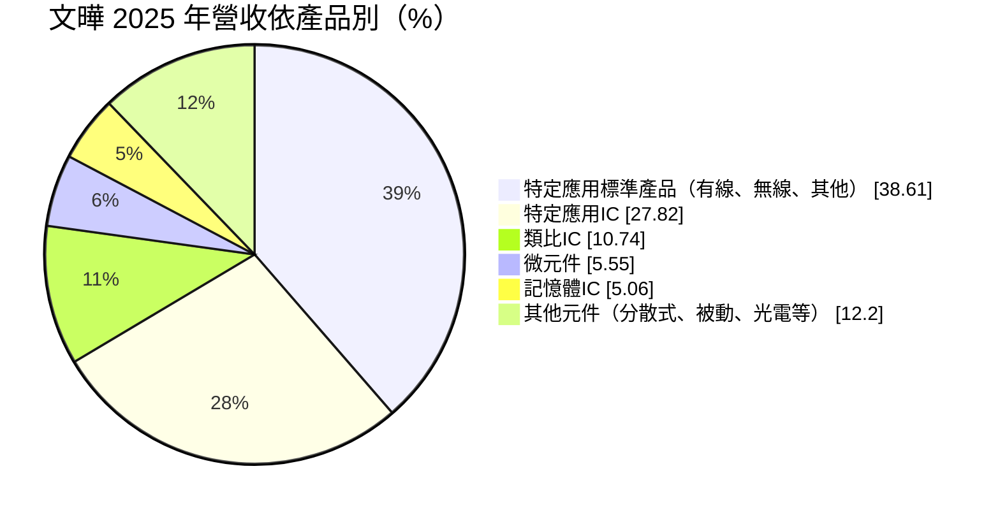
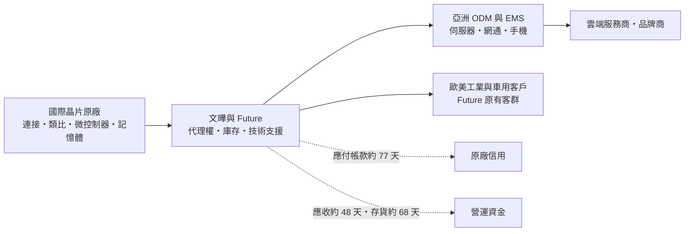
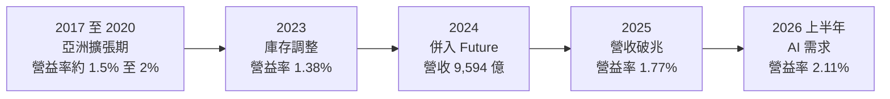
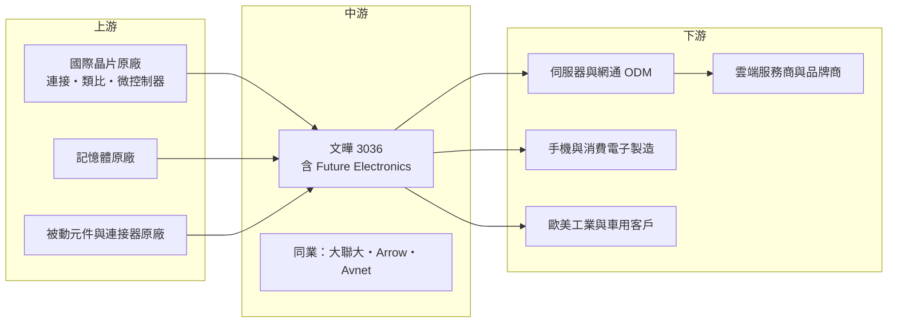

# 3036 文曄

> 上市｜[[產業索引-電子通路業|電子通路業]]｜上市（櫃）日期 2002/08/26

# 第一章：企業模式與商業藍圖

> [!info] 撰寫說明
> 本文由 Claude 依公開資料整理，架構比照 [[2330台積電]] 的四章研究，資料截至 2026-10-08。財務數字來源：Goodinfo 年度經營績效、現金流量與股利政策頁、MoneyDJ 理財網財務比率、營收比重與資產負債表、優分析、旺得富（中時）法說會報導（2026 年 3 月）、財訊快報、證交所開放資料（基本資料、資產負債、綜合損益、營益分析、股利）；產業描述為整理性內容，尚未逐條比對原始文件。#待校對

在評估單一個股的長期投資價值時，首要步驟是拆解企業的底層獲利邏輯。本章針對文曄科技（股票代號：3036，以下簡稱文曄）的商業模式進行定性分析。文曄在十年內從台灣的二線 IC 通路商，透過一連串併購成長為全球前兩大的電子元件通路商，2025 年營收首度突破新台幣一兆元。理解文曄，就是理解「併購整合」與「AI 資料中心」這兩股力量如何改寫一家通路商的規模與地位。

## 一、核心定位：以併購擴張的全球半導體通路商

文曄成立於 1993 年，2002 年在台灣證券交易所上市，總部位於新北市中和區，董事長為創辦人鄭文宗。文曄的本業是半導體零組件的[[代理商]]：向國際晶片原廠取得代理權，替原廠把晶片賣給亞洲的電子製造廠與 [[ODM]]，並提供技術支援、庫存、物流與帳款融資服務。

文曄近十年最重要的成長方式是併購。依公開報導，文曄曾入股並整合亞洲多家通路商（例如新加坡的世健科技，細節待校對），並在 2024 年第二季完成併購加拿大的 Future Electronics（富昌電子），這是全球電子元件通路產業近年最大的併購案之一（交易金額約 38 億美元，待校對）。依優分析整理，併購後文曄的營收中亞洲占比由幾乎百分之百降到約 84%，其餘約 16% 來自美洲與歐洲。Future 在 2022 年的營收結構為亞洲 34%、美洲 42%、歐洲中東非洲 24%。

這次併購讓文曄從「亞洲的技術型通路商」轉型為「全球的電子元件通路商」，可以服務跨國客戶在不同地區的需求，也取得了 Future 在歐美工業、車用與醫療市場的客戶基礎。

## 二、終端應用／產品板塊：資料中心與伺服器為最大應用

依 MoneyDJ 理財網整理的 2025 年營收比重，以產品別來看，特定應用 IC 占 27.82%、特定應用標準產品（有線連接、無線連接與其他）合計約 38.61%、類比 IC 占 10.74%、微元件占 5.55%、記憶體 IC 占 5.06%，其餘分散式元件、被動元件、光電元件等合計約 12.2%。

依應用別，優分析整理的 2024 年資料顯示：資料中心及伺服器占 36.1%、手機占 18.5%、通訊占 12%、工業與儀器占 11.6%、汽車電子占 8.3%、個人電腦及周邊占 7%、消費性電子占 6.5%。

* **資料中心與伺服器：** 文曄代理的有線連接晶片（高速乙太網路交換器、[[SerDes]] 等）、特定應用 IC 與網通晶片，大量用於雲端資料中心與 AI 伺服器。這是文曄最大、也是成長最快的應用。董事長鄭文宗在 2026 年 3 月法說會上表示，AI 仍是主要成長動能，AI 資料中心建置將支撐多年的需求（旺得富報導）。
* **手機與通訊：** 手機的無線連接、射頻與電源晶片，以及網通設備的晶片。
* **工業、車用與其他：** 這部分在併購 Future 後比重提高，Future 在歐美工業與車用客戶有深厚基礎，讓文曄的應用結構更均衡。

## 三、資本轉化邏輯（營運模式）：以規模換議價、以周轉換報酬

文曄的營運模式和其他半導體通路商相似，但有幾個特點：

* **技術型代理：** 通路商分為「技術型」與「物流型」。技術型通路商派駐現場應用工程師（[[FAE]]），協助客戶在設計階段就採用原廠晶片，從而取得長期訂單。文曄以技術型代理起家，在網通、資料中心等高階應用的[[設計導入]]能力，是它與原廠長期合作的基礎。
* **原廠信用的槓桿：** 2026 年第二季底，文曄的應付帳款約 5,571 億元，高於存貨約 3,186 億元與應收帳款約 3,491 億元（MoneyDJ）。這代表大量營運資金來自原廠給予的付款期限，而不是銀行借款。原廠願意給予更長的付款條件，反映文曄的規模與信用地位，也是規模帶來的關鍵優勢。
* **[[交叉銷售]]：** 併購 Future 後，文曄可以把 Future 的歐美客戶介紹給自己代理的原廠，也把自己的亞洲客戶介紹給 Future 代理的產品線，擴大每一條產品線的銷售範圍。

## 四、企業長期藍圖：全球化、AI 化與綜效實現

* **併購綜效實現：** 法說會報導指出，Future 的營運正在恢復，併購綜效逐步顯現（旺得富）。長期觀察重點是 Future 的營業利益率能否提升到文曄的水準。
* **AI 資料中心：** 資料中心與伺服器已是文曄最大的應用，AI 基礎建設的長期擴張，是文曄未來十年最重要的成長來源。
* **產品線的進退：** 通路商的代理權會隨原廠策略改變。2025 年初 ADI（亞德諾）終止與文曄的代理合作，該產品線占文曄營收中低個位數百分比，公司表示將把人力轉向其他類比 IC 原廠（優分析）。這提醒投資人，代理權並非永久資產。
* **資本結構：** 文曄為了支應併購發行[[特別股]]與[[可轉換公司債]]（細節待校對），2026 年第二季底應付公司債約 108.6 億元（MoneyDJ）。經營層的資本配置習慣是以股權與債務混合工具支應大型併購，接受短期的股本稀釋，換取長期的規模地位。

# 第二章：護城河深度與競爭優勢

在長期價值投資中，「護城河」指企業抵禦競爭、維持超額利潤的保護機制。本章分析文曄在半導體通路這個集中度越來越高的產業中，護城河由哪些要素構成，以及它和主要對手的相對位置。

## 一、護城河的核心組成要素

半導體通路的護城河主要來自規模，文曄在併購 Future 後的規模優勢明顯提升：

* **1. 規模與代理權組合：** 晶片原廠傾向把產品線集中給少數大型通路商，以降低管理成本。文曄年營收超過一兆元，代理多家國際原廠的產品，對原廠而言是不可或缺的銷售通路。規模越大，越能取得更多代理權與更好的付款條件，形成正向循環。
* **2. 技術支援能力：** 在資料中心、網通等複雜應用中，客戶需要通路商的應用工程師協助設計導入。這種技術服務需要長期累積的人才與經驗，物流型通路商不容易複製。
* **3. 全球據點與客戶覆蓋：** 併購 Future 後，文曄同時擁有亞洲製造業客戶與歐美工業、車用客戶，可以服務跨國客戶在不同地區的採購需求，這是單一區域通路商無法提供的。
* **4. 信用與資金能力：** 通路商需要大量資金墊付庫存與應收帳款。文曄能取得原廠的長期付款條件與銀行融資，資金成本低於中小型對手。

## 二、全球主要競爭對手格局

| 對手 | 定位 | 對文曄的影響 |
|---|---|---|
| Arrow Electronics（艾睿） | 美國，全球最大電子元件通路商之一 | 在全球市場直接競爭，歐美客戶基礎深厚 |
| [[3702大聯大]] | 台灣，亞洲最大半導體通路商之一，以控股模式整合多家通路 | 在亞洲市場最直接的對手，規模與文曄相近 |
| Avnet（安富利） | 美國，全球前三大通路商 | 在歐美與亞洲市場競爭 |
| TTI、Mouser、Digi-Key 等專業通路 | 各具利基市場 | 在特定產品線或小量多樣市場競爭 |
| 原廠直銷 | 大客戶由原廠直接服務 | 原廠對超大型客戶傾向直銷，壓縮通路商空間 |

## 三、優勢轉化：守得住／守不住／觀察重點

* **守得住：** 中小型與中型客戶的代理業務、需要技術支援的設計導入專案，以及跨區域客戶的整合服務。這些業務原廠不會直接處理，通路商的價值明確。
* **守不住：** 超大型客戶與單一原廠的代理權。若原廠決定直接服務雲端服務商等大客戶，或把代理權轉給其他通路，文曄的營收可能在短期內明顯下滑，ADI 代理權終止就是一例。
* **觀察重點：** 第一，Future 的營業利益率改善程度，這是併購是否創造價值的關鍵。第二，資料中心應用的比重與成長性。第三，主要原廠的代理權是否穩定。第四，負債比與營運資金規模，因為快速成長會吃掉大量資金。

# 第三章：財務體質與盈利規模

資料日期：2026-10-08。數字取自 Goodinfo 年度經營績效、現金流量與股利政策頁、MoneyDJ 理財網財務比率與資產負債表、旺得富法說會報導與證交所開放資料，表格是撰寫當時的快照；最新月營收、毛利率、累計 EPS 由自動排程寫在本筆記的屬性欄位（月營收、毛利率、累計EPS 等）。#待校對

財務報表是檢驗護城河是否真實存在的最終標準。對通路商而言，除了三率之外，存貨與應收帳款的週轉天數、[[營運資金]]的規模，才是判斷經營品質的核心。本章檢視文曄在併購前後的財務變化。

## 一、獲利能力的基石：三率與通路指標

| 年度 | 營收（新台幣） | [[毛利率]] | [[營業利益率]] | EPS（元） | [[ROE]] |
|---|---|---|---|---|---|
| 2017 | 1,894 億 | 4.45% | 2.07% | 5.26 | 13.6% |
| 2018 | 2,734 億 | 3.89% | 1.92% | 5.02 | 13.3% |
| 2019 | 3,352 億 | 3.22% | 1.57% | 4.32 | 11.2% |
| 2020 | 3,532 億 | 3.05% | 1.51% | 5.22 | 10.9% |
| 2021 | 4,479 億 | 3.79% | 2.36% | 9.96 | 15.7% |
| 2022 | 5,712 億 | 3.47% | 2.06% | 8.61 | 14.0% |
| 2023 | 5,945 億 | 3.10% | 1.38% | 4.24 | 6.27% |
| 2024 | 9,594 億 | 3.92% | 1.59% | 8.13 | 10.5% |
| 2025 | 11,779 億 | 4.04% | 1.77% | 11.61 | 12.2% |
| 2026 上半年 | 10,849.7 億 | 3.43% | 2.11% | 13.00 | 未查得 |

註：2017 至 2025 年取自 Goodinfo 合併報表（2016 年未查得）；2026 上半年取自證交所營益分析與綜合損益開放資料。2025 年 EPS 以加權平均股數計算為 11.6 元，以期末股數計算約 10.5 元（旺得富報導）。

| 年度 | [[平均售貨天數]] | 平均收帳天數 | 負債比率 |
|---|---|---|---|
| 2019 | 52.1 天 | 44.0 天 | 76.8% |
| 2020 | 48.0 天 | 54.5 天 | 64.8% |
| 2021 | 46.9 天 | 55.5 天 | 68.9% |
| 2022 | 52.0 天 | 51.1 天 | 72.5% |
| 2023 | 59.0 天 | 60.2 天 | 72.9% |
| 2024 | 50.8 天 | 48.3 天 | 74.8% |
| 2025 | 67.9 天 | 48.4 天 | 77.6% |

註：取自 MoneyDJ 理財網年度財務比率。

* **[[毛利率]]：** 文曄的毛利率在 3% 至 4.5% 之間。2024 年併入 Future 後毛利率上升，因為 Future 的歐美工業與車用客戶毛利較高；但 Future 的營業費用率也較高，所以營業利益率的改善幅度小於毛利率。
* **[[營業利益率]]：** 2025 年營業利益率 1.77%，仍低於 2021 年的 2.36%。2026 年上半年回升到 2.11%，代表 AI 需求帶來的規模效益與 Future 的綜效開始反映。
* **營收爆發成長：** 2020 至 2025 年營收從 3,532 億元成長到 11,779 億元，年複合成長率約 27.2%（推算）。其中約一半來自 Future 併購，另一半來自 AI 資料中心需求（推估）。
* **營運資金：** 2025 年平均售貨天數拉長到 67.9 天，反映 AI 相關產品備貨增加。2026 年第二季底存貨約 3,186 億元、應收帳款約 3,491 億元、應付帳款約 5,571 億元（MoneyDJ），存貨加應收減應付的營運資金約 1,106 億元（推算）。應付帳款大於存貨，代表原廠信用支撐了大部分營運資金。

## 二、[[ROE]]：資本效率

2021 至 2025 年平均 ROE 約 11.7%（推算）。文曄的 ROE 受到兩個因素影響：一是 2023 年半導體庫存調整造成的獲利下滑，二是併購 Future 時發行特別股與新股使權益大幅增加，稀釋了短期 ROE。2026 年第二季底股東權益約 1,246.8 億元，較併購前大幅增加；負債比率在 2026 年第二季達 84.66%（MoneyDJ），代表文曄使用高度財務槓桿，其中多數為應付帳款這類無息負債。

## 三、資本支出、自由現金流與股利

| 年度 | 營業現金流 | 投資現金流 | [[自由現金流]] | 現金股利（元） |
|---|---|---|---|---|
| 2019 | 28.7 億 | -0.42 億 | 28.2 億 | 2.089 |
| 2020 | -16.6 億 | -2.58 億 | -19.1 億 | 3.203 |
| 2021 | -130 億 | -9.93 億 | -140 億 | 5.015 |
| 2022 | -60.4 億 | -49.5 億 | -110 億 | 4.298 |
| 2023 | 410 億 | -7.39 億 | 403 億 | 1.799 |
| 2024 | 424 億 | -1,089 億 | -665 億 | 5.998 |
| 2025 | 176 億 | -17.6 億 | 158 億 | 7.795 |

註：現金流取自 Goodinfo（自由現金流＝營業現金流＋投資現金流），股利依所屬年度列示。

* **2024 年的併購支出：** 2024 年投資現金流流出 1,089 億元，主要是 Future 的收購對價（推估），這是文曄歷史上最大的一筆資本支出。
* **營運現金流的週期性：** 和其他通路商一樣，文曄在營收快速成長的年份（2021、2022 年）營業現金流為負，在庫存去化的年份（2023 年）大幅轉正。七年中自由現金流有三年為正、四年為負，但扣除 2024 年併購支出後，長期累計大致為正（推算）。
* **股利政策：** 公司章程規定盈餘分配不低於當年度可分配盈餘的 40%，採「最低現金股利加額外股利」政策。2025 年度配發現金股利 7.8 元，以 EPS 11.61 元計算[[配發率]]約 67%（推算），創歷年新高。

## 四、[[ROIC]] 與 [[WACC]]：價值創造利差

**ROIC 推算：** 2025 年營業利益約 208.8 億元（旺得富報導），扣除 20% 稅率後約 167 億元。投入資本以 2026 年第二季底計算：股東權益 1,246.8 億元（證交所），有息負債約 664 億元（短期借款 531.3 億元、長期借款含一年內到期約 8 億元、應付公司債 108.6 億元、租賃負債約 16.4 億元，MoneyDJ），合計約 1,911 億元，ROIC 約 8.7%（推算）。以 2026 年上半年營業利益 229.4 億元年化，ROIC 約 19.2%（推算）。需要注意，權益中包含併購產生的[[商譽]]，若扣除商譽，有形資本報酬率會更高。

**WACC 推估（CAPM）：** 假設台灣 10 年期公債殖利率約 1.75%、市場風險溢酬 6%、β 取 0.9（推估，半導體通路商常見值），股東權益成本約 7.15%；稅前負債成本假設 3.5%（推估，含美元借款），稅後約 2.8%。以市值計算（股價淨值比約 2.19 倍，市值約 2,725 億元），權益約占 80%、負債約占 20%，WACC 約 6.3%（推算）。

**結論：** 文曄 2025 年 ROIC 約 8.7%，高於 WACC 約 6.3%，2026 年上半年年化後利差更擴大到十個百分點以上，代表 Future 併購後的營運規模開始創造超額報酬。不過通路商的 ROIC 高度依賴原廠給予的付款條件（應付帳款不計入投入資本），若原廠收緊信用，投入資本會增加、ROIC 會下降。長期來看，文曄能否穩定維持 ROIC 高於 WACC，取決於 Future 的獲利改善與 AI 需求的延續。

# 第四章：總體風險與地緣政治

任何企業都無法脫離宏觀環境獨立存在。本章分析文曄未來必須面對的地緣政治、產業週期與營運風險。

## 一、地緣政治

* **美中科技管制：** 美國對中國的半導體出口管制，限制了部分高階晶片在中國的銷售。文曄的客戶多為亞洲製造業，若管制擴大到更多產品類別，部分營收可能受影響。通路商也必須承擔更高的出口合規管理責任。
* **供應鏈轉移：** 電子製造業從中國轉往東南亞、印度與墨西哥，文曄需要跟著客戶在新的地區建立據點。併購 Future 取得的美洲與歐洲據點，有助於因應這個趨勢。
* **關稅：** 美國關稅政策影響電子產品的生產地與庫存策略，客戶提前拉貨或延後採購都會造成短期營收波動。

## 二、產業週期與市場結構

* **半導體庫存週期：** 2023 年半導體庫存調整，文曄 EPS 從 8.61 元降到 4.24 元。通路商處於供應鏈中段，[[長鞭效應]]會放大庫存與訂單的波動。
* **AI 投資週期：** 資料中心已是最大應用，若雲端服務商放緩 AI 資本支出，文曄的成長動能會受到直接衝擊。
* **通路產業集中化：** 原廠持續整併代理商，大型通路商受惠，但也代表單一代理權的得失影響更大。

## 三、營運環境的隱性風險

* **代理權流失：** ADI 終止代理的案例顯示，原廠可能因策略調整收回代理權，造成營收缺口。
* **原廠信用條件：** 文曄大量依賴原廠的應付帳款支撐營運資金，若原廠縮短付款期限，文曄需要向銀行借更多錢，利息成本與財務風險都會上升。
* **[[存貨跌價損失]]：** 2026 年第二季底存貨約 3,186 億元，若電子元件價格下跌或需求急凍，跌價損失的金額可能很大。
* **併購整合：** Future 的企業文化、系統與管理方式與文曄不同，整合過程中的人才流失或系統問題，可能讓綜效打折。

## 四、科技或法規演進

* **AI 晶片的直銷趨勢：** 最先進的 AI 加速器多由原廠直接銷售給雲端服務商，通路商分到的主要是周邊的網通、電源與記憶體晶片。文曄的成長空間取決於這些周邊晶片的需求規模。
* **數位化採購：** 電子元件的線上採購平台逐漸普及，可能壓縮傳統通路在小量訂單上的角色，但對需要技術支援的設計導入業務影響較小。

# 專有名詞解析

## 半導體

- **[[SerDes]]**：串列器與解串器，把並列資料轉為高速串列訊號傳輸的電路，是資料中心高速互連的關鍵。

## 金融

- **[[營運資金]]**：存貨加應收帳款減應付帳款的金額，代表企業日常營運被占用的資金，通路商的核心指標。
- **[[平均售貨天數]]**：存貨從購入到賣出平均需要的天數，數字越大代表庫存越多、週轉越慢。
- **[[交叉銷售]]**：把既有客戶介紹給其他產品線，或把新產品賣給既有客戶，是併購綜效的主要來源。
- **[[商譽]]**：併購價格高於被併公司可辨認淨資產公允價值的差額，列為無形資產，需定期做減損測試。
- **[[特別股]]**：在股利分配或剩餘財產分配上優先於普通股的股份，常用於併購或籌資。
- **[[可轉換公司債]]**：可以在約定條件下轉換為公司普通股的公司債，兼具債券與股權性質。
- **[[長鞭效應]]**：終端需求的小幅變動，沿供應鏈往上游傳遞時被逐級放大，造成庫存與訂單劇烈波動。
- **[[配發率]]**：現金股利占當年度每股盈餘的比例，用來衡量公司把多少獲利分給股東。

## 產業

- **[[代理商]]**：向原廠採購產品再轉售給下游客戶的通路業者，價值在於庫存、配送與信用服務。
- **[[ODM]]**：原廠委託設計製造，代工廠負責設計與生產，再以客戶品牌出貨，例如伺服器與筆電代工廠。
- **[[FAE]]**：現場應用工程師，協助客戶在產品設計階段選用並導入晶片，是技術型通路商的核心人才。
- **[[設計導入]]**：通路商與原廠協助客戶在新產品設計時採用特定晶片，成功後可帶來產品生命週期內的長期訂單。

# 核心供應鏈

## 1. 上游：晶片原廠
- 國際晶片原廠：代理名單未逐一查證（待校對）；常見的資料中心與網通晶片原廠包括 [[AVGO博通]]、[[MRVL邁威爾]]、[[QCOM高通]] 等，是否為文曄代理線需以公司揭露為準
- 2025 年終止代理：ADI（亞德諾）

## 2. 中游：通路同業
- [[3702大聯大]]
- [[2347聯強]]（半導體業務）
- Arrow Electronics、Avnet

## 3. 下游：客戶
- 伺服器與網通 ODM：[[2382廣達]]、[[3231緯創]]、[[2317鴻海]] 等（客戶名單為整理性描述，待校對）
- 手機與消費電子製造商
- 歐美工業、車用與醫療設備客戶（Future 原有客群）

## 最新新聞
<!-- news:start（自動產生，請勿手動編輯此範圍） -->
- 2026-10-08 📰 媒體 19:51｜營收速報 - 文曄(3036)9月營收2,159.33億元年增率高達60.01％｜[鉅亨網](https://news.cnyes.com/news/id/6625872)
- 2026-10-08 🏛️ 重訊 17:24｜本公司115年9月份自結合併營收約新台幣2,159億元｜[觀測站](https://mops.twse.com.tw/mops/#/web/t05st01)

完整紀錄：[[3036文曄 新聞]]
<!-- news:end -->

## 相關連結
- [公開資訊觀測站](https://mopsov.twse.com.tw/mops/web/t05st03?step=1&firstin=1&co_id=3036)
- [Goodinfo](https://goodinfo.tw/tw/StockDetail.asp?STOCK_ID=3036)
- [Yahoo 股市](https://tw.stock.yahoo.com/quote/3036)
- [鉅亨網新聞](https://www.cnyes.com/twstock/3036/news)
