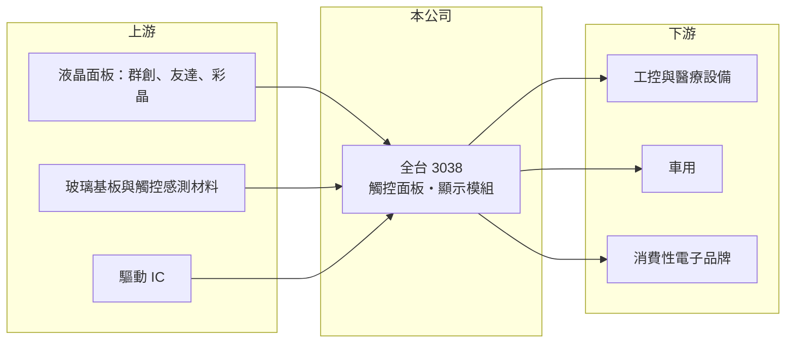

# 3038 全台

> 上市｜[[產業索引-光電業|光電業]]｜上市（櫃）日期 2002/08/26

# 第一章：企業模式與商業藍圖

> [!info] 撰寫說明
> 精簡版，由 Claude 依公開資料整理，架構比照 [[2330台積電]]，資料截至 2026-10-07。來源：nstock.tw 全台公司概況、科技新報與 winvest.tw 營收快訊。公開資料有限，產品比重未查到。#待校對

全台把面板與觸控元件整合成模組，鎖定大型面板廠較少經營的中小尺寸客製市場。

- **核心業務：** 全台晶像總部位於高雄，主要從事[[電容式觸控]]面板與液晶顯示器（[[LCM]]）的製造與銷售。
- **營收結構：** 本次未查到觸控面板與顯示模組的營收比重，推估以中小尺寸應用為主。
- **營運據點：** 總部在高雄市，其他生產據點本次未查到。
- **長期方向：** 在大型面板廠較少經營的中小尺寸、客製化觸控顯示市場深耕，推估以工控、車用、醫療等利基應用為主。

# 第二章：護城河深度與競爭優勢

全台的優勢是觸控與顯示的整合能力，但本業利潤空間很薄。

- **競爭優勢：** 觸控與顯示整合能力，可提供客製化模組；長期維持穩定配息。
- **主要對手：** [[3481群創]]、[[2409友達]]、[[6116彩晶]] 等面板廠，以及 [[8105凌巨]] 等中小尺寸模組廠。
- **觀察重點：** 營收連續年減能否止穩，以及 [[營業利益率]] 偏低的情況是否改善。

# 第三章：財務體質與盈利規模

資料日期：2026-10-07，表格是撰寫當時的快照；最新月營收、毛利率、累計 EPS 由自動排程寫在本筆記的屬性欄位（月營收、毛利率、累計EPS 等）。#待校對

全台營收仍在年減，營業利益率偏低，但配息穩定。

- **營收規模：** 2026 年 8 月營收 2.44 億元，年減 11.0%；1 至 8 月累計 19.50 億元，年減 7.3%。
- **獲利：** 2026 年第二季 EPS 0.28 元，[[毛利率]] 20.86%，營業利益率 1.67%。
- **財務特色：** 資本額約 15.74 億元，近五年平均現金股利 1.42 元，2025 年配發 1.2 元，[[殖利率]]在 5% 左右（以 nstock 當時股價計）。

# 第四章：總體風險與地緣政治

全台的風險在於營業利益率過低，營收稍有下滑就可能轉為本業虧損。

- **產業週期：** 中小尺寸觸控顯示需求跟著工控、消費性電子與車用景氣循環。
- **營運風險：** 營業利益率僅約 1% 至 2%，營收下滑時容易轉為本業虧損。
- **其他風險：** 面板與 IC 等原物料價格波動；美元匯率影響外銷報價與匯兌損益。

# 專有名詞解析

## 應用

- **[[電容式觸控]]**：偵測手指造成的微小電容變化來判斷觸控位置，是手機與平板的主流觸控技術。
- **[[LCM]]**：液晶顯示模組，把面板、背光、驅動 IC 與外框組裝成可直接裝機的顯示單元。

## 金融

- **[[殖利率]]**：每年現金股利除以股價，用來衡量以現價買進可領回的現金報酬。

# 核心供應鏈

- 上游：液晶面板、玻璃基板、觸控感測材料與驅動 IC 供應商
- 下游／客戶：工控、車用、醫療與消費性電子品牌（推估）
- 同業：[[8105凌巨]]、[[3481群創]]、[[6116彩晶]]

## 最新新聞
<!-- news:start -->
<!-- news:end -->

## 相關連結
- [公開資訊觀測站](https://mopsov.twse.com.tw/mops/web/t05st03?step=1&firstin=1&co_id=3038)
- [Goodinfo](https://goodinfo.tw/tw/StockDetail.asp?STOCK_ID=3038)
- [Yahoo 股市](https://tw.stock.yahoo.com/quote/3038)
- [鉅亨網新聞](https://www.cnyes.com/twstock/3038/news)
