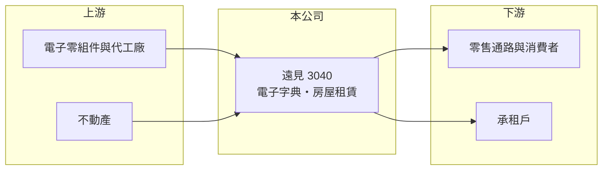

# 3040 遠見

> 上市｜[[產業索引-其他業|其他業]]｜上市（櫃）日期 2002/08/26

# 第一章：企業模式與商業藍圖

> [!info] 撰寫說明
> 精簡版，由 Claude 依公開資料整理，架構比照 [[2330台積電]]，資料截至 2026-10-07。來源：nStock 遠見公司簡介、winvest 營收快訊。公開資料有限。#待校對

遠見是規模很小的公司，業務包括電子字典產銷與房屋租賃，月營收約 1,000 萬元。

- **核心業務：** 公司登記的主要營業項目為產銷[[電子字典]]及房屋租賃。
- **營收結構：** 本次未查到兩項業務的營收比重；2026 年第二季[[毛利率]]達 63.16%，推估租賃收入占有相當比重。
- **營運據點：** 本次未查到具體營運據點資訊。
- **長期方向：** 電子字典市場受手機與線上翻譯取代，推估公司以租賃收入維持營運，本次未查到新業務規劃。

# 第二章：護城河深度與競爭優勢

遠見的業務屬於成熟或萎縮中的市場，護城河有限。

- **競爭優勢：** 主要來自既有不動產帶來的穩定租金收入（推估）。
- **主要對手：** 電子字典面對手機 App 與線上翻譯服務的替代競爭，本次未查到具體同業名單。
- **觀察重點：** 月營收是否維持約 1,000 萬元水準，以及租賃收入的穩定度。

# 第三章：財務體質與盈利規模

資料日期：2026-10-07，以下數字是撰寫當時的快照；最新月營收、毛利率、累計 EPS 由自動排程寫在本筆記的屬性欄位（月營收、毛利率、累計EPS 等）。#待校對

遠見營收規模小，本業有小幅獲利，但最終仍為虧損。

- **營收規模：** 2025 年全年營收 1.32 億元；2026 年 1 至 8 月累計 0.87 億元，8 月營收 1,024.5 萬元，年增 3.32%。
- **獲利：** 2026 年第二季[[毛利率]] 63.16%、[[營業利益率]] 8.51%，但[[淨利率]] -29.14%，EPS -0.14 元，顯示業外項目造成虧損。
- **財務特色：** 資本額 8.58 億元，近五年平均現金股利 1.28 元。

# 第四章：總體風險與地緣政治

遠見的風險在於本業萎縮與業外損益波動。

- **產業週期：** 電子字典需求長期下滑，屬於結構性衰退。
- **營運風險：** 營收規模小，營業費用與業外損益容易讓 EPS 大幅波動。
- **其他風險：** 租賃收入受承租戶續約與不動產景氣影響。

# 專有名詞解析

## 應用

- **[[電子字典]]**：內建字典與翻譯資料庫的掌上型電子裝置，市場已大幅被手機與線上翻譯取代。

## 金融

- **[[毛利率]]**：毛利除以營收，反映產品或服務本身的獲利能力。
- **[[淨利率]]**：稅後淨利除以營收，包含業外損益與稅負後的最終獲利能力。

# 核心供應鏈

- 上游：電子零組件供應商與代工廠、自有或承租不動產（推估）
- 下游／客戶：零售通路、消費者與房屋承租戶（推估）
- 同業：電子字典品牌與一般不動產租賃業者（本次未查到具體名單）

## 最新新聞
<!-- news:start -->
<!-- news:end -->

## 相關連結
- [公開資訊觀測站](https://mopsov.twse.com.tw/mops/web/t05st03?step=1&firstin=1&co_id=3040)
- [Goodinfo](https://goodinfo.tw/tw/StockDetail.asp?STOCK_ID=3040)
- [Yahoo 股市](https://tw.stock.yahoo.com/quote/3040)
- [鉅亨網新聞](https://www.cnyes.com/twstock/3040/news)
