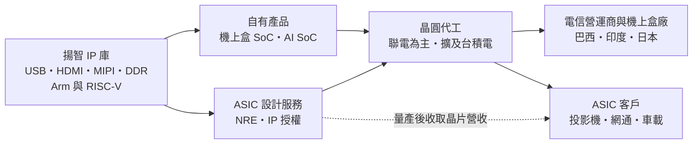
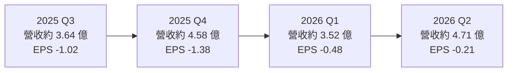
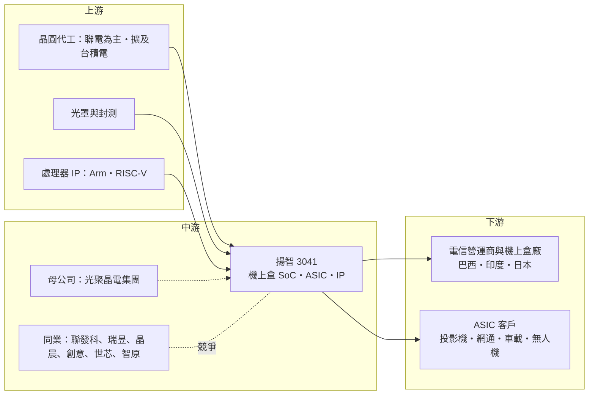

# 3041 揚智

> 上市｜[[產業索引-半導體業|半導體業]]｜上市（櫃）日期 2002/08/26

# 第一章：企業模式與商業藍圖

> [!info] 撰寫說明
> 本文由 Claude 依公開資料整理，架構比照 [[2330台積電]] 的四章研究，資料截至 2026-10-07。財務數字來源：Yahoo 股市月營收與 EPS 資料、Yahoo 股市新聞（2025 年 3 月）、中央社（2024 年 9 月）、鉅亨網（2024 年 9 月）、優分析、科技新報 2026 年 3 月光聚晶電報導、nstock 公司概況；揚智近一年未查得完整法說會資料，產業描述為整理性內容，尚未逐條比對原始文件。#待校對

在評估單一個股的長期投資價值時，首要步驟是拆解企業的底層獲利邏輯。本章針對揚智科技股份有限公司（股票代號：3041，以下簡稱揚智）的商業模式進行定性分析，說明一家以機上盒晶片為主、連續多年虧損的 IC 設計公司，如何藉由 [[ASIC]] 設計服務與集團資源嘗試轉型。

## 一、核心定位：從機上盒晶片走向 ASIC 設計服務

揚智成立於 1993 年 6 月，2002 年上市，早年源自宏碁集團的晶片組事業。過去的主力產品是[[機上盒]]（STB）晶片，也就是有線電視、衛星電視與網路電視盒裡負責影音解碼的 [[SoC]]。依 nstock 公司概況，自 2025 年 7 月起，[[6111光聚晶電]]成為揚智的母公司；依優分析報導，光聚晶電集團透過投資與併購，把 [[2338光罩]]、[[5381合正]]、[[8068全達]]與揚智納入集團版圖。

揚智目前的定位可以分成兩條線，公司稱為「雙引擎成長策略」：

* **機上盒晶片（既有本業）：** 主攻電信營運商與新興市場，產品以 28 奈米製程為主，規劃往 22 奈米推進。公司逐步淡出競爭激烈的零售機上盒市場，改走營運商通路。
* **ASIC 與 IP（轉型方向）：** 運用多年累積的影音、介面技術，替客戶設計客製化晶片，收取[[NRE]]（一次性工程費）、IP 授權金與量產收入。依中央社與鉅亨網 2024 年報導，揚智擁有超過 300 個 [[IP]]，涵蓋 USB、HDMI、MIPI 與 DDR 四大介面，並同時支援 Arm 與 [[RISC-V]] 兩種處理器架構。

## 二、終端應用與產品板塊

揚智近期未公開最新的營收比重，因此本節不繪製比重圖，以定性方式說明：

* **機上盒晶片：** 仍是營收最大來源。2025 年 3 月報導指出，前一年第四季推出的新品在 2025 年占比將達 80% 以上；新品導入 8K 超高清、資訊安全加密等功能，也可延伸到商業機器人與掃地機器人。市場方面，主攻巴西、印度與非洲等新興市場的營運商，並與日本 Access 集團合作衛星電視服務。
* **ASIC 設計服務：** 2024 年第四季開始認列 NRE，首批案件鎖定投影機與乙太網路傳輸應用。公司 2025 年目標 ASIC 占營收一成以上，依優分析整理，ASIC 與 IP 業務毛利率預估約 50%。
* **AI SoC：** 推出整合 [[NPU]] 與 [[ISP]] 的 AI SoC，鎖定智慧家庭；科技新報 2026 年報導，揚智另規劃整合 NPU、ISP 與衛星通訊的 SoC，鎖定車載與[[無人機]]。

## 三、資本轉化邏輯：IP 庫的重複變現

* **IP 重複使用：** 揚智過去為機上盒晶片開發的影音與介面 IP，可以授權給其他客戶或用在 ASIC 案件中，開發成本已在過去攤提，新增收入的毛利率較高。
* **代工夥伴：** 依鉅亨網 2024 年報導，揚智過去以 [[2303聯電]] 為主要代工夥伴，未來擴展到 [[2330台積電]] 及中國晶圓廠。
* **費用控制：** 2024 年營業費用年減 25%，[[毛利率]]提升 8 個百分點到 29%，顯示公司在虧損期間大幅縮減成本。

## 四、企業長期藍圖：ASIC、6 奈米與集團綜效

* **ASIC 營收放大：** 依科技新報 2026 年 3 月報導，法人預估 2026 年 ASIC 與機上盒合計營收約 18 億至 20 億元（推估，非公司財測）。
* **先進製程：** 揚智與國內研究機構合作投入 6 奈米晶片開發，規劃申請經濟部晶創計畫，目的是「擺脫成熟製程的既有印象」。
* **集團綜效：** 光聚晶電集團旗下有台灣光罩等半導體相關公司，並涵蓋遊戲與重電事業，揚智可望在光罩取得、設計與驗證上取得集團支援（推估）。

# 第二章：護城河深度與競爭優勢

在長期價值投資中，「護城河」指企業抵禦競爭、維持超額利潤的保護機制。本章分析揚智在機上盒晶片與 ASIC 設計服務兩個市場的競爭地位。

## 一、揚智護城河的核心組成要素

揚智連續多年虧損，代表目前並沒有足以維持超額利潤的護城河。它擁有的是幾項可以轉化為競爭力的資產：

* **1. IP 庫與影音技術：** 300 個以上的 IP，以及多年累積的影像、音訊、觸控與投影技術，是承接 ASIC 案件的基礎。
* **2. 營運商通路：** 機上盒晶片需要通過電信營運商的條件式接取（CA）與安全認證，揚智在新興市場營運商已有多年合作紀錄。
* **3. 集團資源：** 成為光聚晶電子公司後，可取得集團資金與上游資源，提高接大案的能力（推估）。

## 二、全球主要競爭對手格局

| 對手 | 定位 | 對揚智的威脅 |
|---|---|---|
| Broadcom | 全球機上盒 SoC 龍頭 | 掌握歐美大型營運商高階機上盒 |
| 晶晨半導體（Amlogic） | 中國機上盒與電視 SoC 廠 | 以價格與規模搶新興市場與中國市場 |
| [[2454聯發科]]、[[2379瑞昱]] | 台灣多媒體 SoC 大廠 | 在電視、機上盒與網通 SoC 具規模優勢 |
| [[3443創意]]、[[3661世芯-KY]]、[[3035智原]] | 台灣 ASIC 設計服務公司 | 在 ASIC 市場擁有更多案件與先進製程經驗 |

## 三、優勢轉化：哪些市場守得住、哪些守不住

* **守得住：** 新興市場營運商的中低階機上盒，以及需要影音、投影與介面 IP 的中小型 ASIC 案件。這些案子規模不大，大型設計服務公司不一定優先承接。
* **守不住：** 零售機上盒與中國市場。中國廠商以價格競爭，揚智已主動淡出零售市場；在高階 AI ASIC，創意、世芯等廠商的先進製程經驗與台積電資源遠勝揚智。
* **觀察重點：** 一是 ASIC 營收比重能否穩定超過一成並帶動轉盈；二是 6 奈米開發能否取得實際案件；三是 2026 年營收大增後，虧損能否持續收斂到損益兩平。

# 第三章：財務體質與盈利規模

資料日期：2026-10-07。數字取自 Yahoo 股市月營收與 EPS 資料及財經新聞，表格是撰寫當時的快照；最新月營收、毛利率、累計 EPS 由自動排程寫在本筆記的屬性欄位（月營收、毛利率、累計EPS 等）。#待校對

財務報表是檢驗護城河是否真實存在的最終標準。本章用三率、ROE、現金流與資本報酬，檢視揚智轉型期間的財務狀況。

## 一、獲利能力的基石：三率

| 項目 | 2024 全年 | 2025 全年 | 2025 Q3 | 2025 Q4 | 2026 Q1 | 2026 Q2 |
|---|---|---|---|---|---|---|
| 營收（新台幣） | 16.28 億 | 13.97 億 | 約 3.64 億（推算） | 約 4.58 億（推算） | 約 3.52 億（推算） | 約 4.71 億（推算） |
| [[毛利率]] | 29% | 未查得 | 未查得 | 未查得 | 未查得 | 未查得 |
| EPS（元） | -2.41 | -3.43 | -1.02 | -1.38 | -0.48 | -0.21 |

註：季營收由月營收加總推算。2026 年上半年營收約 8.23 億元，依本筆記屬性欄位的財報資料，上半年毛利率 51.1%、營業利益率 -19.11%、淨利率 -20.24%、EPS -0.69 元。2025 年 EPS 依 nstock 為 -3.43 元，Yahoo 股市各季合計為 -3.50 元，兩者略有出入，#待校對。

* **營收：** 2025 年營收 13.97 億元，較 2024 年衰退；2025 年 9 月與 12 月出現單月 2.4 億、2.7 億元的跳升，推估與 ASIC 或專案認列有關。2026 年 5 月起月營收明顯放大，1 至 8 月累計 11.81 億元，年增 69.46%。
* **[[毛利率]]：** 2024 年 29%，2026 年上半年 51.1%，大幅提升推估來自 ASIC、NRE 與 IP 授權等高毛利收入比重增加。
* **虧損收斂：** 2026 年第二季 EPS -0.21 元，是近兩年虧損最小的一季，但仍未轉盈。

## 二、[[ROE]]：資本效率

揚智連年虧損，ROE 為負值。nstock 資料顯示資本額約 14.21 億元，近五年未配息。轉型能否成功，關鍵在於 ASIC 營收規模能否覆蓋研發費用，讓 ROE 回到正值。

## 三、資本支出與自由現金流

* **[[CapEx]]：** IC 設計公司資本支出主要是研發設備與光罩，6 奈米開發若推進，光罩與 IP 費用將明顯上升（推估）。
* **現金與營運資金：** 2025 年 3 月報導，2024 年底在手現金約 8.6 億元，應收帳款週轉天數由 35 天降到 23 天。連續虧損會持續消耗現金，母公司光聚晶電的資金支持是重要後盾。
* **股利：** 近五年未配息。

## 四、[[ROIC]] 與 [[WACC]]：價值創造利差

揚智目前 ROIC 為負，低於任何合理的 WACC，屬於價值毀損階段。判斷轉型是否成功，不是看營收成長率，而是看 ASIC 與 IP 業務能否讓營業利益轉正；在那之前，營收成長若伴隨更高的研發費用，反而可能擴大虧損。

# 第四章：總體風險與地緣政治

任何企業都無法脫離宏觀環境獨立存在。本章分析揚智未來必須面對的地緣政治、產業週期與營運風險。

## 一、地緣政治風險

* **去中國化的雙面效果：** 依優分析整理，揚智面臨供應鏈調整、成本上升與中國營收下降等挑戰，策略是以印度、巴西與非洲等新興市場彌補。
* **代工布局：** 公司規劃擴展到中國晶圓廠，若美國擴大對中國半導體的管制，可能限制這項布局。
* **新興市場風險：** 印度、巴西等市場的匯率、政策與營運商採購節奏變化大。

## 二、產業週期與市場結構風險

* **機上盒市場萎縮：** 串流影音普及，傳統有線與衛星機上盒需求長期下滑，揚智的本業面臨結構性萎縮。
* **ASIC 營收不穩定：** NRE 與專案收入依案件時程認列，單月營收可能大起大落，2025 年 9 月與 12 月的跳升就是例子，不宜直接外推。
* **價格競爭：** 中國晶片廠在機上盒與多媒體 SoC 以低價搶市，壓縮毛利。

## 三、營運環境的隱性風險

* **持續虧損：** 連續多年虧損，若轉型時程拉長，可能需要增資或依賴母公司資金。
* **經營權變動：** 2025 年 7 月起成為光聚晶電子公司，經營策略與資源分配由集團主導，小股東需留意集團內交易與資源配置。
* **人才競爭：** ASIC 與先進製程設計需要大量資深工程師，台灣 IC 設計業人才競爭激烈。

## 四、科技演進風險

ASIC 設計服務的主戰場已移到 5 奈米、3 奈米等先進製程與 AI 晶片，揚智的經驗集中在 28 奈米與成熟製程。6 奈米開發是追趕的第一步，但與領先廠商仍有明顯差距。另一方面，[[RISC-V]] 開放架構降低了處理器授權門檻，對擁有 RISC-V 能力的揚智是機會，但也讓更多新進者能進入 ASIC 市場。

# 專有名詞解析

## 半導體

- **[[ASIC]]**：特殊應用積體電路，替特定客戶或特定用途量身設計的晶片。
- **[[NRE]]**：一次性工程費用，客戶委託設計晶片時支付的設計、光罩與驗證費用，不隨出貨量增加。
- **[[IP]]**：矽智財，可重複授權使用的電路設計模組，例如 USB、HDMI 介面電路。
- **[[SoC]]**：系統單晶片，把處理器、記憶體控制、介面等多種功能整合在同一顆晶片上。
- **[[RISC-V]]**：開放原始碼的處理器指令集架構，不需支付授權金，近年在物聯網與客製化晶片快速普及。
- **[[NPU]]**：神經網路處理器，專門加速 AI 運算的處理單元。
- **[[ISP]]**：影像訊號處理器，負責把感測器拍到的原始影像轉成可用的畫面。
- **[[設計服務]]**：替客戶完成晶片設計、驗證並安排投片與量產的服務，代表廠商有創意、世芯、智原。

## 應用

- **[[機上盒]]**：連接電視的影音接收裝置，負責解碼有線、衛星或網路電視訊號，英文簡稱 STB。
- **[[無人機]]**：無人駕駛的飛行器，需要影像處理、通訊與定位晶片。

## 金融

- **[[一次性收益]]**：非經常發生的收入，例如專案認列或資產處分利益，評估長期獲利時應排除。

# 核心供應鏈

## 1. 上游：晶圓代工、光罩與 IP
- 晶圓代工：[[2303聯電]]（過去主要夥伴）、[[2330台積電]]（規劃擴展）
- 光罩：集團內的 [[2338光罩]]（集團關係，實際合作程度未查得）
- 處理器 IP：[[ARM安謀]]、RISC-V 生態

## 2. 中游：揚智本身與集團
- 母公司：[[6111光聚晶電]]，集團成員另有 [[2338光罩]]、[[5381合正]]、[[8068全達]]
- 機上盒與多媒體 SoC 同業：[[2454聯發科]]、[[2379瑞昱]]、Broadcom、晶晨半導體
- ASIC 設計服務同業：[[3443創意]]、[[3661世芯-KY]]、[[3035智原]]

## 3. 下游：客戶
- 電信營運商與機上盒製造商：巴西、印度等新興市場，與日本 Access 集團合作衛星電視服務
- ASIC 客戶：投影機、乙太網路傳輸、車載與無人機應用（公司未揭露客戶名稱）

## 最新新聞
<!-- news:start -->
<!-- news:end -->

## 相關連結
- [公開資訊觀測站](https://mopsov.twse.com.tw/mops/web/t05st03?step=1&firstin=1&co_id=3041)
- [Goodinfo](https://goodinfo.tw/tw/StockDetail.asp?STOCK_ID=3041)
- [Yahoo 股市](https://tw.stock.yahoo.com/quote/3041)
- [鉅亨網新聞](https://www.cnyes.com/twstock/3041/news)
