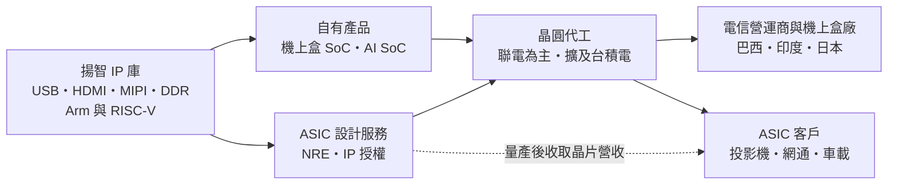
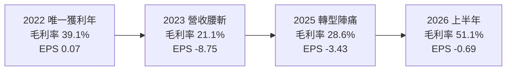
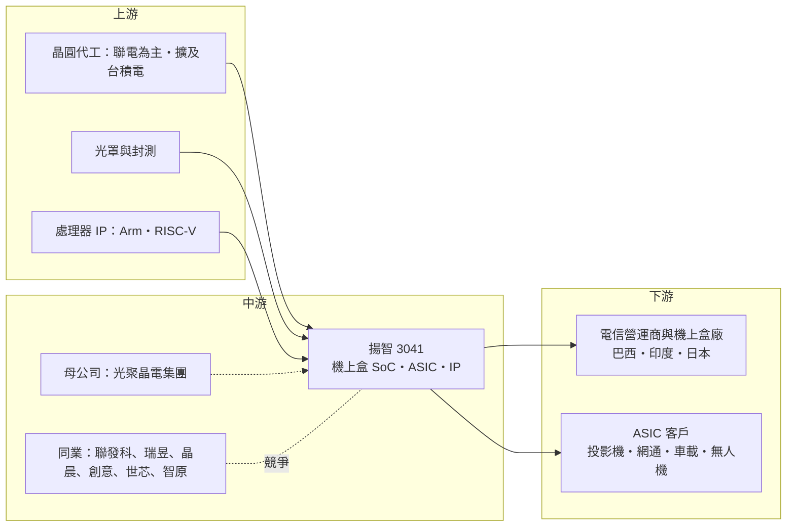

# 3041 揚智

> 上市｜[[產業索引-半導體業|半導體業]]｜上市（櫃）日期 2002/08/26

# 第一章：企業模式與商業藍圖

> [!info] 撰寫說明
> 本文由 Claude 依公開資料整理，架構比照 [[2330台積電]] 的四章研究，資料截至 2026-10-08。財務數字來源：Goodinfo 台灣股市資訊網年度經營績效（2020 至 2025 年）、Yahoo 股市月營收與 EPS 資料、Yahoo 股市新聞（2025 年 3 月）、中央社（2024 年 9 月）、鉅亨網（2024 年 9 月）、優分析、科技新報 2026 年 3 月光聚晶電報導、nstock 公司概況；揚智近一年未查得完整法說會資料，產業描述為整理性內容，尚未逐條比對原始文件。#待校對

在評估單一個股的長期投資價值時，首要步驟是拆解企業的底層獲利邏輯。本章針對揚智科技股份有限公司（股票代號：3041，以下簡稱揚智）的商業模式進行定性分析，說明一家以機上盒晶片為主、連續多年虧損的 IC 設計公司，如何藉由 [[ASIC]] 設計服務與集團資源嘗試轉型。

## 一、核心定位：從機上盒晶片走向 ASIC 設計服務

揚智成立於 1993 年 6 月，2002 年上市，早年源自宏碁集團的晶片組事業。過去的主力產品是[[機上盒]]（STB）晶片，也就是有線電視、衛星電視與網路電視盒裡負責影音解碼的 [[SoC]]。依 nstock 公司概況，自 2025 年 7 月起，[[6111光聚晶電]]成為揚智的母公司；依優分析報導，光聚晶電集團透過投資與併購，把 [[2338光罩]]、[[5381合正]]、[[8068全達]]與揚智納入集團版圖。

揚智目前的定位可以分成兩條線，公司稱為「雙引擎成長策略」：

* **機上盒晶片（既有本業）：** 主攻電信營運商與新興市場，產品以 28 奈米製程為主，規劃往 22 奈米推進。公司逐步淡出競爭激烈的零售機上盒市場，改走營運商通路。
* **ASIC 與 IP（轉型方向）：** 運用多年累積的影音、介面技術，替客戶設計客製化晶片，收取[[NRE]]（一次性工程費）、IP 授權金與量產收入。依中央社與鉅亨網 2024 年報導，揚智擁有超過 300 個 [[IP]]，涵蓋 USB、HDMI、MIPI 與 DDR 四大介面，並同時支援 Arm 與 [[RISC-V]] 兩種處理器架構。

## 二、終端應用與產品板塊

揚智近期未公開最新的營收比重，因此本節不繪製比重圖，以定性方式說明：

* **機上盒晶片：** 仍是營收最大來源。2025 年 3 月報導指出，前一年第四季推出的新品在 2025 年占比將達 80% 以上；新品導入 8K 超高清、資訊安全加密等功能，也可延伸到商業機器人與掃地機器人。市場方面，主攻巴西、印度與非洲等新興市場的營運商，並與日本 Access 集團合作衛星電視服務。
* **ASIC 設計服務：** 2024 年第四季開始認列 NRE，首批案件鎖定投影機與乙太網路傳輸應用。公司 2025 年目標 ASIC 占營收一成以上，依優分析整理，ASIC 與 IP 業務毛利率預估約 50%。
* **AI SoC：** 推出整合 [[NPU]] 與 [[ISP]] 的 AI SoC，鎖定智慧家庭；科技新報 2026 年報導，揚智另規劃整合 NPU、ISP 與衛星通訊的 SoC，鎖定車載與[[無人機]]。AI SoC 的目標是把揚智的影音技術延伸到智慧家庭與車載等新應用，降低對傳統機上盒的依賴。

## 三、資本轉化邏輯：IP 庫的重複變現

* **IP 重複使用：** 揚智過去為機上盒晶片開發的影音與介面 IP，可以授權給其他客戶或用在 ASIC 案件中，開發成本已在過去攤提，新增收入的毛利率較高。IP 一旦開發完成，重複授權的邊際成本很低，這是 ASIC 與 IP 業務毛利率可以高於自有產品的原因。
* **代工夥伴：** 依鉅亨網 2024 年報導，揚智過去以 [[2303聯電]] 為主要代工夥伴，未來擴展到 [[2330台積電]] 及中國晶圓廠。代工夥伴的選擇決定揚智能提供給 ASIC 客戶的製程範圍，擴展到更多晶圓廠有助於承接不同需求的案件。
* **費用控制：** 2024 年營業費用年減 25%，[[毛利率]]提升 8 個百分點到 29%，顯示公司在虧損期間大幅縮減成本。在營收萎縮期間大幅縮減費用，是揚智減緩虧損的必要措施，但費用削減也有極限，最終仍需靠營收成長轉虧為盈。

## 四、企業長期藍圖：ASIC、6 奈米與集團綜效

* **ASIC 成為主要成長引擎：** 依科技新報 2026 年 3 月報導，母公司光聚晶電把 ASIC 與 6 奈米製程列為揚智的主要成長動能。這代表集團資源將優先投入設計服務，而不是持續萎縮的傳統機上盒市場，揚智的長期定位將由「機上盒晶片公司」轉為「設計服務與 IP 公司」。
* **先進製程：** 揚智與國內研究機構合作投入 6 奈米晶片開發，規劃申請經濟部晶創計畫，目的是「擺脫成熟製程的既有印象」。這代表揚智試圖把設計能力推進到較先進的製程，以承接更高附加價值的 ASIC 案件。
* **集團綜效：** 光聚晶電集團旗下有台灣光罩等半導體相關公司，並涵蓋遊戲與重電事業，揚智可望在光罩取得、設計與驗證上取得集團支援（推估）。集團支援能降低揚智在轉型期間的資金壓力，但實際綜效仍待時間驗證。

# 第二章：護城河深度與競爭優勢

在長期價值投資中，「護城河」指企業抵禦競爭、維持超額利潤的保護機制。本章分析揚智在機上盒晶片與 ASIC 設計服務兩個市場的競爭地位。

## 一、揚智護城河的核心組成要素

揚智連續多年虧損，代表目前並沒有足以維持超額利潤的護城河。它擁有的是幾項可以轉化為競爭力的資產：

* **1. IP 庫與影音技術：** 300 個以上的 IP，以及多年累積的影像、音訊、觸控與投影技術，是承接 ASIC 案件的基礎。這些 IP 是揚智多年在機上盒晶片累積的資產，轉型 ASIC 後可以重新變現。
* **2. 營運商通路：** 機上盒晶片需要通過電信營運商的條件式接取（CA）與安全認證，揚智在新興市場營運商已有多年合作紀錄。這些認證需要長時間建立，新進者不易取代，是揚智在新興市場維持機上盒業務的基礎。
* **3. 集團資源：** 成為光聚晶電子公司後，可取得集團資金與上游資源，提高接大案的能力（推估）。對一家連續虧損的公司而言，集團的資金與資源支持能延長轉型所需的時間。

## 二、全球主要競爭對手格局

| 對手 | 定位 | 對揚智的威脅 |
|---|---|---|
| Broadcom | 全球機上盒 SoC 龍頭 | 掌握歐美大型營運商高階機上盒 |
| 晶晨半導體（Amlogic） | 中國機上盒與電視 SoC 廠 | 以價格與規模搶新興市場與中國市場 |
| [[2454聯發科]]、[[2379瑞昱]] | 台灣多媒體 SoC 大廠 | 在電視、機上盒與網通 SoC 具規模優勢 |
| [[3443創意]]、[[3661世芯-KY]]、[[3035智原]] | 台灣 ASIC 設計服務公司 | 在 ASIC 市場擁有更多案件與先進製程經驗 |

## 三、優勢轉化：哪些市場守得住、哪些守不住

* **守得住：** 新興市場營運商的中低階機上盒，以及需要影音、投影與介面 IP 的中小型 ASIC 案件。這些案子規模不大，大型設計服務公司不一定優先承接。
* **守不住：** 零售機上盒與中國市場。中國廠商以價格競爭，揚智已主動淡出零售市場；在高階 AI ASIC，創意、世芯等廠商的先進製程經驗與台積電資源遠勝揚智。
* **觀察重點：** 一是 ASIC 營收比重能否穩定超過一成並帶動轉盈；二是 6 奈米開發能否取得實際案件；三是 2026 年營收大增後，虧損能否持續收斂到損益兩平。這三點決定揚智能否由「虧損的機上盒晶片公司」轉型為「獲利的設計服務公司」。

# 第三章：財務體質與盈利規模

資料日期：2026-10-08。年度數字取自 Goodinfo 台灣股市資訊網的年度經營績效（合併報表），2026 年上半年取自本筆記屬性欄位的財報資料，表格是撰寫當時的快照；最新月營收、毛利率、累計 EPS 由自動排程寫在本筆記的屬性欄位（月營收、毛利率、累計EPS 等）。#待校對

財務報表是檢驗護城河是否真實存在的最終標準。本章用多年度的三率、ROE、現金流與資本報酬，檢視揚智轉型期間的財務狀況。

## 一、獲利能力的基石：三率

| 年度 | 營收（億元） | [[毛利率]] | [[營業利益率]] | EPS（元） | [[ROE]] |
|---|---|---|---|---|---|
| 2021 | 28.2 | 37.9% | -3.31% | -0.47 | -2.89% |
| 2022 | 26.5 | 39.1% | 3.63% | 0.07 | 0.52% |
| 2023 | 14.5 | 21.1% | -45.2% | -8.75 | -69.5% |
| 2024 | 16.3 | 28.2% | -15.6% | -2.39 | -15.8% |
| 2025 | 11.4 | 28.6% | -50.5% | -3.43 | -35.8% |
| 2026 上半年 | 約 8.23 | 51.1% | -19.11% | -0.69 | 未查得 |

註：2025 年營收依 Goodinfo 為 11.4 億元，與月營收加總的 13.97 億元不同，Goodinfo 註明 2025 年第三、四季財報曾重編，#待校對。2024 年 EPS 依 Goodinfo 為 -2.39 元，2025 年 3 月新聞報導為 -2.41 元。2025 年股本由約 19.4 億元降至約 14 億元，推估曾辦理減資，#待校對。2026 年上半年營收由月營收加總。

揚智的數字清楚說明了一家失去主要市場的 IC 設計公司如何陷入困境，以及轉型的初步跡象。

第一，**營收規模持續萎縮。** 2020 年營收 20.7 億元，2021 至 2022 年回到 26 億至 28 億元，2023 年驟降到 14.5 億元，之後一直在 11 億至 16 億元之間。2020 至 2025 年營收年複合成長率約 -11%（推算）。機上盒市場結構性萎縮、退出零售市場，是營收下滑的主因。

第二，**營收萎縮後費用無法同步縮減。** IC 設計公司的研發費用相對固定，營收從 28 億元掉到 14 億元時，營業利益率從接近損益兩平惡化到 -45%。2024 年營業費用年減 25%，虧損一度收斂，但 2025 年營收再度下滑，營業利益率又回到 -50% 左右。

第三，**毛利率是唯一的正面訊號。** 2026 年上半年毛利率 51.1%，遠高於過去五年的 21% 至 39%。推估來自 ASIC、NRE 與 IP 授權等高毛利收入比重增加。若營收規模能同步放大，營業虧損才有機會真正收斂。

## 二、[[ROE]]：資本效率

2021 至 2025 年的 ROE 分別為 -2.89%、0.52%、-69.5%、-15.8%、-35.8%，五年中只有一年為正。連續虧損讓每股淨值由 2022 年的 16.9 元降到 2025 年的約 10 元，代表虧損持續侵蝕股東權益。在 ASIC 業務能穩定獲利之前，揚智沒有可以評估的資本效率。

## 三、資本支出與自由現金流

揚智是 IC 設計公司，資本支出主要是研發設備、光罩與 IP 授權，若推進 6 奈米開發，光罩與 IP 費用將明顯上升（推估）。2025 年 3 月報導指出，2024 年底在手現金約 8.6 億元，應收帳款週轉天數由 35 天降到 23 天。連續虧損代表營業現金流長期為負，現金逐年消耗，母公司光聚晶電的資金支持是重要後盾。

依 nstock 資料，揚智近五年未配息。在轉虧為盈之前，股東的回報完全取決於轉型能否成功，而不是股利。

## 四、[[ROIC]] 與 [[WACC]]：價值創造利差

**ROIC 推算：** 本文未查得來源直接揭露的 ROIC，因此用「稅後營業利益 ÷ 投入資本」推算。2025 年營業利益約 -5.8 億元（營收 11.4 億元 × 營業利益率 -50.5%），虧損時不計稅，稅後營業利益約 -5.8 億元；股東權益以每股淨值 10.03 元 × 約 1.4 億股推算約 14 億元。本文未查得有息負債明細，推估借款不多，以股東權益近似投入資本，2025 年 ROIC 約 -40%（推算）。過去五年只有 2022 年的 ROIC 為小幅正值。

**WACC 推算：** 以 CAPM 估算，假設台灣 10 年期公債殖利率約 1.75%、市場風險溢酬約 6%、β 值取轉型中小型 IC 設計公司常見的 1.2（本文未查得揚智的 β 值，此為假設），股東要求報酬率約 1.75% + 1.2 × 6% = 8.95%。推估有息負債不多，WACC 約 9%（推算）。

**解讀：** 揚智過去五年的 ROIC 幾乎全部低於 WACC，而且差距很大，屬於持續的價值毀損。轉型能否成功的檢驗標準很簡單：ASIC 與 IP 業務必須讓營業利益轉正，並讓 ROIC 至少回到 9% 以上。在那之前，營收成長若伴隨更高的研發費用，反而可能擴大虧損。

# 第四章：總體風險與地緣政治

任何企業都無法脫離宏觀環境獨立存在。本章分析揚智長期必須面對的地緣政治、產業週期與營運風險，以及 ASIC 市場技術演進帶來的挑戰。

## 一、地緣政治風險

揚智的地緣政治處境可以用「去中國化的雙面效果」來形容。依優分析整理，揚智在供應鏈去中國化的過程中，面臨更換供應商的轉換成本、成本上升與中國營收下降等挑戰；公司的策略是以印度、巴西與非洲等新興市場彌補中國市場的流失。這個方向符合國際營運商分散供應鏈的需求，但新興市場的營收規模與穩定性仍不及過去的中國市場。

代工布局也受地緣政治牽動。揚智過去以聯電為主要代工夥伴，曾規劃擴展到台積電與中國晶圓廠；若美國擴大對中國半導體的管制，使用中國晶圓廠的計畫可能受限，或讓部分國際客戶有所顧慮。新興市場本身也有風險，印度、巴西等地的匯率波動、進口政策與營運商採購節奏變化都比成熟市場大。

## 二、產業週期與市場結構風險

揚智最根本的風險是本業市場的結構性萎縮。串流影音普及後，消費者越來越少透過傳統有線或衛星機上盒收看節目，機上盒晶片的需求長期下滑。這不是景氣循環，而是產業結構改變，揚智的營收由 2021 年的 28.2 億元降到 2025 年的約 11 億元，正反映了這個趨勢。

ASIC 業務雖然是轉型方向，但它的營收特性與機上盒晶片完全不同。NRE 與專案收入依案件時程認列，單月營收可能大起大落，2025 年 9 月與 12 月就曾出現營收跳升。投資人評估揚智時，應觀察 ASIC 案件數量與量產案的累積，而不是單一月份的營收。

價格競爭也持續壓縮本業。中國晶片廠在機上盒與多媒體 SoC 市場以低價搶市，揚智退出零售機上盒市場，就是因為在價格戰中難以獲利。

## 三、營運環境的隱性風險

持續虧損是揚智最直接的營運風險。2023 至 2025 年連續虧損，每股淨值由 2022 年的 16.9 元降到 2025 年的約 10 元。若轉型時程拉長，揚智可能需要增資或更依賴母公司的資金支持，對既有股東造成稀釋。

經營權變動帶來治理上的觀察點。2025 年 7 月起揚智成為光聚晶電的子公司，經營策略與資源分配由集團主導。集團資源可以支持轉型，但小股東也需要留意集團內交易的條件是否公平，以及揚智在集團中的資源優先順序。

人才競爭是 IC 設計業的共同挑戰。ASIC 與先進製程設計需要大量資深工程師，台灣 IC 設計業與國際大廠都在搶人，揚智在虧損期間要留住並吸引人才，難度比獲利穩定的同業更高。

## 四、科技演進風險

ASIC 設計服務的主戰場已移到 5 奈米、3 奈米等先進製程與 AI 晶片，揚智的經驗集中在 28 奈米與成熟製程。投入 6 奈米開發是追趕的第一步，但與創意、世芯等領先廠商的差距仍大，揚智較可能在中小型、成熟製程的 ASIC 案件中找到定位。

[[RISC-V]] 開放架構是機會也是威脅。揚智具備 Arm 與 RISC-V 兩種處理器架構的設計能力，RISC-V 不需支付授權金，有助於揚智以較低成本為客戶設計晶片；但 RISC-V 同樣降低了其他新進者的門檻，未來中小型 ASIC 市場的競爭可能更加激烈。

# 專有名詞解析

## 半導體

- **[[ASIC]]**：特殊應用積體電路，替特定客戶或特定用途量身設計的晶片。
- **[[NRE]]**：一次性工程費用，客戶委託設計晶片時支付的設計、光罩與驗證費用，不隨出貨量增加。
- **[[IP]]**：矽智財，可重複授權使用的電路設計模組，例如 USB、HDMI 介面電路。
- **[[SoC]]**：系統單晶片，把處理器、記憶體控制、介面等多種功能整合在同一顆晶片上。
- **[[RISC-V]]**：開放原始碼的處理器指令集架構，不需支付授權金，近年在物聯網與客製化晶片快速普及。
- **[[NPU]]**：神經網路處理器，專門加速 AI 運算的處理單元。
- **[[ISP]]**：影像訊號處理器，負責把感測器拍到的原始影像轉成可用的畫面。
- **[[設計服務]]**：替客戶完成晶片設計、驗證並安排投片與量產的服務，代表廠商有創意、世芯、智原。

## 應用

- **[[機上盒]]**：連接電視的影音接收裝置，負責解碼有線、衛星或網路電視訊號，英文簡稱 STB。
- **[[無人機]]**：無人駕駛的飛行器，需要影像處理、通訊與定位晶片。

## 金融

- **[[一次性收益]]**：非經常發生的收入，例如專案認列或資產處分利益，評估長期獲利時應排除。

# 核心供應鏈

## 1. 上游：晶圓代工、光罩與 IP
- 晶圓代工：[[2303聯電]]（過去主要夥伴）、[[2330台積電]]（規劃擴展）
- 光罩：集團內的 [[2338光罩]]（集團關係，實際合作程度未查得）
- 處理器 IP：[[ARM安謀]]、RISC-V 生態

## 2. 中游：揚智本身與集團
- 母公司：[[6111光聚晶電]]，集團成員另有 [[2338光罩]]、[[5381合正]]、[[8068全達]]
- 機上盒與多媒體 SoC 同業：[[2454聯發科]]、[[2379瑞昱]]、Broadcom、晶晨半導體
- ASIC 設計服務同業：[[3443創意]]、[[3661世芯-KY]]、[[3035智原]]

## 3. 下游：客戶
- 電信營運商與機上盒製造商：巴西、印度等新興市場，與日本 Access 集團合作衛星電視服務
- ASIC 客戶：投影機、乙太網路傳輸、車載與無人機應用（公司未揭露客戶名稱）

## 最新新聞
<!-- news:start -->
<!-- news:end -->

## 相關連結
- [公開資訊觀測站](https://mopsov.twse.com.tw/mops/web/t05st03?step=1&firstin=1&co_id=3041)
- [Goodinfo](https://goodinfo.tw/tw/StockDetail.asp?STOCK_ID=3041)
- [Yahoo 股市](https://tw.stock.yahoo.com/quote/3041)
- [鉅亨網新聞](https://www.cnyes.com/twstock/3041/news)
