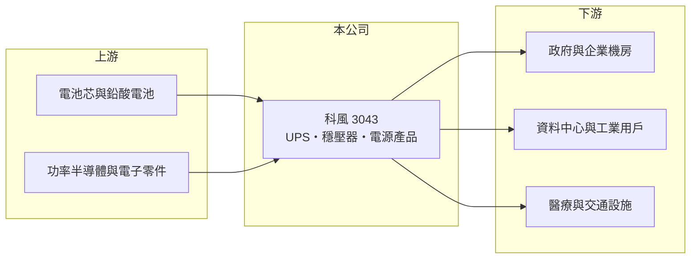

# 3043 科風

> 上市｜[[產業索引-其他電子業|其他電子業]]｜上市（櫃）日期 2002/08/26

# 第一章：企業模式與商業藍圖

> [!info] 撰寫說明
> 精簡版，由 Claude 依公開資料整理，架構比照 [[2330台積電]]，資料截至 2026-10-07。來源：理財周刊 2024 年 11 月報導、nStock 科風公司簡介。產品營收比重本次未查到。#待校對

科風成立於 1987 年，是台灣[[UPS]]（不斷電系統）的自有品牌廠，從設計、製造到維修服務一手包辦。

- **核心業務：** 設計、製造、銷售與維修不斷電系統、穩壓器與其他電源產品，應用從家庭辦公室到工業、數據中心、醫療、交通與政府機構。
- **營收結構：** 本次未查到產品或地區營收比重；客戶包含國內外政府與企業。
- **營運據點：** 在台灣與中國廣東設有工廠，通過 ISO 9001 與 ISO 14001 認證。
- **長期方向：** 受惠資料中心與 [[AI伺服器]] 電力備援需求，市場關注 [[BBU]] 等相關題材能否轉為實際營收。

# 第二章：護城河深度與競爭優勢

科風具 UPS 品牌與服務經驗，但面對國際電源大廠的規模競爭。

- **競爭優勢：** 自有品牌加上本地維修服務網，政府與企業標案需要長期維運，對在地服務能力有要求。
- **主要對手：** 國際大廠施耐德（APC）、伊頓、維諦，以及國內的 [[2308台達電]]、[[6409旭隼]]。
- **觀察重點：** 2026 年第二季已轉為獲利，觀察獲利能否延續，以及資料中心相關訂單的比重。

# 第三章：財務體質與盈利規模

資料日期：2026-10-07，以下數字是撰寫當時的快照；最新月營收、毛利率、累計 EPS 由自動排程寫在本筆記的屬性欄位（月營收、毛利率、累計EPS 等）。#待校對

科風 2025 年虧損，2026 年上半年轉虧為盈，但規模仍小。

- **營收規模：** 2025 年全年營收 8.54 億元；2026 年 1 至 8 月累計 6.45 億元、年增 7.53%，8 月營收 0.93 億元、年增 74.64%。
- **獲利：** 2025 年全年 EPS -2.67 元；2026 年上半年 EPS 0.49 元，其中第二季 0.44 元、[[毛利率]] 26.1%、營業利益率 5.95%。
- **財務特色：** 近五年無配息，仍在虧損後的恢復期。

# 第四章：總體風險與地緣政治

科風的風險在於規模與獲利穩定度。

- **產業週期：** UPS 需求與企業 IT 投資、資料中心建置與政府標案時程相關，大案集中認列會造成營收起伏。
- **營運風險：** 營收規模小，原物料與電池成本上升時議價能力有限；過去虧損期間累積的財務壓力需要時間修復。
- **其他風險：** 中國廣東設廠，面臨美中關稅與供應鏈移轉壓力；電池與電子零件價格、匯率波動影響成本。

# 專有名詞解析

## 應用

- **[[AI伺服器]]**：搭載 GPU 或 AI 加速器、用於訓練與推論 AI 模型的伺服器，功耗遠高於一般伺服器。

## 金融

- **[[毛利率]]**：毛利除以營收，反映產品本身的定價能力與成本控制。

## 產業

- **[[UPS]]**：不斷電系統，市電中斷時以電池即時供電，保護電腦、伺服器與網通設備不斷電。
- **[[BBU]]**：電池備援模組，裝在伺服器機櫃內的備用電池，可在斷電時短時間供電。

# 核心供應鏈

- 上游：電池、功率半導體與電子零件供應商（推估）
- 下游／客戶：政府機關、企業機房、資料中心與 AI伺服器機房、醫療與交通設施（具體客戶未查到）
- 同業：[[2308台達電]]、[[6409旭隼]]、施耐德（APC）、伊頓、維諦

## 最新新聞
<!-- news:start -->
<!-- news:end -->

## 相關連結
- [公開資訊觀測站](https://mopsov.twse.com.tw/mops/web/t05st03?step=1&firstin=1&co_id=3043)
- [Goodinfo](https://goodinfo.tw/tw/StockDetail.asp?STOCK_ID=3043)
- [Yahoo 股市](https://tw.stock.yahoo.com/quote/3043)
- [鉅亨網新聞](https://www.cnyes.com/twstock/3043/news)
