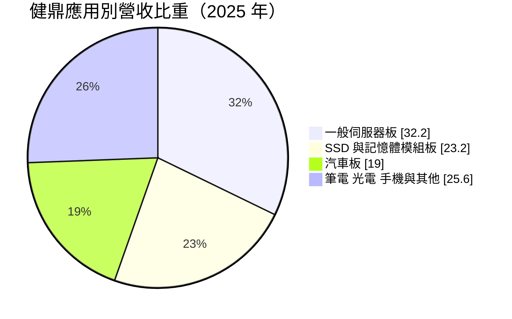
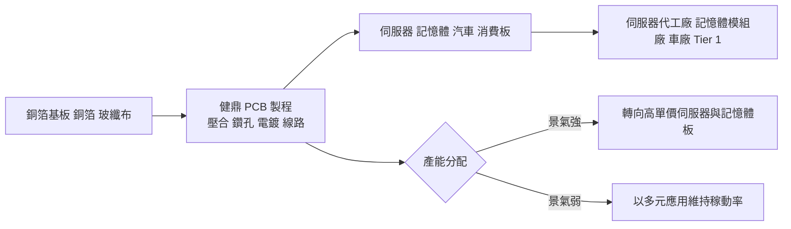
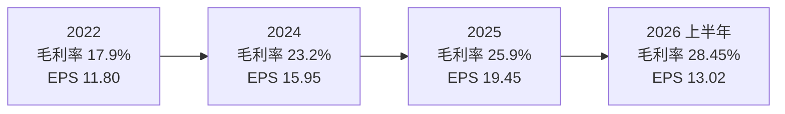
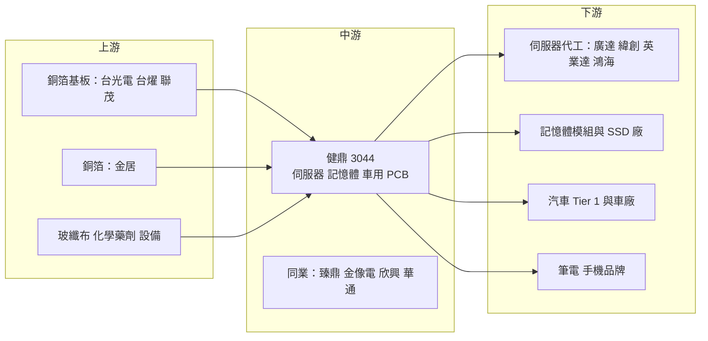

# 3044 健鼎

> 上市｜[[產業索引-電子零組件業|電子零組件業]]｜上市（櫃）日期 2002/08/26

# 第一章：企業模式與商業藍圖

> [!info] 撰寫說明
> 本文由 Claude 依公開資料整理，架構比照 [[2330台積電]] 的四章研究，資料截至 2026-10-08。財務數字來源：Goodinfo 經營績效頁（2020 至 2025 年度）、證交所開放資料快照（2026 年上半年損益、資產負債、股利）、工商時報 2026 年 2 月報導、優分析、理財周刊 2026 年 8 月報導；產業描述為整理性內容，尚未逐條比對原始文件。#待校對

在評估單一個股的長期投資價值時，首要步驟是拆解企業的底層獲利邏輯。本章針對健鼎科技（股票代號：3044，以下簡稱健鼎）的商業模式進行定性分析，說明一家以「多元應用、大量生產」著稱的[[PCB]]（印刷電路板）廠，如何在 AI 伺服器浪潮中把獲利推上新高。

## 一、核心定位

健鼎成立於 1991 年，董事長王景春，是台灣產能規模最大的 PCB 廠之一。依優分析報導，健鼎兩岸月產能已達千萬平方呎，生產據點包括台灣平鎮、江蘇無錫、湖北仙桃，以及越南。

PCB 是電子產品的「骨架」，所有晶片與零件都焊在上面，透過板內的銅線路互相連接。不同產品需要不同規格的板子：伺服器需要層數多、尺寸大的[[HLC]]（高層數板），手機與記憶體模組需要線路細密的 [[HDI]]（高密度互連板），汽車需要耐高溫、高可靠度的車用板。

健鼎的定位是「應用最分散的大型 PCB 廠」。它不像某些同業集中在單一客戶或單一產品，而是同時做伺服器、記憶體模組、硬碟、筆電、光電、手機與汽車板。這種分散讓健鼎在單一市場衰退時仍能維持產能利用率，也讓它能把產能快速轉向當下最強勁的需求。

## 二、終端應用／產品板塊

依優分析整理，健鼎 2025 年營收 733.99 億元，其中一般伺服器板占 32.2%，SSD 與記憶體模組板占 23.2%，汽車板出貨 139.16 億元、約占 19%（推算）：

* **伺服器板：** 最大應用，以一般伺服器為主。理財周刊報導指出，同業把更多產能轉向 GPU、ASIC 等高階 [[AI伺服器]]，使一般伺服器訂單外溢到健鼎。伺服器、網通與記憶體模組合計占比從 2026 年第一季的 61.9% 提高到第二季的 65.3%（法人說法）。
* **記憶體模組與 SSD 板：** 第二大應用，受惠 AI 帶動的記憶體需求與規格升級。
* **汽車板：** 健鼎是台灣最大的車用 PCB 廠，2025 年汽車板出貨 139.16 億元，但年減 12.9%，占比降到兩成以下，反映車用市場放緩。
* **其他：** 筆電、光電、手機等消費性應用，優分析的資料顯示健鼎屬於蘋果 PCB 供應鏈，也曾供應華為、三星與小米手機用板（客戶資料時間較早，待校對）。

## 三、資本轉化邏輯（營運模式）

PCB 是資本密集的製造業，獲利取決於產能利用率與產品組合。健鼎的模式可以概括為「大規模、高稼動、快速調整」：以龐大的產能接下各種應用的訂單，讓工廠維持高利用率攤薄固定成本，再依景氣把產能分配給毛利最好的產品。

這套模式的優勢在 2024 至 2026 年充分顯現。健鼎的毛利率從 2022 年的 17.9% 升到 2025 年的 25.9%，2026 年第二季更達到 30.09% 的新高（理財周刊）。伺服器與記憶體板單價高、層數多，產品組合轉向這兩類應用，是毛利率大幅提升的主因。

## 四、企業長期藍圖

健鼎的長期策略是持續提高 HLC、HDI 等高階板比重，聚焦伺服器、記憶體與車用市場（工商時報）。產能擴張集中在三個地方：越南周德工業區新廠在 2026 年第一季試產，初期以伺服器產品為主，預計第四季量產，越南二廠規劃 2027 年動工；湖北仙桃持續擴充高階 PCB 產能，2026 年下半年至 2027 年上半年陸續開出；越南同奈省已完成收購一家日系 PCB 廠。公司目標在 2027 年挑戰月均營收 100 億元。

資本支出方面，2025 年約近 50 億元，2026 年規劃 50 至 60 億元，重心在越南新廠。健鼎過去的經營風格偏保守、重視現金與配息，近年擴產步調加快，反映公司判斷 AI 伺服器需求是結構性的。

# 第二章：護城河深度與競爭優勢

本章分析健鼎的護城河構成、全球主要競爭對手，以及這些優勢在 PCB 產業競爭中能守住多少。

## 一、健鼎護城河的核心組成要素

PCB 產業整體護城河不深，健鼎的優勢主要來自以下三個要素：

* **1. 規模與成本效率：** 月產能千萬平方呎的規模，讓健鼎在原料採購與設備利用上具有成本優勢。PCB 是以量取勝的產業，規模越大，單位固定成本越低，越能在價格競爭中保有利潤。
* **2. 應用分散與產能調配彈性：** 同時服務伺服器、記憶體、汽車與消費電子，健鼎能在不同景氣循環之間移動產能，維持高利用率。這種彈性讓它在 2023 年 PCB 產業低迷時，仍維持約 19% 的毛利率與 11% 的營業利益率。
* **3. 客戶認證與良率經驗：** 伺服器與車用板都需要長期認證，高層數板的良率管理需要經驗累積。健鼎是台灣最大的車用 PCB 廠，這代表它在高可靠度產品上具備一定門檻。

## 二、全球主要競爭對手格局

| 對手 | 定位 | 對健鼎的威脅 |
|---|---|---|
| [[4958臻鼎-KY]] | 全球最大 PCB 廠，軟板、HDI、載板 | 規模更大，在 AI 伺服器與高階 HDI 布局更深 |
| [[2368金像電]] | 伺服器與網通 HLC 專業廠 | 在 AI 伺服器高階板領先 |
| [[3037欣興]] | PCB 與 ABF 載板 | 在高階 HDI 與載板競爭 |
| [[2313華通]]、[[3715定穎投控]]、[[2355敬鵬]] | HDI、車用板 | 在 HDI 與車用板直接競爭 |
| 深南電路、勝宏科技、滬電股份 | 中國 PCB 大廠 | 在伺服器板與通訊板以價格與規模競爭 |

## 三、優勢轉化：哪些市場守得住、哪些守不住

* **守得住：** 一般伺服器與記憶體模組板。這些產品需要大量、穩定的產能，健鼎的規模與良率經驗正好符合需求，加上同業把產能轉向 GPU 高階板，留下的一般伺服器訂單成為健鼎的優勢市場。
* **守不住：** 最高階的 AI GPU 與 ASIC 伺服器板。這一塊由金像電、臻鼎等在高層數與高速材料上更早布局的廠商主導，健鼎目前並非主要供應商（推估）。車用板也面臨需求放緩與同業競爭。
* **觀察重點：** 其一，越南新廠的量產進度與良率，以及能否取得伺服器客戶認證。其二，健鼎能否切入 AI 加速器相關的高階板。其三，毛利率在 30% 左右能否維持，或只是記憶體與伺服器景氣高峰的短期現象。

# 第三章：財務體質與盈利規模

資料日期：2026-10-08。數字取自 Goodinfo 經營績效頁、證交所開放資料快照與理財周刊，表格是撰寫當時的快照；最新月營收、毛利率、累計 EPS 由自動排程寫在本筆記的屬性欄位（月營收、毛利率、累計EPS 等）。#待校對

財務報表是檢驗護城河是否真實存在的最終標準。本章用多年度的三率、ROE、現金流與資本報酬，檢視健鼎的獲利品質。

## 一、獲利能力的基石：三率

| 年度 | 營收（新台幣） | [[毛利率]] | [[營業利益率]] | EPS（元） | [[ROE]] |
|---|---|---|---|---|---|
| 2020 | 555 億 | 20.1% | 11.8% | 11.65 | 17.4% |
| 2021 | 630 億 | 18.9% | 10.5% | 11.15 | 15.8% |
| 2022 | 658 億 | 17.9% | 10.3% | 11.80 | 15.4% |
| 2023 | 589 億 | 19.3% | 11.3% | 11.53 | 14.1% |
| 2024 | 658 億 | 23.2% | 14.8% | 15.95 | 17.9% |
| 2025 | 734 億 | 25.9% | 17.6% | 19.45 | 19.6% |
| 2026 上半年 | 458.2 億 | 28.45% | 20.58% | 13.02 | 未查得 |

* **兩個階段：** 2020 至 2023 年是「穩定期」，營收在 555 億至 658 億元之間，毛利率約 18% 至 20%，EPS 穩定在 11 至 12 元。2024 年起進入「升級期」，伺服器與記憶體板比重提高，毛利率三年內從 19.3% 升到 2026 年上半年的 28.45%，營業利益率從 11.3% 升到 20.58%。
* **營收成長：** 2020 至 2025 年營收年複合成長率約 5.8%（推算）。2026 年上半年營收 458.2 億元、年增 30.8%，前七月年增 34.71%（理財周刊），成長明顯加速。
* **營運槓桿：** 毛利率每提高 1 個百分點，營業利益率提升幅度接近相同，因為管銷費用相對固定。這是 PCB 廠在高稼動率時獲利快速放大的原因。

## 二、[[ROE]]：資本效率

2021 至 2025 年平均 ROE 約 16.6%（推算），在 PCB 產業屬於中上水準，而且即使在 2023 年產業低谷也維持 14% 以上。健鼎的財務槓桿不高，ROE 主要靠穩定的利潤率與資產周轉支撐。2025 年 ROE 升到 19.6%，反映毛利率提升的效果。

## 三、資本支出與[[自由現金流]]

PCB 是資本密集產業，健鼎 2025 年資本支出約近 50 億元，2026 年規劃 50 至 60 億元。以 2025 年稅後淨利約 102 億元來看，資本支出約為淨利的一半，加上折舊回流，健鼎的自由現金流長期為正（推估，現金流量表數字未查得）。股利方面，2025 年度配發現金股利 12.7 元（證交所股利資料），以 EPS 19.45 元計算，配息率約 65%（推算）。健鼎過去以穩定配息著稱，擴產期間仍能維持六成以上配息率，說明擴產資金主要來自內部現金流。

## 四、[[ROIC]] 與 [[WACC]]：價值創造利差

* **ROIC（推算）：** 2025 年營業利益約 129.2 億元（734 億 × 17.6%），稅後營業利益約 103.4 億元。投入資本以 2026 年第二季底權益總計約 557.2 億元，加上有息負債估計約 150 億元（有息負債未查得，假設約占總負債 531 億元的三成），合計約 707 億元，ROIC 約 14.6%（推算）。2020 至 2023 年營業利益率約 10% 至 12%，同期 ROIC 推估約 10% 至 12%。
* **WACC（推算）：** 以 CAPM 推估，無風險利率 1.75%，市場風險溢酬 6%，β 未查得來源，採 PCB 同業常見值 1.0，股東權益成本約 7.75%。負債成本假設 2%，稅後約 1.6%；資本結構以權益 79%、負債 21% 計算，WACC 約 6.5%（推算）。
* **結論：** 健鼎的 ROIC 長期高於 WACC，利差從穩定期的約 4 至 5 個百分點，擴大到 2025 年的約 8 個百分點（推算），代表公司持續創造價值，而且近年價值創造能力明顯增強。需要留意的是，大規模擴產後的新產能若遇到需求反轉，ROIC 可能快速回落。

# 第四章：總體風險與地緣政治

任何企業都無法脫離宏觀環境獨立存在。本章分析健鼎未來必須面對的地緣政治、產業週期與營運風險。

## 一、地緣政治風險

* **中國產能比重高：** 健鼎主要產能在江蘇無錫與湖北仙桃，美國客戶要求「中國以外產能」的壓力，是健鼎加速越南布局的主因。越南新廠量產前，中國產能比重仍高，美中關稅與出口管制若擴大到伺服器零組件，會影響訂單分配。
* **越南據點的營運風險：** 越南的電力供應、工程人才與供應鏈成熟度不如中國，新廠初期的良率與成本可能不如預期。

## 二、產業週期與市場結構風險

* **伺服器與記憶體循環：** 伺服器與記憶體模組合計占健鼎營收六成以上，這兩個市場都有明顯週期。記憶體價格與出貨量起伏大，雲端業者的資本支出也可能因景氣調整，訂單一旦反轉，健鼎的高稼動率就難以維持。
* **[[長鞭效應]]：** PCB 位於供應鏈中上游，客戶庫存調整會被放大，2023 年健鼎營收從 658 億元降到 589 億元就是一例。
* **PCB 產業擴產潮：** 台灣與中國同業同時擴產 AI 伺服器產能，未來可能出現供過於求與價格競爭。

## 三、營運環境的隱性風險

* **原物料價格：** 銅箔、銅箔基板與玻纖布價格上漲，若無法轉嫁客戶，會壓縮毛利率。
* **匯率：** 以美元計價出貨，新台幣與人民幣匯率波動影響獲利。
* **環保法規：** PCB 製程使用大量水、化學藥劑與電力，中國與越南的環保法規趨嚴，會提高廢水處理與能源成本。

## 四、科技或法規演進風險

AI 伺服器的 PCB 規格快速升級，層數更多、材料更高速、線路更細。如果健鼎在高階製程上的投資落後，可能只能停留在一般伺服器市場，長期面臨價格競爭。另一方面，部分高速傳輸可能從 PCB 轉向[[CPO]]或背板線纜，改變伺服器內部的連接方式，這是 PCB 產業共同面對的長期技術變數。

# 專有名詞解析

## 半導體

- **[[CPO]]**：共同封裝光學，把光學元件與交換器晶片封裝在一起，以縮短電訊號路徑、降低耗電。

## 應用

- **[[AI伺服器]]**：搭載 GPU 或 ASIC 加速器、專門執行 AI 訓練與推論的伺服器，對電路板層數與材料要求更高。
- **[[記憶體模組]]**：把多顆 DRAM 晶片焊在電路板上的模組，例如電腦與伺服器使用的記憶體條。

## 金融

- **[[產能利用率]]**：實際生產量占總產能的比例，PCB 廠的毛利率高度取決於此數字。
- **[[自由現金流]]**：營業活動現金流減去資本支出，代表企業可自由用於配息、還債或併購的現金。
- **[[長鞭效應]]**：終端需求的小幅變動，沿供應鏈往上游傳遞時被逐級放大，造成上游庫存與訂單劇烈波動。
- **[[ROIC]]**：投入資本報酬率，衡量公司每投入一元營運資本能賺多少稅後營業利益。
- **[[WACC]]**：加權平均資金成本，股東與債權人要求報酬率的加權平均，是企業投資的最低報酬門檻。

## 產業

- **[[PCB]]**：印刷電路板，用銅線路連接晶片與電子零件的基板，是所有電子產品的骨架。
- **[[HLC]]**：高層數板，層數通常在 20 層以上，用於伺服器與網通設備，製程難度高。
- **[[HDI]]**：高密度互連板，以微小雷射孔與細線路提高線路密度，用於手機、記憶體模組與 AI 伺服器。
- **[[CCL]]**：銅箔基板，PCB 的主要原料，由銅箔、玻纖布與樹脂壓合而成，等級決定訊號傳輸效能。

# 核心供應鏈

## 1. 上游：基板材料與原料
- 銅箔基板：[[2383台光電]]、[[6274台燿]]、[[6213聯茂]]（供應關係依產業常識整理，待校對）
- 銅箔：[[8358金居]]
- 玻纖布：[[1802台玻]]、[[1815富喬]]

## 2. 中游：健鼎本身與同業
- 同業：[[4958臻鼎-KY]]、[[2368金像電]]、[[3037欣興]]、[[2313華通]]、[[3715定穎投控]]、[[2355敬鵬]]

## 3. 下游：主要客戶群
- 伺服器代工：[[2382廣達]]、[[3231緯創]]、[[2356英業達]]、[[2317鴻海]]（客戶名單依產業常識整理，待校對）
- 記憶體模組：[[8299群聯]]、[[3260威剛]]、[[005930三星電子]]（待校對）
- 消費電子：[[AAPL蘋果]]（優分析資料，時間較早，待校對）

## 最新新聞
<!-- news:start（自動產生，請勿手動編輯此範圍） -->
- 2026-10-08 📰 媒體 17:23｜營收速報 - 健鼎(3044)9月營收106.48億元年增率高達53.5％｜[鉅亨網](https://news.cnyes.com/news/id/6625006)
- 2026-10-08 🏛️ 重訊 14:42｜代本公司之子公司J & J Holding Co., Ltd.公告 其新增資金貸與金額達新台幣一千萬以上且達本 公司最近期財務報表淨值百分之二以上。｜[觀測站](https://mops.twse.com.tw/mops/#/web/t05st01)

完整紀錄：[[3044健鼎 新聞]]
<!-- news:end -->

## 相關連結
- [公開資訊觀測站](https://mopsov.twse.com.tw/mops/web/t05st03?step=1&firstin=1&co_id=3044)
- [Goodinfo](https://goodinfo.tw/tw/StockDetail.asp?STOCK_ID=3044)
- [Yahoo 股市](https://tw.stock.yahoo.com/quote/3044)
- [鉅亨網新聞](https://www.cnyes.com/twstock/3044/news)
