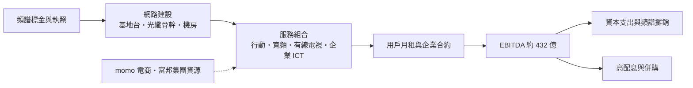
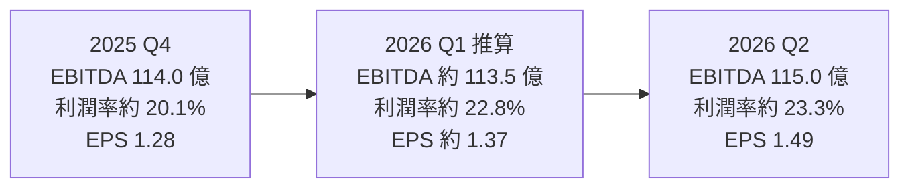
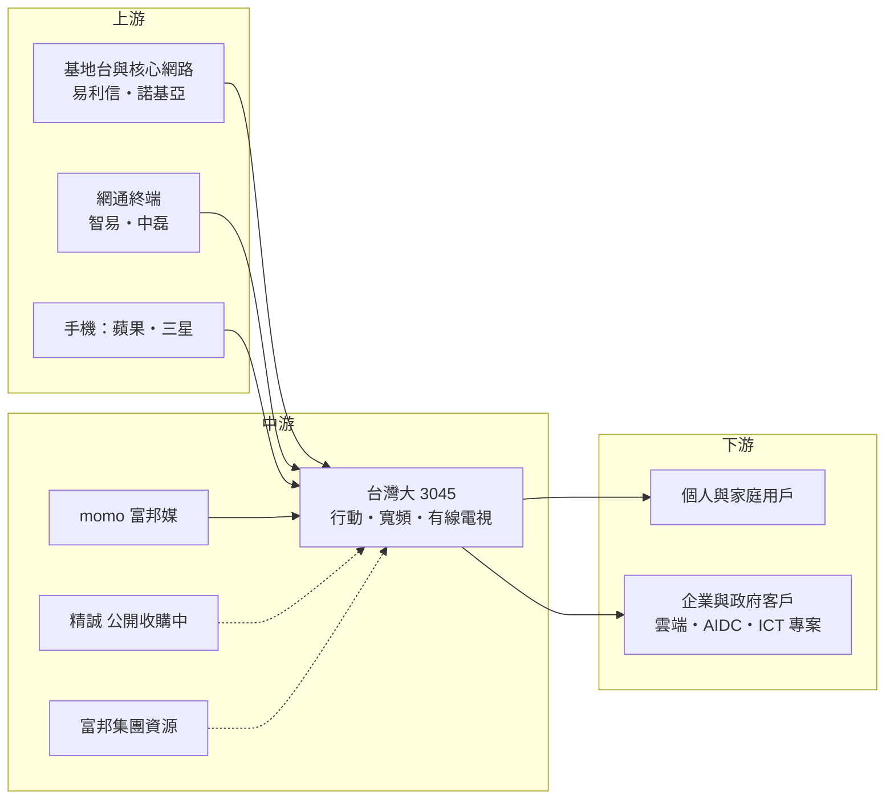

# 3045 台灣大

> 上市｜[[產業索引-通信網路業|通信網路業]]｜上市（櫃）日期 2002/08/26

# 第一章：企業模式與商業藍圖

> [!info] 撰寫說明
> 本文由 Claude 依公開資料整理，架構比照 [[2330台積電]] 的四章研究，資料截至 2026-10-07。財務數字來源：台灣大 2025 年第四季與 2026 年第二季法說會報導（優分析）、富果研究法說整理、優分析電信三雄月報、Yahoo 股市公司資料、iThome 與優分析精誠收購案報導；產業描述為整理性內容，尚未逐條比對原始文件。#待校對

在評估單一個股的長期投資價值時，首要步驟是拆解企業的底層獲利邏輯。本章針對台灣大哥大（股票代號：3045，以下簡稱台灣大）的商業模式進行定性分析，說明一家電信公司如何以「電信＋」的架構，把行動通訊、有線電視、電商與資訊服務串成同一個集團。

## 一、核心定位：電信本業加上電商與有線電視的「電信＋」集團

台灣大成立於 1997 年 2 月 25 日，2002 年上市，是台灣三大電信業者之一，董事長為富邦集團的蔡明忠，總經理為林之晨。業務可以分成三塊：

* **電信本業（Telco）：** 行動通訊（4G/5G）、固網與企業數據服務。
* **有線電視與寬頻：** 旗下凱擘等有線電視系統台，提供有線電視與家用寬頻。
* **電商（momo）：** 持有 [[8454富邦媒]]（momo 購物網）並納入合併，是台灣最大的綜合電商平台之一。

2025 年合併營收 1,987.6 億元，年減 0.31%，主要受 momo 營收拖累；但 [[EBITDA]] 431.7 億元年增 1.53%，稅後純益 144.4 億元年增 4%，EPS 4.77 元，創 7 年新高。2026 年上半年營收 992.1 億元（年增 3.74%），稅後純益 86.9 億元（年增 25.22%），EPS 2.86 元；第二季稅後純益 45.5 億元，創近 20 年新高。

## 二、終端應用與產品板塊：電信核心、企業電信、新科技三層

各事業的精確營收比重本次未查得，因此不畫比重圖。台灣大把業務整理成「電信核心、企業電信（Telco+）、新科技（Telco+Tech）」三層：

* **行動服務：** 仍是最大獲利來源。2025 年 [[5G]] 營收年增 10%，已占行動服務營收 68%；5G 用戶滲透率提升到 44%，用戶升級 5G 後月租費平均成長 53%。2025 年第四季智慧型手機 [[ARPU]] 達 687 元，年增 3%，[[退租率]]降到 0.59% 的歷史新低。
* **家用寬頻：** 2025 年寬頻服務營收年增 5%，300Mbps 以上訂戶年增 27%，占用戶 48%。台灣大透過自有及合作系統台，服務涵蓋超過 90% 的家戶。
* **企業服務：** 2025 年營收年增 26%，動能來自 AI 資料中心（[[AIDC]]）、雲端與政府專案。
* **新科技事業：** 2025 年營收年增 12%，涵蓋支付、遊戲與電商相關服務。
* **momo：** 2025 年活躍會員年增 3%；商家自營的「mo 店+」GMV 呈三位數成長，[[零售媒體]]廣告服務（RMN）滲透率超過 40% 的供應商。

## 三、資本轉化邏輯：先投網路，再收月租

電信業的特色是前期投入巨大、後期以月租收回。頻譜與網路一旦建好，新增用戶的邊際成本很低，因此提高 ARPU 與降低退租率，是把固定成本轉為利潤的關鍵。

* **併購台灣之星：** 台灣大於 2023 年底完成合併台灣之星，2024 年 9 月完成網路整併。公司表示合併綜效已在 2025 年獲利中體現，是 2025 至 2026 年電信本業利潤率改善的主要原因之一。
* **收購精誠資訊：** 2024 年以約 40 億元取得 [[6214精誠]] 約 11.86% 股權。2026 年再宣布以上限約 291 億元、溢價 29.5% 公開收購精誠，目標持股過半，對價一半現金、一半換股。公司目標把資訊服務市占從約 7% 提高到約 14%，最快年底開始認列營收；總經理林之晨表示若收購成功，2027 年營收將挑戰電信業第一。

## 四、企業長期藍圖：從電信商走向科技電信集團

* **電信本業提升獲利率：** 5G 升級、資費結構調整與整併後的網路效率。
* **企業 ICT 與 AI：** 結合精誠的系統整合能力，提供企業級 AIDC 與 AI 資通訊（AICT）方案。
* **電商與數位生態系：** momo 與電信會員、支付、遊戲串連，形成「電信＋電商＋金融（富邦集團）」的生態系。
* **財測上修：** 2026 年第二季法說會把全年營業利益成長由 1% 至 2% 上修為 7% 至 9%，電信營業利益成長由 4% 至 6% 上修為 13% 至 15%，營益率由 9% 至 11% 上修為 10% 至 12%，營收成長維持 5% 至 7%（皆不含精誠收購影響）。

# 第二章：護城河深度與競爭優勢

在長期價值投資中，「護城河」指企業抵禦競爭、維持超額利潤的保護機制。本章分析台灣大的護城河構成、主要競爭對手，以及這些優勢在三雄寡占的市場中能守住多少。

## 一、台灣大護城河的核心組成要素

台灣大的護城河屬於「寬護城河」，但比較像公用事業型的護城河：

* **1. 頻譜與執照：** 行動通訊需要政府標售的頻譜與特許執照，進入門檻極高。台灣之星、亞太電信分別被台灣大與遠傳併購後，市場只剩三家主要電信商，形成[[寡占]]結構。
* **2. 網路基礎建設：** 全台基地台、光纖骨幹與機房是長年累積的沉沒成本，新業者幾乎不可能複製。
* **3. 用戶黏著與轉換成本：** 合約綁約、家庭方案、寬頻與電視組合，讓用戶轉換的麻煩程度提高，退租率降到 0.59% 即是佐證。
* **4. 生態系綜效：** momo 電商、有線電視、富邦集團的金融服務與會員資源，使台灣大比單純電信商多了交叉銷售管道。

## 二、全球主要競爭對手格局

| 對手 | 定位 | 對台灣大的威脅 |
|---|---|---|
| [[2412中華電]] | 台灣最大電信業者，固網與光纖寬頻壓倒性優勢 | 資本實力最強，2026 年前 7 月營收 1,412.4 億元、EPS 3.11 元 |
| [[4904遠傳]] | 合併亞太電信後規模接近 | 在企業 ICT、資料中心與 5G 滲透率積極追趕，2026 年前 7 月營收 657.21 億元、EPS 2.46 元 |
| 蝦皮、[[8044網家]]、酷澎 | 電商平台 | 以價格與物流與 momo 競爭 |
| 大型系統整合商 | 企業 ICT | 與台灣大在企業資訊服務競爭 |

## 三、優勢轉化：哪些市場守得住、哪些守不住

* **守得住：** 三雄寡占的市場結構讓資費戰強度比過去低；5G 升級與台灣之星整併後的成本下降，支撐 2026 年獲利成長。2026 年前 7 月台灣大 EPS 3.32 元，為電信三雄之首。
* **守不住：** 中華電在固網與光纖的優勢難以撼動，台灣大的家用寬頻主要依靠有線電視系統；momo 面對電商同業的低價競爭與酷澎擴張，營收成長放緩。
* **觀察重點：** 精誠公開收購能否順利完成與整合成效、企業服務與 AIDC 能否維持高成長、momo 營收能否恢復成長，以及財測上修後的營益率能否守住 10% 至 12%。

# 第三章：財務體質與盈利規模

資料日期：2026-10-07。數字取自公司法說會報導與財經媒體整理，最新月營收與三率請見[[#相關連結]]的公開資訊觀測站。#待校對

財務報表是檢驗護城河是否真實存在的最終標準。電信業折舊與攤銷龐大，習慣以 EBITDA 衡量本業現金獲利能力，因此本章改用 EBITDA、ROE、資本支出對 EBITDA 比與用戶價值指標，檢視台灣大的獲利品質。

## 一、獲利能力的基石：EBITDA 與 EBITDA 利潤率

| 項目 | 2025 全年 | 2025 Q4 | 2026 Q1 | 2026 Q2 | 2026 H1 |
|---|---|---|---|---|---|
| 營收（新台幣） | 1,987.6 億 | 567.8 億 | 約 497.8 億 | 494.3 億 | 992.1 億 |
| [[EBITDA]] | 431.7 億 | 114.0 億 | 約 113.5 億 | 115.0 億 | 228.5 億 |
| [[EBITDA 利潤率]]（依表內數字計算） | 約 21.7% | 約 20.1% | 約 22.8% | 約 23.3% | 約 23.0% |
| 稅後純益 | 144.4 億 | 38.8 億 | 約 41.4 億 | 45.5 億 | 86.9 億 |
| EPS（元） | 4.77 | 1.28 | 約 1.37 | 1.49 | 2.86 |

* 2026 Q1 數字為上半年減第二季推算。本次未查得各季[[毛利率]]與[[營業利益率]]的可靠數字；公司財測中 2026 年營益率目標為 10% 至 12%。
* **季節性：** 第四季營收明顯高於其他季，主要因年底 momo 檔期與手機銷售旺季。手機銷售毛利低，因此第四季營收大增但 EBITDA 增幅有限，EBITDA 利潤率反而最低。
* **近期動能：** 2026 年 8 月單月營收 167.83 億元，年增 8.5%；前 7 月累計營收 1,153.8 億元，年增 4.2%，稅後純益 100.9 億元，年增 24%。

## 二、[[ROE]]：資本效率

本次未查得台灣大近期 ROE 的確切數字。電信業屬於高資本、高折舊、穩定現金流的產業，台灣大長期以舉債與高配息並行，ROE 通常高於一般公用事業。2026 年獲利成長 2 成以上，而資本支出下降，資本效率可望改善（推估）。

## 三、資本支出與自由現金流

* **[[CapEx]]：** 2025 年實際約 112 億元；2026 年預估 82.4 億元，其中電信 61.3 億元、有線電視 10.3 億元、momo 與其他 10.8 億元。5G 建設高峰已過，資本支出明顯下降。
* **[[資本密集度]]：** 以 2025 年數字計算，資本支出約為 EBITDA 的 26%；2026 年資本支出降到 82.4 億元，若 EBITDA 持平，比率將降到兩成以下（推估）。
* **[[自由現金流]]：** 資本支出下降、EBITDA 成長，代表自由現金流擴大，有利於維持高股利與支應精誠收購的現金部分（推估）。精誠收購若以一半換股進行，將稀釋既有股東持股，需留意對每股盈餘的影響。
* **股利：** 2025 年度配發現金股利每股 4.8 元，年增約 7%，以宣布時股價計算現金殖利率約 4.5%。

## 四、用戶價值指標：ARPU、5G 滲透率與退租率

電信業的 [[ROIC]] 與 [[WACC]] 利差取決於既有網路能從每位用戶收回多少現金，因此用戶價值指標比單看資本報酬更直接（ROIC 具體數值未查得）：

* **ARPU：** 2025 年第四季智慧型手機 ARPU 687 元，年增 3%。
* **5G 滲透率：** 44%，升級用戶月租費平均成長 53%，代表仍有約一半以上用戶可以升級，是未來 ARPU 成長的主要來源。
* **退租率：** 0.59% 為歷史新低，用戶流失少，代表獲客成本可以攤在更長的使用期間。

這三項指標同時改善，加上資本支出下降，是台灣大 2026 年電信營業利益成長財測上修到 13% 至 15% 的基礎。

# 第四章：總體風險與地緣政治

任何企業都無法脫離宏觀環境獨立存在。本章分析台灣大未來必須面對的地緣政治、產業結構與法規風險。

## 一、地緣政治風險

* **通訊安全與資安：** 電信網路屬於關鍵基礎設施，兩岸緊張時可能面臨網路攻擊、海纜中斷等風險。近年台灣周邊海纜多次受損，備援與衛星通訊成為政策重點。
* **設備供應商限制：** 台灣電信商的核心網路設備避開中國供應商，主要採用歐洲廠商，供應商選擇較少。

## 二、產業週期與市場結構風險

* **市場成熟：** 台灣手機門號普及率早已飽和，用戶數成長有限，營收成長仰賴 ARPU 提升與新業務。
* **資費競爭：** 三雄寡占使價格戰趨緩，但若有業者為搶 5G 用戶發動低價方案，仍可能壓抑 ARPU。
* **電商競爭：** momo 面對蝦皮、酷澎的價格與物流競爭，可能拖累合併營收成長與獲利。

## 三、營運環境的隱性風險

* **併購整合：** 精誠收購金額大，涉及換股與經營獨立性，若整合效益不如預期，可能稀釋獲利；收購仍需主管機關核准。
* **頻譜成本：** 未來 6G 或新頻段釋出時，需要再投入大筆頻譜標金與建設成本。
* **財務槓桿：** 為支應併購與高股利，負債水準需要持續觀察。

## 四、科技與法規演進風險

* **監理政策：** NCC 對併購、資費與有線電視的監理規範，可能影響業務擴張與定價。
* **技術變遷：** [[低軌衛星]]通訊、Wi-Fi 與 [[OTT]] 通訊軟體持續替代傳統語音與部分數據服務。
* **有線電視萎縮：** 年輕族群轉向串流平台，有線電視訂戶可能持續流失。

# 專有名詞解析

## 金融

- **[[EBITDA]]**：稅前息前折舊攤銷前利潤，電信業折舊攤銷龐大，常用它衡量本業現金獲利能力。
- **[[EBITDA 利潤率]]**：EBITDA 除以營收，電信業用來比較本業獲利能力，手機銷售比重高時會被拉低。
- **[[ARPU]]**：每用戶平均月營收，電信業衡量用戶價值的核心指標，5G 升級與加值服務可推升 ARPU。
- **[[退租率]]**：每月停止使用服務的用戶占總用戶比例，愈低代表用戶黏著度愈高。
- **[[資本密集度]]**：資本支出相對營收或 EBITDA 的比例，電信業在新世代網路建設期會明顯升高。
- **[[ROE]]**：股東權益報酬率，稅後淨利除以股東權益，衡量公司運用股東資金的效率。
- **[[CapEx]]**：資本支出，電信業主要用於基地台、光纖與機房建設。
- **[[自由現金流]]**：營業活動現金流減去資本支出，電信業以此支應高配息與併購。

## 產業

- **[[5G]]**：第五代行動通訊，速度與容量高於 4G，電信商以升級資費提高 ARPU。
- **[[AIDC]]**：AI 資料中心，提供 AI 運算所需的機房、電力與網路，是電信商企業服務的新成長來源。
- **[[寡占]]**：市場由少數業者主導的結構，台灣行動通訊在併購後收斂為中華電、台灣大、遠傳三雄。
- **[[零售媒體]]**：電商或通路利用自家消費資料向品牌商販售廣告版位的服務（Retail Media Network）。
- **[[低軌衛星]]**：在數百至兩千公里高度運行的通訊衛星群，可提供偏遠地區與災難備援的網路連線。
- **[[OTT]]**：透過網際網路直接提供影音或通訊服務的業者，例如串流平台與通訊軟體，會替代傳統電視與語音。

# 核心供應鏈

## 1. 上游：網路設備與終端
- 基地台與核心網路：Ericsson（易利信）、Nokia（諾基亞）
- 寬頻與網通終端設備：[[3596智易]]、[[5388中磊]]
- 手機與終端：[[AAPL蘋果]]、[[005930三星電子]]

## 2. 中游：台灣大本身與集團資源
- 電商子公司：[[8454富邦媒]]
- 資訊服務（公開收購中）：[[6214精誠]]
- 有線電視系統：凱擘等系統台
- 集團金融資源：[[2881富邦金]]

## 3. 下游：客戶
- 個人與家庭用戶：行動通訊、寬頻與有線電視
- 企業與政府客戶：數據專線、雲端、AI 資料中心與 ICT 專案

## 4. 同業與競爭者
- 電信：[[2412中華電]]、[[4904遠傳]]
- 電商：蝦皮、[[8044網家]]、酷澎

## 最新新聞
<!-- news:start（自動產生，請勿手動編輯此範圍） -->
- 2026-10-07 🏛️ 重訊 17:09｜代子公司台灣固網(股)公司公告取得台灣大哥大(股)公司一筆使用權資產｜[觀測站](https://mops.twse.com.tw/mops/#/web/t05st01)

完整紀錄：[[3045台灣大 新聞]]
<!-- news:end -->

## 相關連結
- [公開資訊觀測站](https://mopsov.twse.com.tw/mops/web/t05st03?step=1&firstin=1&co_id=3045)
- [Goodinfo](https://goodinfo.tw/tw/StockDetail.asp?STOCK_ID=3045)
- [Yahoo 股市](https://tw.stock.yahoo.com/quote/3045)
- [鉅亨網新聞](https://www.cnyes.com/twstock/3045/news)
