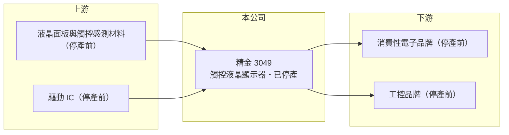

# 3049 精金

> 上市｜[[產業索引-光電業|光電業]]｜上市（櫃）日期 2002/09/27

# 第一章：企業模式與商業藍圖

> [!info] 撰寫說明
> 精簡版，由 Claude 依公開資料整理，架構比照 [[2330台積電]]，資料截至 2026-10-07。來源：winvest.tw 精金 2026 年 4 至 8 月營收快訊。公開資料有限。#待校對

精金原本生產觸控液晶顯示器，2026 年初已全面停產，目前缺乏明確的本業。

- **核心業務：** 精金科技成立於 1999 年，2002 年上市，原本從事觸控式液晶顯示器的研發、生產與銷售。
- **營收結構：** 公司公告自 2026 年 1 月 31 日起全面停產，之後的月營收大幅萎縮，推估主要來自剩餘[[存貨出清]]或其他收入。
- **營運據點：** 生產據點本次未查到，停產後實際營運規模已大幅縮小。
- **長期方向：** 停產後公司未來定位不明，需追蹤公司是否轉型、處分資產或有新業務注入。

# 第二章：護城河深度與競爭優勢

停產後精金已沒有製造面的護城河，觀察重心轉到帳上資產。

- **競爭優勢：** 停產後原有的製造能力已不再是營收來源，目前看不出明確競爭優勢；資本額約 80.20 億元，帳上資產價值是觀察重點。
- **主要對手：** 原本的觸控顯示業務同業包括 [[3038全台]]、[[8105凌巨]] 等中小尺寸顯示廠。
- **觀察重點：** 停產後資產處分進度、是否有[[現金減資]]或轉型計畫，以及獲利是否主要來自[[一次性收益]]。

# 第三章：財務體質與盈利規模

資料日期：2026-10-07，表格是撰寫當時的快照；最新月營收、毛利率、累計 EPS 由自動排程寫在本筆記的屬性欄位（月營收、毛利率、累計EPS 等）。#待校對

精金停產後營收大減，但帳面轉為獲利，數字需要拆開來看。

- **營收規模：** 2026 年 8 月營收 3,049.4 萬元，年減 72.22%；1 至 8 月累計 4.12 億元，年減 54.1%。
- **獲利：** 2026 年第二季 EPS 0.55 元，上半年累計 0.51 元；2025 年全年 EPS 為 -0.64 元。停產後轉為獲利，推估與資產處分等一次性收益有關。
- **財務特色：** 資本額大、營收規模小，EPS 容易受非本業項目左右。

# 第四章：總體風險與地緣政治

精金最大的風險是停產後缺乏持續性收入，後續走向取決於公司的資產處置與轉型決策。

- **產業週期：** 原觸控顯示產業已進入成熟期，價格競爭激烈，這也是推估停產的背景之一。
- **營運風險：** 停產後缺乏穩定的本業收入，後續獲利可能難以延續。
- **其他風險：** 公司後續資產處置與轉型計畫的不確定性；相關公告須以公開資訊觀測站為準。

# 專有名詞解析

## 金融

- **[[存貨出清]]**：停產或轉型時把剩餘庫存一次賣出，營收不具持續性。
- **[[一次性收益]]**：處分資產、土地或投資等不會每年重複的收益，會讓單期 EPS 偏離本業實力。
- **[[現金減資]]**：公司減少股本並把對應現金退還股東，可提高每股盈餘與淨值報酬率。

# 核心供應鏈

- 上游：（停產前）液晶面板、觸控感測材料與驅動 IC 供應商
- 下游／客戶：（停產前）消費性電子與工控品牌
- 同業：[[3038全台]]、[[8105凌巨]]

## 最新新聞
<!-- news:start -->
<!-- news:end -->

## 相關連結
- [公開資訊觀測站](https://mopsov.twse.com.tw/mops/web/t05st03?step=1&firstin=1&co_id=3049)
- [Goodinfo](https://goodinfo.tw/tw/StockDetail.asp?STOCK_ID=3049)
- [Yahoo 股市](https://tw.stock.yahoo.com/quote/3049)
- [鉅亨網新聞](https://www.cnyes.com/twstock/3049/news)
