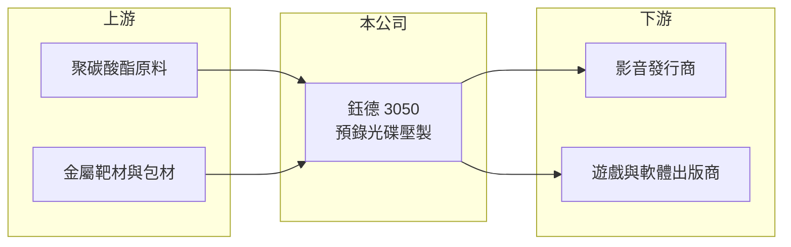

# 3050 鈺德

> 上市｜[[產業索引-光電業|光電業]]｜上市（櫃）日期 2002/10/29

# 第一章：企業模式與商業藍圖

> [!info] 撰寫說明
> 精簡版，由 Claude 依公開資料整理，架構比照 [[2330台積電]]，資料截至 2026-10-07。來源：nstock.tw 鈺德公司概況、winvest.tw 營收快訊。公開資料有限，產品比重未查到。#待校對

鈺德替內容業者壓製出版用光碟，在萎縮的市場中靠穩定接單與成本控制維持獲利。

- **核心業務：** 鈺德科技成立於 1994 年，2002 年上市，主要從事[[預錄光碟]]片的製造與銷售，也就是替影音、遊戲、軟體等內容業者壓製出版用光碟。
- **營收結構：** 本次未查到各類光碟（CD、DVD、藍光等）的營收比重，推估以影音與遊戲內容的實體出版為主。
- **營運據點：** 總部位於桃園市龜山區，其他廠區本次未查到。
- **長期方向：** 實體光碟市場長期受串流與數位下載取代，公司以接單穩定、控制成本維持獲利，後續轉型方向待追蹤。

# 第二章：護城河深度與競爭優勢

鈺德的護城河來自產業整併後的存活者地位，但市場本身持續縮小。

- **競爭優勢：** 預錄光碟產業已高度集中，留下來的業者在產能與客戶關係上較穩固；第二季獲利率顯示營運效率尚可。
- **主要對手：** 國內可對照 [[2349錸德]]，以及海外的光碟壓製代工廠。
- **觀察重點：** 實體出版需求的萎縮速度、淨利率中[[業外收益]]占比，以及配息能否維持。

# 第三章：財務體質與盈利規模

資料日期：2026-10-07，表格是撰寫當時的快照；最新月營收、毛利率、累計 EPS 由自動排程寫在本筆記的屬性欄位（月營收、毛利率、累計EPS 等）。#待校對

鈺德月營收維持在 1 億元上下，毛利率與淨利率都不低，但淨利推估含業外。

- **營收規模：** 2026 年 8 月營收 1.01 億元，年減 9.01%；1 至 8 月累計 7.83 億元，年減 4.51%。月營收大致維持在 1 億元上下。
- **獲利：** 2026 年第二季 [[毛利率]] 34.07%，淨利率 22.7%。淨利率明顯偏高，推估含業外收益。
- **財務特色：** 資本額約 15.50 億元，2025 年配發現金股利 0.25 元，近五年平均現金[[殖利率]]約 2.97%。

# 第四章：總體風險與地緣政治

鈺德最大的風險是實體媒體被數位化取代的結構性衰退。

- **產業週期：** 實體光碟屬於結構性衰退產業，需求跟著影音、遊戲新作發行節奏波動，年底檔期通常較旺（推估）。
- **營運風險：** 數位化持續侵蝕實體媒體需求，營收長期易緩步下滑。
- **其他風險：** 塑膠原料（[[聚碳酸酯]]）價格波動；外銷客戶的匯率影響。

# 專有名詞解析

## 應用

- **[[預錄光碟]]**：出廠前已壓製好影音、遊戲或軟體內容的唯讀光碟，與可燒錄的空白光碟不同。

## 金融

- **[[業外收益]]**：本業以外的收益，例如投資、處分資產或匯兌利益，通常不具持續性。
- **[[殖利率]]**：每年現金股利除以股價，用來衡量以現價買進可領回的現金報酬。

## 產業

- **[[聚碳酸酯]]**：簡稱 PC，透明耐衝擊的工程塑膠，是光碟片基板的主要原料。

# 核心供應鏈

- 上游：聚碳酸酯原料、金屬靶材與包材供應商
- 下游／客戶：影音發行商、遊戲與軟體出版商
- 同業：[[2349錸德]]

## 最新新聞
<!-- news:start -->
<!-- news:end -->

## 相關連結
- [公開資訊觀測站](https://mopsov.twse.com.tw/mops/web/t05st03?step=1&firstin=1&co_id=3050)
- [Goodinfo](https://goodinfo.tw/tw/StockDetail.asp?STOCK_ID=3050)
- [Yahoo 股市](https://tw.stock.yahoo.com/quote/3050)
- [鉅亨網新聞](https://www.cnyes.com/twstock/3050/news)
