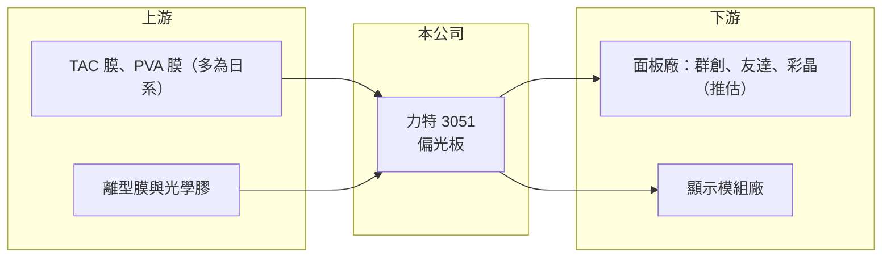

# 3051 力特

> 上市｜[[產業索引-光電業|光電業]]｜上市（櫃）日期 2002/10/28

# 第一章：企業模式與商業藍圖

> [!info] 撰寫說明
> 精簡版，由 Claude 依公開資料整理，架構比照 [[2330台積電]]，資料截至 2026-10-07。來源：winvest.tw 力特 2026 年 5 至 8 月營收快訊。公開資料有限，產品比重未查到。#待校對

力特生產液晶面板必備的光學材料，屬於面板供應鏈的上游。

- **核心業務：** 力特光電成立於 1998 年，主要業務為[[偏光板]]。偏光板是液晶顯示器不可缺少的光學材料，上下各貼一片控制光線通過。
- **營收結構：** 本次未查到依應用（電視、監視器、中小尺寸、車用等）的營收比重。
- **營運據點：** 生產據點本次未查到，本文不推測。
- **長期方向：** 推估朝高附加價值的利基型偏光板發展，以避開大尺寸標準品的價格競爭。

# 第二章：護城河深度與競爭優勢

力特的優勢在於台灣少數的偏光板量產能力，但規模遠小於日韓與中國大廠。

- **競爭優勢：** 屬台灣少數具偏光板量產能力的業者，具備光學膜加工與品質認證基礎。
- **主要對手：** [[8215明基材]]、[[4960誠美材]]，以及日東電工、住友化學、杉金光電等日韓與中國大廠。
- **觀察重點：** 2026 年營收年增能否延續、獲利改善是否來自本業，以及面板廠[[稼動率]]變化。

# 第三章：財務體質與盈利規模

資料日期：2026-10-07，表格是撰寫當時的快照；最新月營收、毛利率、累計 EPS 由自動排程寫在本筆記的屬性欄位（月營收、毛利率、累計EPS 等）。#待校對

力特 2026 年營收與獲利都優於去年，上半年 EPS 已超過 2025 年全年。

- **營收規模：** 2026 年 8 月營收 1.61 億元，年增 14.16%；1 至 8 月累計 12.80 億元，年增 5.9%。5 月營收 2.00 億元為今年高點。
- **獲利：** 2026 年第二季 EPS 0.60 元，季增 33%；上半年累計 EPS 1.05 元，已超過 2025 年全年的 1.01 元。
- **財務特色：** 資本額約 16.70 億元，2026 年獲利明顯優於去年，營收規模相對國際大廠小。

# 第四章：總體風險與地緣政治

力特的風險緊跟面板產業循環，並受中國產能擴充與日系原料成本影響。

- **產業週期：** 偏光板需求緊跟面板產業循環，面板廠稼動率與庫存調整直接影響拉貨。
- **營運風險：** 中國大陸偏光板產能持續擴充，標準品價格壓力大；客戶集中於少數面板廠（推估）。
- **其他風險：** [[TAC膜]]、[[PVA膜]]等原材料多仰賴日本供應，日圓與美元匯率會影響成本。

# 專有名詞解析

## 應用

- **[[偏光板]]**：貼在液晶面板上下兩側、只讓特定方向光線通過的光學膜，是液晶顯示的必要材料。

## 金融

- **[[稼動率]]**：工廠實際生產量占產能的比例，面板業常用來描述開工程度。

## 產業

- **[[TAC膜]]**：三醋酸纖維素膜，用來保護偏光板中的 PVA 層，主要由日本廠商供應。
- **[[PVA膜]]**：聚乙烯醇膜，經染色延伸後成為偏光板中真正產生偏光效果的核心層。

# 核心供應鏈

- 上游：TAC 膜、PVA 膜、離型膜與光學膠等材料供應商（多為日系）
- 下游／客戶：[[3481群創]]、[[2409友達]]、[[6116彩晶]] 等面板與模組廠（推估）
- 同業：[[8215明基材]]、[[4960誠美材]]

## 最新新聞
<!-- news:start -->
<!-- news:end -->

## 相關連結
- [公開資訊觀測站](https://mopsov.twse.com.tw/mops/web/t05st03?step=1&firstin=1&co_id=3051)
- [Goodinfo](https://goodinfo.tw/tw/StockDetail.asp?STOCK_ID=3051)
- [Yahoo 股市](https://tw.stock.yahoo.com/quote/3051)
- [鉅亨網新聞](https://www.cnyes.com/twstock/3051/news)
