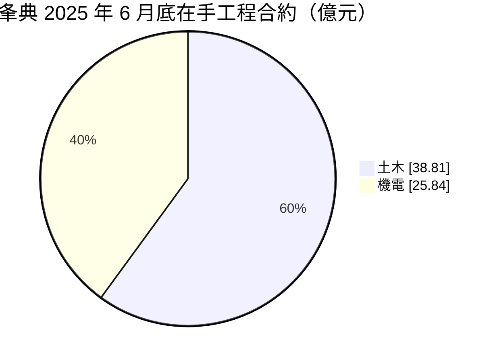
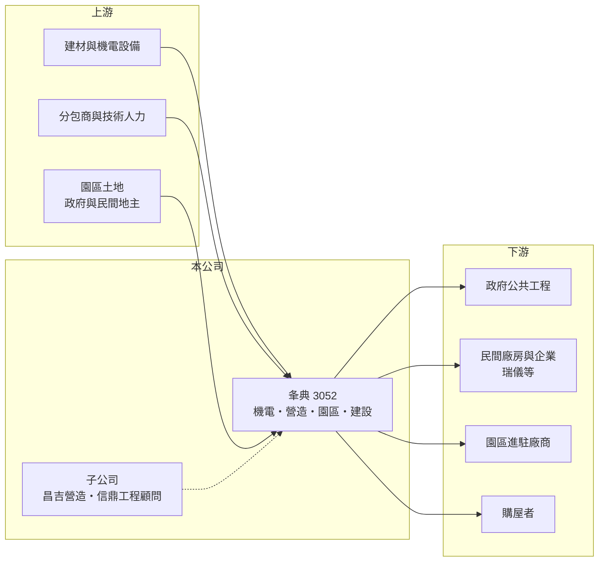

# 3052 夆典

> 上市｜[[產業索引-建材營造業|建材營造業]]｜上市（櫃）日期 1995/11/25

# 第一章：企業模式與商業藍圖

> [!info] 撰寫說明
> 本文由 Claude 依公開資料整理，架構比照 [[2330台積電]] 的四章研究，資料截至 2026-10-08。財務數字來源：Goodinfo 年度經營績效頁、富果研究 2025 年 10 月法說會整理；產業描述為整理性內容，尚未逐條比對原始文件。#待校對

在評估單一個股的長期投資價值時，首要步驟是拆解企業的底層獲利邏輯。本章說明夆典科技開發（股票代號：3052，以下簡稱夆典）如何以機電工程為本業，再延伸到營造、產業園區開發、都更建設與液晶模組，形成一家多事業的工程公司。

## 一、核心定位：機電加營造的工程集團

夆典成立於 1976 年，資本額約 23.5 億元，下轄工程、光電、建設、園區開發四大事業部。工程事業承攬廠房、公共建築與[[統包工程]]的機電與儀電工程；子公司昌吉營造（1980 年成立，甲等綜合營造）負責土木建築，信鼎工程顧問提供技術顧問服務。機電與營造兩者結合，讓夆典能承接需要整合結構與機電的完整工程。

代表承攬案包括瑞儀光電研發中心、嘉義馬稠後污水處理廠、空軍營區統包工程與新北市第二行政中心弱電工程。客戶涵蓋公共部門與民間企業，屬於中型、多元的工程承攬商。

## 二、在手工程結構

截至 2025 年 6 月底，在手工程合約約 64.65 億元，約為 2024 年營收的 2.4 倍。營造業依工程進度認列營收，在手合約是未來兩到三年營收的主要能見度。

## 三、園區開發與建設：較長週期的第二引擎

園區開發是夆典較有特色的業務：承接公民營工業區開發，主要為嘉義馬稠後與台南七股科技工業區（開發面積 141.15 公頃，預計 2027 年 9 月完工），以收取代辦費的方式認列收入，馬稠後與七股分別約有 2.14 億元與 3.55 億元代辦費待認列。建設事業則以台北南港玉成段[[都更]]自建案為主，預計 2027 年推案。光電事業生產中小尺寸液晶顯示模組，年營收約 2 億元，七成外銷，屬於規模較小的舊事業。

# 第二章：護城河深度與競爭優勢

「護城河」指企業抵禦競爭、維持超額利潤的保護機制。工程承攬業競爭激烈，本章說明夆典的相對優勢與限制。

## 一、相對優勢

夆典的優勢在於機電與營造的整合能力。廠房與公共建築的機電工程比例越來越高，能同時處理土建與機電的廠商，在統包案中較具競爭力。其次是產業園區開發的經驗，工業區開發涉及土地取得、環評、公共設施與招商，需要長期與政府合作，新進者不易切入。

## 二、主要競爭對手

| 對手 | 定位 | 對夆典的威脅 |
|---|---|---|
| [[2546根基]]、[[2597潤弘]] | 大型營造與科技廠房 | 在大型廠房與公共建築案競爭 |
| 機電工程同業 | 漢唐、帆宣等 | 在廠房機電與無塵室工程競爭 |
| 地方型營造廠 | 公共工程 | 以低價爭取政府標案 |

## 三、守得住／守不住／觀察重點

守得住的是機電加營造的整合與園區開發經驗；守不住的是工程毛利率，2019 至 2025 年毛利率多在 6% 至 14%，2021 年曾低到 5.67%，顯示承攬業務的價格競爭與成本風險。長期觀察重點是在手合約能否持續成長、七股園區的銷售與完工進度，以及南港都更案能否如期推出。

# 第三章：財務體質與盈利規模

資料日期：2026-10-08。數字取自 Goodinfo 年度經營績效與富果研究法說會整理，表格是撰寫當時的快照；最新月營收、毛利率、累計 EPS 由自動排程寫在本筆記的屬性欄位（月營收、毛利率、累計EPS 等）。#待校對

財務報表是檢驗護城河是否真實存在的最終標準。本章用五年的三率、ROE 與資本報酬檢視夆典的獲利品質。

## 一、多年度經營績效

| 年度 | 營收（新台幣） | [[毛利率]] | [[營業利益率]] | EPS（元） | [[ROE]] |
|---|---|---|---|---|---|
| 2021 | 36.1 億 | 5.67% | 1.88% | 0.52 | 3.41% |
| 2022 | 29.5 億 | 12.4% | 7.01% | 1.05 | 6.61% |
| 2023 | 34.8 億 | 11.1% | 6.36% | 1.04 | 6.31% |
| 2024 | 26.6 億 | 13.6% | 7.17% | 0.98 | 5.94% |
| 2025 | 34.2 億 | 12.6% | 7.68% | 1.10 | 6.37% |

2022 年以後，夆典的毛利率穩定在 11% 至 14%、EPS 約 1 元，ROE 約 6%，獲利品質較 2021 年明顯改善但水準不高。2021 至 2025 年平均 ROE 約 5.7%（推算），營收年複合成長率約 -1.3%（推算），規模大致持平。Goodinfo 統計歷年平均現金股利約 0.32 元，近年每股約 0.5 元，配息率約五成。

## 二、營造業指標

在手工程合約約 64.65 億元，其中土木 38.81 億元、機電 25.84 億元；另有馬稠後與七股園區合計約 5.7 億元代辦費待認列。依 ROE 與 ROA 推算，總資產約為股東權益的三倍（推算），推估與園區開發的土地與預收款有關（推估）。

## 三、[[ROIC]] 與 [[WACC]]：價值創造利差

**ROIC 推算：** 2025 年營業利益約 2.6 億元（34.2 億 × 7.68%），稅後約 2.1 億元。股東權益約 40 億元（每股淨值 17.23 元 × 約 2.33 億股），假設有息負債約 30 億元（推估），投入資本約 70 億元，ROIC 約 3%（推算）。

**WACC 推算：** 台灣 10 年期公債 1.75%、市場風險溢酬 6%、β 取營建同業常見值 0.9，股東權益成本約 7.2%；負債成本 3%、稅後 2.4%；權益占投入資本約 57%，WACC 約 5.1%（推算）。

**結論：** 夆典 ROIC 低於 WACC，代表目前的事業組合整體上還沒有賺回資金成本。若園區開發與都更案能以較高毛利完成，或把資本從低報酬事業移出，才有機會改善。

# 第四章：總體風險與地緣政治

任何企業都無法脫離宏觀環境獨立存在。本章分析夆典長期必須面對的產業與營運風險。

## 一、工程景氣與成本

工程承攬依賴公共建設預算與企業資本支出，兩者都有週期。固定總價合約下，原物料與人工上漲會壓縮毛利；少子化與高齡化造成的工程人才短缺與技術斷層，是經營層點名的長期風險，淨零政策也會推高施工成本。

## 二、園區與建設的長週期風險

工業區開發與都更案時程長，受政策、環評與地主整合影響。七股園區採附條件買賣、需公開銷售，若招商不如預期，代辦費認列與資金回收都會延後。建設事業則受房市交易量與央行[[信用管制]]影響。

## 三、多角化的管理成本

工程、光電、建設、園區四個事業性質差異大，光電事業規模小且面臨價格競爭。多事業並行雖能分散風險，也可能分散管理資源，拉低整體資本報酬。

# 專有名詞解析

## 金融

- **[[信用管制]]**：央行限制購屋與建商貸款成數的政策，會影響房市成交與建商資金。
- **[[ROIC]]**：投入資本報酬率，稅後營業利益除以股東權益加有息負債，衡量本業運用資本的效率。
- **[[WACC]]**：加權平均資金成本，股東與債權人要求報酬率的加權平均，是 ROIC 要超越的門檻。

## 產業

- **[[統包工程]]**：由同一家廠商負責設計與施工的承攬方式，業主只需面對單一窗口。
- **[[都更]]**：都市更新，由地主與建商合作把老舊建物改建，地主依權利價值分回房地或收益。
- **[[產業園區開發]]**：由開發商規劃工業區土地、興建公共設施並出售給廠商，常與政府合作並收取代辦費。

# 核心供應鏈

## 1. 上游：建材、設備與土地
- 建材與機電設備供應商、分包商
- 園區土地：嘉義馬稠後、台南七股

## 2. 中游：夆典與同業
- 子公司：昌吉營造、信鼎工程顧問
- 同業：[[2546根基]]、[[2597潤弘]]

## 3. 下游：業主
- 政府機關、[[6176瑞儀]] 等民間企業、園區廠商、南港都更購屋者

## 最新新聞
<!-- news:start -->
<!-- news:end -->

## 相關連結
- [公開資訊觀測站](https://mopsov.twse.com.tw/mops/web/t05st03?step=1&firstin=1&co_id=3052)
- [Goodinfo](https://goodinfo.tw/tw/StockDetail.asp?STOCK_ID=3052)
- [Yahoo 股市](https://tw.stock.yahoo.com/quote/3052)
- [鉅亨網新聞](https://www.cnyes.com/twstock/3052/news)
