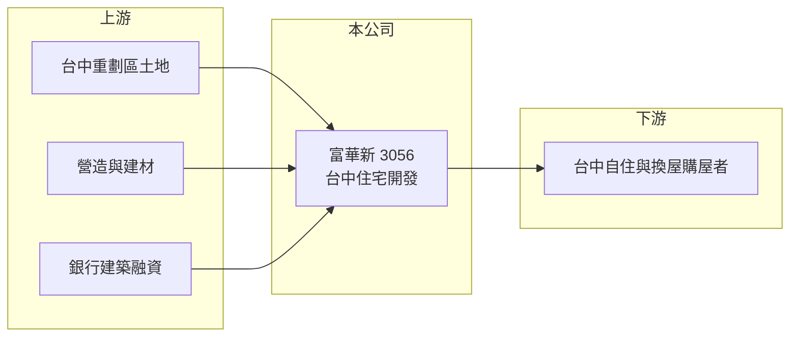

# 3056 富華新

> 上市｜[[產業索引-建材營造業|建材營造業]]｜上市（櫃）日期 2003/03/03

# 第一章：企業模式與商業藍圖

> [!info] 撰寫說明
> 本文由 Claude 依公開資料整理，架構比照 [[2330台積電]] 的四章研究，資料截至 2026-10-08。財務數字來源：Goodinfo 年度經營績效頁、理財周刊 2024 年 11 月報導、Yahoo 股市與工商時報報導標題；公開資料有限，公司沿革與產業描述為整理性內容，尚未逐條比對原始文件。#待校對

在評估單一個股的長期投資價值時，首要步驟是拆解企業的底層獲利邏輯。本章說明富華新（股票代號：3056）這家以台中為主要市場的建商，如何以大型住宅案為核心經營建設本業。

## 一、核心定位：深耕台中的大型住宅開發商

富華新前身為總太地產（更名時間與原因未查得，待校對），長期以台中市為主要推案區域，產品以大型住宅社區為主。台中是近十年人口與房價成長較明顯的都會區，七期、北屯、水湳等重劃區陸續開發，提供建商大量土地與自住需求。

富華新的代表案是台中北屯區的「心之所向」，總銷約 163 億元並已完銷，2024 年第四季開始交屋，預計貢獻 70 億至 80 億元營收。單一建案總銷就超過公司一般年度營收的數倍，顯示公司偏好大型、長期的社區開發。

## 二、資本轉化邏輯：大案集中交屋

大案集中交屋的結果是營收極不平均：Goodinfo 數據顯示 2022 年營收 87 億元、2023 年只有 15.2 億元、2024 年又跳到 128 億元。投資人評估這類公司時，看多年平均獲利與未來交屋排程，比看單一年度更有意義。

## 三、長期方向

在大型案交屋完成後，富華新的長期課題是補足土地與推案，維持穩定的推案節奏。由於公開資料有限，本次未查得 2026 年後的推案量與[[已售未入帳]]金額，讀者應以公司年報與法說會資料補充。

# 第二章：護城河深度與競爭優勢

「護城河」指企業抵禦競爭、維持超額利潤的保護機制。本章分析富華新在台中房市的相對優勢與限制。

## 一、相對優勢

富華新的優勢在於區域深耕。長期在台中推案，累積了土地資訊、在地合作營造廠與客群口碑；大型社區開發需要較強的規劃與資金能力，能做到總銷百億元以上的在地建商不多。「心之所向」能在交屋前完銷，也說明品牌在當地具有一定的去化能力。

## 二、主要競爭對手

| 對手 | 定位 | 對富華新的威脅 |
|---|---|---|
| [[2542興富發]] | 全台大量推案，台中也有大案 | 以價格與量能搶奪首購與換屋客 |
| [[5508永信建]]、[[2537聯上發]] 等台中建商 | 深耕台中 | 爭取同一批重劃區土地與買方 |
| 豪宅型建商 | 台中七期高價住宅 | 在高價產品線競爭 |

## 三、守得住／守不住／觀察重點

守得住的是在地經驗與大型案開發能力；守不住的是台中市場的供給壓力，近年台中推案量大，若供給過多，去化速度與售價都會受影響。長期觀察重點是補地的價格與區位、新案去化率，以及營收能否從「大案年」轉為較平穩的節奏。

# 第三章：財務體質與盈利規模

資料日期：2026-10-08。數字取自 Goodinfo 年度經營績效與財經媒體報導，表格是撰寫當時的快照；最新月營收、毛利率、累計 EPS 由自動排程寫在本筆記的屬性欄位（月營收、毛利率、累計EPS 等）。#待校對

財務報表是檢驗護城河是否真實存在的最終標準。本章用五年的三率、ROE 與資本報酬檢視富華新的獲利品質。

## 一、多年度經營績效

| 年度 | 營收（新台幣） | [[毛利率]] | [[營業利益率]] | EPS（元） | [[ROE]] |
|---|---|---|---|---|---|
| 2021 | 36.5 億 | 28.9% | 21.7% | 3.01 | 12.5% |
| 2022 | 87.0 億 | 34.5% | 30.9% | 9.81 | 35.3% |
| 2023 | 15.2 億 | 42.1% | 23.0% | 0.90 | 4.24% |
| 2024 | 128 億 | 24.0% | 20.7% | 6.15 | 27.6% |
| 2025 | 40.5 億 | 22.0% | 14.6% | 1.07 | 5.82% |

2021 至 2025 年平均 ROE 約 17.1%（推算），但年度間從 4% 到 35% 劇烈波動。毛利率在 22% 至 42% 之間，近兩年回落到 22% 至 24%，推估與大型案土地與營建成本較高有關（推估）。股本由 2021 年 21.1 億元增加到 2025 年 48.1 億元，代表大量發行新股或配發股票股利，每股獲利因此被稀釋（原因未查得）。Goodinfo 統計歷年平均現金股利約 1.11 元。

## 二、營建業指標

「心之所向」總銷約 163 億元、已完銷，2024 年第四季起交屋。依 ROE 與 ROA 推算，2025 年總資產約 164 億元、股東權益約 88 億元（推算），負債比約 47%，在建商中屬中等偏低。

## 三、[[ROIC]] 與 [[WACC]]：價值創造利差

**ROIC 推算：** 2025 年營業利益約 5.9 億元（40.5 億 × 14.6%），稅後約 4.7 億元。股東權益約 88 億元（每股淨值 18.22 元 × 約 4.81 億股），假設有息負債約 53 億元（推估，約負債的七成），投入資本約 141 億元，ROIC 約 3.4%（推算）；以 2021 至 2025 年平均營業利益約 14 億元計算，ROIC 約 8%（推算）。

**WACC 推算：** 台灣 10 年期公債 1.75%、市場風險溢酬 6%、β 取營建同業常見值 0.9，股東權益成本約 7.2%；負債成本 3%、稅後 2.4%；權益占投入資本約 62%，WACC 約 5.4%（推算）。

**結論：** 以多年平均看，富華新 ROIC 略高於 WACC，屬於有創造價值但波動大的建商；單看交屋小年則低於資金成本。關鍵在於能否持續取得合理價格的土地，並維持穩定的推案與交屋節奏。

# 第四章：總體風險與地緣政治

任何企業都無法脫離宏觀環境獨立存在。本章分析富華新長期必須面對的房市、區域與營運風險。

## 一、房市週期與政策

房地產景氣循環長達 7 至 10 年，央行[[信用管制]]、房地合一稅與預售屋禁止轉售等政策，都會影響購屋需求。台中房市過去吸引不少投資型買盤，政策緊縮時受影響可能較大。

## 二、區域集中與供給風險

推案集中在台中，等於把公司命運綁在單一城市。台中近年推案量大，若人口與產業成長趨緩，供給過剩會拉長去化時間並壓低售價。

## 三、營建成本與股本稀釋

缺工與建材上漲推高營建成本，大型案工期長，成本控制難度更高。股本快速增加則代表每股盈餘被稀釋，未來增資或發行可轉債的頻率，也是股東需要留意的資本配置面向。

# 專有名詞解析

## 金融

- **[[信用管制]]**：央行限制購屋與建商貸款成數的政策，會影響房市成交與建商資金。
- **[[ROIC]]**：投入資本報酬率，稅後營業利益除以股東權益加有息負債，衡量本業運用資本的效率。
- **[[WACC]]**：加權平均資金成本，股東與債權人要求報酬率的加權平均，是 ROIC 要超越的門檻。

## 產業

- **[[建案交屋]]**：建商在房屋完工並交付買方時才認列營收，因此營建公司的營收常集中在交屋年度。
- **[[已售未入帳]]**：已經賣出、但尚未完工交屋而未認列營收的建案金額，是建商未來營收的主要能見度指標。
- **[[重劃區]]**：政府將零散土地重新規劃整理並配置道路與公共設施後發還地主的區域，常是新建案集中地。

# 核心供應鏈

## 1. 上游：土地、營造與資金
- 土地：台中北屯等重劃區
- 建材：[[1101台泥]]、[[2002中鋼]] 等；營造廠
- 資金：銀行建築融資

## 2. 中游：富華新與同業
- 同業：[[2542興富發]]、[[5508永信建]]、[[2537聯上發]]

## 3. 下游：客戶
- 台中自住與換屋購屋者

## 最新新聞
<!-- news:start（自動產生，請勿手動編輯此範圍） -->
- 2026-10-08 📰 媒體 17:23｜營收速報 - 富華新(3056)9月營收9,916萬元年增率高達36.92％｜[鉅亨網](https://news.cnyes.com/news/id/6625007)

完整紀錄：[[3056富華新 新聞]]
<!-- news:end -->

## 相關連結
- [公開資訊觀測站](https://mopsov.twse.com.tw/mops/web/t05st03?step=1&firstin=1&co_id=3056)
- [Goodinfo](https://goodinfo.tw/tw/StockDetail.asp?STOCK_ID=3056)
- [Yahoo 股市](https://tw.stock.yahoo.com/quote/3056)
- [鉅亨網新聞](https://www.cnyes.com/twstock/3056/news)
