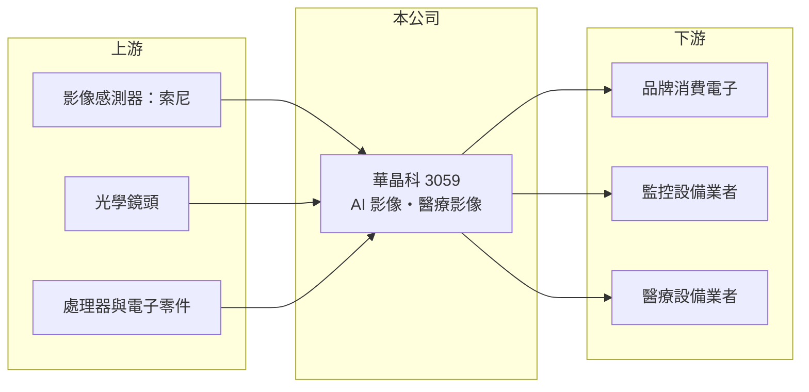

# 3059 華晶科

> 上市｜[[產業索引-光電業|光電業]]｜上市（櫃）日期 2002/12/24

# 第一章：企業模式與商業藍圖

> [!info] 撰寫說明
> 精簡版，由 Claude 依公開資料整理，架構比照 [[2330台積電]]，資料截至 2026-10-07。來源：nstock.tw 華晶科公司概況、winvest.tw 營收快訊。公開資料有限，產品比重未查到。#待校對

華晶科從數位相機代工轉向 AI 影像與醫療應用，追求較高附加價值的產品組合。

- **核心業務：** 華晶科技以影像技術起家，過去以數位相機代工聞名，目前營業項目為 AI 影像解決方案及醫療相關應用產品的研發、生產與銷售。
- **營收結構：** 本次未查到 AI 影像、醫療與其他產品的營收比重。
- **營運據點：** 生產據點本次未查到，本文不推測。
- **長期方向：** 從消費型相機轉向 [[AI影像辨識]]與醫療影像等較高附加價值領域，降低對單一消費電子產品的依賴。

# 第二章：護城河深度與競爭優勢

華晶科的護城河在於多年累積的光學與影像演算法經驗，可延伸到不同應用。

- **競爭優勢：** 累積多年的光學設計、[[影像處理演算法]]與量產經驗，可延伸到監控、車用與醫療影像。
- **主要對手：** 影像模組領域可對照 [[3406玉晶光]]、[[2374佳能]]，以及中國大陸的相機模組廠。
- **觀察重點：** AI 影像與醫療產品的出貨成長、[[毛利率]]能否提升，以及營收年增能否延續。

# 第三章：財務體質與盈利規模

資料日期：2026-10-07，表格是撰寫當時的快照；最新月營收、毛利率、累計 EPS 由自動排程寫在本筆記的屬性欄位（月營收、毛利率、累計EPS 等）。#待校對

華晶科營收穩定年增，獲利為正並維持配息。

- **營收規模：** 2026 年 8 月營收 8.47 億元，月增 6.81%、年增 8.25%；1 至 8 月累計 60.21 億元。
- **獲利：** 2026 年第二季 EPS 0.38 元，毛利率 26.55%。
- **財務特色：** 資本額約 30.77 億元，2025 年配發現金股利 1 元，近五年平均現金股利 0.88 元。

# 第四章：總體風險與地緣政治

華晶科的風險來自影像模組的價格競爭，以及新產品放量時程的不確定。

- **產業週期：** 影像產品需求跟著消費電子、監控與醫療設備的換機週期起伏。
- **營運風險：** 影像模組競爭激烈，中國廠商價格壓力大；轉型產品放量時程不確定。
- **其他風險：** 美元匯率影響外銷報價與匯兌損益；醫療產品需通過各國[[醫材法規]]認證。

# 專有名詞解析

## 應用

- **[[AI影像辨識]]**：用深度學習模型分析影像，自動辨識人、車、物件或異常狀況。
- **[[影像處理演算法]]**：把感測器原始訊號轉成清晰影像的運算方法，包括降噪、對焦、曝光與色彩校正。

## 產業

- **[[醫材法規]]**：醫療器材上市前須取得台灣 TFDA、美國 FDA 等主管機關核准，審查期長。

# 核心供應鏈

- 上游：影像感測器（如 [[SONY索尼]]）、光學鏡頭、處理器與電子零件供應商
- 下游／客戶：品牌消費電子、監控與醫療設備業者（推估）
- 同業：[[3406玉晶光]]、[[2374佳能]]

## 最新新聞
<!-- news:start -->
<!-- news:end -->

## 相關連結
- [公開資訊觀測站](https://mopsov.twse.com.tw/mops/web/t05st03?step=1&firstin=1&co_id=3059)
- [Goodinfo](https://goodinfo.tw/tw/StockDetail.asp?STOCK_ID=3059)
- [Yahoo 股市](https://tw.stock.yahoo.com/quote/3059)
- [鉅亨網新聞](https://www.cnyes.com/twstock/3059/news)
