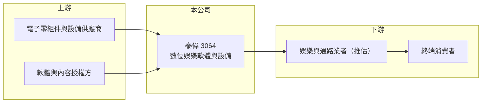

# 3064 泰偉

> 上櫃｜[[產業索引-文化創意業|文化創意業]]｜上市（櫃）日期 2004/06/09

# 第一章：企業模式與商業藍圖

> [!info] 撰寫說明
> 精簡版，由 Claude 依公開資料整理，架構比照 [[2330台積電]] 的四章研究，資料截至 2026-10-08。來源：Goodinfo 年度經營績效頁、nStock 公司簡介、櫃買中心開放資料（基本資料、2026 年第二季資產負債與綜合損益、每月營收、本益比殖利率）。公開資料有限，主要產品與營收比重未查得，業務描述以公司登記項目為準。#待校對

本章拆解泰偉電子（股票代號：3064，以下簡稱泰偉）的商業模式。泰偉是一家營收規模不到 4 億元、長期虧損的小型公司，被歸類在文化創意產業，公開資料對其產品著墨很少，投資人需要特別留意資訊透明度。

- **核心業務：** 泰偉 2000 年設立，2004 年上櫃，實收資本額約 1.30 億元，董事長為林國泰、總經理為林佑翔，公司登記地址在台中市西屯區。依營業登記，業務項目包括資料儲存及處理設備製造、資訊軟體服務、電子零組件製造、玩具製造、玩具及娛樂用品批發零售與租賃業。
- **營收結構：** 公司未揭露各產品營收比重。[[毛利率]]在多數年份高達 65% 至 91%，代表營收主要來自軟體、授權或服務類收入，而非一般電子產品製造（推估）。從登記項目推測，業務可能與娛樂設備或電子遊戲的軟硬體及租賃有關（推估，待校對）。
- **營運據點：** 以台灣為主，總部位於台中。
- **長期方向：** 公開資料未見公司的長期策略說明。近十年營收在 0.5 億至 3.6 億元之間波動，僅 2024 年小幅獲利，商業模式尚未穩定。

# 第二章：護城河深度與競爭優勢

泰偉目前沒有可辨識的護城河，營收規模過小，難以在任何細分市場建立規模優勢。

- **競爭優勢：** 高毛利率顯示公司的產品或服務具有一定的附加價值，例如軟體或授權類收入；但毛利金額太小，不足以支撐研發與管理費用，因此高毛利並未轉化為獲利。
- **主要對手：** 由於主要產品未查得，難以指出直接對手。nStock 列出的同產業公司為 [[3293鈊象]]、[[6180橘子]]、[[5478智冠]]，但這三家規模都是泰偉的數十至數百倍，業務重疊程度不明。
- **觀察重點：** 公司能否清楚揭露主要產品與客戶、營收能否連續數年維持在損益兩平以上的規模，是評估是否值得長期追蹤的前提。

# 第三章：財務體質與盈利規模

資料日期：2026-10-08，表格是撰寫當時的快照；最新月營收、毛利率、累計 EPS 由自動排程寫在本筆記的屬性欄位（月營收、毛利率、累計EPS 等）。#待校對

本章用十年數據檢視泰偉長期虧損的財務狀況。

| 年度 | 營收（新台幣） | [[毛利率]] | [[營業利益率]] | EPS（元） | [[ROE]] |
|---|---|---|---|---|---|
| 2016 | 1.93 億 | 70.4% | -71.5% | -2.19 | -30.3% |
| 2018 | 1.41 億 | 65.4% | -166% | -2.03 | -55.4% |
| 2019 | 1.47 億 | 73.6% | -208% | -3.78 | -169% |
| 2020 | 3.55 億 | 83.5% | -14.7% | -2.34 | -48.2% |
| 2021 | 2.39 億 | 76.4% | -3.56% | -0.75 | -26.9% |
| 2022 | 0.84 億 | 42.6% | -143% | -3.47 | -117% |
| 2023 | 0.89 億 | 89.6% | -36.2% | -0.27 | -8.74% |
| 2024 | 1.17 億 | 84.7% | 3.62% | 0.05 | 0.54% |
| 2025 | 0.82 億 | 90.8% | -28.7% | -3.51 | -52.8% |
| 2026 上半年 | 0.41 億 | 89.0% | -15.5% | -0.73 | 不適用（半年） |

- **營收規模：** 營收在 0.5 億至 3.6 億元之間，2020 年為高點，2021 至 2025 年年複合成長率約 -23.5%（推算）。依月營收資料，2026 年 1 至 8 月累計約 0.55 億元，與去年同期的 0.57 億元相近。
- **獲利：** 近十年只有 2024 年本業小幅獲利，其餘年份皆為虧損，ROE 多次低於 -50%。2026 年上半年營業虧損約 0.06 億元、業外損失約 0.03 億元，淨損約 0.09 億元（櫃買中心資料）。
- **財務特色：** 2026 年第二季底總資產約 3.03 億元、負債約 2.48 億元（其中非流動負債約 1.68 億元）、股東權益僅約 0.55 億元，保留盈餘約 -0.87 億元，每股淨值約 3.91 元，已低於面額 10 元的一半。負債對權益約 4.5 倍，財務槓桿很高。近五年無配息（nStock）。

**[[ROIC]] 與 [[WACC]]：** 2025 年營業利益約 -0.24 億元（0.82 億元 × -28.7%），2026 年上半年仍為虧損，ROIC 為負（推算）；即使在唯一獲利的 2024 年，營業利益約 0.04 億元，相對於約 2 億元以上的投入資本（股東權益加上推估的有息負債），ROIC 也不到 2%（推算）。WACC 假設公債 1.75%、市場風險溢酬 6%、β 取 1.2（微型股，假設），股東權益成本約 8.95%；負債成本假設 3%、稅後 2.4%；以權益約兩成、負債約八成的帳面結構計算，WACC 約 3.7%（推算）。由於權益極小，這個 WACC 低估了實際風險；無論如何，ROIC 長期為負，公司並未創造價值。

# 第四章：總體風險與地緣政治

泰偉的風險集中在財務體質與資訊透明度。

- **產業週期：** 主要產品未查得，難以判斷所處產業的週期；但營收長年大幅波動，顯示需求或訂單來源相當不穩定。
- **營運風險：** 每股淨值已低於面額一半，依櫃買中心規定可能面臨交易方式變更等措施（待校對）；負債比高，若虧損持續，可能需要增資或減資彌補虧損，對既有股東造成稀釋。營收規模小，任何單一客戶或專案的變化都會造成很大影響。
- **其他風險：** 公開資訊有限，投資人難以掌握產品、客戶與策略，這本身就是一項重要風險；借款利率上升也會加重財務負擔。

# 專有名詞解析

## 金融

- **[[每股淨值]]**：股東權益除以流通股數，代表每股在帳上對應的淨資產，低於面額一半時可能受到交易限制。
- **[[累積虧損]]**：公司歷年虧損累計造成保留盈餘為負，會侵蝕股本並降低每股淨值。
- **[[財務槓桿]]**：以負債支應資產的程度，槓桿越高，獲利與虧損對股東權益的放大效果越大。
- **[[ROIC]]**：投入資本報酬率，稅後營業利益除以股東權益加有息負債，衡量本業運用資本的效率。
- **[[WACC]]**：加權平均資金成本，股東與債權人要求報酬的加權平均，ROIC 高於它才代表創造價值。

# 核心供應鏈

- 上游：電子零組件與設備供應商、軟體與內容授權方（依登記項目推估）。
- 下游／客戶：娛樂與零售通路業者、終端消費者（推估，主要客戶未查得）。
- 同業：nStock 列為同產業的 [[3293鈊象]]、[[6180橘子]]、[[5478智冠]]（業務重疊程度不明）。

## 最新新聞
<!-- news:start -->
<!-- news:end -->

## 相關連結
- [公開資訊觀測站](https://mopsov.twse.com.tw/mops/web/t05st03?step=1&firstin=1&co_id=3064)
- [Goodinfo](https://goodinfo.tw/tw/StockDetail.asp?STOCK_ID=3064)
- [Yahoo 股市](https://tw.stock.yahoo.com/quote/3064)
- [鉅亨網新聞](https://www.cnyes.com/twstock/3064/news)
