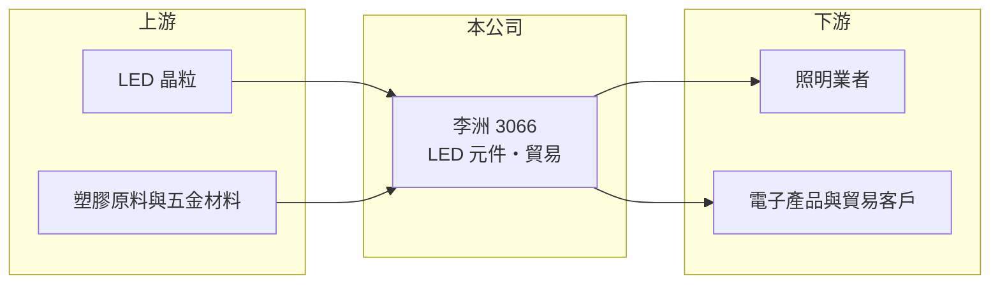

# 3066 李洲

> 上櫃｜[[產業索引-光電業|光電業]]｜上市（櫃）日期 2004/12/02

# 第一章：企業模式與商業藍圖

> [!info] 撰寫說明
> 精簡版，由 Claude 依公開資料整理，架構比照 [[2330台積電]]，資料截至 2026-10-07。來源：nstock.tw 李洲公司概況、winvest.tw 營收快訊。公開資料有限。#待校對

李洲是營收規模很小的光電類公司，業務橫跨 LED 元件與多項貿易。

- **核心業務：** 李洲科技屬光電類股，登記業務包括進出口貿易、塑膠製品與原料、五金機械建材加工買賣、電器電子組件加工買賣，以及各式發光二極體（LED）。
- **營收結構：** 本次未查到各業務的營收比重，推估以 LED 相關產品與貿易為主。
- **營運據點：** 生產與營運據點本次未查到，本文不推測。
- **長期方向：** 營收規模小，未來發展方向公開資料有限，需追蹤公司公告。

# 第二章：護城河深度與競爭優勢

李洲目前看不出明確護城河，獲利來源是否可持續是首要問題。

- **競爭優勢：** 公開資料有限，看不出明確的技術或規模優勢。
- **主要對手：** LED 領域可對照 [[2393億光]]、[[6168宏齊]] 等 [[LED封裝]]廠。
- **觀察重點：** 2026 年上半年 EPS 與營收規模落差大，需確認獲利來源是否為[[一次性收益]]。

# 第三章：財務體質與盈利規模

資料日期：2026-10-07，表格是撰寫當時的快照；最新月營收、毛利率、累計 EPS 由自動排程寫在本筆記的屬性欄位（月營收、毛利率、累計EPS 等）。#待校對

李洲營收小幅成長，但上半年 EPS 遠高於營收規模所能支撐的水準。

- **營收規模：** 2026 年 8 月營收 1,848.1 萬元，年增 18.89%，為近五年同期新高；1 至 8 月累計約 1.8 億元，年增 3.5%。
- **獲利：** nstock 顯示 2026 年上半年累計 EPS 5.41 元，與營收規模相比明顯偏高，推估含處分資產或[[業外收益]]等一次性項目，待以財報確認。
- **財務特色：** 資本額約 8.31 億元，近五年沒有配息紀錄。

# 第四章：總體風險與地緣政治

李洲的風險在於本業規模小、資訊揭露有限，獲利難以延續。

- **產業週期：** LED 元件屬成熟產業，需求跟著照明與消費電子景氣起伏。
- **營運風險：** 營收規模小，本業獲利能力有限；若 EPS 主要來自一次性收益，後續難以延續。
- **其他風險：** 原物料價格與匯率波動；資訊揭露有限，投資判斷需仰賴財報原文。

# 專有名詞解析

## 半導體

- **[[LED封裝]]**：把 LED 晶粒固定在支架或基板上，接線並以膠體保護，做成可焊接使用的元件。

## 金融

- **[[一次性收益]]**：處分資產、土地或投資等不會每年重複的收益，會讓單期 EPS 偏離本業實力。
- **[[業外收益]]**：本業以外的收益，例如投資、處分資產或匯兌利益，通常不具持續性。

# 核心供應鏈

- 上游：LED 晶粒、塑膠原料與五金材料供應商
- 下游／客戶：照明、電子產品與貿易客戶（推估）
- 同業：[[2393億光]]、[[6168宏齊]]

## 最新新聞
<!-- news:start -->
<!-- news:end -->

## 相關連結
- [公開資訊觀測站](https://mopsov.twse.com.tw/mops/web/t05st03?step=1&firstin=1&co_id=3066)
- [Goodinfo](https://goodinfo.tw/tw/StockDetail.asp?STOCK_ID=3066)
- [Yahoo 股市](https://tw.stock.yahoo.com/quote/3066)
- [鉅亨網新聞](https://www.cnyes.com/twstock/3066/news)
