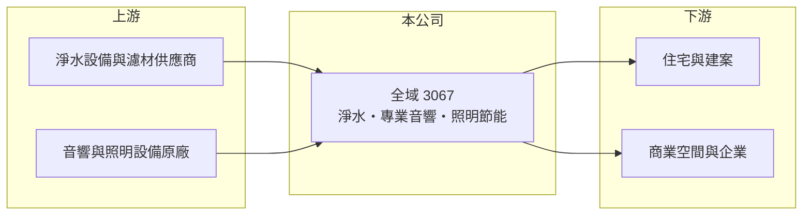

# 3067 全域

> 上櫃｜[[產業索引-其他電子業|其他電子業]]｜上市（櫃）日期 2003/10/21

# 第一章：企業模式與商業藍圖

> [!info] 撰寫說明
> 精簡版，由 Claude 依公開資料整理，架構比照 [[2330台積電]]，資料截至 2026-10-07。來源：nStock 全域公司簡介、winvest 營收快訊。公開資料有限，業務營收比重本次未查到。#待校對

全域成立於 1973 年、2003 年上櫃，目前營收規模很小，經營淨水、音響與照明節能三類產品。

- **核心業務：** 銷售[[全戶淨水]]產品、設計與買賣專業音響產品，以及照明[[節能設備]]的出售與租賃。
- **營收結構：** 本次未查到三類業務的營收比重。
- **營運據點：** 以台灣市場為主，生產或代理來源本次未查到。
- **長期方向：** 營收規模每年不到 1 億元，觀察公司能否找到可放大規模的業務以改善虧損。

# 第二章：護城河深度與競爭優勢

全域的業務分散且規模小，目前看不出明顯的競爭門檻。

- **競爭優勢：** 本次未查到明確的技術或通路優勢；照明節能設備採租賃方式，可能帶來部分經常性收入（推估）。
- **主要對手：** 國內外淨水設備品牌、專業音響與照明節能工程業者（推估，具體名單未查到）。
- **觀察重點：** 2026 年 4 至 6 月月營收連續下滑、年減幅度擴大，觀察下半年營收能否回升。

# 第三章：財務體質與盈利規模

資料日期：2026-10-07，以下數字是撰寫當時的快照；最新月營收、毛利率、累計 EPS 由自動排程寫在本筆記的屬性欄位（月營收、毛利率、累計EPS 等）。#待校對

全域營收規模極小且本業虧損，獲利主要靠業外支撐。

- **營收規模：** 2025 年全年營收 0.58 億元；2026 年 1 至 7 月累計 0.37 億元，6 月營收僅 136.5 萬元、年減 59.56%。
- **獲利：** 2025 年全年 EPS -0.84 元；2026 年第二季 EPS 約 0 元，[[毛利率]] 34.83%、營業利益率 -57.76%，淨利率 0.21%，代表本業虧損由[[業外收益]]抵銷。
- **財務特色：** 近五年無配息。

# 第四章：總體風險與地緣政治

全域的主要風險在於營收規模過小與持續虧損。

- **產業週期：** 淨水與音響屬消費性與工程型需求，受房市、商業空間裝修與消費景氣影響。
- **營運風險：** 營收規模太小，固定費用無法分攤，本業持續虧損會侵蝕股東權益；月營收波動劇烈，單一案件影響大。
- **其他風險：** 獲利依賴業外收益，持續性低；資訊揭露有限，投資人難以評估各業務的實際狀況。

# 專有名詞解析

## 金融

- **[[毛利率]]**：毛利除以營收，反映產品本身的定價能力與成本控制。
- **[[業外收益]]**：本業以外的收入，例如投資、處分資產或匯兌利益，持續性通常較低。

## 產業

- **[[全戶淨水]]**：裝在住宅進水端、過濾全屋用水的淨水系統，與只裝在廚房的飲水機不同。
- **[[節能設備]]**：以 LED 照明等高效率設備取代舊設備以降低用電，常以租賃或節能分享方式提供。

# 核心供應鏈

- 上游：淨水設備、濾材、音響與照明設備供應商（推估）
- 下游／客戶：住宅用戶與建案、商業空間與企業（推估）
- 同業：國內淨水設備與專業音響業者（本次未查到具體名單）

## 最新新聞
<!-- news:start -->
<!-- news:end -->

## 相關連結
- [公開資訊觀測站](https://mopsov.twse.com.tw/mops/web/t05st03?step=1&firstin=1&co_id=3067)
- [Goodinfo](https://goodinfo.tw/tw/StockDetail.asp?STOCK_ID=3067)
- [Yahoo 股市](https://tw.stock.yahoo.com/quote/3067)
- [鉅亨網新聞](https://www.cnyes.com/twstock/3067/news)
