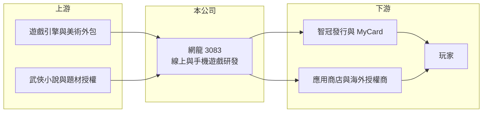

# 3083 網龍

> 上櫃｜[[產業索引-文化創意業|文化創意業]]｜上市（櫃）日期 2003/12/02

# 第一章：企業模式與商業藍圖

> [!info] 撰寫說明
> 精簡版，由 Claude 依公開資料整理，架構比照 [[2330台積電]] 的四章研究，資料截至 2026-10-08。來源：Goodinfo 年度經營績效頁、nStock 公司簡介、櫃買中心開放資料（基本資料、2026 年第二季資產負債與綜合損益、每月營收、本益比殖利率）。公開資料有限，產品描述為整理性內容。#待校對

本章拆解中華網龍（股票代號：3083，以下簡稱網龍）的商業模式。網龍是台灣老牌的線上遊戲研發商，以武俠題材著稱，母公司為 [[5478智冠]]，在集團中扮演「內容研發」的角色。

- **核心業務：** 網龍成立於 2000 年，2003 年上櫃，實收資本額約 8.65 億元。公司以開發網路連線平台與應用軟體為主，目前提供電腦線上遊戲與手機遊戲服務，早期以《金庸群俠傳 Online》等武俠題材作品打開知名度（作品清單待校對）。
- **營收結構：** 公司未揭露各產品的營收比重。從財報看，[[毛利率]]長年在 80% 至 88% 之間，代表營收主要來自自研遊戲的營運收入與授權金，屬於高毛利、但營收規模小的研發型公司。
- **營運據點：** 總部位於台北南港。智冠持股約 48.4%（nStock，2026 年 6 月 30 日資料），網龍研發的遊戲可透過智冠的發行通路與 [[MyCard]] 點數平台觸及玩家，形成集團內的分工。
- **長期方向：** 網龍的長期價值在於武俠 [[遊戲IP]] 的累積與授權。舊作改編成手機遊戲、授權給海外廠商營運，可以用較低成本延長 IP 的壽命；但能否推出新的熱門作品，仍是公司營收能否突破 3 億至 7 億元區間的關鍵。

# 第二章：護城河深度與競爭優勢

網龍的護城河來自武俠題材的長期經營與集團支援，但規模不大，屬於窄護城河。

- **競爭優勢：** 武俠題材在華人市場有穩定的玩家群，網龍二十多年累積的美術、劇情與玩法經驗，讓它能以較低成本推出改編作品。背靠智冠集團，則讓網龍省下自建發行通路與金流的成本，研發可以專注在內容本身。
- **主要對手：** 同樣以研發為主的台灣公司包括 [[3546宇峻]]（三國題材）、[[3293鈊象]]、[[3687歐買尬]]；更大的競爭壓力來自中國大陸與韓國的大型遊戲公司，它們的研發預算動輒是網龍營收的數十倍，在武俠與 MMORPG 類型上直接競爭。
- **觀察重點：** 2018 至 2019 年與 2024 年營業利益率轉正，都與新作或授權收入有關；其他年份多為虧損。觀察重點在於新作推出的頻率與成功率，以及 IP 授權收入能否成為穩定的底盤。

# 第三章：財務體質與盈利規模

資料日期：2026-10-08，表格是撰寫當時的快照；最新月營收、毛利率、累計 EPS 由自動排程寫在本筆記的屬性欄位（月營收、毛利率、累計EPS 等）。#待校對

本章用多年度數據檢視網龍研發型商業模式的獲利波動。

| 年度 | 營收（新台幣） | [[毛利率]] | [[營業利益率]] | EPS（元） | [[ROE]] |
|---|---|---|---|---|---|
| 2018 | 6.00 億 | 80.1% | 8.64% | 0.45 | 4.79% |
| 2019 | 6.63 億 | 84.5% | 11.7% | 0.92 | 7.37% |
| 2020 | 4.58 億 | 87.2% | -2.18% | 0.01 | 1.10% |
| 2021 | 3.42 億 | 85.1% | -18.4% | -0.46 | -3.15% |
| 2022 | 3.66 億 | 82.4% | -15.0% | -0.26 | -1.96% |
| 2023 | 3.44 億 | 81.3% | -9.52% | 0.01 | 0.08% |
| 2024 | 4.28 億 | 82.2% | 6.22% | 0.81 | 5.50% |
| 2025 | 3.96 億 | 83.8% | -1.18% | 0.43 | 2.97% |
| 2026 上半年 | 1.87 億 | 84.8% | -2.0% | 0.30 | 不適用（半年） |

- **營收規模：** 營收在 3.4 億至 6.6 億元之間起伏，2021 至 2025 年年複合成長率約 3.7%（推算），沒有明顯的長期成長趨勢。
- **獲利：** 毛利率雖高，但研發與營運費用相對固定，營收只要低於約 4 億元，營業利益就容易轉為虧損，這是典型的[[營業槓桿]]。2023 與 2025 年本業虧損、EPS 卻為正，代表業外收入（如利息與投資收益）撐住了淨利。2021 至 2025 年平均 ROE 僅約 0.7%（推算）。
- **財務特色：** 2026 年第二季底總資產約 14.7 億元、負債僅約 1.45 億元，股東權益約 13.3 億元，幾乎沒有借款，財務非常保守。帳上資金遠大於營運需求，是業外收入的來源，也拉低了 ROE。Goodinfo 統計歷年一般平均現金股利約 1.84 元。

**[[ROIC]] 與 [[WACC]]：** 以 2024 年較好的年度計算，營業利益約 0.27 億元（4.28 億元 × 6.22%），稅後約 0.21 億元；投入資本以股東權益約 13.3 億元計（無有息負債，櫃買中心 2026 年第二季資料），ROIC 約 1.6%（推算）；2025 年本業虧損，ROIC 為負。WACC 假設公債 1.75%、市場風險溢酬 6%、β 取 0.9（遊戲股常見值，假設），因無借款，WACC 約 7.2%（推算）。ROIC 長期低於 WACC，代表本業目前未能創造超過資金成本的報酬，大量閒置資金是主要拖累。

# 第四章：總體風險與地緣政治

網龍的風險集中在研發成敗與資金運用效率。

- **產業週期：** 遊戲營收高度依賴新作，作品上線初期營收高、之後逐年衰退。若研發節奏中斷，營收會連續多年下滑，2020 至 2023 年就是例子。
- **營運風險：** 營收規模小，單一作品失敗對公司影響很大；武俠題材的玩家年齡偏高，年輕玩家偏好的類型不同，IP 吸引力可能逐漸下降。作為智冠子公司，與母公司之間的交易條件與資源分配也值得留意。
- **其他風險：** 海外授權收入受中國版號政策與當地市場競爭影響；手機平台的抽成政策（約三成）也壓縮研發商的分潤空間。

# 專有名詞解析

## 金融

- **[[營業槓桿]]**：固定費用占比高的企業，營收增加時利潤以更快速度成長，營收下滑時也會放大衰退。
- **[[ROIC]]**：投入資本報酬率，稅後營業利益除以股東權益加有息負債，衡量本業運用資本的效率。
- **[[WACC]]**：加權平均資金成本，股東與債權人要求報酬的加權平均，ROIC 高於它才代表創造價值。

## 產業

- **[[遊戲IP]]**：遊戲的智慧財產，包括角色、世界觀與名稱，可改編成續作、手機遊戲或授權給其他廠商使用。
- **[[MyCard]]**：智冠經營的數位點數平台，玩家購買點數後可儲值到合作的遊戲與數位服務中使用。
- **[[MMORPG]]**：大型多人線上角色扮演遊戲，大量玩家在同一世界中互動，開發與營運成本都高。

# 核心供應鏈

- 上游：遊戲引擎、伺服器與美術外包；題材授權來源。
- 下游／客戶：母公司 [[5478智冠]] 的發行與點數通路、手機應用商店、海外授權營運商，最終為玩家。
- 同業：[[3546宇峻]]、[[3293鈊象]]、[[3687歐買尬]]、[[6180橘子]]。

## 最新新聞
<!-- news:start -->
<!-- news:end -->

## 相關連結
- [公開資訊觀測站](https://mopsov.twse.com.tw/mops/web/t05st03?step=1&firstin=1&co_id=3083)
- [Goodinfo](https://goodinfo.tw/tw/StockDetail.asp?STOCK_ID=3083)
- [Yahoo 股市](https://tw.stock.yahoo.com/quote/3083)
- [鉅亨網新聞](https://www.cnyes.com/twstock/3083/news)
