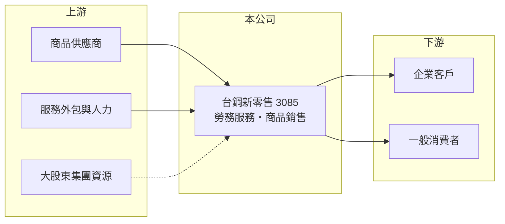

# 3085 新零售

> 上櫃｜[[產業索引-數位雲端|數位雲端]]｜上市（櫃）日期 2004/03/01

# 第一章：企業模式與商業藍圖

> [!info] 撰寫說明
> 精簡版，由 Claude 依公開資料整理，架構比照 [[2330台積電]]，資料截至 2026-10-08。來源：櫃買中心開放資料（基本資料、資產負債、綜合損益、每月營收）、Goodinfo 年度經營績效、富邦 e 點通（MoneyDJ）公司基本資料。公開資料有限，勞務收入的具體服務內容、與台鋼集團的持股關係與更名年份未查得。#待校對

本章說明台鋼新零售（3085）的業務結構，以及它從長期虧損中尋找新定位的過程。

- **核心業務：** 台鋼新零售成立於 1994 年，2004 年上櫃，董事長李雲琴。依網路公司資料，公司曾以「創新新零售」為名，目前全名冠上「台鋼」，推估已成為台鋼集團旗下的事業（入主時間與持股比例未查得）。依 MoneyDJ 2025 年營收比重，勞務收入占 78.0%，商品銷售占 22.0%，代表公司以提供服務收費為主、商品零售為輔。
- **營收規模：** 2025 年全年營收只有約 0.55 億元，2026 年 1 至 8 月累計約 0.48 億元，是規模非常小的上櫃公司。在這樣的營收規模下，人事與上市維持成本占比很高，很難靠本業產生穩定獲利。
- **資本重整：** 依 Goodinfo 公告資料，公司 2026 年辦理[[減資彌補虧損]]，並調整[[私募]]資金用途；證交所與櫃買中心的最新基本資料顯示實收資本額約 5.36 億元，低於 2026 年第二季資產負債表上的股本 6.90 億元。減資彌補虧損不改變公司實際資產，但能清除帳上累積虧損，為日後配息或增資鋪路。
- **長期方向：** 對規模小、長期虧損的公司來說，大股東的策略往往比現有業務更能決定未來。若台鋼集團把零售、運動或其他事業資源導入，公司可能轉型成集團的新零售平台；反之，若找不到可擴大的業務，仍會停留在小規模虧損的狀態。

# 第二章：護城河深度與競爭優勢

本章分析新零售目前的競爭條件。

- **競爭優勢：** 以現有公開資料來看，新零售的本業規模太小，難以形成明確的護城河。潛在優勢來自大股東集團的資源，例如集團內的客戶、場域與品牌，可以提供初期的業務來源，降低從零開始拓展的難度。
- **主要對手：** 零售與服務業的競爭者眾多，從大型通路如 [[5904寶雅]]、[[8454富邦媒]]，到各類中小型服務商都是潛在對手（實際服務領域未查得，難以指出直接對手）。
- **觀察重點：** 第一是勞務收入的實際內容與客戶來源，是否主要來自集團內部。第二是 2026 年減資後是否搭配私募或增資引進新業務。第三是營業虧損能否收斂，2023 至 2025 年營業利益率從 -71% 到 -104%，2025 年改善為 -83.8%。

# 第三章：財務體質與盈利規模

資料日期：2026-10-08，表格是撰寫當時的快照；最新月營收、毛利率、累計 EPS 由自動排程寫在本筆記的屬性欄位（月營收、毛利率、累計EPS 等）。#待校對

本章用六年數字檢視新零售的虧損狀況與資本結構。

| 年度 | 營收（新台幣） | [[毛利率]] | [[營業利益率]] | EPS（元） | [[ROE]] |
|---|---|---|---|---|---|
| 2020 | 0.94 億 | 8.44% | -138% | -2.45 | -155%（淨值極低） |
| 2021 | 0.89 億 | 27.0% | -61% | 0.37 | 19.7% |
| 2022 | 1.77 億 | 14.9% | -14.1% | -0.79 | -16.4% |
| 2023 | 0.73 億 | 23.1% | -71.1% | -1.75 | -36.8% |
| 2024 | 0.52 億 | 27.4% | -104% | -1.69 | -23.6% |
| 2025 | 0.55 億 | 56.1% | -83.8% | -0.56 | -9.06% |

- **營收規模：** 六年來營收都在 2 億元以下，2022 年的 1.77 億元是高點，之後又回落到 0.5 億元左右。依櫃買中心資料，2026 年上半年營收約 0.35 億元、營業損失約 0.28 億元、每股虧損 0.35 元。
- **獲利：** 六年中只有 2021 年 EPS 為正，但當年營業利益率仍是 -61%，推估獲利來自業外收益（細節未查得）。近五年（2021 至 2025）平均 ROE 約 -13.2%（推算），本業長期無法覆蓋費用。
- **財務特色：** 2026 年第二季歸屬母公司權益約 3.9 億元，每股淨值 5.60 元，總負債約 1.0 億元，MoneyDJ 所列負債比例約 21%，負債不高，淨值主要來自歷年增資與私募。2020 年每股淨值曾低到 1.14 元，之後靠增資補回。Goodinfo 統計 2000 年以來平均現金股利約 0.09 元，幾乎沒有配息紀錄。
- **[[ROIC]] 與 [[WACC]]：** 2025 年營業利益約 -0.46 億元（0.55 億 × -83.8%），虧損不計稅；投入資本以股東權益約 3.9 億元計（有息負債未查得，依低負債比例假設極少），ROIC 約 -12%（推算）。WACC 以 CAPM 推估：無風險利率 1.75%、市場風險溢酬 6%，MoneyDJ 的 β 為 0.20 不具代表性，改用小型服務股常見值 1.0，股東權益成本約 7.75%；幾乎無負債，WACC 約 7.7%（推算）。ROIC 長期遠低於 WACC，代表目前的業務在消耗股東資本，價值創造要等新業務成形。

# 第四章：總體風險與地緣政治

本章整理新零售長期必須面對的風險。

- **產業週期：** 零售與服務業需求跟著消費景氣走，但新零售目前規模太小，景氣影響遠不如本身業務方向的不確定性重要。
- **營運風險：** 長期虧損使公司必須反覆透過增資或私募補充資金，造成股權稀釋；若業務主要來自大股東集團，關係人交易的條件與持續性需要關注。管理層與業務方向的變動頻率高，也讓長期策略難以評估。
- **其他風險：** 小型上櫃公司若持續虧損導致淨值過低，可能面臨交易方式變更等監理措施；私募股票有轉讓限制，資金用途變更也需要股東會決議，增加資本規劃的不確定性。

# 專有名詞解析

## 金融

- **[[減資彌補虧損]]**：以減少股本的方式沖銷帳上累積虧損，股東持股數減少但持股比例不變，公司實際資產不變。
- **[[私募]]**：公司向特定人或機構募集資金發行新股，價格可低於市價，但有三年轉讓限制。
- **[[ROIC]]**：投入資本報酬率，稅後營業利益除以投入資本，衡量本業運用資金創造報酬的能力。
- **[[WACC]]**：加權平均資金成本，股東與債權人要求報酬率的加權平均，ROIC 高於 WACC 才代表創造價值。

# 核心供應鏈

- 上游：商品供應商、服務外包與人力；大股東台鋼集團的資源（實際往來未查得）。
- 下游／客戶：企業客戶與一般消費者（客戶組成未查得）。
- 同業：國內零售與服務業者，例如 [[5904寶雅]]、[[8454富邦媒]]（業務重疊程度有限，僅供參考）。

## 最新新聞
<!-- news:start -->
<!-- news:end -->

## 相關連結
- [公開資訊觀測站](https://mopsov.twse.com.tw/mops/web/t05st03?step=1&firstin=1&co_id=3085)
- [Goodinfo](https://goodinfo.tw/tw/StockDetail.asp?STOCK_ID=3085)
- [Yahoo 股市](https://tw.stock.yahoo.com/quote/3085)
- [鉅亨網新聞](https://www.cnyes.com/twstock/3085/news)
