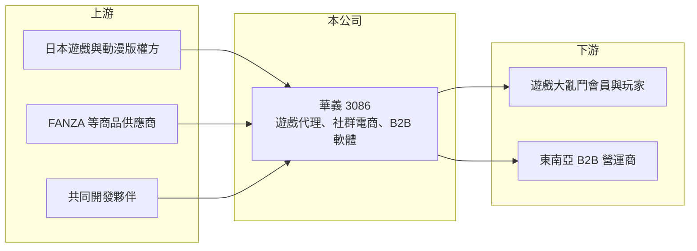

# 3086 華義

> 上櫃｜[[產業索引-文化創意業|文化創意業]]｜上市（櫃）日期 2004/03/29

# 第一章：企業模式與商業藍圖

> [!info] 撰寫說明
> 精簡版，由 Claude 依公開資料整理，架構比照 [[2330台積電]] 的四章研究，資料截至 2026-10-08。來源：富果研究 2026 年 8 月法說會整理、Goodinfo 年度經營績效頁、櫃買中心開放資料（基本資料、2026 年第二季資產負債與綜合損益、每月營收）。公開資料有限，法說會整理為 AI 摘要，數字請以公司公告為準。#待校對

本章拆解華義國際數位娛樂（股票代號：3086，以下簡稱華義）的商業模式。華義是台灣早期的線上遊戲代理商，近年營收規模縮小到每年 1 億至 2.5 億元，正嘗試從單純的遊戲代理轉型為平台、電商與 B2B 技術供應並行的數位娛樂公司。

- **核心業務：** 華義成立於 1993 年，2004 年上櫃，早年以代理日系線上遊戲聞名（代表作品待校對）。依 2026 年 8 月法說會，目前業務分成三塊：一是以「遊戲大亂鬥」為核心、已整合「Bana Bana」的社群與電商平台，2026 年 7 月底會員約 44.8 萬人；二是遊戲產品，包括代理、自研、共同開發與 [[IP聯運]]；三是透過子公司 LuckOrigin 經營的 B2B 遊戲軟體技術供應，品牌為 LuckMesh。
- **營收結構：** 公司未揭露各業務的營收比重。[[毛利率]]由 2021 年的 75.7% 降到 2025 年的 46.0%，2026 年上半年約 28%（櫃買中心資料），反映營收組合由高毛利的遊戲營運，轉向需要進貨成本的電商與代理分潤（推估）。
- **營運據點：** 總部位於台北內湖。遊戲產品的重心正由台灣轉向海外，例如《三國志：王戰》東南亞版預計 2026 年 9 月上市；電商自 2025 年 10 月起與日本 FANZA 合作，販售動漫與周邊商品。
- **長期方向：** 公司表示未來將以自製 IP 為主，減少對外部聯名 IP 的依賴，並計畫重製華義的經典 IP。B2B 業務首要市場是東南亞，下一步目標為美洲。這代表華義想把收入來源從「靠單款代理遊戲」轉為「平台會員、電商與軟體授權」的組合，但各項新業務都還在起步階段。
- **股本特色：** 2026 年 4 月 20 日起，華義的股票面額由 10 元改為 1 元，實收資本額約 2.73 億元。面額變更後每股數字（EPS、每股淨值）與過去不能直接比較。

# 第二章：護城河深度與競爭優勢

華義的護城河相當薄弱，目前的競爭力主要來自長期累積的日本遊戲與動漫合作關係，以及社群平台的會員基礎。

- **競爭優勢：** 華義長期與日本遊戲、動漫版權方合作，熟悉日系內容的授權流程，這讓它能取得《攻殼機動隊》（2026 年 5 月新增）等知名 IP 的聯運合作，也是與 FANZA 合作電商的基礎。社群平台約 44.8 萬會員、Facebook 粉絲團約 56 萬人，提供了推廣新遊戲與商品的自有流量。
- **主要對手：** 遊戲代理與發行方面，面對 [[6180橘子]]、[[5478智冠]] 等大型發行商，以及直接來台營運的海外遊戲公司；電商方面則面對各類動漫周邊通路與大型電商平台。B2B 遊戲軟體供應在東南亞同樣有眾多國際供應商。
- **觀察重點：** 2021 年營業利益率曾達 38.6%，顯示單款成功作品就能讓公司大幅獲利；但 2024 年後本業轉為虧損。觀察重點在於自研作品能否成功、B2B 授權能否取得第一批付費客戶，以及電商營收能否達到足以支撐費用的規模。

# 第三章：財務體質與盈利規模

資料日期：2026-10-08，表格是撰寫當時的快照；最新月營收、毛利率、累計 EPS 由自動排程寫在本筆記的屬性欄位（月營收、毛利率、累計EPS 等）。#待校對

本章用多年度數據檢視華義轉型期的獲利狀況。2025 年以前的 EPS 以面額 10 元計算。

| 年度 | 營收（新台幣） | [[毛利率]] | [[營業利益率]] | EPS（元） | [[ROE]] |
|---|---|---|---|---|---|
| 2019 | 1.23 億 | 51.4% | -7.16% | -0.97 | -10.2% |
| 2020 | 1.16 億 | 64.3% | 1.54% | 0.04 | 0.33% |
| 2021 | 2.48 億 | 75.7% | 38.6% | 4.80 | 34.5% |
| 2022 | 1.47 億 | 66.4% | 13.8% | 1.65 | 11.6% |
| 2023 | 1.41 億 | 65.7% | 18.2% | 1.41 | 10.3% |
| 2024 | 1.50 億 | 51.0% | -0.9% | 0.67 | 5.12% |
| 2025 | 1.59 億 | 46.0% | -13.1% | -0.62 | -5.89% |
| 2026 上半年 | 0.695 億 | 28.0% | -32.3% | -0.06（面額 1 元） | 不適用（半年） |

- **營收規模：** 營收在 1 億至 2.5 億元之間，2021 至 2025 年年複合成長率約 -10.5%（推算）。依月營收資料，2026 年 1 至 8 月累計約 0.86 億元，低於去年同期的 1.06 億元。
- **獲利：** 2021 至 2023 年因代理遊戲表現良好，連續三年本業獲利；2024 年起毛利率下滑、費用增加，2025 年營業利益率 -13.1%。2021 至 2025 年平均 ROE 約 11.1%（推算），但主要由 2021 年單一年度拉高，近兩年 ROE 已轉為個位數或負值。
- **財務特色：** 2026 年第二季底總資產約 3.38 億元、負債僅約 0.32 億元、股東權益約 3.06 億元，幾乎沒有借款，帳上資金足以支撐數年的轉型投入。Goodinfo 統計歷年一般平均現金股利約 0.26 元（面額變更前），配息並不穩定。

**[[ROIC]] 與 [[WACC]]：** 以獲利較好的 2023 年估算，營業利益約 0.26 億元（1.41 億元 × 18.2%），稅後約 0.21 億元，以目前股東權益約 3.06 億元作為投入資本（無有息負債），ROIC 約 6.7%（推算）；2025 年與 2026 年上半年本業虧損，ROIC 為負。WACC 假設公債 1.75%、市場風險溢酬 6%、β 取 1.0（小型遊戲股常見值，假設），因無借款，WACC 約 7.75%（推算）。即使在好年份，ROIC 也只接近資金成本，近年則明顯低於，代表華義目前尚未建立能長期創造價值的商業模式，轉型成果是未來的關鍵。

# 第四章：總體風險與地緣政治

華義的風險集中在轉型執行與營收規模過小。

- **產業週期：** 代理遊戲的營收取決於合約與作品壽命。2026 年 7 月代理遊戲《妖界黃昏》因合約到期停運，就是代理模式收入不穩定的例子。
- **營運風險：** 新業務（電商、B2B、自研）同時推進，但每一項的規模都不大，費用卻先發生，短期內可能持續虧損。電商依賴日本合作夥伴與授權商品，合作條件變動會直接影響營收。
- **其他風險：** B2B 遊戲軟體供應採離岸執照經營，所涉及的各國遊戲與線上娛樂法規差異大，若相關產品涉及博弈類內容（推估），法規風險會更高。日圓匯率則影響日系商品的進貨成本。

# 專有名詞解析

## 金融

- **[[面額變更]]**：公司把每股面額由 10 元改為 1 元等其他金額，股數相應增加，每股盈餘與每股淨值的數字會同步變小。
- **[[ROIC]]**：投入資本報酬率，稅後營業利益除以股東權益加有息負債，衡量本業運用資本的效率。
- **[[WACC]]**：加權平均資金成本，股東與債權人要求報酬的加權平均，ROIC 高於它才代表創造價值。

## 產業

- **[[IP聯運]]**：遊戲營運商取得知名動漫或品牌授權，在自家遊戲或平台中推出聯名內容，雙方分享營收。
- **[[遊戲IP]]**：遊戲的智慧財產，包括角色、世界觀與名稱，可改編成續作、手機遊戲或授權給其他廠商使用。
- **[[代理商]]**：取得原廠授權，在特定地區銷售或營運產品的公司，收入取決於代理合約條件與期限。

# 核心供應鏈

- 上游：日本遊戲與動漫版權方、電商合作夥伴 FANZA、共同開發團隊。
- 下游／客戶：遊戲大亂鬥與 Bana Bana 平台會員、遊戲玩家、東南亞 B2B 遊戲營運商。
- 同業：[[6180橘子]]、[[5478智冠]]、[[4946辣椒]]。

## 最新新聞
<!-- news:start -->
<!-- news:end -->

## 相關連結
- [公開資訊觀測站](https://mopsov.twse.com.tw/mops/web/t05st03?step=1&firstin=1&co_id=3086)
- [Goodinfo](https://goodinfo.tw/tw/StockDetail.asp?STOCK_ID=3086)
- [Yahoo 股市](https://tw.stock.yahoo.com/quote/3086)
- [鉅亨網新聞](https://www.cnyes.com/twstock/3086/news)
