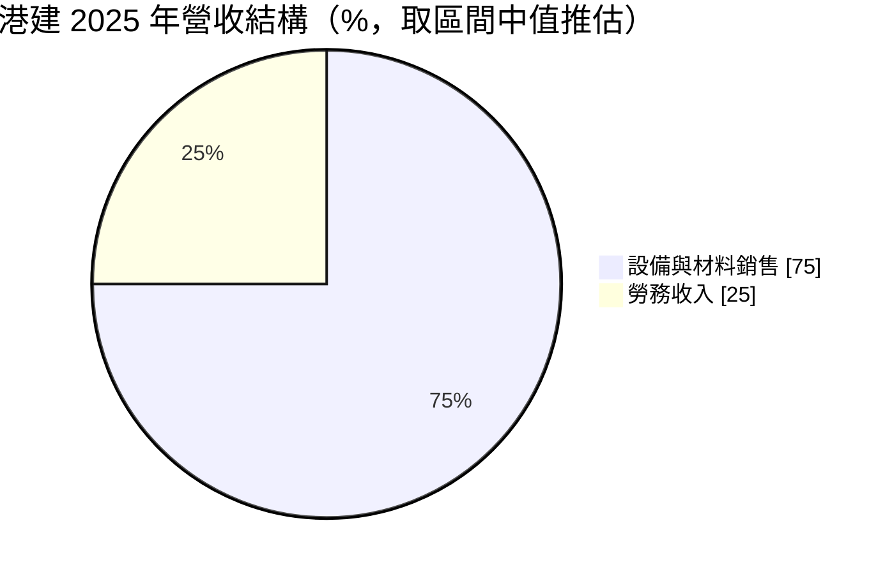
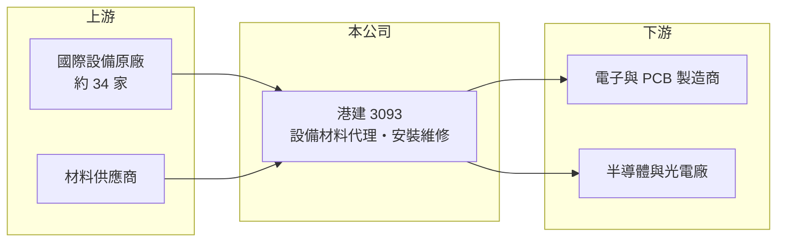

# 3093 港建

> 上櫃｜[[產業索引-其他電子業|其他電子業]]｜上市（櫃）日期 2005/06/17

# 第一章：企業模式與商業藍圖

> [!info] 撰寫說明
> 精簡版，由 Claude 依公開資料整理，架構比照 [[2330台積電]]，資料截至 2026-10-07。來源：nstock.tw 港建公司概況、富果研究港建 2025 年 8 月法說會整理、老虎證券轉載王氏港建公告。#待校對

港建是代理國際設備與材料、並提供安裝維修服務的經銷商，客戶以電子製造業為主。

- **核心業務：** 公司 1977 年成立，擔任高科技產業設備、原材料的[[總代理]]與經銷商，並提供安裝、維修等客戶服務；依法說會資料共代理 34 家國際設備供應商，服務五大產業領域。
- **營收結構：** 依 2025 年法說會，設備與材料銷售約占營收 70% 至 80%，勞務收入約占 20% 至 30%。
- **營運據點：** 總部位於桃園蘆竹，中國區營收約占一成；母公司為香港上市的王氏港建國際（WKK International）。
- **長期方向：** 公司認為客戶為了 [[AI伺服器]]、[[低軌衛星]]、高速運算與 VR/AR 產品持續擴充高階產能，未來兩至三年營運可望隨之成長。

# 第二章：護城河深度與競爭優勢

代理商的價值在於原廠授權、技術服務能力與客戶關係，而非自有技術。

- **競爭優勢：** 長期代理多家國際設備原廠，並具備裝機與維修團隊，能提供客戶從採購到售後的整套服務；勞務收入占比兩至三成，提供較穩定的現金來源。
- **主要對手：** 其他電子設備代理商與原廠直營據點，例如[[5434崇越]]等代理通路（推估，未查得公司自述的對手名單）。
- **觀察重點：** 原廠代理權是否穩定、先進製程設備的出貨與認證進度，以及客戶擴產週期能否延續。

# 第三章：財務體質與盈利規模

資料日期：2026-10-07，表格是撰寫當時的快照；最新月營收、毛利率、累計 EPS 由自動排程寫在本筆記的屬性欄位（月營收、毛利率、累計EPS 等）。#待校對

港建的營收隨客戶設備採購週期大幅波動，2025 年起明顯回升。

- **營收規模：** 2025 年全年營收 18.65 億元；2026 年 1 至 8 月累計 11.36 億元，6 月單月 1.94 億元、年增 92.31%。
- **獲利：** 2025 年全年 EPS 1.22 元；2026 年第二季 EPS 0.33 元、[[毛利率]] 27.45%。2025 年上半年營收年增 156%，EPS 0.65 元。
- **財務特色：** 2025 年度配發現金股利 1.15 元，過去五年平均現金股利 2.67 元，配息率高；法說會提到先進製程設備需半年以上認證期，營收認列時點會影響單季毛利率。

# 第四章：總體風險與地緣政治

港建的風險主要來自客戶資本支出週期與代理關係。

- **產業週期：** 營收取決於電子、PCB 與半導體客戶的擴產計畫，客戶縮減[[CapEx]]時設備銷售會快速下滑。
- **營運風險：** 代理權若被原廠收回或改為直營，營收會直接流失；設備驗收期長，也讓單季營收與毛利率起伏較大。
- **其他風險：** 進口設備以外幣計價，有匯率風險；中國區營收約一成，受兩岸與出口管制政策影響。

# 專有名詞解析

## 應用

- **[[AI伺服器]]**：搭載 GPU 或 AI 加速晶片、用於訓練與推論的高效能伺服器。

## 金融

- **[[CapEx]]**：資本支出，企業購置廠房、機器設備等長期資產的支出。

## 產業

- **[[總代理]]**：取得國外原廠授權，在特定地區負責銷售與售後服務的通路商。
- **[[低軌衛星]]**：在距地表約 2,000 公里以下軌道運行的通訊衛星群，帶動地面站與衛星零組件需求。

# 核心供應鏈

- 上游：國際設備與材料原廠，代理品牌名單未查得
- 下游／客戶：高科技電子製造業，客戶名稱未揭露
- 同業：[[5434崇越]]等設備材料代理商（推估）

## 最新新聞
<!-- news:start -->
<!-- news:end -->

## 相關連結
- [公開資訊觀測站](https://mopsov.twse.com.tw/mops/web/t05st03?step=1&firstin=1&co_id=3093)
- [Goodinfo](https://goodinfo.tw/tw/StockDetail.asp?STOCK_ID=3093)
- [Yahoo 股市](https://tw.stock.yahoo.com/quote/3093)
- [鉅亨網新聞](https://www.cnyes.com/twstock/3093/news)
