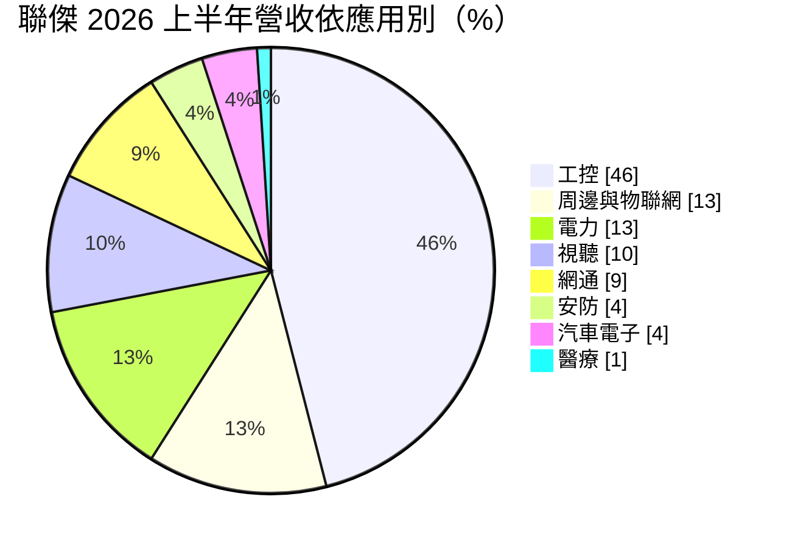
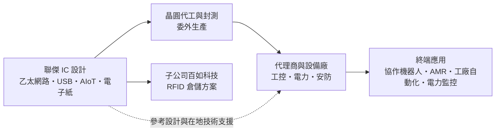
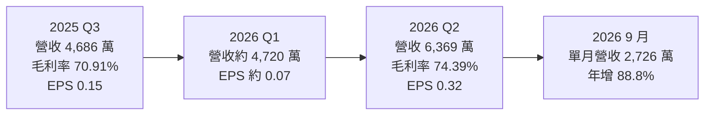
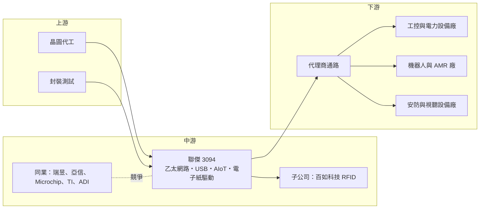

# 3094 聯傑

> 上市｜[[產業索引-半導體業|半導體業]]｜上市（櫃）日期 2007/08/06

# 第一章：企業模式與商業藍圖

> [!info] 撰寫說明
> 本文由 Claude 依公開資料整理，架構比照 [[2330台積電]] 的四章研究，資料截至 2026-10-07。財務數字來源：富果研究 2025 年 12 月與 2026 年 8 月法說整理、HiStock 月營收資料、優分析、鉅亨網公司基本資料；產業描述為整理性內容，尚未逐條比對原始文件。#待校對

在評估單一個股的長期投資價值時，首要步驟是拆解企業的底層獲利邏輯。本章針對聯傑國際股份有限公司（股票代號：3094，以下簡稱聯傑）的商業模式進行定性分析，說明一家年營收不到 2 億元的小型網路 IC 設計公司，如何靠工控利基市場維持七成以上的毛利率，以及它押注[[單對乙太網路]]的長期布局。

## 一、核心定位：工控利基市場的網路晶片設計公司

聯傑成立於 1996 年 8 月，2007 年上市，董事長為郝挺，資本額約 8.31 億元。公司是 [[Fabless]] 網路 IC 設計公司，最早以網路控制晶片、數據機晶片組與 USB 晶片起家。

聯傑的產品規模不大，但定位很清楚：不和 [[2379瑞昱]]、Broadcom 這類大廠在消費性網通晶片拚量，而是專注在工業自動化、電力、安防等「量小、品項多、生命週期長」的利基市場。這類市場有兩個特性：

* **產品生命週期長：** 工控設備一款產品可能銷售十年以上，客戶需要晶片長期供貨，不輕易更換設計。
* **重視技術支援：** 工控客戶多為中小型設備廠，需要晶片商提供參考設計與在地技術服務，價格不是唯一考量。

## 二、終端應用與產品板塊：工控將近一半

依富果研究整理的 2026 年 8 月法說會內容，2026 年上半年的營收結構如下：

聯傑把產品分成四大軸線：

* **網路控制晶片：** 10/100/1000Mbps [[乙太網路]]收發器與控制器，以及 USB 介面晶片，是營收主力。應用於工業自動化設備、電力監控、協作機器人與無人搬運車。
* **[[AIoT]] 晶片：** 以 [[RISC-V]] 架構為基礎的邊緣運算 AI [[SoC]]。
* **[[電子紙]]驅動晶片：** 36 段可級聯式電子紙驅動 IC，用於電子標籤與低功耗顯示。
* **視頻解碼晶片：** 720H 與 960H 解析度的類比影像解碼器，主要用於安防監控。

另外，子公司百如科技專注 [[RFID]] 解決方案，已導入一級廠商的倉儲系統，預計 2026 年下半年推出自主研發的讀取器。

## 三、資本轉化邏輯：小營收、高毛利、靠業外撐獲利

* **高毛利、低營收：** 2025 年前三季[[毛利率]] 76.19%，2026 年上半年約 74.6%，毛利率遠高於一般 IC 設計公司。但營收規模小，2025 年全年營收僅約 1.88 億元，研發與管理費用占營收比重高，營業利益率只有約一成。
* **營運槓桿明顯：** 依優分析整理，2026 年上半年營業利益率提升 6.33 個百分點到 12.54%，主要來自營收成長後研發費用被攤薄，而不是產品漲價。
* **業外收益占比高：** 2026 年上半年淨利率約 29%，高於營業利益率，代表利息、投資等業外收益對獲利貢獻大（推估，業外明細未查得）。

## 四、企業長期藍圖：單對乙太網路與機器人

* **[[單對乙太網路]]（SPE）：** 聯傑開發 10BASE-T1S 實體層晶片，只用一對雙絞線就能傳輸資料，適合機器人關節、工業感測器與車用網路等空間受限的場合。依優分析整理，內部測試節點超過 250 個，遠高於規格要求，預計 2026 年下半年[[Tape-out]]。公司預期 SPE 將成為 2027 年以後的主要成長動能，並引述 SPE 市場至 2034 年年複合成長率約 13.6%。
* **機器人與工業自動化：** 依 2025 年 12 月法說，公司預期工控產業年複合成長約 15%，協作機器人 2026 至 2030 年年複合成長超過 25%，無人搬運車超過 30%。
* **轉向 AI 應用導向：** 產品策略由「資料導向 IC」轉向「AI 應用導向 IC」，並配合歐盟網路韌性法案（CRA）等資安法規要求。

# 第二章：護城河深度與競爭優勢

在長期價值投資中，「護城河」指企業抵禦競爭、維持超額利潤的保護機制。本章分析聯傑在工控網路晶片市場的競爭地位，以及一家小型設計公司能守住多少。

## 一、聯傑護城河的核心組成要素

聯傑規模小，護城河屬於「窄護城河」，主要由以下三個要素組成：

* **1. 工控設計導入的黏著度：** 工控設備一旦採用某顆網路晶片，通常整個產品生命週期都不會更換，聯傑可以持續出貨多年。七成以上的毛利率反映的正是這種長尾需求。
* **2. 降低客戶轉換成本的產品設計：** 依優分析整理，聯傑 10BASE-T1S 晶片的設計重點是讓客戶「只需少量軟體修改就能替換通訊晶片」，用低轉換成本搶既有市場。
* **3. 在地技術支援：** 公司強調貼身服務與本地技術支援，中小型設備廠需要這種服務，國際大廠往往不願意投入。

## 二、全球主要競爭對手格局

| 對手 | 定位 | 對聯傑的威脅 |
|---|---|---|
| Microchip、Texas Instruments、Analog Devices | 國際類比與工控晶片大廠 | 產品線完整，掌握大型工控客戶，SPE 也積極布局 |
| [[2379瑞昱]] | 台灣網通晶片大廠 | 乙太網路晶片規模與成本優勢明顯 |
| [[3169亞信]] | 台灣乙太網路控制晶片與工控網通晶片廠 | 在工控乙太網路與 USB 轉網路晶片直接競爭 |
| WIZnet 等專業網路晶片廠 | 嵌入式乙太網路晶片 | 在物聯網與工控市場重疊 |
| 中國大陸 IC 設計公司 | 低價網路與介面晶片 | 法說會點名的低價競爭與國產替代風險 |

## 三、優勢轉化：哪些市場守得住、哪些守不住

* **守得住：** 已導入多年的工控與電力設備、需要長期供貨與技術支援的中小型客戶。
* **守不住：** 中國市場的標準型網路晶片。中國 IC 設計公司以低價搶市並受惠國產替代政策，聯傑規模小，難以打價格戰。
* **觀察重點：** 一是 10BASE-T1S 晶片能否如期在 2026 年下半年完成 Tape-out，並在 2027 至 2028 年取得設計導入；二是機器人與工控復甦能否持續帶動營收；三是存貨倍增後能否順利去化。

# 第三章：財務體質與盈利規模

資料日期：2026-10-07。數字取自法說會整理與月營收資料，表格是撰寫當時的快照；最新月營收、毛利率、累計 EPS 由自動排程寫在本筆記的屬性欄位（月營收、毛利率、累計EPS 等）。#待校對

財務報表是檢驗護城河是否真實存在的最終標準。本章用三率、ROE、現金流與資本報酬，檢視聯傑這類小型高毛利 IC 設計公司的獲利結構。

## 一、獲利能力的基石：三率

| 項目 | 2025 全年 | 2025 前三季 | 2025 Q3 | 2026 Q1 | 2026 Q2 | 2026 上半年 |
|---|---|---|---|---|---|---|
| 營收（新台幣） | 約 1.88 億 | 1.45 億 | 4,686 萬 | 約 4,720 萬（推算） | 6,369 萬 | 1.11 億 |
| [[毛利率]] | 未查得 | 76.19% | 70.91% | 未查得 | 74.39% | 74.64% |
| [[營業利益率]] | 未查得 | 未查得 | 未查得 | 未查得 | 未查得 | 12.54% |
| [[淨利率]] | 未查得 | 約 9.3%（推算） | 約 26.6%（推算） | 未查得 | 未查得 | 29.29% |
| EPS（元） | 未查得 | 0.16 | 0.15 | 約 0.07（推算） | 0.32 | 0.39 |

註：2025 年全年營收由月營收加總（1.878 億元）；2026 年第一季營收與 EPS 由上半年減第二季推算。2026 年上半年淨利率依本筆記屬性欄位的財報資料。

* **[[毛利率]]：** 長期維持在 70% 以上。依優分析整理，2026 年上半年毛利率較去年同期下降約 4.5 個百分點，原因是 2025 年缺貨時的特殊價格環境回歸正常。
* **營收動能：** 2026 年 4 月起月營收連續年增，9 月單月 2,726 萬元、年增 88.8%，1 至 9 月累計約 1.81 億元，已接近 2025 年全年。
* **獲利波動大：** 營收規模小，單季營收差距幾百萬元就會讓 EPS 大幅變動，2025 年上半年 EPS 僅 0.01 元，第三季則有 0.15 元。

## 二、[[ROE]]：資本效率

聯傑資本額約 8.31 億元，年營收不到 2 億元，股本相對營收偏大，加上帳上資產有相當比例為現金與投資，ROE 長期偏低（推估，具體數值未查得）。2025 年度配發現金股利 0.25 元。

## 三、資本支出與自由現金流

* **[[CapEx]]：** IC 設計公司資本支出主要是研發設備與光罩，10BASE-T1S 的 Tape-out 會帶來一次性的光罩與驗證費用（推估）。
* **存貨：** 依優分析整理，2025 年第一季到 2026 年第二季之間存貨約倍增，可能是為需求回升主動備貨，也可能代表部分需求轉弱，需要追蹤。
* **股利政策：** 依 2026 年 8 月法說，聯傑自 2007 年上市以來平均盈餘配發率維持在 80% 以上。

## 四、[[ROIC]] 與 [[WACC]]：價值創造利差

聯傑的營業利益率約一成、投入資本中現金比重高，以本業計算的 ROIC 推估低於或接近 WACC（推估，具體數值未查得）。要創造明顯的價值，營收規模需要放大到能充分攤提研發費用，SPE 新產品正是這個關鍵。

# 第四章：總體風險與地緣政治

任何企業都無法脫離宏觀環境獨立存在。本章分析聯傑未來必須面對的地緣政治、產業週期與營運風險。

## 一、地緣政治風險

* **中國國產替代：** 法說會指出中國大陸 IC 設計公司的低價競爭與國產替代是主要風險，中國工控客戶可能改用本土晶片。
* **非中國供應鏈需求：** 反過來說，歐美與日本工控客戶要求供應鏈分散，台灣晶片商可能受惠（推估）。
* **法規要求：** 歐盟網路韌性法案（CRA）要求聯網產品符合資安規範，晶片商需要投入資源配合認證。

## 二、產業週期與市場結構風險

* **工控[[庫存調整]]：** 2023 至 2025 年工控產業經歷長時間庫存去化，聯傑營收停滯。目前的成長來自庫存去化結束與機器人需求，若工業景氣再度轉弱，營收可能回落。
* **[[長鞭效應]]：** 工控晶片多經代理商銷售，需求變化經過多層放大，小公司對訂單波動的承受力較弱。

## 三、營運環境的隱性風險

* **規模過小：** 年營收不到 2 億元，研發資源有限，難以同時推進多條新產品線。
* **新產品時程：** 10BASE-T1S 預計 2026 年下半年 Tape-out，工控與機器人客戶通常需要一年以上驗證，實際營收貢獻可能要到 2027 至 2028 年。
* **存貨風險：** 存貨倍增若未能順利去化，可能需要提列跌價損失。

## 四、科技演進風險

工業網路正從傳統的現場匯流排轉向[[乙太網路]]，並發展出 [[TSN]]（時間敏感網路）與單對乙太網路等新標準。這是聯傑的機會，但國際大廠也在積極布局，標準化之後可能出現大廠主導、價格快速下滑的情況。聯傑能否在標準成形初期取得足夠的設計導入，決定它能否從這波技術轉換中受益。

# 專有名詞解析

## 半導體

- **[[Fabless]]**：無晶圓廠的 IC 設計公司，只負責設計與銷售，生產委由晶圓代工廠。
- **[[SoC]]**：系統單晶片，把處理器、記憶體控制、介面等多種功能整合在同一顆晶片上。
- **[[RISC-V]]**：開放原始碼的處理器指令集架構，不需支付授權金，近年在物聯網與客製化晶片快速普及。
- **[[Tape-out]]**：晶片設計完成、交付晶圓廠製作光罩並試產的里程碑，代表設計進入實體驗證階段。

## 應用

- **[[AIoT]]**：人工智慧與物聯網的結合，讓聯網裝置在本地具備 AI 判斷能力。
- **[[RFID]]**：無線射頻辨識，以電波讀取標籤資料，用於倉儲、物流與門禁管理。

## 金融

- **[[配發率]]**：現金股利占每股盈餘的比例，代表公司把多少獲利以股利發還股東。
- **[[長鞭效應]]**：終端需求的小幅變動，沿供應鏈往上游傳遞時被逐級放大，造成上游庫存與訂單劇烈波動。

## 產業

- **[[乙太網路]]**：最普遍的有線區域網路技術，工業設備也逐漸以乙太網路取代傳統匯流排。
- **[[單對乙太網路]]**：只用一對雙絞線傳輸資料的乙太網路技術，英文簡稱 SPE，適合機器人、感測器與車用等空間受限場合。
- **[[TSN]]**：時間敏感網路，讓乙太網路具備精準時間同步與確定性傳輸能力，用於工業自動化與車用。
- **[[電子紙]]**：反射式、低功耗的顯示技術，畫面不變時幾乎不耗電，用於電子書與電子貨架標籤。
- **[[AMR]]**：自主移動機器人，可自行規劃路徑在工廠或倉庫中搬運物品。
- **[[庫存調整]]**：下游客戶與代理商減少備貨、消化既有庫存的期間，上游供應商的訂單會明顯減少。

# 核心供應鏈

## 1. 上游：晶圓代工與封測
- 公司未揭露代工與封測夥伴

## 2. 中游：聯傑本身與同業
- 子公司：百如科技（RFID 倉儲方案）
- 台灣同業：[[2379瑞昱]]、[[3169亞信]]
- 國際同業：Microchip、Texas Instruments、Analog Devices、WIZnet

## 3. 下游：應用市場
- 工控與電力設備：工廠自動化、電力監控（占上半年營收 59%）
- 機器人：協作機器人、自主移動機器人與無人搬運車
- 周邊物聯網、視聽、網通、安防與汽車電子設備廠
- 金融支付與工廠物料追蹤（電子紙與 RFID 應用）

## 最新新聞
<!-- news:start -->
<!-- news:end -->

## 相關連結
- [公開資訊觀測站](https://mopsov.twse.com.tw/mops/web/t05st03?step=1&firstin=1&co_id=3094)
- [Goodinfo](https://goodinfo.tw/tw/StockDetail.asp?STOCK_ID=3094)
- [Yahoo 股市](https://tw.stock.yahoo.com/quote/3094)
- [鉅亨網新聞](https://www.cnyes.com/twstock/3094/news)
