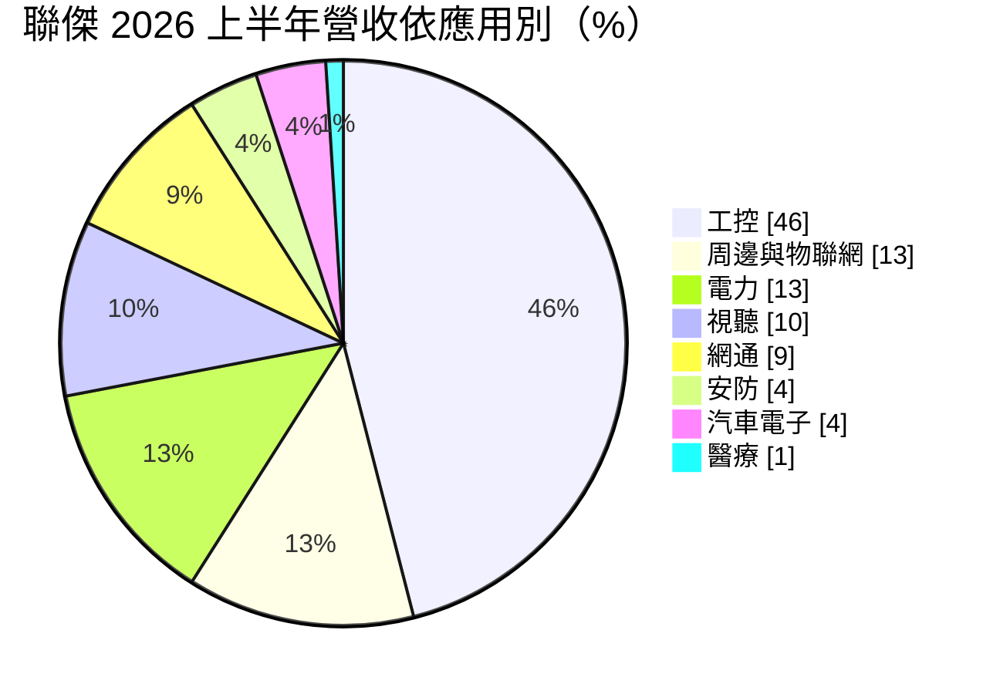
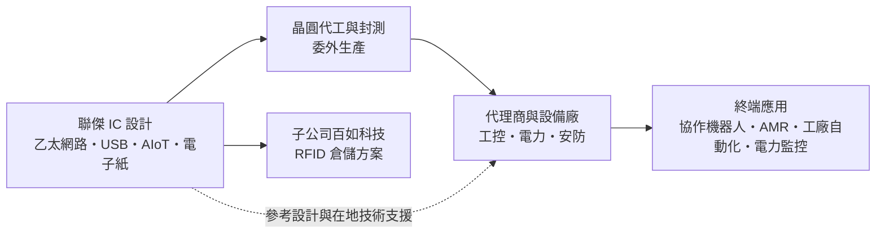
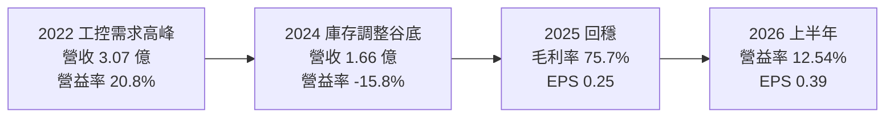
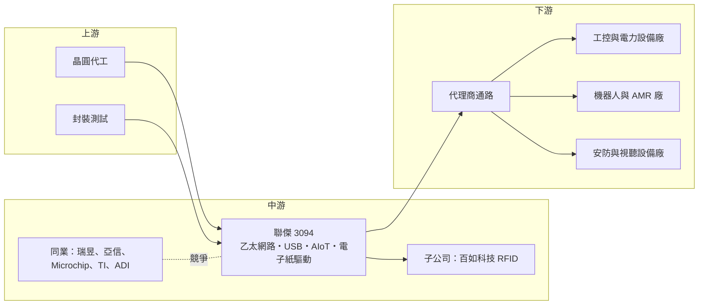

# 3094 聯傑

> 上市｜[[產業索引-半導體業|半導體業]]｜上市（櫃）日期 2007/08/06

# 第一章：企業模式與商業藍圖

> [!info] 撰寫說明
> 本文由 Claude 依公開資料整理，架構比照 [[2330台積電]] 的四章研究，資料截至 2026-10-08。財務數字來源：Goodinfo 台灣股市資訊網年度經營績效（2020 至 2025 年）、富果研究 2025 年 12 月與 2026 年 8 月法說整理、HiStock 月營收資料、優分析、鉅亨網公司基本資料；產業描述為整理性內容，尚未逐條比對原始文件。#待校對

在評估單一個股的長期投資價值時，首要步驟是拆解企業的底層獲利邏輯。本章針對聯傑國際股份有限公司（股票代號：3094，以下簡稱聯傑）的商業模式進行定性分析，說明一家年營收不到 2 億元的小型網路 IC 設計公司，如何靠工控利基市場維持七成以上的毛利率，以及它押注[[單對乙太網路]]的長期布局。

## 一、核心定位：工控利基市場的網路晶片設計公司

聯傑成立於 1996 年 8 月，2007 年上市，董事長為郝挺，資本額約 8.31 億元。公司是 [[Fabless]] 網路 IC 設計公司，最早以網路控制晶片、數據機晶片組與 USB 晶片起家。

聯傑的產品規模不大，但定位很清楚：不和 [[2379瑞昱]]、Broadcom 這類大廠在消費性網通晶片拚量，而是專注在工業自動化、電力、安防等「量小、品項多、生命週期長」的利基市場。這類市場有兩個特性：

* **產品生命週期長：** 工控設備一款產品可能銷售十年以上，客戶需要晶片長期供貨，不輕易更換設計。這種長尾需求讓聯傑的產品可以持續出貨多年，是高毛利率的基礎。
* **重視技術支援：** 工控客戶多為中小型設備廠，需要晶片商提供參考設計與在地技術服務，價格不是唯一考量。這讓聯傑能以服務彌補規模上的劣勢，在國際大廠照顧不到的中小型客戶中建立地位。

## 二、終端應用與產品板塊：工控將近一半

依富果研究整理的 2026 年 8 月法說會內容，2026 年上半年的營收結構如下：

聯傑把產品分成四大軸線：

* **網路控制晶片：** 10/100/1000Mbps [[乙太網路]]收發器與控制器，以及 USB 介面晶片，是營收主力。應用於工業自動化設備、電力監控、協作機器人與無人搬運車。
* **[[AIoT]] 晶片：** 以 [[RISC-V]] 架構為基礎的邊緣運算 AI [[SoC]]。這條產品線讓聯傑從單純的連網晶片，延伸到具備運算能力的邊緣裝置晶片。
* **[[電子紙]]驅動晶片：** 36 段可級聯式電子紙驅動 IC，用於電子標籤與低功耗顯示。電子紙在電子貨架標籤與低功耗顯示的應用持續擴大，是聯傑在工控以外的成長來源之一。
* **視頻解碼晶片：** 720H 與 960H 解析度的類比影像解碼器，主要用於安防監控。安防監控的類比攝影機市場逐漸被網路攝影機取代，這條產品線屬於成熟期產品。

另外，子公司百如科技專注 [[RFID]] 解決方案，已導入一級廠商的倉儲系統，預計 2026 年下半年推出自主研發的讀取器。

## 三、資本轉化邏輯：小營收、高毛利、靠業外撐獲利

* **高毛利、低營收：** 2025 年前三季[[毛利率]] 76.19%，2026 年上半年約 74.6%，毛利率遠高於一般 IC 設計公司。但營收規模小，2025 年全年營收僅約 1.88 億元，研發與管理費用占營收比重高，營業利益率只有約一成。
* **營運槓桿明顯：** 依優分析整理，2026 年上半年營業利益率提升 6.33 個百分點到 12.54%，主要來自營收成長後研發費用被攤薄，而不是產品漲價。這說明聯傑的獲利對營收規模高度敏感，營收只要回升，營業利益率就會明顯改善。
* **業外收益占比高：** 2026 年上半年淨利率約 29%，高於營業利益率，代表利息、投資等業外收益對獲利貢獻大（推估，業外明細未查得）。評估聯傑的本業競爭力時，應以營業利益率為準，而不是看淨利率。

## 四、企業長期藍圖：單對乙太網路與機器人

* **[[單對乙太網路]]（SPE）：** 聯傑開發 10BASE-T1S 實體層晶片，只用一對雙絞線就能傳輸資料，適合機器人關節、工業感測器與車用網路等空間受限的場合。依優分析整理，內部測試節點超過 250 個，遠高於規格要求，預計 2026 年下半年[[Tape-out]]。公司預期 SPE 將成為 2027 年以後的主要成長動能，並引述 SPE 市場至 2034 年年複合成長率約 13.6%。
* **機器人與工業自動化：** 依 2025 年 12 月法說，公司預期工控產業年複合成長約 15%，協作機器人 2026 至 2030 年年複合成長超過 25%，無人搬運車超過 30%。機器人與自動化設備需要大量的網路連線元件，這是聯傑長期最主要的成長方向。
* **轉向 AI 應用導向：** 產品策略由「資料導向 IC」轉向「AI 應用導向 IC」，並配合歐盟網路韌性法案（CRA）等資安法規要求。這個轉向反映工控設備正逐步加入 AI 與資安功能，晶片商必須跟著升級產品。

# 第二章：護城河深度與競爭優勢

在長期價值投資中，「護城河」指企業抵禦競爭、維持超額利潤的保護機制。本章分析聯傑在工控網路晶片市場的競爭地位，以及一家小型設計公司能守住多少。

## 一、聯傑護城河的核心組成要素

聯傑規模小，護城河屬於「窄護城河」，主要由以下三個要素組成：

* **1. 工控設計導入的黏著度：** 工控設備一旦採用某顆網路晶片，通常整個產品生命週期都不會更換，聯傑可以持續出貨多年。七成以上的毛利率反映的正是這種長尾需求。
* **2. 降低客戶轉換成本的產品設計：** 依優分析整理，聯傑 10BASE-T1S 晶片的設計重點是讓客戶「只需少量軟體修改就能替換通訊晶片」，用低轉換成本搶既有市場。降低轉換成本是小廠搶進新市場的常見策略，能讓客戶在不大幅改動設計的情況下試用聯傑的晶片。
* **3. 在地技術支援：** 公司強調貼身服務與本地技術支援，中小型設備廠需要這種服務，國際大廠往往不願意投入。這種服務模式需要長期累積的工程團隊，是聯傑與低價競爭者區隔的重要因素。

## 二、全球主要競爭對手格局

| 對手 | 定位 | 對聯傑的威脅 |
|---|---|---|
| Microchip、Texas Instruments、Analog Devices | 國際類比與工控晶片大廠 | 產品線完整，掌握大型工控客戶，SPE 也積極布局 |
| [[2379瑞昱]] | 台灣網通晶片大廠 | 乙太網路晶片規模與成本優勢明顯 |
| [[3169亞信]] | 台灣乙太網路控制晶片與工控網通晶片廠 | 在工控乙太網路與 USB 轉網路晶片直接競爭 |
| WIZnet 等專業網路晶片廠 | 嵌入式乙太網路晶片 | 在物聯網與工控市場重疊 |
| 中國大陸 IC 設計公司 | 低價網路與介面晶片 | 法說會點名的低價競爭與國產替代風險 |

## 三、優勢轉化：哪些市場守得住、哪些守不住

* **守得住：** 已導入多年的工控與電力設備、需要長期供貨與技術支援的中小型客戶。這些客戶重視的是供貨穩定與技術支援，而不是最低價格。
* **守不住：** 中國市場的標準型網路晶片。中國 IC 設計公司以低價搶市並受惠國產替代政策，聯傑規模小，難以打價格戰。
* **觀察重點：** 一是 10BASE-T1S 晶片能否如期在 2026 年下半年完成 Tape-out，並在 2027 至 2028 年取得設計導入；二是機器人與工控復甦能否持續帶動營收；三是存貨倍增後能否順利去化。這三點決定聯傑能否把營收規模擴大到足以充分攤提研發費用的水準。

# 第三章：財務體質與盈利規模

資料日期：2026-10-08。年度數字取自 Goodinfo 台灣股市資訊網的年度經營績效（合併報表），2026 年上半年取自富果研究法說整理與優分析，表格是撰寫當時的快照；最新月營收、毛利率、累計 EPS 由自動排程寫在本筆記的屬性欄位（月營收、毛利率、累計EPS 等）。#待校對

財務報表是檢驗護城河是否真實存在的最終標準。本章用多年度的三率、ROE、現金流與資本報酬，檢視聯傑這類小型高毛利 IC 設計公司的獲利結構。

## 一、獲利能力的基石：三率

| 年度 | 營收（億元） | [[毛利率]] | [[營業利益率]] | EPS（元） | [[ROE]] |
|---|---|---|---|---|---|
| 2021 | 2.83 | 71.1% | 19.9% | 0.85 | 6.67% |
| 2022 | 3.07 | 71.6% | 20.8% | 0.84 | 6.54% |
| 2023 | 2.43 | 67.5% | 6.18% | 0.61 | 4.84% |
| 2024 | 1.66 | 67.0% | -15.8% | 0.17 | 1.41% |
| 2025 | 1.88 | 75.7% | 約 0% | 0.25 | 2.00% |
| 2026 上半年 | 1.11 | 74.64% | 12.54% | 0.39 | 未查得 |

註：2020 年營收 2.34 億元、毛利率 67.1%、EPS 0.41 元，作為比較基準。2025 年營業利益依 Goodinfo 接近零。

聯傑的財務結構可以用「毛利率很高、營收太小、業外撐獲利」來概括。

第一，**毛利率長期在 67% 至 76%。** 即使在 2024 年營收大減的谷底，毛利率仍有 67%，代表工控利基晶片的定價能力穩定，客戶不會因景氣差而大幅砍價。這是聯傑最有價值的財務特徵。

第二，**營業利益率對營收高度敏感。** 營收 3 億元時營業利益率約兩成，營收掉到 1.7 億元時轉為 -15.8%。原因是研發與管理費用相對固定，年營收只有 2 億元上下，固定費用占比很高。這說明聯傑的問題不在於產品賺不賺錢，而在於營收規模不足以攤提費用。

第三，**淨利長期高於營業利益。** 2024 年營業虧損，EPS 仍有 0.17 元；2025 年營業利益接近零，EPS 0.25 元。推估來自帳上現金的利息與投資收益。這代表聯傑的 EPS 有相當比例不是來自本業，評估本業時應以營業利益為準。

## 二、[[ROE]]：資本效率

2021 至 2025 年的 ROE 分別為 6.67%、6.54%、4.84%、1.41%、2.00%，五年平均約 4.3%（推算），長期偏低。每股淨值五年來維持在 12 元至 13 元，股本約 8.31 億元，相對於 2 億元上下的年營收明顯偏大。

ROE 偏低的原因不是本業不賺錢，而是股東權益中有大量現金與投資，這些資產只賺取利息等級的報酬，稀釋了整體資本效率。2020 至 2025 年營收年複合成長率約 -4%（推算），營收沒有成長，也就沒有機會讓這些資本發揮更高的報酬。

## 三、資本支出與自由現金流

聯傑是 IC 設計公司，資本支出主要是研發設備與光罩，金額很小（推估，具體金額未查得），10BASE-T1S 的 Tape-out 會帶來一次性的光罩與驗證費用。在營業利益為正的年度，營業現金流大致可以轉為[[自由現金流]]。

依 2026 年 8 月法說，聯傑自 2007 年上市以來平均盈餘配發率維持在 80% 以上；2025 年度現金股利 0.25 元，與當年 EPS 0.25 元相當，配發率約 100%（推算）。經營層的資本配置習慣是高配息、保守經營，這讓股東能穩定拿回現金，但也代表公司沒有用大額資本推動成長。

## 四、[[ROIC]] 與 [[WACC]]：價值創造利差

**ROIC 推算：** 本文未查得來源直接揭露的 ROIC，因此用「稅後營業利益 ÷ 投入資本」推算。聯傑推估沒有大額有息負債，以股東權益近似投入資本。2025 年營業利益接近零，ROIC 約 0%（推算）。以 2022 年景氣較好時計算，營業利益約 0.64 億元（3.07 億元 × 20.8%），稅率 20% 下稅後約 0.51 億元，股東權益約 10.7 億元（每股淨值 12.89 元 × 約 0.83 億股），ROIC 約 4.8%（推算）。若扣除帳上現金，只計算實際營運資產，本業的報酬率會明顯較高，但本文未查得現金金額，無法精確計算。

**WACC 推算：** 以 CAPM 估算，假設台灣 10 年期公債殖利率約 1.75%、市場風險溢酬約 6%、β 值取小型利基 IC 設計公司常見的 0.8（本文未查得聯傑的 β 值，此為假設），股東要求報酬率約 1.75% + 0.8 × 6% = 6.55%。推估沒有有息負債，WACC 約 6.5%（推算）。

**解讀：** 以全部股東權益計算，聯傑過去五年的 ROIC 都低於約 6.5% 的 WACC，整體而言沒有為股東創造超額價值。問題的根源是營收規模太小，以及股東權益中閒置資金比重高。若 SPE 新產品能讓營收回到 3 億元以上，營業利益率回到兩成，同時維持高配息，ROIC 才有機會超過 WACC。

# 第四章：總體風險與地緣政治

任何企業都無法脫離宏觀環境獨立存在。本章分析聯傑長期必須面對的地緣政治、產業週期與營運風險，以及工業網路技術演進帶來的挑戰。

## 一、地緣政治風險

中國國產替代是聯傑在地緣政治上最直接的風險。依 2025 年 12 月法說會內容，中國大陸 IC 設計公司的低價競爭與國產替代是公司面臨的主要挑戰。中國工控設備廠在政策引導下，會逐步改用本土的網路晶片，聯傑在中國的標準型產品將持續承受價格壓力。

反過來說，供應鏈分散也可能帶來機會。歐美與日本的工控客戶為了降低對中國供應鏈的依賴，會尋找台灣等非中國的晶片來源，聯傑可能因此受惠（推估）。法規要求則是新的門檻：歐盟網路韌性法案（CRA）要求聯網產品符合資安規範，晶片商需要投入資源配合認證，這對規模小的聯傑是額外負擔，但也可能成為與低價競爭者區隔的條件。

## 二、產業週期與市場結構風險

工控產業的[[庫存調整]]週期對聯傑影響很大。2023 至 2025 年工控產業經歷長時間的庫存去化，聯傑營收由 2022 年的 3.07 億元降到 2024 年的 1.66 億元，營業利益率由 20.8% 轉為 -15.8%。工控晶片多經代理商銷售，需求變化經過多層通路放大，[[長鞭效應]]讓聯傑這類小公司的營收波動特別劇烈。

市場結構方面，工控網路晶片屬於利基市場，總規模有限，國際大廠多半不會積極投入，這是聯傑得以生存的空間。但當新技術標準（例如單對乙太網路）出現、市場規模擴大時，國際大廠就會進場競爭，利基市場可能轉為主流市場，價格與競爭態勢隨之改變。

## 三、營運環境的隱性風險

規模過小是聯傑最根本的營運風險。年營收約 2 億元，研發資源有限，難以同時推進網路晶片、AIoT、電子紙驅動與 SPE 等多條產品線，必須在產品選擇上有所取捨。

新產品的商業化時程也較長。10BASE-T1S 晶片預計 2026 年下半年 Tape-out，工控與機器人客戶通常需要一年以上的驗證與設計導入，實際營收貢獻可能要到 2027 至 2028 年。在這段期間，聯傑需要以既有產品支撐營運。

存貨也需要追蹤。依優分析整理，2025 年第一季到 2026 年第二季之間存貨約倍增，若未能順利去化，可能需要提列跌價損失，對小營收規模的公司影響相對明顯。

## 四、科技演進風險

工業網路正從傳統的現場匯流排轉向[[乙太網路]]，並發展出 [[TSN]]（時間敏感網路）與[[單對乙太網路]]等新標準。這是聯傑的機會，因為新標準會帶來新一輪的設計導入；但國際大廠也在積極布局，標準化之後可能出現大廠主導、價格快速下滑的情況。

聯傑能否在標準成形初期取得足夠的設計導入，決定它能否從這波技術轉換中受益。工控客戶一旦採用某顆晶片，通常整個產品生命週期都不會更換，因此早期導入的數量，會決定聯傑未來十年的營收基礎。

# 專有名詞解析

## 半導體

- **[[Fabless]]**：無晶圓廠的 IC 設計公司，只負責設計與銷售，生產委由晶圓代工廠。
- **[[SoC]]**：系統單晶片，把處理器、記憶體控制、介面等多種功能整合在同一顆晶片上。
- **[[RISC-V]]**：開放原始碼的處理器指令集架構，不需支付授權金，近年在物聯網與客製化晶片快速普及。
- **[[Tape-out]]**：晶片設計完成、交付晶圓廠製作光罩並試產的里程碑，代表設計進入實體驗證階段。

## 應用

- **[[AIoT]]**：人工智慧與物聯網的結合，讓聯網裝置在本地具備 AI 判斷能力。
- **[[RFID]]**：無線射頻辨識，以電波讀取標籤資料，用於倉儲、物流與門禁管理。

## 金融

- **[[配發率]]**：現金股利占每股盈餘的比例，代表公司把多少獲利以股利發還股東。
- **[[長鞭效應]]**：終端需求的小幅變動，沿供應鏈往上游傳遞時被逐級放大，造成上游庫存與訂單劇烈波動。

## 產業

- **[[乙太網路]]**：最普遍的有線區域網路技術，工業設備也逐漸以乙太網路取代傳統匯流排。
- **[[單對乙太網路]]**：只用一對雙絞線傳輸資料的乙太網路技術，英文簡稱 SPE，適合機器人、感測器與車用等空間受限場合。
- **[[TSN]]**：時間敏感網路，讓乙太網路具備精準時間同步與確定性傳輸能力，用於工業自動化與車用。
- **[[電子紙]]**：反射式、低功耗的顯示技術，畫面不變時幾乎不耗電，用於電子書與電子貨架標籤。
- **[[AMR]]**：自主移動機器人，可自行規劃路徑在工廠或倉庫中搬運物品。
- **[[庫存調整]]**：下游客戶與代理商減少備貨、消化既有庫存的期間，上游供應商的訂單會明顯減少。

# 核心供應鏈

## 1. 上游：晶圓代工與封測
- 公司未揭露代工與封測夥伴

## 2. 中游：聯傑本身與同業
- 子公司：百如科技（RFID 倉儲方案）
- 台灣同業：[[2379瑞昱]]、[[3169亞信]]
- 國際同業：Microchip、Texas Instruments、Analog Devices、WIZnet

## 3. 下游：應用市場
- 工控與電力設備：工廠自動化、電力監控（占上半年營收 59%）
- 機器人：協作機器人、自主移動機器人與無人搬運車
- 周邊物聯網、視聽、網通、安防與汽車電子設備廠
- 金融支付與工廠物料追蹤（電子紙與 RFID 應用）

## 最新新聞
<!-- news:start -->
<!-- news:end -->

## 相關連結
- [公開資訊觀測站](https://mopsov.twse.com.tw/mops/web/t05st03?step=1&firstin=1&co_id=3094)
- [Goodinfo](https://goodinfo.tw/tw/StockDetail.asp?STOCK_ID=3094)
- [Yahoo 股市](https://tw.stock.yahoo.com/quote/3094)
- [鉅亨網新聞](https://www.cnyes.com/twstock/3094/news)
