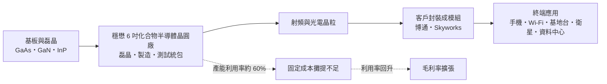
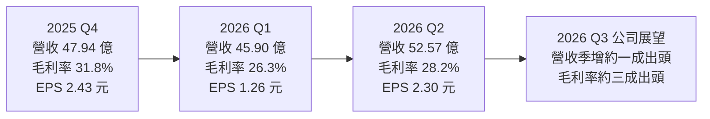
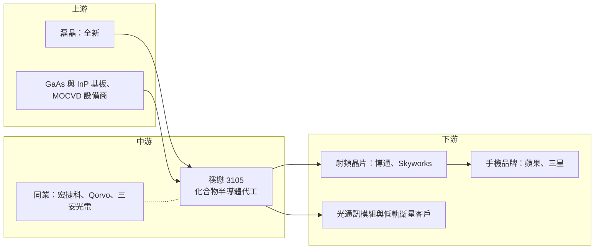

# 3105 穩懋

> 上櫃｜[[產業索引-半導體業|半導體業]]｜上市（櫃）日期 2011/12/13

# 第一章：企業模式與商業藍圖

> [!info] 撰寫說明
> 本文由 Claude 依公開資料整理，架構比照 [[2330台積電]] 的四章研究，資料截至 2026-10-07。財務數字來源：穩懋 2025 年第四季、2026 年第一季與第二季法說會報導（科技新報、股感、優分析、永豐金證券豐雲學堂）；產業描述為整理性內容，尚未逐條比對原始文件。#待校對

在評估單一個股的長期投資價值時，首要步驟是拆解企業的底層獲利邏輯。本章針對穩懋半導體（股票代號：3105，以下簡稱穩懋）的商業模式進行定性分析，說明全球最大的砷化鎵晶圓代工廠如何從手機射頻起家，並把資源移向低軌衛星與 AI 光通訊等高門檻應用。

## 一、核心定位：全球最大的砷化鎵晶圓代工廠

穩懋是全球規模最大的砷化鎵（[[GaAs]]）等[[化合物半導體]]專業[[晶圓代工]]廠，主要以 6 吋晶圓生產。化合物半導體和一般矽晶片不同，用的是砷化鎵、氮化鎵（[[GaN]]）、磷化銦（[[InP]]）等材料，擅長處理高頻、高功率與光電訊號，因此廣泛用在：

* **手機射頻：** 功率放大器（[[PA]]），負責把手機要發射的訊號放大。
* **無線網路與基地台：** Wi-Fi、基地台與衛星通訊的射頻元件。
* **光通訊與感測：** 雷射與光接收元件，用於 3D 感測與資料中心光模組。

穩懋強調自己是「化合物半導體業界唯一擁有統包解決方案的晶圓代工服務公司」，可以從[[磊晶]]、晶圓製造一路做到測試，提供客戶一條龍服務。客戶多是不自建化合物半導體產線、或需要外包產能的射頻與光通訊晶片公司，依 2026 年第二季報導，主要客戶包括 [[AVGO博通]] 與 Skyworks 等，終端再供應給 [[AAPL蘋果]]、[[005930三星電子]] 等手機品牌。

## 二、終端應用／產品板塊：手機 PA 之外，基礎建設與光通訊崛起

穩懋 2026 年的完整應用別比重本次未查得，以下為 2025 年第四季法說會資料的區間（因僅有區間，不繪製圓餅圖）：

* **基礎建設（Infrastructure）：** 約 30% 至 35%，是 2025 年第四季最強的動能來源，涵蓋基地台、資料中心與[[低軌衛星]]。2026 年第二季報導指出，衛星產品已超過基礎建設營收的 30%，公司目標提高到 40%。
* **手機網路（Cellular）：** 約 25% 至 30%，主要是手機射頻 PA，過去是最大宗，近年比重下降。
* **Wi-Fi：** 約 15% 至 20%，受路由器需求疲弱影響，2026 年第二季出貨微幅下滑。
* **光學（Optical）：** 約 11% 至 17%，包括 [[VCSEL]]（3D 感測、資料中心短距光通訊）與光接收元件（[[PD]]）。2026 年第二季光接收元件正式量產，是季增幅最大的產品線，公司預期第三季仍是成長最大的產品線。

公司在 2026 年第二季法說會表示，希望把光通訊發展成繼手機與基礎建設之後的「第三個重要支柱」，並布局 VCSEL、[[EML]] 與 [[CW Laser]] 等光源技術。AI 資料中心相關營收占比由 2025 年的低個位數，朝 2026 年的中個位數提升。

## 三、資本轉化邏輯：產能利用率決定一切

* **資本密集：** 與矽晶圓代工一樣，化合物半導體代工需要大量設備投資，折舊與人事成本相對固定。
* **[[產能利用率]]是關鍵：** 2025 年第四季產能利用率約 60%，顯示產能仍有餘裕，這也是近年毛利率偏低的原因之一。利用率每提升一段，增加的營收大部分可轉為利潤。
* **產能布局：** 主要生產基地在台灣桃園，並在高雄路竹規劃新廠區（細節本次未逐一查證）。2026 年資本支出規劃約 20 億元以上（市場估計可能達 30 億至 40 億元），主要用於擴充 6 吋與 4 吋磷化銦產能，以支應光通訊需求。

## 四、企業長期藍圖：資源轉向高門檻應用

穩懋已「策略性將資源移往航太、低軌衛星及 AI 資料中心」等高門檻產業：

* **衛星通訊：** 以高頻 GaN、GaAs 元件切入低軌衛星，衛星產品占基礎建設營收的比重目標由 30% 以上提高到 40%。
* **AI 光通訊：** 以 InP 雷射與光接收元件切入資料中心光模組，PD 已量產，CW Laser 與 EML 驗證中。
* **降低手機依賴：** 手機 PA 市場成熟、價格競爭激烈，穩懋希望透過衛星與光通訊提高產品組合的附加價值，提升產能利用率與毛利率。

# 第二章：護城河深度與競爭優勢

在長期價值投資中，「護城河」指企業抵禦競爭、維持超額利潤的保護機制。本章分析穩懋的護城河構成、全球主要競爭對手，以及這些優勢在手機成熟與新應用崛起之間能守住多少。

## 一、穩懋護城河的核心組成要素

穩懋的護城河屬於「中等」，由四個要素組成：

* **1. 規模與專業代工地位：** 化合物半導體代工市場規模遠小於矽晶圓代工，需要專門的製程與設備，穩懋多年經營建立全球最大的砷化鎵代工產能，規模經濟與[[良率]]經驗是後進者難以複製的。
* **2. 統包服務：** 從磊晶、製造到測試的一條龍服務，降低客戶的供應鏈管理成本。
* **3. 客戶驗證與長期合作：** 射頻 PA 與光通訊元件需要長時間驗證，穩懋與國際射頻大廠長期合作，轉單成本高。
* **4. 技術延伸能力：** 從砷化鎵延伸到氮化鎵、磷化銦，讓穩懋能跟著衛星、資料中心等新應用成長。

## 二、全球主要競爭對手格局

| 對手 | 定位 | 對穩懋的威脅 |
|---|---|---|
| [[8086宏捷科]] | 台灣砷化鎵代工同業 | 在手機 PA 代工直接競爭 |
| [[2455全新]] | 化合物半導體磊晶廠 | 磊晶業務與穩懋的統包能力部分重疊 |
| Qorvo、Skyworks、村田 | 射頻 [[IDM]]，擁有自有產線 | 景氣差時收回自製，影響穩懋的外包訂單 |
| 三安光電等中國業者 | 受國產替代政策支持 | 在中國手機 PA 市場以價格競爭 |
| Lumentum、Coherent | 光通訊大廠，擁有自有 InP 產線 | 光通訊代工需與其自製產能競爭 |

## 三、優勢轉化：哪些市場守得住、哪些守不住

* **守得住：** 高階射頻（衛星、基地台）與國際客戶的外包需求，穩懋的規模與良率優勢明顯。
* **守不住：** 手機 PA 受中國同業與 IDM 自製影響，價格壓力持續；2025 年第四季產能利用率約 60%，代表整體需求仍不足以填滿產能。
* **轉折點：** 2026 年第二季營收創四年新高、營業利益率回升到 14.1%，第三季預估營收再季增約一成出頭、毛利率回到三成出頭，顯示光通訊與衛星帶動的組合改善開始發酵。
* **觀察重點：** PD 下半年放量速度、CW Laser 與 EML 的驗證時程、衛星產品對產能利用率與毛利率的貢獻，以及 InP 擴產進度。

# 第三章：財務體質與盈利規模

資料日期：2026-10-07。數字取自公司法說會與財經媒體整理（科技新報、股感、優分析、永豐金證券豐雲學堂），表格是撰寫當時的快照；最新月營收、毛利率、累計 EPS 由自動排程寫在本筆記的屬性欄位（月營收、毛利率、累計EPS 等）。#待校對

財務報表是檢驗護城河是否真實存在的最終標準。本章用三率、ROE、資本支出與資本報酬，檢視穩懋在產能利用率回升初期的獲利品質。

## 一、獲利能力的基石：三率

| 項目 | 2025 全年 | 2025 Q4 | 2026 Q1 | 2026 Q2 |
|---|---|---|---|---|
| 營收（新台幣） | 166.38 億 | 47.94 億 | 45.90 億 | 52.57 億 |
| [[毛利率]] | 未查得 | 31.8% | 26.3% | 28.2% |
| [[營業利益率]] | 未查得 | 未查得 | 9.4% | 14.1% |
| 歸屬母公司淨利 | 未查得 | 10.29 億 | 未查得 | 9.77 億 |
| EPS（元） | 4.00 | 2.43 | 1.26 | 2.30 |

* **2025 年回顧：** 營收年減 5%，但 EPS 4.00 元、年增 121%，第四季毛利率回升到 31.8%（個體毛利率 35.1%）。
* **[[毛利率]]：** 2026 年第一季為傳統淡季，營收季減、毛利率降到 26.3%；第二季回升到 28.2%，公司預估第三季回到三成出頭。
* **[[營業利益率]]：** 第二季營業淨利 7.42 億元、季增 72%，營業利益率由 9.4% 升到 14.1%，營業利益增幅遠大於營收增幅，正是產能利用率回升時的營運槓桿。
* **營收動能：** 第二季營收 52.57 億元，季增 15%、年增 39%，創四年新高；EPS 2.30 元優於市場預期。上半年營收 98.47 億元，EPS 3.56 元。

## 二、[[ROE]]：資本效率

穩懋是資本密集的晶圓代工廠，產能利用率對獲利影響極大。2025 年第四季產能利用率約 60%，代表大量固定成本未被充分攤提，ROE 偏低（精確值本次未查得）。若光通訊與衛星需求帶動產能利用率回升，營業槓桿會讓獲利成長幅度大於營收（推估）。

## 三、資本支出與自由現金流

* **[[CapEx]]：** 2026 年規劃約 20 億元以上，市場估計可能達 30 億至 40 億元，主要投入磷化銦產能。相較過去大規模擴產期，目前資本支出相對保守。
* **[[自由現金流]]：** 產能利用率仍有提升空間，短期內現有產能足以支應成長，現金流壓力不大（推估）。
* **股利：** 2025 年度股利金額本次未查得。

## 四、[[ROIC]] 與 [[WACC]]：價值創造利差

過去幾年穩懋產能利用率偏低，大量已投入的設備未被充分使用，ROIC 推估低於或接近 WACC（具體數值未查得）。這也是穩懋目前資本支出偏保守的原因：先把既有產能填滿，再針對 InP 等高附加價值產能做精準擴充。若利用率能隨光通訊與衛星需求回升，ROIC 將是改善最明顯的指標之一。

# 第四章：總體風險與地緣政治

任何企業都無法脫離宏觀環境獨立存在。本章分析穩懋未來必須面對的地緣政治、產業週期、營運與技術風險。

## 一、地緣政治風險

* **美中科技戰：** 中國手機品牌與射頻晶片廠推動國產替代，可能減少對台灣化合物半導體代工的需求；美國對中國的出口管制則可能讓國際客戶更依賴台灣產能。
* **台灣集中風險：** 主要產能集中在台灣，面臨兩岸情勢、供電與地震等風險。
* **關稅：** 手機與網通設備的關稅政策會透過終端需求間接影響穩懋。

## 二、產業週期與市場結構風險

* **手機市場成熟：** 手機出貨成長有限，射頻 PA 的需求主要來自規格升級，景氣波動大。
* **客戶自製與轉單：** 國際射頻大廠在景氣好時外包、景氣差時收回自製產能，使穩懋的產能利用率波動大，這也是一種[[長鞭效應]]：終端需求的小幅變化，會在代工廠的訂單上被放大。
* **匯率：** 營收以美元計價為主，新台幣升值會壓縮毛利率。

## 三、營運環境的隱性風險

* **產能利用率：** 2025 年第四季產能利用率約 60%，若新應用放量不如預期，折舊會持續壓抑毛利率。
* **客戶集中：** 主要客戶為少數國際射頻大廠，單一客戶的訂單變化對營收影響大。
* **新產品驗證：** CW Laser、EML 等光源產品仍在驗證，若時程延後，光通訊第三支柱的建立會遞延。

## 四、科技演進風險

AI 資料中心光通訊技術演進快速，[[矽光子]]與共同封裝光學（[[CPO]]）可能改變光源與光接收元件的需求型態。若矽光子大量採用外部雷射光源，對穩懋的 InP 雷射（CW Laser）是機會；但若整合度提高、元件數量下降，也可能影響需求。此外，氮化鎵在射頻與功率元件的應用擴大，需要穩懋持續投入新製程。

# 專有名詞解析

## 半導體

- **[[化合物半導體]]**：由兩種以上元素組成的半導體材料，例如砷化鎵、氮化鎵、磷化銦，適合高頻、高功率與光電應用。
- **[[GaAs]]**：砷化鎵，高頻特性優於矽的化合物半導體材料，是手機射頻功率放大器的主流材料。
- **[[GaN]]**：氮化鎵，耐高電壓、高功率的化合物半導體材料，用於基地台、衛星射頻與快充電源。
- **[[InP]]**：磷化銦，適合製作光通訊雷射與光接收元件的化合物半導體材料，是資料中心光模組的關鍵。
- **[[磊晶]]**：在基板上一層層長出特定材料結構的薄膜，化合物半導體元件的性能很大程度取決於磊晶品質。
- **[[PA]]**：功率放大器，把要發射的無線訊號放大到足夠強度，手機、Wi-Fi 與基地台都需要。
- **[[VCSEL]]**：垂直共振腔面射型雷射，從晶片表面垂直發光，用於手機 3D 感測與資料中心短距光通訊。
- **[[EML]]**：電吸收調變雷射，可高速調變光訊號，適合資料中心中長距離的高速光模組。
- **[[CW Laser]]**：連續波雷射，持續輸出穩定光源，作為矽光子與共同封裝光學的外部光源。
- **[[PD]]**：光接收元件（光二極體），把光訊號轉回電訊號，是光模組接收端的核心元件。
- **[[矽光子]]**：在矽晶片上製作光學元件，以光取代電傳輸資料，可降低 AI 資料中心的傳輸耗電。
- **[[CPO]]**：共同封裝光學，把光學引擎與交換器晶片封裝在一起，縮短電訊號傳輸距離以降低功耗。
- **[[良率]]**：一片晶圓上合格晶片所占的比例，直接影響每顆晶片的成本。

## 應用

- **[[低軌衛星]]**：在距地面約數百至兩千公里軌道運行的通訊衛星群，提供全球寬頻網路，需要大量高頻射頻元件。

## 金融

- **[[產能利用率]]**：實際投片量占總產能的比例，晶圓代工廠的毛利率高度取決於此數字。
- **[[長鞭效應]]**：終端需求的小幅變動，沿供應鏈往上游傳遞時被逐級放大，造成上游庫存與訂單劇烈波動。

# 核心供應鏈

## 1. 上游：基板、磊晶與設備
- 化合物半導體磊晶：[[2455全新]]
- 基板與設備：砷化鎵、磷化銦基板供應商與 MOCVD 設備商（未具名）

## 2. 中游：穩懋本身與同業
- 砷化鎵代工同業：[[8086宏捷科]]
- 國外 IDM 與同業：Qorvo、Skyworks、三安光電

## 3. 下游：主要客戶
- 射頻晶片：[[AVGO博通]]、Skyworks
- 終端手機品牌：[[AAPL蘋果]]、[[005930三星電子]]
- 光通訊與衛星：資料中心光模組與低軌衛星客戶（未具名）

## 最新新聞
<!-- news:start（自動產生，請勿手動編輯此範圍） -->
- 2026-10-09 📰 媒體 12:10｜鉅亨速報 - Factset 最新調查：穩懋(3105-TW)EPS預估上修至7.8元，預估目標價為440元｜[鉅亨網](https://news.cnyes.com/news/id/6626714)
- 2026-10-09 📰 媒體 12:10｜鉅亨速報 - Factset 最新調查：穩懋(3105-TW)目標價調升至440元，幅度約11.39%｜[鉅亨網](https://news.cnyes.com/news/id/6626710)
- 2026-10-07 🏛️ 重訊 15:34｜公告本公司將舉辦2026年第三季線上法人說明會｜[觀測站](https://mops.twse.com.tw/mops/#/web/t05st01)
- 2026-10-06 📰 媒體 08:10｜鉅亨速報 - Factset 最新調查：穩懋(3105-TW)EPS預估下修至7.54元，預估目標價為395元｜[鉅亨網](https://news.cnyes.com/news/id/6622251)
- 2026-10-05 📰 媒體 20:48｜穩懋9月營收年月雙增 Q3受惠光通訊出貨放大增長｜[鉅亨網](https://news.cnyes.com/news/id/6621996)

完整紀錄：[[3105穩懋 新聞]]
<!-- news:end -->

## 相關連結
- [公開資訊觀測站](https://mopsov.twse.com.tw/mops/web/t05st03?step=1&firstin=1&co_id=3105)
- [Goodinfo](https://goodinfo.tw/tw/StockDetail.asp?STOCK_ID=3105)
- [Yahoo 股市](https://tw.stock.yahoo.com/quote/3105)
- [鉅亨網新聞](https://www.cnyes.com/twstock/3105/news)
