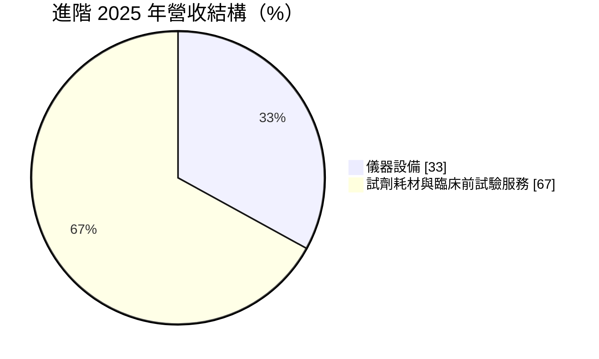
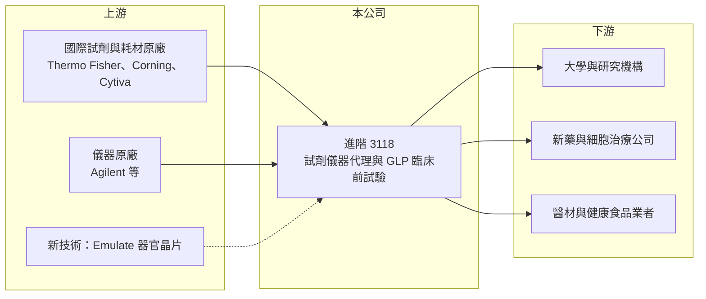

# 3118 進階

> 上櫃｜[[產業索引-生技醫療業|生技醫療業]]｜上市（櫃）日期 2008/05/21

# 第一章：企業模式與商業藍圖

> [!info] 撰寫說明
> 精簡版，由 Claude 依公開資料整理，架構比照 [[2330台積電]] 的四章研究，資料截至 2026-10-08。來源：Goodinfo 年度經營績效頁（2020 至 2025 年）、櫃買中心開放資料（基本資料、2026 年第二季資產負債與綜合損益、本益比殖利率）、富果研究 2026 年 9 月進階法說會整理；產業描述為整理性內容，尚未逐條比對原始文件。#待校對

進階生物科技（股票代號：3118，以下簡稱進階）不是一般人想像中的保健食品公司，而是替台灣學研單位與生技藥廠提供「研發工具」的通路商兼服務商。理解它的關鍵，是看懂生技研發這條路上「賣鏟子」的生意如何賺錢。

- **核心業務：** 進階成立於 1989 年、2008 年上櫃，主要有兩條業務線。第一條是生醫通路，代理國際品牌的實驗室試劑、耗材與精密儀器，涵蓋細胞培養、免疫分析、基因核酸與蛋白質科學；第二條是生技服務，經營符合 [[GLP]] 規範的臨床前試驗中心，替新藥、細胞治療、醫療器材與健康食品做藥物動力學、毒理與安全藥理試驗。兩條業務都不需要承擔新藥研發成敗的風險，只要台灣的生技研發活動持續，就有穩定的需求。
- **營收結構：** 依法說會資料，儀器設備占營收的比重由 2024 年的 30% 升到 2025 年的 33%，其餘為試劑耗材與臨床前試驗服務。試劑耗材屬於重複性採購，實驗室每天都要用，是營收的穩定基礎；儀器單價高但採購時點受預算影響，是營收波動的主要來源。
- **營運據點：** 公司位於新北市汐止，服務超過 6,000 家學研與工業客戶，臨床前試驗中心已完成超過 1,650 件試驗案件。代理的國際品牌包括 Agilent、Corning、Cytiva、Thermo Fisher 等，並引進 Emulate 的器官晶片技術（富果研究整理）。#待校對
- **長期方向：** 進階把成長重心放在細胞治療、外泌體、核酸藥物、類器官與器官晶片等新興研究領域，並已開發細胞治療的體內分布與持久性分析方法。這些新領域的研究工具單價較高、技術門檻也較高，若台灣的再生醫療與新藥研發持續擴大，進階可以從「賣試劑」延伸到「賣整套研發解決方案」。

# 第二章：護城河深度與競爭優勢

進階的護城河不在技術專利，而在代理權、客戶關係與試驗資格這三種「時間累積出來的資產」。本章說明這些優勢的來源與限制。

- **競爭優勢：** 國際試劑大廠在台灣通常只授權少數代理商，進階累積三十多年的代理關係與技術支援團隊，讓研究人員習慣向它下單。臨床前試驗中心通過美國 FDA、歐盟 OECD 與日本 PMDA 的 GLP 查核並取得 AAALAC 認證（富果研究整理），這類資格需要多年建立，新進者很難短期取得。#待校對
- **主要對手：** 試劑與儀器代理方面，對手是其他國際品牌的台灣代理商，以及國際大廠直接在台設立的分公司；臨床前試驗方面，對手包括國內其他 [[CRO]] 與國外大型試驗機構。代理商最大的風險是原廠收回代理權改為直營，因此代理品牌的分散程度很重要。
- **觀察重點：** 第一，新興領域（細胞治療、器官晶片）的營收能否逐年提高比重；第二，臨床前試驗服務能否接到更多國際案件；第三，2025 年毛利率升到 35.0%，是否代表產品組合往高附加價值移動，而不只是一次性的儀器標案。

# 第三章：財務體質與盈利規模

資料日期：2026-10-08，表格是撰寫當時的快照；最新月營收、毛利率、累計 EPS 由自動排程寫在本筆記的屬性欄位（月營收、毛利率、累計EPS 等）。#待校對

進階的財務特色是規模小、獲利穩定、幾乎不借錢，並且把大部分盈餘配給股東。以下用六年的數字檢驗這個描述。

| 年度 | 營收（新台幣） | [[毛利率]] | [[營業利益率]] | EPS（元） | [[ROE]] |
|---|---|---|---|---|---|
| 2020 | 6.72 億 | 31.5% | 9.8% | 1.79 | 11.1% |
| 2021 | 6.77 億 | 34.3% | 11.7% | 2.10 | 12.7% |
| 2022 | 5.93 億 | 34.2% | 10.9% | 1.80 | 10.8% |
| 2023 | 6.61 億 | 33.2% | 10.2% | 1.94 | 11.5% |
| 2024 | 7.31 億 | 32.4% | 10.3% | 2.00 | 11.7% |
| 2025 | 7.37 億 | 35.0% | 11.3% | 2.46 | 14.0% |
| 2026 上半年 | 3.21 億 | 35.6% | 9.9% | 0.95 | 未查得 |

- **營收規模：** 2020 至 2025 年營收年複合成長率約 1.9%（推算），屬於成熟穩定型的公司。營收波動主要來自學研單位的預算時點，例如 2026 年上半年因政府總預算較晚通過，學研客戶採購延後（富果研究整理）。
- **獲利：** 毛利率長期在 31% 至 35% 之間，營業利益率維持在 10% 上下，2021 至 2025 年平均 ROE 約 12.1%（推算）。對一家代理商而言，這代表它的技術服務與臨床前試驗帶來比純貿易更高的附加價值。
- **財務特色：** 2026 年第二季底股東權益約 5.40 億元、負債約 2.59 億元，負債幾乎全是流動負債（櫃買中心開放資料），推估沒有重大銀行借款。2025 年度現金股利 2.20 元，約為當年 EPS 的 89%（推算），高配息反映公司不需要大量資本支出。

**[[ROIC]] 與 [[WACC]]：**
- ROIC（推算）：2025 年營業利益約 0.83 億元，以稅率 20% 計算，稅後約 0.67 億元；投入資本以股東權益 5.40 億元加上推估為零的有息負債計算，ROIC 約 12%（推算）。
- WACC（推算）：無風險利率取 1.75%、市場風險溢酬 6%，β 取小型通路股常見值 0.7（假設），股東權益成本約 6.0%；因幾乎無負債，WACC 約 6%（推算）。
- 結論：ROIC 長期高於 WACC 約 6 個百分點，代表進階雖然成長慢，但每一塊錢資本都持續創造價值，並把多餘的現金以股利返還股東。

# 第四章：總體風險與地緣政治

進階的風險不在景氣大起大落，而在於它依賴的兩個外部條件：政府研發預算與國際原廠的代理授權。

- **產業週期：** 學研客戶的採購受政府科技預算與計畫核定時點影響，預算延遲或刪減會直接延後儀器訂單。生技產業的資金環境也很重要，新藥公司募資困難時，臨床前試驗與試劑採購都會縮減。
- **營運風險：** 代理商的核心資產是代理權，原廠若調整台灣的通路策略、收回代理或改為直營，相關營收可能一次流失。臨床前試驗中心則需要持續投入人才與設備，維持各國 GLP 資格。
- **其他風險：** 代理產品多以美元或歐元計價，新台幣貶值會提高進貨成本；動物試驗也面臨國際上減少動物實驗的法規趨勢，進階引進器官晶片等替代技術，正是因應這個長期變化。

# 專有名詞解析

## 金融

- **[[ROIC]]**：投入資本報酬率，稅後營業利益除以股東權益與有息負債的合計，衡量本業對所有資金提供者的報酬。
- **[[WACC]]**：加權平均資金成本，依股東權益與負債的比重加權計算的資金成本，ROIC 高於它才代表創造價值。

## 產業

- **[[GLP]]**：優良實驗室操作規範，新藥與醫材的臨床前安全性試驗須在符合 GLP 的實驗室執行，數據才會被各國主管機關採信。
- **[[CRO]]**：受託研究機構，替藥廠執行臨床前或臨床試驗，讓藥廠不必自建全部的試驗能力。
- **[[器官晶片]]**：在微流道晶片上培養人體細胞、模擬器官功能的技術，可部分取代動物試驗。

# 核心供應鏈

- 上游：國際生命科學工具大廠，包括 Agilent、Corning、Cytiva、Thermo Fisher（代理或經銷關係），以及器官晶片廠商 Emulate。
- 下游／客戶：大學與研究機構、新藥開發公司、細胞治療公司、醫療器材與健康食品業者，合計超過 6,000 家客戶。
- 同業：其他生命科學試劑代理商、國際原廠在台分公司，以及國內外臨床前 [[CRO]]。

## 最新新聞
<!-- news:start -->
<!-- news:end -->

## 相關連結
- [公開資訊觀測站](https://mopsov.twse.com.tw/mops/web/t05st03?step=1&firstin=1&co_id=3118)
- [Goodinfo](https://goodinfo.tw/tw/StockDetail.asp?STOCK_ID=3118)
- [Yahoo 股市](https://tw.stock.yahoo.com/quote/3118)
- [鉅亨網新聞](https://www.cnyes.com/twstock/3118/news)
