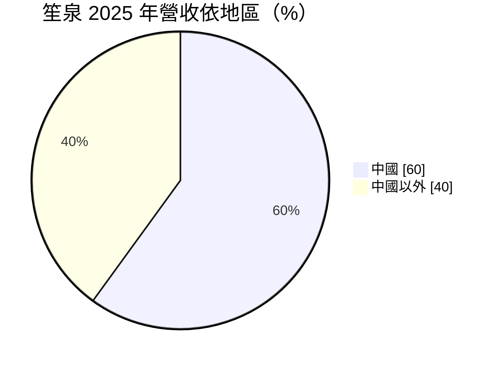
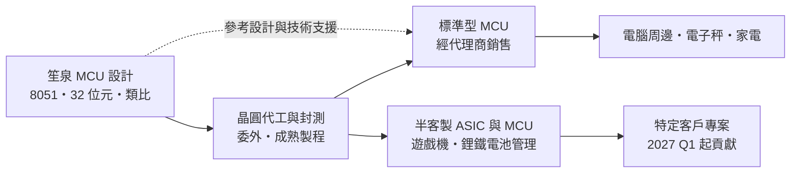
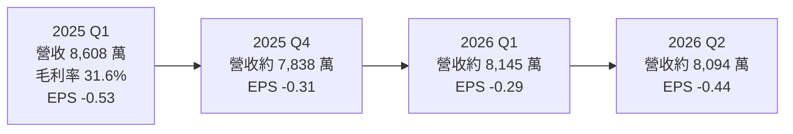
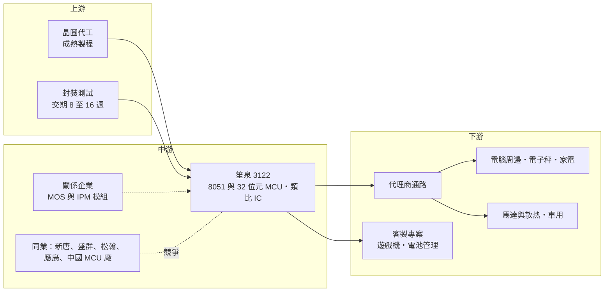

# 3122 笙泉

> 上櫃｜[[產業索引-半導體業|半導體業]]｜上市（櫃）日期 2015/01/26

# 第一章：企業模式與商業藍圖

> [!info] 撰寫說明
> 本文由 Claude 依公開資料整理，架構比照 [[2330台積電]] 的四章研究，資料截至 2026-10-07。財務數字來源：poorstock 法說會整理（2025 年 6 月）、鉅亨網 2025 年 6 月法說報導、永豐金證券豐雲學堂、旺得富（中時）2026 年 5 月報導、HiStock 每股盈餘資料、Yahoo 股市月營收資料；產業描述為整理性內容，尚未逐條比對原始文件。#待校對

在評估單一個股的長期投資價值時，首要步驟是拆解企業的底層獲利邏輯。本章針對笙泉科技股份有限公司（股票代號：3122，以下簡稱笙泉）的商業模式進行定性分析，說明一家以 8051 微控制器起家、深陷中國價格戰的小型 IC 設計公司，如何嘗試以利基市場與半客製化晶片走出連年虧損。

## 一、核心定位：通用型 MCU 設計公司的轉型

笙泉是 [[Fabless]] 微控制器（[[MCU]]）設計公司，2015 年上櫃，依永豐金證券整理，公司成立約 25 年。早期以 [[8051]] 架構的 8 位元 MCU 為主力，產品用於電腦周邊、馬達控制、電子秤與家電面板等，這類 MCU 單價低、規格標準化，客戶主要在中國。

近年中國本土 MCU 廠大量投入，以極低價格搶市，業界稱為「內卷」。笙泉的營收規模僅約 3 億多元，難以和中國廠拚價格，因此轉型方向是：

* **降低中國依賴：** 拓展台灣、日本、歐美等海外客戶。
* **轉向利基與半客製化：** 不再拚通用型 MCU，而是做馬達控制、電池管理、遊戲機等特定應用的 MCU 與 [[ASIC]]。
* **擴充類比與介面產品：** 開發車用 [[CAN]]/LIN 收發器、高精度 ADC 與隔離晶片，提高單一客戶的採購金額。

## 二、終端應用與產品板塊：中國占比降到六成

依 poorstock 整理的 2025 年 6 月法說會內容，中國營收占比由 2021 年的 79% 降到 2025 年的 60%：

* **前十大應用：** 集中在電腦周邊、馬達應用、衡器（電子秤）與家電顯示面板。
* **馬達控制：** 推出 32 位元 [[BLDC]] 無刷馬達方案，採雙核心 MCU 架構與 [[FOC]] 磁場導向控制演算法，並提供圖形化介面簡化客戶開發。與關係企業合作 MOS 產品與小型 [[IPM]] 模組，鎖定 AI 散熱風扇與機器人關節。
* **車用與類比：** 2025 年法說規劃車用 CAN/LIN 收發器於第四季量產，車用應用包括環景、音響與引擎室調節器；高精度 ADC 已量產，規劃 24 位元解析度產品。
* **超低功耗 MCU：** 目標功耗降低 70%，原規劃 2026 年第二季推出。

公司未揭露產品別營收比重。

## 三、資本轉化邏輯：從賣標準品到接客製案

* **標準品的困境：** 通用型 MCU 經代理商賣給大量中小客戶，價格透明，中國廠一降價，笙泉就必須跟進，[[毛利率]]因此大幅波動。依 poorstock 整理，近年單季毛利率在 28.3% 至 42.9% 之間。
* **半客製化的轉變：** 依旺得富 2026 年 5 月報導，兩款客製化 ASIC 與 MCU 產品進入開發後期，一款是遊戲機 MCU，一款是[[鋰鐵電池]]管理晶片，預計 2026 年第四季量產、2027 年第一季開始貢獻營收。客製案的好處是客戶綁定、毛利率較穩定。

## 四、企業長期藍圖：經營團隊重組與利基市場

* **董總合一：** 2026 年 5 月 8 日笙泉全面改選董事，新任董事長兼任總經理，原總經理轉任營運長。報導指出這代表公司未來轉型與資源整合將由新團隊直接主導。
* **三大方向：** 加速轉向半客製化 ASIC、機電整合（馬達控制與功率模組）與利基型 MCU 市場。
* **產品擴充：** 隔離晶片原規劃 2026 年第二季送樣、24 位元 ADC 規劃 2026 年推出，逐步從純 MCU 公司擴展為「MCU 加類比」的方案供應商。

# 第二章：護城河深度與競爭優勢

在長期價值投資中，「護城河」指企業抵禦競爭、維持超額利潤的保護機制。本章分析笙泉在 MCU 市場的競爭處境，以及轉型策略能否建立新的防線。

## 一、笙泉護城河的核心組成要素

笙泉連年虧損，代表目前並沒有能維持超額利潤的護城河。可以作為轉型基礎的資產有：

* **1. 8051 生態與既有客戶：** 8051 是歷史悠久的 MCU 架構，大量中小型設備廠的韌體以 8051 撰寫，既有客戶更換 MCU 需要重寫程式，有一定轉換成本。
* **2. 馬達控制演算法：** BLDC 與 FOC 方案配合圖形化工具，可降低客戶開發門檻，在散熱風扇與小型馬達市場具差異化。
* **3. 客製化能力：** 小公司在中小型客製案上反應快、彈性高，遊戲機與電池管理晶片就是例子。

## 二、全球主要競爭對手格局

| 對手 | 定位 | 對笙泉的威脅 |
|---|---|---|
| 中國 MCU 廠（如兆易創新、中穎電子等） | 政策扶植、低價、本地服務 | 在中國通用型 MCU 市場以價格壓制，是笙泉虧損主因 |
| [[4919新唐]] | 台灣最大 MCU 廠之一 | 產品線完整，8051 與 32 位元 MCU 都有規模優勢 |
| [[6202盛群]]、[[5471松翰]]、[[6716應廣]]、[[4952凌通]] | 台灣消費性與家電 MCU 廠 | 在家電、電子秤與消費性 MCU 直接競爭 |
| Microchip、ST、Renesas | 國際 MCU 大廠 | 在車用與工控 MCU 掌握主要市場 |

## 三、優勢轉化：哪些市場守得住、哪些守不住

* **守得住：** 已簽約的客製化專案、需要馬達控制演算法的散熱與小型馬達應用，以及中國以外重視供應鏈分散的客戶。
* **守不住：** 中國的通用型 8 位元 MCU 市場。中國廠的價格與在地服務都占優，笙泉已主動降低這部分比重。
* **觀察重點：** 一是遊戲機 MCU 與鋰鐵電池管理晶片能否在 2026 年第四季如期量產；二是中國以外營收占比能否持續提高；三是新經營團隊能否讓營業虧損明顯收斂。

# 第三章：財務體質與盈利規模

資料日期：2026-10-07。數字取自法說會整理、HiStock 每股盈餘與 Yahoo 股市月營收資料，表格是撰寫當時的快照；最新月營收、毛利率、累計 EPS 由自動排程寫在本筆記的屬性欄位（月營收、毛利率、累計EPS 等）。#待校對

財務報表是檢驗護城河是否真實存在的最終標準。本章用三率、ROE、現金流與資本報酬，檢視笙泉轉型期間的財務狀況。

## 一、獲利能力的基石：三率

| 項目 | 2024 全年 | 2025 全年 | 2025 Q1 | 2025 Q4 | 2026 Q1 | 2026 Q2 |
|---|---|---|---|---|---|---|
| 營收（新台幣） | 未查得 | 3.24 億 | 8,608 萬 | 約 7,838 萬（推算） | 約 8,145 萬（推算） | 約 8,094 萬（推算） |
| [[毛利率]] | 未查得 | 未查得 | 31.6% | 未查得 | 未查得 | 未查得 |
| EPS（元） | -1.44 | -1.75 | -0.53 | -0.31 | -0.29 | -0.44 |

註：季營收由月營收加總推算。依本筆記屬性欄位的財報資料，2026 年上半年毛利率 34.75%、營業利益率 -17.83%、淨利率 -18.27%、EPS -0.73 元。2025 年第一季稅後淨損 2,141 萬元。

* **營收停滯：** 2025 年營收 3.24 億元，多數月份年減；2026 年 1 至 8 月營收仍大致持平，尚未看到明顯成長。
* **[[毛利率]]：** 2026 年上半年 34.75%，高於 2025 年第一季的 31.6%，推估與中國低價產品比重下降有關。
* **營業虧損：** 營收規模小、研發費用固定，營業利益率長期為負，2026 年上半年約 -17.8%。2024 至 2026 年上半年每季都是虧損。

## 二、[[ROE]]：資本效率

笙泉連續多年虧損，ROE 為負值。依 poorstock 整理，2025 年 3 月底資產總額約 6.85 億元，較前一年同期的 7.21 億元下降，反映虧損持續侵蝕資產。

## 三、資本支出與自由現金流

* **[[CapEx]]：** IC 設計公司資本支出低，主要是研發與光罩費用（推估，具體金額未查得）。
* **現金消耗：** 營業虧損代表每年都在消耗現金，若轉型時程拉長，可能需要增資或處分資產（推估）。
* **股利：** 本筆記屬性欄位無 2025 年度現金股利資料，推估近年未配息。

## 四、[[ROIC]] 與 [[WACC]]：價值創造利差

笙泉目前 ROIC 為負，低於任何合理的 WACC，屬於價值毀損階段。轉型能否成功的檢驗標準是：客製化專案量產後，營收能否成長到足以覆蓋研發與管理費用的規模，讓營業利益轉正。

# 第四章：總體風險與地緣政治

任何企業都無法脫離宏觀環境獨立存在。本章分析笙泉未來必須面對的地緣政治、產業週期與營運風險。

## 一、地緣政治風險

* **中國依賴仍高：** 2025 年中國營收仍占約六成，中國推動 MCU 國產替代，當地客戶持續轉向本土供應商。
* **供應鏈分散需求：** 歐美日客戶要求非中國供應來源，是笙泉擴展海外的機會，但笙泉在這些市場的品牌與通路仍弱。

## 二、產業週期與市場結構風險

* **MCU 價格戰：** 中國 MCU 廠產能過剩，通用型 MCU 價格長期承壓，是笙泉連年虧損的主因。
* **消費性電子需求：** 電腦周邊、電子秤與家電屬消費性市場，景氣轉弱時客戶縮減庫存，[[長鞭效應]]放大訂單波動。
* **成熟製程產能吃緊：** 依旺得富 2026 年 5 月報導，成熟製程供應鏈嚴重吃緊，封裝交期延長到 8 至 16 週，價格持續上漲，壓縮新產品量產時程與毛利。

## 三、營運環境的隱性風險

* **經營團隊變動：** 2026 年 5 月全面改選董事、董總合一，新策略的執行成效仍待觀察。
* **客製案集中：** 未來成長押注少數客製化專案，若客戶產品銷售不如預期，影響會很直接。
* **規模不足：** 年營收約 3 億元，難以同時支撐 MCU、類比、隔離晶片與客製案等多條研發線。

## 四、科技演進風險

MCU 市場正從 8 位元轉向 32 位元 Arm 與 [[RISC-V]] 架構，8051 的生態優勢逐漸縮小。同時，邊緣 AI 讓 MCU 需要整合 AI 加速與更高效能，研發門檻提高。笙泉若無法在 32 位元與低功耗產品建立足夠競爭力，既有 8051 客戶會隨產品升級流失。

# 專有名詞解析

## 半導體

- **[[MCU]]**：微控制器，把處理器、記憶體與輸入輸出介面整合在一顆晶片上，用於家電、工控與車用等各種電子設備。
- **[[8051]]**：英特爾早年推出的 8 位元 MCU 架構，結構簡單、生態成熟，至今仍廣泛用於低成本電子產品。
- **[[Fabless]]**：無晶圓廠的 IC 設計公司，只負責設計與銷售，生產委由晶圓代工廠。
- **[[ASIC]]**：特殊應用積體電路，替特定客戶或特定用途量身設計的晶片。
- **[[RISC-V]]**：開放原始碼的處理器指令集架構，不需支付授權金，近年在物聯網與客製化晶片快速普及。
- **[[IPM]]**：智慧功率模組，把功率元件與驅動電路封裝在一起，用於馬達驅動與變頻家電。

## 金融

- **[[長鞭效應]]**：終端需求的小幅變動，沿供應鏈往上游傳遞時被逐級放大，造成上游庫存與訂單劇烈波動。

## 產業

- **[[BLDC]]**：無刷直流馬達，以電子換向取代碳刷，效率高、壽命長，用於風扇、家電與機器人。
- **[[FOC]]**：磁場導向控制，一種精準控制馬達轉矩與轉速的演算法，可降低噪音與耗電。
- **[[CAN]]**：控制器區域網路，車用電子最常見的通訊匯流排，LIN 則是成本較低的車用子網路。
- **[[鋰鐵電池]]**：以磷酸鐵鋰為正極材料的鋰電池，安全性高、壽命長，用於儲能與電動車。

# 核心供應鏈

## 1. 上游：晶圓代工與封測
- 公司未揭露代工與封測夥伴；2026 年成熟製程與封裝產能吃緊

## 2. 中游：笙泉本身與同業
- 合作夥伴：關係企業（MOS 產品與小型 IPM 模組，名稱未查得）
- 台灣 MCU 同業：[[4919新唐]]、[[6202盛群]]、[[5471松翰]]、[[6716應廣]]、[[4952凌通]]
- 中國與國際同業：兆易創新、中穎電子、Microchip、ST、Renesas

## 3. 下游：應用市場
- 電腦周邊、電子秤、家電顯示面板（前十大應用）
- 馬達控制：AI 散熱風扇、機器人關節
- 車用：環景、音響、引擎室調節器
- 客製專案：遊戲機 MCU、鋰鐵電池管理晶片（客戶名稱未揭露）

## 最新新聞
<!-- news:start -->
<!-- news:end -->

## 相關連結
- [公開資訊觀測站](https://mopsov.twse.com.tw/mops/web/t05st03?step=1&firstin=1&co_id=3122)
- [Goodinfo](https://goodinfo.tw/tw/StockDetail.asp?STOCK_ID=3122)
- [Yahoo 股市](https://tw.stock.yahoo.com/quote/3122)
- [鉅亨網新聞](https://www.cnyes.com/twstock/3122/news)
