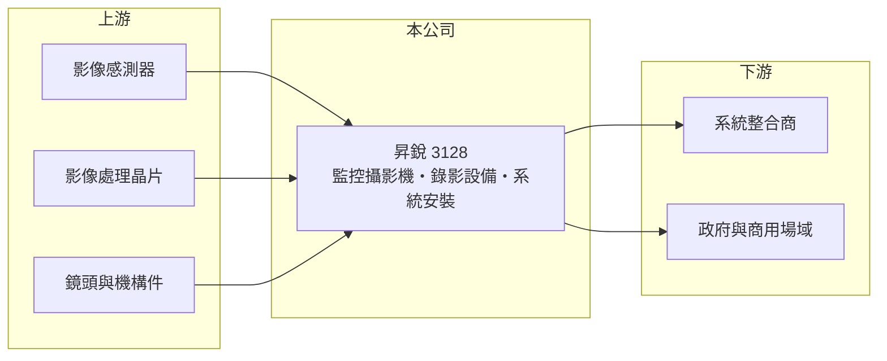

# 3128 昇銳

> 上櫃｜[[產業索引-光電業|光電業]]｜上市（櫃）日期 2006/09/04

# 第一章：企業模式與商業藍圖

> [!info] 撰寫說明
> 精簡版，由 Claude 依公開資料整理，架構比照 [[2330台積電]]，資料截至 2026-10-07。來源：nstock.tw 昇銳公司概況、winvest.tw 營收快訊。公開資料有限，營收比重未查到。#待校對

昇銳是老牌安全監控設備商，2026 年營收連續年減，獲利接近損益兩平。

- **核心業務：** 昇銳電子成立於 1987 年，2006 年上櫃，業務為各種電子監視系統及其零件的製造、加工、買賣與安裝，產品涵蓋監控攝影機與錄影設備（推估包含 [[IP攝影機]]與 [[NVR]]）。
- **營收結構：** 本次未查到產品與地區營收比重。
- **營運據點：** 生產與營運據點本次未查到，本文不推測。
- **長期方向：** 監控產業正從類比轉向網路化與 AI 分析，昇銳能否跟上產品升級，決定營收能否止跌。

# 第二章：護城河深度與競爭優勢

昇銳在監控市場屬中小型品牌，面對中國大廠的價格競爭，護城河有限。

- **競爭優勢：** 從設備製造延伸到系統安裝，可承接整案工程；另具台灣製造背景，有機會受惠[[非紅供應鏈]]採購需求（推估）。
- **主要對手：** 國內有 [[3356奇偶]]、3454晶睿、[[3297杭特]]，國際上則有海康威視、大華等中國大廠。
- **觀察重點：** 月營收年減幅度能否收斂，以及毛利率能否維持在兩成五以上。

# 第三章：財務體質與盈利規模

資料日期：2026-10-07，以下數字是撰寫當時的快照；最新月營收、毛利率、累計 EPS 由自動排程寫在本筆記的屬性欄位（月營收、毛利率、累計EPS 等）。#待校對

昇銳 2026 年營收明顯下滑，第二季小幅虧損。

- **營收規模：** 2025 年全年營收 10.98 億元；2026 年 1 至 8 月累計 6.07 億元、年減 17.02%，8 月營收 6,116.5 萬元、年減 29.24%，4 至 8 月每月都較去年同期衰退。
- **獲利：** 2026 年第二季 EPS -0.03 元，[[毛利率]] 26.38%，[[營業利益率]] -0.77%，淨利率 -0.89%。
- **財務特色：** 資本額約 5.02 億元；2025 年配發現金股利 0.4 元與股票股利 0.6 元，近五年平均現金股利 0.66 元。

# 第四章：總體風險與地緣政治

昇銳的風險在於營收衰退與產業價格競爭。

- **產業週期：** 監控設備需求跟著政府標案、商用建案與企業資本支出起伏。
- **營運風險：** 營收規模縮小時，固定費用難以攤提，容易由盈轉虧。
- **其他風險：** 影像晶片與感測器多仰賴外購，零件價格與匯率波動會影響毛利；資安法規變化可能帶來機會也可能增加認證成本。

# 專有名詞解析

## 應用

- **[[IP攝影機]]**：透過網路傳輸影像的監控攝影機，可直接接上網路交換器，不必經過類比線路與錄影主機。
- **[[NVR]]**：網路錄影主機，把多台 IP攝影機的影像集中錄製、儲存與管理的設備。

## 產業

- **[[非紅供應鏈]]**：排除中國製零組件的供應鏈，常見於國防、無人機與政府採購規範。

# 核心供應鏈

- 上游：影像感測器（如 [[SONY索尼]]）、影像處理晶片、鏡頭與機構件供應商
- 下游／客戶：系統整合商、政府與商用場域（推估）
- 同業：[[3356奇偶]]、3454晶睿、[[3297杭特]]、海康威視、大華

## 最新新聞
<!-- news:start -->
<!-- news:end -->

## 相關連結
- [公開資訊觀測站](https://mopsov.twse.com.tw/mops/web/t05st03?step=1&firstin=1&co_id=3128)
- [Goodinfo](https://goodinfo.tw/tw/StockDetail.asp?STOCK_ID=3128)
- [Yahoo 股市](https://tw.stock.yahoo.com/quote/3128)
- [鉅亨網新聞](https://www.cnyes.com/twstock/3128/news)
