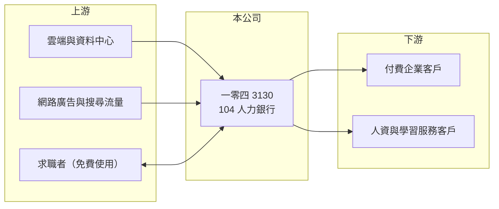

# 3130 一零四

> 上市｜[[產業索引-數位雲端|數位雲端]]｜上市（櫃）日期 2006/02/17

# 第一章：企業模式與商業藍圖

> [!info] 撰寫說明
> 精簡版，由 Claude 依公開資料整理，架構比照 [[2330台積電]]，資料截至 2026-10-08。來源：證交所開放資料（基本資料、資產負債、綜合損益、營益分析、股利、每月營收）、Goodinfo 年度經營績效、富邦 e 點通（MoneyDJ）公司基本資料。服務項目與商業模式描述為整理性內容，市占率與客戶數未查得。#待校對

本章說明一零四（3130）如何以「104 人力銀行」為核心，向企業收取徵才服務費的網路平台模式。

- **核心業務：** 一零四資訊科技成立於 1993 年，2006 年上市，創辦人暨董事長楊基寬，實收資本額約 3.3 億元。公司經營台灣最具代表性的求職求才網站「104 人力銀行」，依 MoneyDJ 2025 年營收比重，網路及顧問服務占 100%。求職者免費使用，企業則付費刊登職缺、搜尋履歷與使用人才服務。
- **商業模式：** 這是典型的[[雙邊平台]]：求職者越多，企業越願意付費刊登；職缺越多，求職者越會上門。企業多半以年約或方案預付費用，公司先收錢、再分期認列營收，帳上因此累積大量[[合約負債]]（預收款），等於客戶替公司提供營運資金。
- **營收結構：** 收入以企業徵才方案為主，另外延伸到獵才、高階人才、人資管理與學習等服務，目的是從「刊登職缺」走向陪伴企業整個人才生命週期。2020 至 2025 年營收從 16.3 億元成長到 26.7 億元，毛利率長期維持在 86% 至 90%。
- **長期方向：** 台灣少子化與勞動力缺口，讓企業招募難度提高、更願意花錢找人，這對人力銀行是長期順風。另一方面，人工智慧媒合、社群招募與國際平台也在改變求職方式，一零四的長期課題是把累積二十多年的職缺與履歷資料，轉化為更精準的媒合與人資服務。

# 第二章：護城河深度與競爭優勢

本章分析一零四平台的護城河與競爭者。

- **競爭優勢：** 第一是[[網路效應]]，長期累積的求職者與企業規模讓 104 成為多數台灣企業與求職者的第一個選擇，新平台很難同時吸引兩邊。第二是品牌，「104」幾乎等同於找工作的代名詞。第三是資料，數十年的職缺、薪資與履歷資料可以用來改善搜尋與媒合，後進者難以複製。
- **主要對手：** 國內有 1111 人力銀行、yes123 求職網，以及 [[5287數字]] 旗下的 518 熊班等；專業人才市場則有 LinkedIn 等國際平台與新興的履歷與社群招募服務。競爭主要發生在中小企業的價格與藍領、兼職等特定市場。
- **觀察重點：** 第一是企業付費客戶數與每客戶平均收入的變化，這反映景氣與平台定價能力。第二是非刊登型服務（人資、獵才、學習）的成長，決定能否擺脫徵才景氣循環。第三是人工智慧對求職媒合的改變，可能是升級機會，也可能讓新進者有機會切入。

# 第三章：財務體質與盈利規模

資料日期：2026-10-08，表格是撰寫當時的快照；最新月營收、毛利率、累計 EPS 由自動排程寫在本筆記的屬性欄位（月營收、毛利率、累計EPS 等）。#待校對

本章用六年數字檢視一零四平台模式的獲利品質與股東回報。

| 年度 | 營收（新台幣） | [[毛利率]] | [[營業利益率]] | EPS（元） | [[ROE]] |
|---|---|---|---|---|---|
| 2020 | 16.3 億 | 88.9% | 17.6% | 7.80 | 17.3% |
| 2021 | 18.5 億 | 90.2% | 21.3% | 11.16 | 24.2% |
| 2022 | 21.8 億 | 89.5% | 23.1% | 13.42 | 27.4% |
| 2023 | 23.3 億 | 86.9% | 22.1% | 13.61 | 27.3% |
| 2024 | 25.0 億 | 87.2% | 21.9% | 14.14 | 28.1% |
| 2025 | 26.7 億 | 86.1% | 19.9% | 14.70 | 28.7% |

- **營收規模：** 2020 至 2025 年營收年複合成長率約 10.4%（推算），每年都成長，連 2020 年疫情期間也未衰退。依證交所資料，2026 年上半年營收約 14.1 億元、毛利率 87.3%、營業利益率 22.5%、EPS 9.60 元；1 至 8 月累計營收較前一年同期成長約 8%。
- **獲利：** EPS 從 2020 年的 7.80 元一路增加到 2025 年的 14.70 元，近五年（2021 至 2025）平均 ROE 約 27.1%（推算）。毛利率極高，因為平台的主要成本是人力與系統，增加一位付費企業的邊際成本很低；營業利益率約 2 成，代表業務與研發人力是主要費用。
- **財務特色：** 2026 年第二季歸屬母公司權益約 15.7 億元，每股淨值 47.20 元，總負債約 27.9 億元，MoneyDJ 所列負債比例約 64%，但負債以企業預付的合約負債為主，並非借款（推估，依商業模式判斷）。依證交所資料，2025 年度現金股利每股約 14.70 元，與當年 EPS 相同，[[配息率]]約 100%；Goodinfo 統計加權平均現金股利約 9.48 元，屬於幾乎把獲利全數發還股東的公司。
- **[[ROIC]] 與 [[WACC]]：** 2025 年營業利益約 5.3 億元（26.7 億 × 19.9%），以稅率 20% 計稅後約 4.2 億元；投入資本以股東權益約 15.7 億元計，有息負債未查得、依商業模式假設為零，ROIC 約 27%（推算；權益中含大量現金，扣除後的營運資本報酬更高，甚至因預收款而接近無限大）。WACC 以 CAPM 推估：無風險利率 1.75%、市場風險溢酬 6%，MoneyDJ 的 β 為 0.05 不具代表性，改用網路服務股常見值 0.8，股東權益成本約 6.55%；無有息負債，WACC 約 6.5%（推算）。ROIC 長期高出 WACC 約 20 個百分點，是典型以輕資產平台持續創造價值的公司。

# 第四章：總體風險與地緣政治

本章整理一零四長期必須面對的風險。

- **產業週期：** 企業徵才預算跟著景氣走，景氣下滑時企業凍結招募、減少刊登，營收成長會放緩。不過因為企業多以年約預付，景氣反應通常會遞延數季才在營收上出現。
- **營運風險：** 平台的價值建立在流量上，若求職者轉向社群或人工智慧求職工具，網路效應可能被削弱。高配息政策讓公司保留的現金有限，若需要大規模併購或投資新技術，可能要改變股利政策。
- **其他風險：** 個人資料保護法規趨嚴，人力銀行握有大量履歷與個資，資安事件或法規罰則的影響很大；台灣少子化長期會減少求職人口，雖然短期提高徵才需求，長期可能限制市場總量。

# 專有名詞解析

## 金融

- **[[合約負債]]**：客戶已預先付款、公司尚未提供服務的金額，會隨服務提供逐步轉為營收。
- **[[配息率]]**：現金股利占每股盈餘的比例，反映公司把多少獲利發還股東。
- **[[ROIC]]**：投入資本報酬率，稅後營業利益除以投入資本，衡量本業運用資金創造報酬的能力。
- **[[WACC]]**：加權平均資金成本，股東與債權人要求報酬率的加權平均，ROIC 高於 WACC 才代表創造價值。

## 產業

- **[[雙邊平台]]**：同時服務兩群使用者（例如乘客與司機）的平台，一邊使用者增加會吸引另一邊加入。
- **[[網路效應]]**：使用者越多、服務對每位使用者越有價值的現象，是平台型企業最主要的護城河。

# 核心供應鏈

- 上游：雲端與資料中心服務、網路廣告與搜尋流量（例如 [[GOOGL谷歌]]、[[META臉書]]），以及免費使用平台的求職者（求職者是供給方，也是平台價值的來源）。
- 下游／客戶：付費刊登職缺與搜尋人才的企業，以及使用人資管理、獵才與學習服務的企業。
- 同業：1111 人力銀行、yes123 求職網、[[5287數字]] 旗下 518 熊班、LinkedIn。

## 最新新聞
<!-- news:start（自動產生，請勿手動編輯此範圍） -->
- 2026-10-06 🏛️ 重訊 17:01｜說明本公司發生網路資安事件｜[觀測站](https://mops.twse.com.tw/mops/#/web/t05st01)

完整紀錄：[[3130一零四 新聞]]
<!-- news:end -->

## 相關連結
- [公開資訊觀測站](https://mopsov.twse.com.tw/mops/web/t05st03?step=1&firstin=1&co_id=3130)
- [Goodinfo](https://goodinfo.tw/tw/StockDetail.asp?STOCK_ID=3130)
- [Yahoo 股市](https://tw.stock.yahoo.com/quote/3130)
- [鉅亨網新聞](https://www.cnyes.com/twstock/3130/news)
