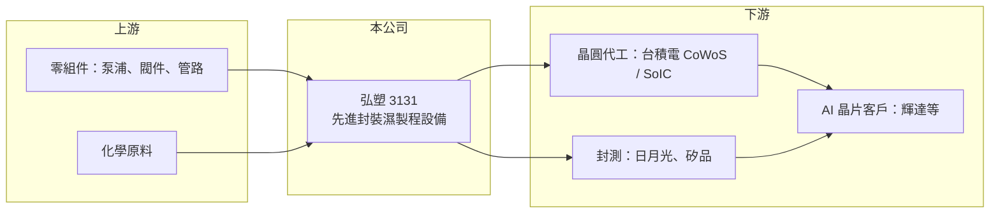

# 3131 弘塑

> 上櫃｜[[產業索引-其他電子業|其他電子業]]｜上市（櫃）日期 2011/01/17

# 第一章：企業模式與商業藍圖

> [!info] 撰寫說明
> 精簡版，由 Claude 依公開資料整理，架構比照 [[2330台積電]]，資料截至 2026-10-07。來源：科技新報弘塑月營收報導與高盛報告整理（2026 年 8 月）、CMoney 財報筆記、經濟日報。#待校對

弘塑是先進封裝[[濕製程]]設備的主要供應商，直接受惠於 AI 晶片的封裝擴產。

- **核心業務：** 製造半導體後段封裝用的濕式清洗、蝕刻與去光阻等濕製程設備，集團另有[[電子級化學品]]業務（推估，依公司公開介紹，未逐項查證）。
- **營收結構：** 營收以設備為主，最大需求來自 [[CoWoS]] 等 2.5D 與 3D [[先進封裝]]；本次未查得精確的產品別比重。
- **營運據點：** 主要客戶為 [[2330台積電]] 與 [[3711日月光投控]]，依高盛報告，弘塑在台積電 CoWoS 濕清洗設備市占約 50%，在日月光與矽品接近 100%。
- **長期方向：** 弘塑是台積電 [[SoIC]] 清洗設備的獨家供應商，公司預期到 2028 年需求與產能分別以約 45% 與 50% 的年複合成長率增加。

# 第二章：護城河深度與競爭優勢

弘塑的護城河來自在先進封裝客戶的高市占與長期驗證。

- **競爭優勢：** 先進封裝設備需經過客戶長時間驗證才能量產導入，弘塑在台積電與日月光的高市占形成轉換成本；SoIC 獨家供應地位讓它參與下一代 3D 封裝。
- **主要對手：** 日本 SCREEN、東京威力科創等國際濕製程設備廠，以及國內 [[6187萬潤]]、[[3583辛耘]] 等先進封裝設備廠（推估）。
- **觀察重點：** 高盛指出短期毛利較低的 2.5D 設備出貨比重高，壓抑毛利率；SoIC 與 3D 封裝設備放量時程是下一個成長關鍵。

# 第三章：財務體質與盈利規模

資料日期：2026-10-07，表格是撰寫當時的快照；最新月營收、毛利率、累計 EPS 由自動排程寫在本筆記的屬性欄位（月營收、毛利率、累計EPS 等）。#待校對

弘塑的營收與獲利在 AI 封裝擴產帶動下維持高成長。

- **營收規模：** 2026 年第一季營收 15.96 億元、第二季 17.27 億元；7 月營收 7.93 億元、年增 42.4%，前 7 月累計 41.16 億元、年增 20.1%。
- **獲利：** 2026 年第二季 [[毛利率]] 38.9%、EPS 11.16 元，皆優於高盛預估；2025 年上半年 EPS 15.79 元。
- **財務特色：** 設備業務以訂單與驗收認列，月營收起伏大；2025 年即有訂單能見度看到 2026 年上半年的報導，產能長期滿載。

# 第四章：總體風險與地緣政治

弘塑高度依賴少數先進封裝客戶的擴產計畫。

- **產業週期：** 營收隨台積電與封測大廠的先進封裝[[CapEx]]起落，AI 需求若放緩或客戶擴產暫停，設備訂單會快速下滑。
- **營運風險：** 客戶集中度高；產品組合中毛利較低的 2.5D 設備比重升高時，毛利率會被壓縮。
- **其他風險：** 國際設備大廠可能加強競爭；客戶海外設廠（美國、日本）需跟進設立服務據點，增加營運成本。

# 專有名詞解析

## 半導體

- **[[濕製程]]**：以化學溶液進行清洗、蝕刻、去光阻等步驟的製程，與使用電漿或氣體的乾製程相對。
- **[[電子級化學品]]**：純度極高、用於半導體與面板製程的化學品，例如蝕刻液、清洗液與剝離液。
- **[[CoWoS]]**：台積電的 2.5D 先進封裝技術，把 GPU 與 HBM 放在矽中介層上整合，是 AI 晶片主流封裝。
- **[[先進封裝]]**：把多顆晶片以中介層、混合鍵合等方式高密度整合的封裝技術，例如 CoWoS、SoIC。
- **[[SoIC]]**：台積電的 3D 晶片堆疊技術，以混合鍵合直接接合上下晶片，連接密度高於傳統凸塊。

# 核心供應鏈

- 上游：泵浦、閥件、管路等設備零組件與化學原料供應商（推估）
- 下游／客戶：[[2330台積電]]、[[3711日月光投控]]（含矽品），終端為 [[NVDA輝達]] 等 AI 晶片
- 同業：[[6187萬潤]]、[[3583辛耘]]、日本 SCREEN、[[8035東京威力科創]]（推估）

## 供應鏈關係
- 供應給 [[2330台積電]]：濕製程設備與化學品（台積電供應鏈 › 下游：先進封裝大聯盟 (CoWoS 設備與載板) › CoWoS 核心設備群）

## 最新新聞
<!-- news:start（自動產生，請勿手動編輯此範圍） -->
- 2026-10-10 📰 媒體 12:16｜半導體設備需求大爆發！弘塑9月營收年增61.8%、Q3再創新高 訂單需求一路看到2030年｜[Yahoo股市](https://news.google.com/rss/articles/CBMilANBVV95cUxQakNQaHFnM2owTmVSOW5xWWRRa2FHTTc4MTB5Q3c2VWdZUlUyQ1RNRHdubnlSNnhUSlZEZUZjNnF3Wm9DZmlnQWNFQjhCalROT2JtSlRhUGtuVFJxU2l2eUJzeEJ1RVZuZ1VuYnhlZ2ZPRDM1N3QzNkNaMmVaNW1PdHhLMzJsNUs1bGxCaGxzemNGNl9kUGJHYmR0ZFJRbDE0dWNUY3ZhUjdlMU9yTlpWcURtakZXODQzcEdrUTk0UGgtZkdRaEFKZmF6dVl0UjRPN1F5QWE0Z1MteEhtZThsN0dHVlVvMm4xQk5vZVVCbjNYSE1sN3BjcWNrNzAtcG9kbWkwSFlENzVRenFQODhpYzhCdHZfRUY3d2kwa1Z1SFJpajV1TDNxWDdBTjRRcklZNXBUcjZzYnVKS3R0VG5EbHBjeXI5U1d5Q3E3dExzTmwyQlY2QU1TeXhfeGpSX0ZoLVZyWl9WQUlLYWdJd05FTHQwNExveWRBbjFyazdOXzFDQ2gxbGQ2N0xRSjVhQnMtUEF5bw?oc=5)
- 2026-10-09 📰 媒體 23:33｜弘塑9月營收月增9% 同期最佳｜[經濟日報](https://news.google.com/rss/articles/CBMif0FVX3lxTE9hb19WSVpzNmtTb0t0S1ZvekZzWTVUUFpObTM2ZzY3UVRvTGFoeWFtMzc3SjYxNndEeHlWVVZEQndmcnRfREVxdFFlVUNsbk1XV2lEVFhHUVhWV29TZmhvZWEtOUQtdTdtNkJ2YmFic3Q5UXBXZnVEbnpUc2xQMUHSAWBBVV95cUxQb3J0TktnbU9TTUE4STRrbkVyWlhiWGR3NWM0QTdocUdySUxxbVRULURmN1Noal9NeFp2Wkpsc1lpVmd2UzJtbXlsc1k0Snhxc19TdXhjYVB0VXo1aDJURHk?oc=5)
- 2026-10-09 📰 媒體 18:48｜弘塑單季業績創新高 下半年營運優於上半｜[UDN](https://news.google.com/rss/articles/CBMiUEFVX3lxTE9DWG9JLWc2d2JXczNRc1MyYlVEbGVIaW12THBnS0tRcGdkTVlra3N6T3NGSzlpeC1BTTJSY25pYTlwc2xjbXF6Qk16TE5ZbkRL0gFWQVVfeXFMUFktUlpUdERmMzg5U0cyeTkxWVFBVlZ4RkRucGxycHB3ako2LVRCVm9mMmluZERKUFN3clk2YThtanUzd3JZNUE3QXNKR2RLUnVuZXJMSEE?oc=5)
- 2026-10-09 📰 媒體 10:38｜千金股解密—弘塑3131｜[自由時報](https://news.google.com/rss/articles/CBMiWEFVX3lxTE1MSm9iYjhJb1R2YUpVR3ZLT2kyaEtEMUtVU1hFS0l1TXowb085Q2pyZFFMWmlpLVhNSVVuY0M4N3B3Rzk3TFY2OVd0VVFvQUVMSFYydWF0TjI?oc=5)
- 2026-10-09 📰 媒體 10:13｜弘塑9月營收7.47 億元｜[TechNews 科技新報](https://news.google.com/rss/articles/CBMifkFVX3lxTE5taUhPUE9vd0RhbTd2UVJVNW1OaFJSdGZrZTB3TEsyODZKOWZBUWd6Z2ZyamEySFpKTWdVcGpvZktoNjBNSGg4OU9VTUc3TzhFd2lHQnc0cVh4cmV3clVaMC13U01fdG9pQUVscHdoSzJzNHNJUlotMUM4NTZ3QQ?oc=5)

完整紀錄：[[3131弘塑 新聞]]
<!-- news:end -->

## 相關連結
- [公開資訊觀測站](https://mopsov.twse.com.tw/mops/web/t05st03?step=1&firstin=1&co_id=3131)
- [Goodinfo](https://goodinfo.tw/tw/StockDetail.asp?STOCK_ID=3131)
- [Yahoo 股市](https://tw.stock.yahoo.com/quote/3131)
- [鉅亨網新聞](https://www.cnyes.com/twstock/3131/news)
