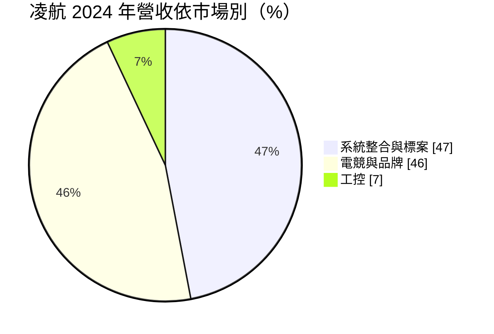
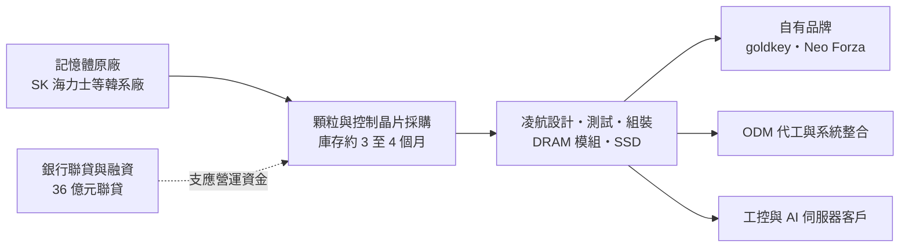
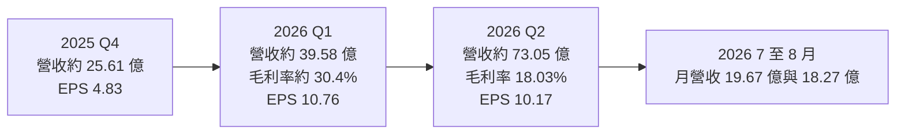
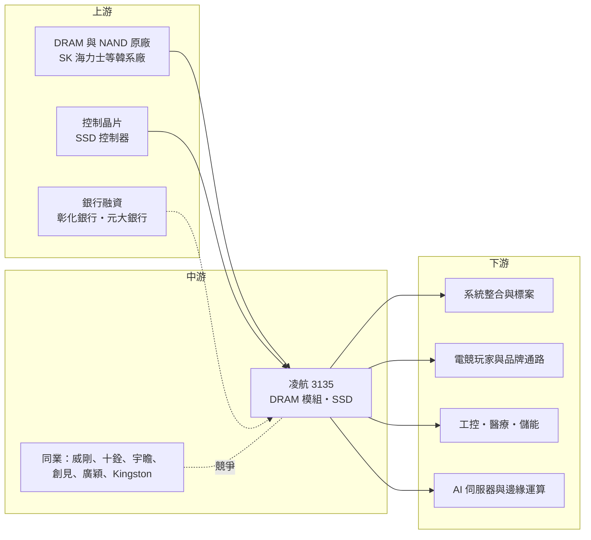

# 3135 凌航

> 上市｜[[產業索引-半導體業|半導體業]]｜上市（櫃）日期 2025/08/06

# 第一章：企業模式與商業藍圖

> [!info] 撰寫說明
> 本文由 Claude 依公開資料整理，架構比照 [[2330台積電]] 的四章研究，資料截至 2026-10-07。財務數字來源：科技新報 2025 年 7 月上市前業績發表會報導、旺得富（中時）2026 年 6 月與 7 月報導、優分析、富果研究（金玉峰投顧報告摘要）、玩股網 EPS 資料、Yahoo 股市月營收資料、nstock 公司概況；產業描述為整理性內容，尚未逐條比對原始文件。#待校對

在評估單一個股的長期投資價值時，首要步驟是拆解企業的底層獲利邏輯。本章針對凌航科技股份有限公司（股票代號：3135，以下簡稱凌航）的商業模式進行定性分析，說明一家記憶體模組廠如何在 2026 年記憶體「超級循環」中，營收與獲利出現數倍成長，以及這種成長的本質與風險。

## 一、核心定位：記憶體模組與儲存裝置的設計製造商

凌航成立於 1998 年 7 月，初期從事 IC 卡與讀卡機晶片組的研發製造，2007 年後轉型以記憶體應用、製造與銷售為主業，2025 年 8 月上市。董事長曾珍表示，公司產品「橫跨 DRAM 記憶體 IC、模組、Flash 快閃記憶體 IC 與 SSD」。

凌航的商業模式屬於[[DRAM模組]]廠，也就是向原廠採購記憶體顆粒，搭配電路板、控制晶片與韌體，組裝成記憶體模組或 [[SSD]]，再以品牌或代工方式銷售。這類公司有兩個特點：

* **顆粒成本占比極高：** 模組的成本絕大部分是 DRAM 與 NAND 顆粒，模組廠的附加價值在於規格設計、測試、客製化與通路。毛利率通常只有一成上下，但在記憶體漲價期間，低價買進的庫存會帶來大額「庫存利益」。
* **取得貨源的能力就是競爭力：** 缺貨時，誰能從原廠拿到顆粒，誰就能出貨。依科技新報報導，凌航的 DRAM 與 Flash 主要來自韓系原廠；旺得富報導提到公司將強化與 SK 海力士等國際原廠的合作。

凌航採雙軌模式：自有品牌 goldkey 與 Neo Forza 經營電競超頻與品牌市場，同時承接 ODM 代工與國際系統整合案。

## 二、終端應用與產品板塊：標案、電競與工控

依科技新報 2025 年 7 月報導，2024 年的市場結構如下：

* **系統整合與標案（47%）：** 承接國際系統整合商與政府、企業標案的記憶體與儲存需求。
* **電競與品牌（46%）：** 以 goldkey、Neo Forza 品牌銷售超頻記憶體與 SSD，主攻電競玩家。
* **工控（7%）：** 工業電腦、醫療、能源與儲能櫃等利基應用。依優分析整理，凌航與美系伺服器大廠合作，目標把工控營收占比由約 7% 提高到 10% 至 20%。

依產品別，2024 年 [[DRAM]] 占 68%、Flash 占 31%。依旺得富 2026 年 6 月報導，[[DDR5]] 占比由 2025 年的 50% 提升到 2026 年的 60% 以上。

## 三、資本轉化邏輯：庫存與資金就是產能

* **營運資金是成長上限：** 模組廠不需要晶圓廠，但必須預先準備大量現金採購顆粒。依旺得富報導，凌航完成新台幣 36 億元三年期聯合授信，由彰化銀行與元大銀行共同主辦，用途是「中期營運與原料週轉金，以確保原廠產能配額」。公司並規劃 2026 年透過擴大銀行融資、聯貸與資本市場等方式籌措 60 億至 100 億元。
* **庫存利益：** 依優分析整理，凌航維持 3 至 4 個月庫存，並有長期供貨協議與優先配貨地位；依富果研究摘要，2025 年第四季庫存增加 122%。在顆粒價格上漲時，提前買進的庫存以高價售出，毛利率大幅放大。

## 四、企業長期藍圖：AI 伺服器、工控與邊緣 AI

* **AI 伺服器記憶體：** 2026 年 COMPUTEX 推出 DDR5 伺服器記憶體（單條 16GB 至 64GB）、PCIe Gen5 企業級 SSD（容量達 15.36TB）與新一代 CQDIMM 規格。
* **工控與邊緣 AI：** 布局車用、機器人、邊緣運算、智慧醫療 AI NAS 與綠能 UPS 系統，以客製化產品提高毛利率穩定度。
* **從貿易型模組廠升級：** 長期目標是從價差導向的模組廠，轉型為以規格設計與客製化取勝的方案供應商，降低對記憶體價格循環的依賴。

# 第二章：護城河深度與競爭優勢

在長期價值投資中，「護城河」指企業抵禦競爭、維持超額利潤的保護機制。本章分析凌航在記憶體模組市場的競爭地位，以及這一波超額獲利有多少能留下來。

## 一、凌航護城河的核心組成要素

記憶體模組是競爭激烈、進入門檻不高的產業，凌航的護城河屬於「窄護城河」，主要由以下三個要素組成：

* **1. 原廠供貨關係：** 在缺貨期間，能否拿到顆粒決定一切。凌航有近 30 年記憶體經驗與韓系原廠的長期合作，是這一波能大量出貨的關鍵。
* **2. 資金與融資能力：** 上市後取得更多銀行授信，能在價格上漲前備足庫存。這在景氣上行期是優勢，但也放大了下行風險。
* **3. 工控與客製化認證：** 工控、醫療與伺服器客戶需要長期供貨與規格驗證，一旦導入不易更換，可帶來比電競與標案市場更穩定的毛利。

## 二、全球主要競爭對手格局

| 對手 | 定位 | 對凌航的威脅 |
|---|---|---|
| Kingston（金士頓） | 全球最大記憶體模組廠 | 規模與原廠議價力遠高於台灣模組廠 |
| [[3260威剛]] | 台灣最大記憶體模組品牌之一 | 品牌、通路與電競市場直接競爭 |
| [[4967十銓]] | 台灣電競記憶體品牌 | 在電競超頻記憶體與 SSD 直接競爭 |
| [[8271宇瞻]]、[[2451創見]]、[[4973廣穎]] | 台灣工控與品牌記憶體廠 | 在工控記憶體與儲存市場競爭 |

## 三、優勢轉化：哪些市場守得住、哪些守不住

* **守得住：** 已導入的工控、伺服器與標案客戶，這些客戶重視長期供貨與規格穩定。
* **守不住：** 電競與品牌市場。產品同質性高，價格透明，記憶體價格回落時，品牌模組廠往往要面臨削價與庫存跌價。
* **觀察重點：** 一是記憶體價格何時見頂，以及凌航如何調整庫存水位；二是工控與 AI 伺服器營收占比能否提高到 10% 至 20%；三是大規模融資後的負債比與利息負擔。

# 第三章：財務體質與盈利規模

資料日期：2026-10-07。數字取自財經媒體、EPS 與月營收資料網站，表格是撰寫當時的快照；最新月營收、毛利率、累計 EPS 由自動排程寫在本筆記的屬性欄位（月營收、毛利率、累計EPS 等）。#待校對

財務報表是檢驗護城河是否真實存在的最終標準。本章用三率、ROE、現金流與資本報酬，檢視凌航在記憶體超級循環中的獲利品質。

## 一、獲利能力的基石：三率

| 項目 | 2024 全年 | 2025 全年 | 2025 Q4 | 2026 Q1 | 2026 Q2 | 2026 上半年 |
|---|---|---|---|---|---|---|
| 營收（新台幣） | 未查得 | 77.04 億 | 約 25.61 億（推算） | 約 39.58 億（推算） | 約 73.05 億（推算） | 112.62 億 |
| [[毛利率]] | 未查得 | 未查得 | 未查得 | 約 30.4%（推算） | 18.03% | 22.36% |
| [[營業利益率]] | 未查得 | 未查得 | 未查得 | 未查得 | 16.44% | 20.31% |
| [[淨利率]] | 未查得 | 未查得 | 未查得 | 未查得 | 13.22% | 16.18% |
| EPS（元） | 2.37 | 6.33 | 4.83 | 10.76 | 10.17 | 20.87 |

註：季營收由月營收加總推算；第二季三率依 nstock，上半年三率依本筆記屬性欄位的財報資料，第一季毛利率由兩者回推。各季 EPS 依玩股網，加總與上半年 EPS 略有差異，可能因股本變動，#待校對。

* **營收：** 2026 年上半年營收 112.62 億元、年增 256%，已是 2025 年全年 77.04 億元的 1.46 倍。1 至 8 月累計 150.57 億元。
* **[[毛利率]]：** 第一季毛利率推估約 30%，第二季降到 18%。推估原因是第一季大量出售先前低價買進的庫存，第二季庫存成本逐漸反映新的高價顆粒，庫存利益縮小。這顯示凌航的高毛利率主要來自價格上漲，不是穩定的結構性獲利。
* **EPS：** 2026 年上半年 EPS 20.87 元，是 2025 年全年 6.33 元的三倍多；2024 年 EPS 2.37 元。富果研究摘要的投顧報告預估 2026 年營收 166.1 億元、EPS 35.64 元（推估，非公司財測）。

## 二、[[ROE]]：資本效率

模組廠屬輕資產但重營運資金，ROE 的高低主要由記憶體價格決定。2026 年上半年的 ROE 將處於歷史高點（推估，具體數值未查得）。需要留意的是，大規模融資會提高財務槓桿，ROE 的一部分來自負債放大，而不只是營運效率。

## 三、資本支出與自由現金流

* **[[CapEx]]：** 模組廠的資本支出主要是測試與組裝設備，金額相對營收很小（推估，具體金額未查得）。
* **營運資金：** 真正的資金需求在庫存與應收帳款。2025 年第四季庫存增加 122%，2026 年規劃籌資 60 億至 100 億元，營業現金流可能因備貨而轉弱（推估）。
* **股利：** 2024 年度現金股利 1.5 元，配發率超過 63%。依本筆記屬性欄位，2025 年度現金股利 4.1 元，以 EPS 6.33 元計，配發率約 65%（推算）。

## 四、[[ROIC]] 與 [[WACC]]：價值創造利差

凌航的投入資本以存貨與應收帳款為主。2026 年記憶體價格大漲，ROIC 遠高於 WACC（推估）。但記憶體模組廠的歷史顯示，高峰期累積的高價庫存，常在價格反轉時轉為跌價損失，把前一年的超額利潤吐回去。評估凌航應以完整景氣循環的平均 ROIC 為準，並特別留意價格見頂時的庫存水位。

# 第四章：總體風險與地緣政治

任何企業都無法脫離宏觀環境獨立存在。本章分析凌航未來必須面對的地緣政治、產業週期與營運風險。

## 一、地緣政治風險

* **原廠集中於韓國：** 顆粒主要來自韓系原廠，若韓國供應受地緣政治、出口管制或原廠策略影響，凌航缺乏替代來源。
* **美國關稅：** 記憶體模組與 SSD 若被納入美國關稅範圍，會影響美國系統整合與伺服器客戶的採購成本。
* **中國記憶體廠崛起：** 中國 DRAM 與 NAND 廠擴產，長期可能改變顆粒價格與供應結構。

## 二、產業週期與市場結構風險

* **記憶體價格反轉：** 這是凌航最大的風險。依富果研究摘要，DDR4 現貨價 2026 年初以來曾飆漲 2,287%，漲幅越大，回落時的衝擊也越大。一旦價格下跌，高價庫存會產生[[存貨跌價損失]]。
* **[[長鞭效應]]：** 缺貨期間客戶重複下單與超額備貨，需求被高估；景氣反轉時訂單會快速消失。
* **終端需求：** 電競與 PC 需求可能因記憶體漲價而轉弱，抵銷部分漲價效益。

## 三、營運環境的隱性風險

* **高槓桿營運：** 36 億元聯貸加上 60 億至 100 億元籌資計畫，代表凌航正以高槓桿擴大庫存，利率上升或價格反轉都會放大風險。
* **毛利率波動：** 2026 年第二季毛利率已較第一季明顯下滑，若顆粒成本持續上漲而售價跟不上，毛利率可能進一步壓縮。
* **上市時間短：** 2025 年 8 月才上市，市場對其治理與資訊揭露的檢驗時間較短。

## 四、科技演進風險

伺服器記憶體正快速從 DDR5 走向 MRDIMM、CQDIMM 等新規格，AI 伺服器也大量採用 [[HBM]] 與 [[CXL]] 記憶體擴充。HBM 直接封裝在 GPU 旁，模組廠無法參與；CXL 與新規格則需要更深的設計與驗證能力。凌航若要在 AI 伺服器市場取得穩定份額，需要持續投入新規格開發，否則可能被侷限在電競與標案等價格競爭激烈的市場。

# 專有名詞解析

## 半導體

- **[[DRAM]]**：動態隨機存取記憶體，斷電後資料會消失，是電腦與各類電子產品的主要工作記憶體。
- **[[DDR5]]**：第五代雙倍資料率 DRAM 規格，頻寬與容量高於 DDR4，是目前 PC 與伺服器的主流規格。
- **[[SSD]]**：固態硬碟，以 NAND Flash 儲存資料，速度遠快於傳統機械硬碟。
- **[[NAND Flash]]**：大容量非揮發性記憶體，斷電後資料仍保存，是 SSD 與手機儲存的主要元件。
- **[[HBM]]**：高頻寬記憶體，把多顆 DRAM 垂直堆疊並與 GPU 封裝在一起，主要用於 AI 加速器。

## 應用

- **[[CXL]]**：Compute Express Link，一種讓處理器與記憶體、加速器高速互連的介面標準，可擴充伺服器記憶體容量。
- **[[AI伺服器]]**：搭載 GPU 或 AI 加速晶片的伺服器，對記憶體容量與頻寬的需求遠高於一般伺服器。

## 金融

- **[[庫存利益]]**：原物料或零組件價格上漲時，以較低成本買進的庫存以高價售出所產生的額外利潤。
- **[[存貨跌價損失]]**：存貨的市價低於帳面成本時，依會計規定須認列的損失，記憶體價格下跌時常見。
- **[[聯合授信]]**：由多家銀行共同提供一筆貸款給企業，又稱聯貸，用於大額資金需求。
- **[[長鞭效應]]**：終端需求的小幅變動，沿供應鏈往上游傳遞時被逐級放大，造成上游庫存與訂單劇烈波動。

## 產業

- **[[DRAM模組]]**：把多顆 DRAM 顆粒焊在電路板上組成的記憶體條，模組廠向原廠買顆粒再組裝銷售。
- **[[ODM]]**：原始設計製造商，替品牌廠設計並生產產品。
- **[[電競]]**：電子競技，電競玩家對高頻超頻記憶體與高速 SSD 的需求高。

# 核心供應鏈

## 1. 上游：記憶體原廠與控制晶片
- DRAM 與 NAND 顆粒：SK 海力士等韓系原廠，另有 [[005930三星電子]]（推估為可能來源，公司僅揭露韓系廠商）
- SSD 控制晶片：[[8299群聯]] 等控制器廠（推估，公司未揭露）
- 融資：彰化銀行、元大銀行主辦 36 億元聯貸

## 2. 中游：凌航本身與同業
- 台灣模組同業：[[3260威剛]]、[[4967十銓]]、[[8271宇瞻]]、[[2451創見]]、[[4973廣穎]]
- 國際同業：Kingston

## 3. 下游：應用市場
- 系統整合商與政府、企業標案
- 電競玩家：goldkey、Neo Forza 品牌通路
- 工控、醫療、能源與儲能櫃客戶
- AI 伺服器與邊緣運算：與美系伺服器大廠合作（公司未揭露名稱）

## 最新新聞
<!-- news:start -->
<!-- news:end -->

## 相關連結
- [公開資訊觀測站](https://mopsov.twse.com.tw/mops/web/t05st03?step=1&firstin=1&co_id=3135)
- [Goodinfo](https://goodinfo.tw/tw/StockDetail.asp?STOCK_ID=3135)
- [Yahoo 股市](https://tw.stock.yahoo.com/quote/3135)
- [鉅亨網新聞](https://www.cnyes.com/twstock/3135/news)
