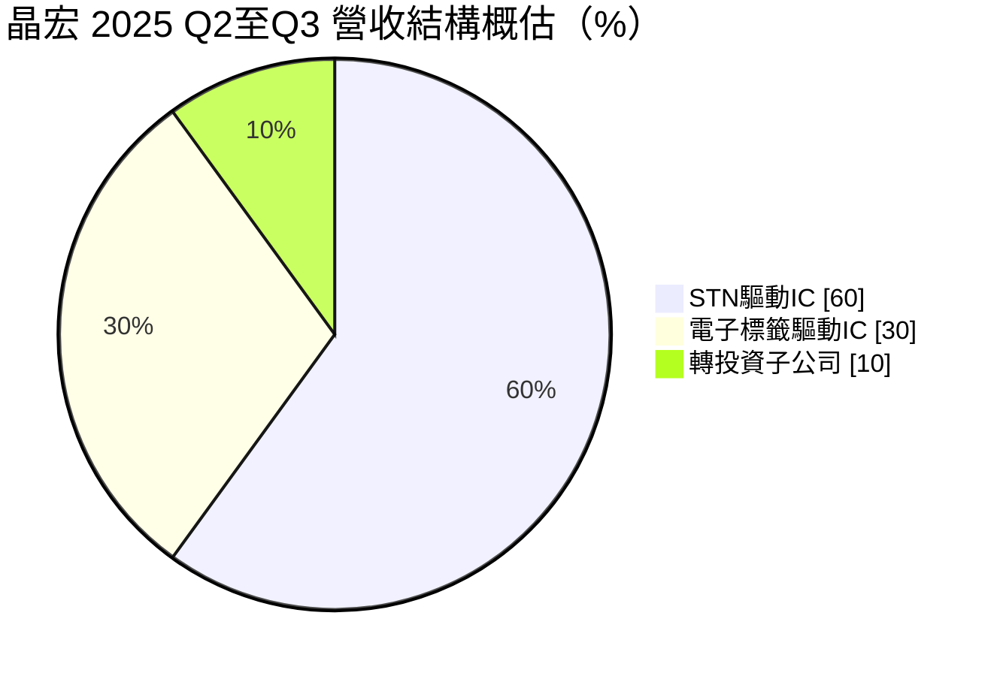
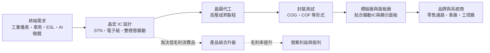
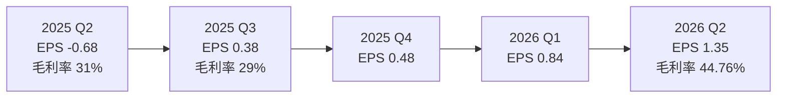
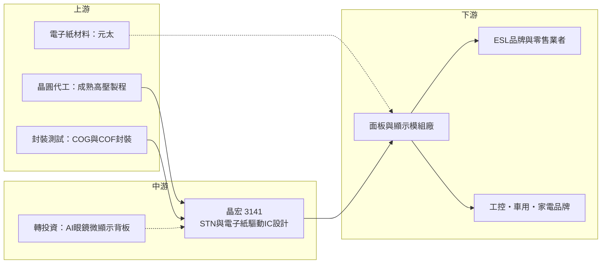

# 3141 晶宏

> 上櫃｜[[產業索引-半導體業|半導體業]]｜上市（櫃）日期 2014/03/14

# 第一章：企業模式與商業藍圖

> [!info] 撰寫說明
> 本文由 Claude 依公開資料整理，架構比照 [[2330台積電]] 的四章研究，資料截至 2026-10-07。財務數字來源：富果研究 2025 年 12 月法說會整理、nstock 公司資料頁、Winvest 營收快訊、Yahoo 股市 EPS 與新聞頁、玩股網毛利成長頁；產業描述為整理性內容，尚未逐條比對原始文件。#待校對

在評估單一個股的長期投資價值時，首要步驟是拆解企業的底層獲利邏輯。本章針對晶宏半導體（股票代號：3141，以下簡稱晶宏）的商業模式進行定性分析，說明一家以小尺寸顯示驅動 IC 起家的設計公司，如何從消費性市場轉向工業、車用與電子紙這些規格穩定、週期較長的利基市場。

## 一、核心定位：利基型顯示驅動 IC 設計公司

晶宏成立於 1999 年 8 月，2014 年 3 月掛牌上櫃，本業是「行動顯示器驅動 IC 產品之設計與銷售」。它屬於 [[Fabless]] IC 設計公司，自己不擁有晶圓廠，負責電路設計與客戶支援，晶圓製造委外給晶圓代工廠，封裝測試再交給封測廠。

晶宏的產品不是大尺寸電視或手機 AMOLED 的驅動 IC，而是兩類規模較小、但規格壽命很長的顯示器：

* **[[STN]] 液晶驅動 IC：** STN（超扭轉向列型）是較早期的單色或低色彩液晶技術，耗電低、成本低，至今仍大量用在工業儀表、家電面板、車用儀表與資訊顯示器。這類產品一旦設計進終端，常可出貨很多年。
* **[[電子紙]]驅動 IC：** 電子紙只有在畫面變化時耗電，畫面靜止時幾乎不需電力，主要用在[[電子貨架標籤]]（ESL）、電子書與看板。晶宏從黑白、三色一路做到四色電子紙驅動 IC。

董事長徐豫東在 2026 年的公開說明中表示，公司會逐步淘汰毛利率低的消費市場產品，把資源集中在工業與車用市場。這是理解晶宏近兩年毛利率回升的關鍵：營收規模不大（2025 全年約 16.14 億元），但每一顆晶片的單價與毛利是公司刻意挑選過的。

## 二、終端應用／產品板塊：STN 為底、電子紙與新顯示為成長引擎

依 2025 年 12 月法說會的說明，2025 年第二至第三季的營收大致分布如下（公司給的是區間，以下取中間值概算）：

* **STN 驅動 IC（約六成）：** 公司的穩定獲利基礎，毛利率高於公司平均。應用集中在工業儀表、車用與家電，法說會提到新能源車帶動車用 STN 需求持續成長。
* **電子標籤驅動 IC（約三成）：** 以電子貨架標籤為主。四色電子紙驅動 IC 依法說說明於 2025 年第二季開始量產，單價高於黑白與三色產品，是 2025 至 2026 年營收成長的主要來源。
* **轉投資子公司（一至二成）：** 轉投資超鉅科技（部分新聞寫作「超炫科技」），提供 AI 眼鏡用的矽基 OLED（[[OLEDoS]]）與矽基 LED 顯示背板，採 22 奈米製程，客戶是簽有保密協定的「全球一線大廠」，產品鎖定 2027 年上市的終端裝置。
* **[[雙穩態顯示]] IC（開發中）：** 公司已完成電漿與膽固醇液晶等雙穩態材料的驅動 IC，2026 年第三季送樣認證，依新聞說明預計 2027 年第二季後需求才會明顯放大。

## 三、資本轉化邏輯（營運模式）：輕資產、靠產品組合換取毛利

* **輕資產模式：** 晶宏不需投資晶圓廠，主要支出是研發人員、光罩與委外製造成本。這讓公司在營收規模不大時仍能獲利，但也代表晶圓代工價格、產能分配會直接影響成本。
* **營運槓桿明顯：** 研發與管理費用相對固定，營收一旦放大，營業利益會成倍成長。2026 年第二季毛利率 44.76%、營業利益率 15.76%，與 2025 年第二季單季虧損（EPS -0.68 元）形成強烈對比。
* **出貨型態：** 驅動 IC 通常以裸晶或捲帶形式交給面板模組廠，與面板一起貼合後再賣給終端品牌。因此晶宏的直接客戶多是模組廠，真正決定需求的則是零售業者（電子標籤）與工控、車用品牌。

## 四、企業長期藍圖：從顯示驅動走向低功耗顯示平台

* **四色電子紙放量：** 零售業導入彩色電子標籤做促銷標示，四色驅動 IC 的單價較高。2026 年 1 至 8 月累計營收 13.43 億元，年增 23.93%，8 月單月 2.42 億元、年增 79.77%，報導歸因於訂單需求成長。
* **雙穩態顯示：** 雙穩態材料可以在斷電後維持畫面，應用在戶外看板、運輸站牌與工業標示，是電子紙之外另一條低功耗路線。
* **AI 眼鏡微顯示：** 透過轉投資切入矽基 OLED 與矽基 LED 背板，若客戶產品如期在 2027 年上市，這會是晶宏首度從傳統驅動 IC 跨入高階微顯示，法說會表示子公司虧損正在快速收斂。
* **財務工具：** 2026 年董事會通過發行第四次無擔保轉換公司債，並辦理限制員工權利新股與庫藏股註銷，顯示公司在擴張研發的同時也在調整資本結構。

# 第二章：護城河深度與競爭優勢

在長期價值投資中，「護城河」指企業抵禦競爭、維持超額利潤的保護機制。本章分析晶宏的護城河構成、主要競爭對手，以及它在利基型驅動 IC 市場能守住多少。

## 一、護城河的核心組成要素

晶宏屬於規模小的利基型設計公司，護城河偏窄，主要來自三個要素：

* **1. 長生命週期產品的設計綁定：** 工業儀表與車用儀表的 STN 面板一旦設計定案，驅動 IC 往往跟著用很多年。更換驅動 IC 需要重新驗證顯示效果與可靠度，車用還要通過[[車規驗證]]，客戶轉換成本高。
* **2. 電子紙波形控制的技術累積：** 電子紙的顯示品質取決於驅動電壓波形（[[Waveform]]），不同顏色、溫度要用不同波形。四色電子紙比黑白更複雜，晶宏能較早量產四色驅動 IC，代表在波形調校上有一定累積。
* **3. 專注小市場的經濟性：** STN 與電子紙驅動 IC 市場規模不大，大型驅動 IC 廠把資源放在電視、手機與車用 TFT，對這些小市場投入有限，讓晶宏這類專業廠商有生存空間。

## 二、全球主要競爭對手格局

| 對手 | 定位 | 對晶宏的威脅 |
|---|---|---|
| [[8016矽創]] | 台灣中小尺寸驅動 IC 大廠，產品涵蓋 TFT、STN、電子紙 | 產品線最重疊，規模較大，可整包供貨 |
| [[4961天鈺]] | 鴻海集團驅動 IC 設計公司，含電子紙驅動 | 集團資源與面板客戶關係 |
| 中國驅動 IC 設計公司 | 以價格爭取中國模組廠與 ESL 廠 | 壓低黑白、三色電子紙與消費性 STN 報價 |
| [[3034聯詠]]、奇景光電 | 大型驅動 IC 廠（推估僅部分領域重疊） | 若大廠切入電子紙或車用小尺寸，可能擠壓價格 |

註：上表對手範圍為依產品線推估，各家在電子紙市場的實際市占未查得。

## 三、優勢轉化：守得住、守不住與觀察重點

* **守得住：** 車用、工業儀表的 STN 驅動 IC。這些客戶看重長期供貨與穩定品質，價格敏感度較低，也是公司毛利率高於平均的業務。
* **守不住：** 一般消費性產品與標準化的黑白電子標籤驅動 IC。中國競爭者以價格搶單，這也是公司主動淘汰低毛利消費產品的原因。
* **觀察重點：** 第一，四色電子紙驅動 IC 的出貨能否持續帶動毛利率維持在四成以上；第二，雙穩態顯示 IC 在 2027 年能否如期放量；第三，轉投資的 AI 眼鏡微顯示背板何時由虧轉盈。這三項決定晶宏能否從「穩定的小型驅動 IC 廠」轉型為有新成長曲線的公司。

# 第三章：財務體質與盈利規模

資料日期：2026-10-07。數字取自 Yahoo 股市 EPS 頁、nstock 公司資料頁、Winvest 營收快訊與富果研究法說會整理，表格是撰寫當時的快照；最新月營收、毛利率、累計 EPS 由自動排程寫在本筆記的屬性欄位（月營收、毛利率、累計EPS 等）。#待校對

財務報表是檢驗護城河是否真實存在的最終標準。本章用三率、ROE、現金流與資本報酬，檢視晶宏在產品轉型期的獲利品質。

## 一、獲利能力的基石：三率

| 項目 | 2025 全年 | 2025 前三季 | 2026 Q1 | 2026 Q2 |
|---|---|---|---|---|
| 營收（新台幣） | 16.14 億 | 12.29 億 | 2026 H1 合計 11.01 億 | （同左） |
| [[毛利率]] | 未查得 | 34% | 未查得 | 44.76% |
| [[營業利益率]] | 未查得 | 約 2.7%（推算） | 未查得 | 15.76% |
| EPS（元） | 0.54 | 0.05 | 0.84 | 1.35 |

註：2025 前三季營業利益率以營業淨利 3,319 萬元除以營收 12.29 億元推算。

* **[[毛利率]]：** 2025 年第二、三季毛利率只有 31% 與 29%，2026 年第二季跳升至 44.76%。依玩股網資料，2026 年第二季毛利額季增 50.54%、年增 61.82%，代表毛利改善來自產品組合（四色電子紙、車用 STN），而非單純營收放大。
* **[[營業利益率]]：** 2025 年前三季營業利益只有 3,319 萬元，2026 年第二季營業利益率已達 15.76%，顯示費用結構固定、營收與毛利回升後的營運槓桿。
* **業外因素：** 2025 年前三季稅後淨利只有 407 萬元，EPS 0.05 元，與營業利益落差大，主因是約 5,000 萬元的匯兌損失與轉投資虧損。晶宏以美元報價為主，新台幣匯率變動會直接影響業外損益，評估本業時應以營業利益為準。

## 二、[[ROE]]：資本效率

2025 年第三季底每股淨值 32.93 元，2026 年上半年累計 EPS 2.19 元，單看上半年的年化 ROE 約在一成出頭（推估）。2025 全年 EPS 只有 0.54 元，ROE 約 1.6%（推估）。晶宏的 ROE 波動很大，主要取決於產品組合與匯兌、轉投資損益，而非資產效率；輕資產的設計公司，ROE 的改善主要來自淨利率回升。

## 三、資本支出與自由現金流

* **[[CapEx]]：** 作為 Fabless 公司，晶宏的資本支出主要是研發設備、光罩與辦公設施，金額相對營收很小（具體數字未查得）。
* **[[自由現金流]]：** 營業現金流主要受存貨與應收帳款波動影響。2026 年發行可轉換公司債，推估是為了支應研發擴張與轉投資子公司營運資金。
* **股利：** 新聞報導 2025 年度配發現金股利 0.255 元，另有資料記載 2025 年第四季配息 0.36 元，兩者口徑不一致，需以公司公告為準。

## 四、[[ROIC]] 與 [[WACC]]：價值創造利差

晶宏 2024 至 2025 年的獲利偏低，投入資本報酬率推估低於一般股權資金成本，處於「價值未被創造」的階段。2026 年上半年營業利益率回到 15% 以上，若下半年維持，ROIC 有機會重新高於 WACC。關鍵在於轉投資子公司的虧損何時停止，因為那部分資本目前仍在消耗股東權益。

# 第四章：總體風險與地緣政治

任何企業都無法脫離宏觀環境獨立存在。本章分析晶宏未來必須面對的地緣政治、產業週期與營運風險。

## 一、地緣政治

* **中國供應鏈與客戶：** 電子紙模組與電子標籤的組裝大量集中在中國，中國的 ESL 品牌與模組廠是重要出貨對象（推估）。美中貿易摩擦或關稅可能改變模組廠的採購來源，中國客戶也可能被要求改用本土驅動 IC。
* **晶圓代工產能集中台灣：** 晶宏的晶圓主要由台灣成熟製程代工廠生產（推估），與其他台灣 IC 設計公司一樣面臨兩岸風險。

## 二、產業週期與市場結構

* **電子標籤的專案型需求：** 零售業者導入電子貨架標籤常以大型專案方式採購，某個客戶一次換裝會讓營收突然放大，換裝完畢後又回落。2025 年 12 月法說就預告 2026 年第一季電子標籤需求可能趨緩，這種專案型波動是晶宏營收起伏的主因之一。
* **[[長鞭效應]]：** 工業與車用客戶在缺貨期會超額下單、景氣反轉時去化庫存，驅動 IC 作為上游零件，波動會被放大。
* **價格競爭：** 黑白與三色電子紙驅動 IC 已逐漸標準化，中國同業以價格競爭，毛利率可能被壓縮。

## 三、營運環境的隱性風險

* **匯率：** 2025 年前三季因匯兌損失約 5,000 萬元，幾乎吃光本業獲利，新台幣大幅升值時，業外損益可能再次侵蝕 EPS。
* **轉投資執行風險：** AI 眼鏡用微顯示背板的客戶產品預計 2027 年上市，如果客戶延後或改採其他供應商，子公司虧損收斂將延遲。
* **股本稀釋：** 可轉換公司債轉換與限制員工權利新股，都可能稀釋每股盈餘。

## 四、科技或法規演進

* **顯示技術替代：** STN 屬於舊世代技術，部分應用正被小尺寸 TFT 取代。晶宏的策略是抓住仍偏好 STN 的工業與車用市場，但長期市場規模可能萎縮。
* **電子紙的技術路線：** 彩色電子紙仍在演進，若面板材料商（如 [[8069元太]]）改變彩色技術架構，驅動 IC 需跟著重新設計。
* **法規：** 歐洲對零售業節能與數位價格標示的推動，對電子標籤需求有利；車用則須持續符合功能安全與可靠度標準。

# 專有名詞解析

## 半導體

- **[[OLEDoS]]**：矽基 OLED，把 OLED 發光層直接做在矽晶片背板上，畫素密度極高，用於 AR/VR 與 AI 眼鏡。
- **[[Fabless]]**：只做 IC 設計、晶圓製造全部委外的半導體公司經營模式。

## 應用

- **[[電子貨架標籤]]**：以電子紙取代紙本價格標籤，可由系統遠端更新價格，簡稱 ESL。
- **[[車規驗證]]**：車用晶片須通過 AEC-Q100 等可靠度測試與車廠認證，流程常需 2 至 3 年，因此轉換成本高。

## 金融

- **[[毛利率]]**：毛利除以營收，反映產品定價能力與成本控制。
- **[[營業利益率]]**：營業利益除以營收，扣除研發、銷售與管理費用後的本業獲利能力。
- **[[自由現金流]]**：營業活動現金流減去資本支出，代表企業可自由用於配息、還債或併購的現金。
- **[[長鞭效應]]**：終端需求的小幅變動，沿供應鏈往上游傳遞時被逐級放大，造成上游庫存與訂單劇烈波動。

## 產業

- **[[STN]]**：超扭轉向列型液晶顯示技術，成本低、耗電低，多為單色或少色顯示，常見於工業儀表、家電與車用儀表。
- **[[電子紙]]**：靠帶電粒子移動成像的反射式顯示器，只有畫面改變時耗電，常用於電子書與電子貨架標籤。
- **[[雙穩態顯示]]**：斷電後仍能維持畫面的顯示技術，例如膽固醇液晶，適合長時間顯示靜態資訊。
- **[[Waveform]]**：電子紙驅動波形，控制每次換畫面時施加的電壓序列，決定顯示顏色與殘影品質。

# 核心供應鏈

## 1. 上游：晶圓代工與封裝測試
- 成熟高壓製程晶圓代工（推估，實際代工廠未查得）：[[2303聯電]]、[[5347世界先進]]、[[6770力積電]]
- 驅動 IC 封裝測試（推估）：[[6147頎邦]]、[[8150南茂]]

## 2. 中游：晶宏本身與轉投資
- STN、電子紙、雙穩態顯示驅動 IC 設計
- 轉投資超鉅科技：AI 眼鏡用矽基 OLED 與矽基 LED 背板

## 3. 下游：面板模組與終端客戶
- 電子紙面板材料：[[8069元太]]
- 電子貨架標籤品牌：SES-imagotag、漢朔、Pricer 等（推估，晶宏實際客戶未公開）
- 工業儀表、車用儀表與家電品牌

## 4. 同業
- [[8016矽創]]、[[4961天鈺]]

## 最新新聞
<!-- news:start -->
<!-- news:end -->

## 相關連結
- [公開資訊觀測站](https://mopsov.twse.com.tw/mops/web/t05st03?step=1&firstin=1&co_id=3141)
- [Goodinfo](https://goodinfo.tw/tw/StockDetail.asp?STOCK_ID=3141)
- [Yahoo 股市](https://tw.stock.yahoo.com/quote/3141)
- [鉅亨網新聞](https://www.cnyes.com/twstock/3141/news)
