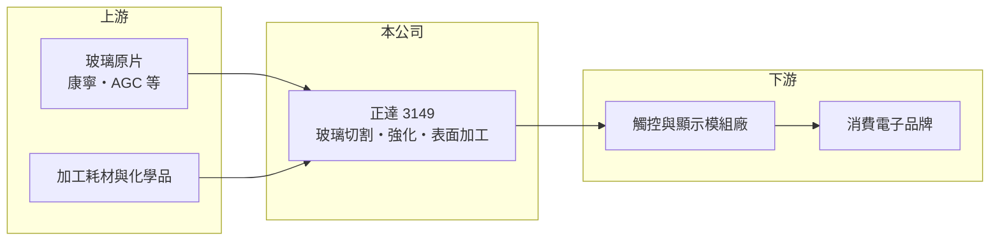

# 3149 正達

> 上市｜[[產業索引-光電業|光電業]]｜上市（櫃）日期 2011/11/23

# 第一章：企業模式與商業藍圖

> [!info] 撰寫說明
> 精簡版，由 Claude 依公開資料整理，架構比照 [[2330台積電]]，資料截至 2026-10-07。來源：nstock.tw 正達公司概況、winvest.tw 營收快訊。公開資料有限，營收比重未查到。#待校對

正達是玻璃加工廠，營收回升但仍處於毛利為負的虧損狀態。

- **核心業務：** 正達國際光電成立於 1996 年，總部位於苗栗縣銅鑼鄉，業務為玻璃及玻璃製品、電子零組件製造與國際貿易，推估以手機、平板等電子產品的[[蓋板玻璃]]加工為主。
- **營收結構：** 本次未查到產品與客戶營收比重。
- **營運據點：** 總部與主要廠區位於苗栗銅鑼（推估），其他據點本次未查到。
- **長期方向：** 2026 年營收年增一成以上，但仍虧損；能否找到毛利較高的新玻璃應用，是轉虧為盈的關鍵。

# 第二章：護城河深度與競爭優勢

正達的技術基礎在玻璃切割、[[化學強化]]與表面加工，但消費電子玻璃市場競爭激烈。

- **競爭優勢：** 長年累積的玻璃加工製程經驗，可承接客製尺寸與表面處理需求。
- **主要對手：** 中國的藍思科技、伯恩光學等大型蓋板玻璃廠，規模遠大於正達。
- **觀察重點：** 毛利率何時轉正；市值約 217 億元，遠高於營收規模，市場賦予的新應用題材是否有實際訂單支撐，需以公司說明確認。

# 第三章：財務體質與盈利規模

資料日期：2026-10-07，以下數字是撰寫當時的快照；最新月營收、毛利率、累計 EPS 由自動排程寫在本筆記的屬性欄位（月營收、毛利率、累計EPS 等）。#待校對

正達營收成長，但第二季毛利率仍為負值。

- **營收規模：** 2025 年全年營收 22.83 億元；2026 年 1 至 8 月累計 15.52 億元、年增 13.11%，6 至 8 月單月營收約 1.9 億至 2.1 億元，年增 19% 至 26%。
- **獲利：** 2026 年第二季 EPS -0.48 元，[[毛利率]] -3.23%，[[營業利益率]] -19.28%，淨利率 -19.42%，ROE -4.44%。
- **財務特色：** 資本額約 22.62 億元，近五年沒有配息紀錄。

# 第四章：總體風險與地緣政治

正達的風險在於長期虧損與題材驅動的股價波動。

- **產業週期：** 蓋板玻璃需求跟著手機與平板出貨起伏，新機規格變動會影響訂單。
- **營運風險：** 毛利率為負代表[[產能利用率]]或報價不足以支應成本，若營收無法持續放大，虧損可能延續。
- **其他風險：** 股價與市值大幅領先基本面，評價波動風險高；能源與原料玻璃價格、匯率影響成本。

# 專有名詞解析

## 應用

- **[[蓋板玻璃]]**：覆蓋在手機、平板與觸控螢幕最外層的保護玻璃，需耐刮、耐摔並保持高透光。

## 金融

- **[[產能利用率]]**：實際使用產能占總產能的比例，固定成本高的製造業毛利率高度取決於此數字。

## 產業

- **[[化學強化]]**：把玻璃浸入熔融鹽中，以離子交換在表面形成壓應力層，大幅提高玻璃的抗摔強度。

# 核心供應鏈

- 上游：玻璃原片（康寧、AGC 等，推估）、加工耗材與化學品供應商
- 下游／客戶：觸控與顯示模組廠、消費電子品牌（推估）
- 同業：藍思科技、伯恩光學

## 最新新聞
<!-- news:start -->
<!-- news:end -->

## 相關連結
- [公開資訊觀測站](https://mopsov.twse.com.tw/mops/web/t05st03?step=1&firstin=1&co_id=3149)
- [Goodinfo](https://goodinfo.tw/tw/StockDetail.asp?STOCK_ID=3149)
- [Yahoo 股市](https://tw.stock.yahoo.com/quote/3149)
- [鉅亨網新聞](https://www.cnyes.com/twstock/3149/news)
