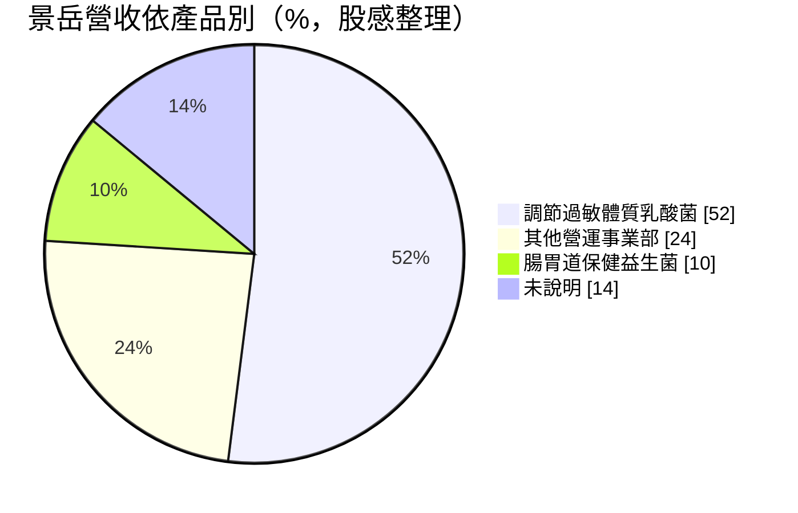
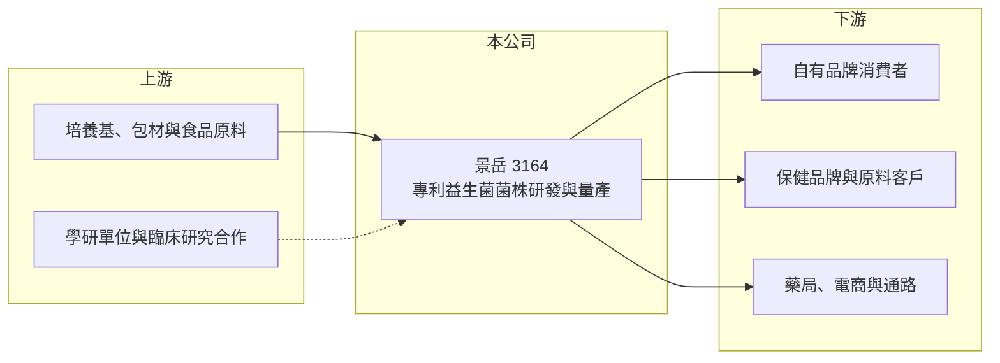

# 3164 景岳

> 上市｜[[產業索引-生技醫療業|生技醫療業]]｜上市（櫃）日期 2010/03/22

# 第一章：企業模式與商業藍圖

> [!info] 撰寫說明
> 精簡版，由 Claude 依公開資料整理，架構比照 [[2330台積電]] 的四章研究，資料截至 2026-10-08。來源：Goodinfo 年度經營績效頁（2020 至 2025 年）、證交所開放資料（基本資料、2026 年第二季資產負債與綜合損益、營益分析、股利）、股感財務頁（營收比重）；憑既有知識撰寫的部分已標「待校對」。公開資料有限。#待校對

景岳生物科技（股票代號：3164，以下簡稱景岳）是以專利 [[益生菌]] 菌株為核心的保健食品公司。它的商業模式是把實驗室篩選出的特定菌株，經過功能性研究與量產，做成自有品牌產品或賣給其他品牌當原料。

- **核心業務：** 景岳成立於 2000 年、2010 年上市，總部與工廠位於台南科學工業園區，董事長為陳根德（證交所開放資料）。公司的主力是具有調節過敏體質功能的乳酸菌產品，另有腸胃道保健益生菌與其他機能性食品。益生菌產業的差異化來自菌株本身，誰擁有經過臨床研究驗證的專利菌株，誰就能訂出較高的價格。
- **營收結構：** 依股感整理的營收比重，調節過敏體質乳酸菌產品占 52%、其他營運事業部占 24%、腸胃道保健益生菌占 10%，其餘約 14% 未說明（期間未標示）。過敏調節菌株是景岳最具代表性的產品線，這也代表公司的營收相當集中在單一功能訴求。
- **營運據點：** 研發與生產集中在南科廠區，產品以台灣市場為主，並以原料或成品形式外銷（外銷比重未查得）。景岳同時經營自有品牌與原料供應兩種模式，自有品牌毛利較高，原料供應則能擴大菌株的使用量。#待校對
- **長期方向：** 益生菌市場的長期成長動能來自人口老化、過敏人口增加與預防保健意識。景岳的機會在於把已驗證的菌株授權或供應給更多國內外品牌，並把功能訴求擴展到更多健康領域；挑戰則是保健食品市場進入門檻低、品牌競爭激烈。

# 第二章：護城河深度與競爭優勢

景岳的護城河建立在菌株專利與研究資料上，但保健食品的通路競爭很激烈，研發優勢不一定能轉成市占率。

- **競爭優勢：** 專利菌株與功能性研究需要多年累積，其他業者無法直接複製同一株菌的研究成果。景岳的毛利率長期在 60% 以上（Goodinfo），明顯高於一般食品業，反映菌株的差異化確實帶來定價能力。
- **主要對手：** 國內有同樣以益生菌為主力的 [[1707葡萄王]]、[[4128中天]] 等業者，國際上則有大型菌株原料商與跨國保健品牌。消費者通路端還要面對藥妝、電商與直銷品牌的競爭，行銷費用是獲利的主要壓力。
- **觀察重點：** 第一，營業利益率由 2021 年的 29.2% 降到 2023 年的 2.2%，再回到 2025 年的 14.4%，費用控制與營收規模能否恢復到過去水準；第二，外銷與原料授權能否成為新的成長來源；第三，新菌株的研究成果能否轉化為產品。

# 第三章：財務體質與盈利規模

資料日期：2026-10-08，表格是撰寫當時的快照；最新月營收、毛利率、累計 EPS 由自動排程寫在本筆記的屬性欄位（月營收、毛利率、累計EPS 等）。#待校對

景岳的財務特色是高毛利、低負債，但營收規模小，獲利對費用變動很敏感。

| 年度 | 營收（新台幣） | [[毛利率]] | [[營業利益率]] | EPS（元） | [[ROE]] |
|---|---|---|---|---|---|
| 2020 | 3.25 億 | 66.2% | 21.8% | 0.69 | 4.11% |
| 2021 | 4.28 億 | 69.9% | 29.2% | 1.31 | 7.29% |
| 2022 | 3.69 億 | 69.7% | 16.8% | 0.66 | 3.14% |
| 2023 | 3.18 億 | 66.4% | 2.2% | 0.38 | 1.52% |
| 2024 | 3.85 億 | 61.8% | 10.5% | 0.66 | 3.26% |
| 2025 | 4.01 億 | 62.7% | 14.4% | 0.66 | 3.28% |
| 2026 上半年 | 1.93 億 | 56.8% | 3.9% | 0.23 | 未查得 |

- **營收規模：** 2020 至 2025 年營收年複合成長率約 4.3%（推算），營收在 3 億至 4.3 億元之間波動，尚未突破明顯的規模門檻。2026 年上半年毛利率降到 56.8%，營業利益率 3.9%（證交所營益分析），獲利仍受費用拖累。
- **獲利：** 毛利率雖高，但 2021 至 2025 年平均 ROE 只有約 3.7%（推算）。原因是股東權益約 14.3 億元（2026 年第二季底），相對於每年數千萬元的淨利偏大，資本使用效率不高。
- **財務特色：** 2026 年第二季底總負債約 2.42 億元、負債比約 14%（證交所開放資料），財務保守。2025 年度配發盈餘現金股利 0.6 元與資本公積現金 0.2 元，合計 0.8 元高於當年 EPS 0.66 元（證交所股利資料），部分股利來自資本公積而非當年盈餘，長期不一定能維持。

**[[ROIC]] 與 [[WACC]]：**
- ROIC（推算）：2025 年營業利益約 4.01 億元 × 14.4% ≈ 0.58 億元，稅後約 0.46 億元；投入資本以股東權益 14.29 億元加上推估的有息負債約 1 億元（非流動負債 0.88 億元的大部分，假設），合計約 15.3 億元，ROIC 約 3.0%（推算）。
- WACC（推算）：無風險利率 1.75%、市場風險溢酬 6%，β 取保健食品股常見值 0.8（假設），股東權益成本約 6.6%；負債成本 2.5%、稅後 2.0%，負債占比約 7%，WACC 約 6.3%（推算）。
- 結論：ROIC 低於 WACC，代表以目前的規模與費用結構，景岳尚未替股東創造超過資金成本的報酬。改善的關鍵是擴大營收、讓高毛利真正轉成營業利益。

# 第四章：總體風險與地緣政治

景岳的長期風險集中在保健食品市場的競爭、法規與產品集中度。

- **產業週期：** 保健食品屬於非必需消費，景氣轉弱時消費者會縮減支出。益生菌又是競爭最激烈的品類之一，新品牌不斷進入，價格與行銷費用壓力長期存在。
- **營運風險：** 營收過半集中在調節過敏體質的乳酸菌產品，若相關功能訴求受法規限制、或競爭菌株推出更強的臨床證據，營收可能受影響。小型公司的營業利益率對行銷費用變動很敏感，2023 年營業利益率一度只有 2.2% 就是例子。
- **其他風險：** 保健食品的功效宣稱受衛福部健康食品認證與廣告法規管理，外銷則要面對各國不同的法規。食品安全事件也可能衝擊整個保健食品產業的信任度。

# 專有名詞解析

## 金融

- **[[ROIC]]**：投入資本報酬率，稅後營業利益除以股東權益與有息負債的合計，衡量本業對所有資金提供者的報酬。
- **[[WACC]]**：加權平均資金成本，依股東權益與負債的比重加權計算的資金成本，ROIC 高於它才代表創造價值。

## 產業

- **[[益生菌]]**：對人體有益的活性微生物，常見為乳酸菌與比菲德氏菌，功能因菌株而異。
- **[[專利菌株]]**：經篩選、鑑定並取得專利保護的特定菌株，通常附有功能性研究，是益生菌業者的差異化來源。
- **[[健康食品認證]]**：台灣衛福部對具科學證據的保健功效核發的認證，取得後才能標示特定保健功效。

# 核心供應鏈

- 上游：發酵用培養基、包材與食品原料供應商，以及合作進行菌株研究的學研與醫療單位。
- 下游／客戶：自有品牌消費者、採購益生菌原料的國內外保健品牌、藥局與電商通路。
- 同業：[[1707葡萄王]]、[[4128中天]] 與國際益生菌原料商。#待校對

## 最新新聞
<!-- news:start（自動產生，請勿手動編輯此範圍） -->
- 2026-10-07 🏛️ 重訊 16:41｜公告本公司申請股票上櫃轉上市時所出具之承諾事項 暨其後續執行情形｜[觀測站](https://mops.twse.com.tw/mops/#/web/t05st01)

完整紀錄：[[3164景岳 新聞]]
<!-- news:end -->

## 相關連結
- [公開資訊觀測站](https://mopsov.twse.com.tw/mops/web/t05st03?step=1&firstin=1&co_id=3164)
- [Goodinfo](https://goodinfo.tw/tw/StockDetail.asp?STOCK_ID=3164)
- [Yahoo 股市](https://tw.stock.yahoo.com/quote/3164)
- [鉅亨網新聞](https://www.cnyes.com/twstock/3164/news)
