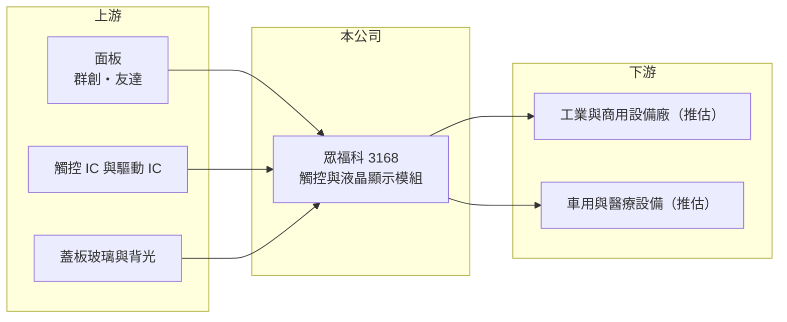

# 3168 眾福科

> 上市｜[[產業索引-光電業|光電業]]｜上市（櫃）日期 2024/03/26

# 第一章：企業模式與商業藍圖

> [!info] 撰寫說明
> 精簡版，由 Claude 依公開資料整理，架構比照 [[2330台積電]]，資料截至 2026-10-07。來源：nstock.tw 眾福科公司概況、winvest.tw 營收快訊。營收比重未查到。#待校對

眾福科是觸控顯示模組設計製造商，2024 年上市，獲利穩定且配息率高。

- **核心業務：** 眾福科技成立於 1997 年，2024 年 3 月上市，業務為觸控式液晶顯示模組與液晶顯示模組（[[LCM]]）的設計、製造與銷售，結合[[電容式觸控]]與面板整合。
- **營收結構：** 本次未查到產品與應用營收比重；推估以工業、商用等中小尺寸客製顯示模組為主。
- **營運據點：** 生產與營運據點本次未查到，本文不推測。
- **長期方向：** 2026 年前三季營收年增 16%，持續擴大客製模組業務，成長來源需以法說資料確認。

# 第二章：護城河深度與競爭優勢

眾福科的優勢在客製化設計能力，可以把面板、觸控與驅動整合成客戶要的規格。

- **競爭優勢：** 中小尺寸客製模組訂單量小、規格多，需要長期配合的設計與品質驗證，客戶導入後較少更換供應商（推估）。
- **主要對手：** 國內可對照 [[8105凌巨]]、[[3673TPK-KY]]，以及中國的中小尺寸模組廠。
- **觀察重點：** 營收成長能否維持，以及毛利率能否守在兩成以上。

# 第三章：財務體質與盈利規模

資料日期：2026-10-07，以下數字是撰寫當時的快照；最新月營收、毛利率、累計 EPS 由自動排程寫在本筆記的屬性欄位（月營收、毛利率、累計EPS 等）。#待校對

眾福科營收與獲利同步成長，配息水準在同業中偏高。

- **營收規模：** 2025 年全年營收 34.34 億元；2026 年 1 至 9 月累計 30.1 億元、年增 16.45%，8 月營收 3.82 億元、年增 38.86%，9 月 3.69 億元、年增 7.59%。
- **獲利：** 2025 年全年 EPS 2.61 元；2026 年第二季 EPS 0.83 元、季增 38.33%，上半年累計 1.43 元；第二季[[毛利率]] 23.06%，[[營業利益率]] 8.54%，淨利率 7.79%。
- **財務特色：** 資本額約 7.51 億元；2025 年配發現金股利 3 元，現金[[殖利率]]約 6.17%（以撰寫當時股價 42.4 元計）。

# 第四章：總體風險與地緣政治

眾福科的風險在於面板價格與下游需求變化。

- **產業週期：** 顯示模組需求跟著工業、商用設備的資本支出起伏。
- **營運風險：** 面板是主要成本，面板報價上漲而無法轉嫁時毛利率會下滑；客製訂單集中於少數客戶時營收波動大（推估）。
- **其他風險：** 匯率波動，以及中國模組廠的價格競爭。

# 專有名詞解析

## 半導體

- **[[電容式觸控]]**：偵測手指接觸造成的微小電容變化來判斷位置的觸控技術，是筆電觸控板與手機螢幕的主流。

## 應用

- **[[LCM]]**：液晶顯示模組，把面板、背光、驅動 IC 與外框組裝成可直接裝機的顯示單元。

## 金融

- **[[殖利率]]**：每年現金股利除以股價，用來衡量以現價買進可領回的現金報酬。

# 核心供應鏈

- 上游：面板 [[3481群創]]、[[2409友達]]；觸控與驅動 IC、蓋板玻璃與背光供應商
- 下游／客戶：工業、商用、車用與醫療設備廠（推估）
- 同業：[[8105凌巨]]、[[3673TPK-KY]]

## 最新新聞
<!-- news:start -->
<!-- news:end -->

## 相關連結
- [公開資訊觀測站](https://mopsov.twse.com.tw/mops/web/t05st03?step=1&firstin=1&co_id=3168)
- [Goodinfo](https://goodinfo.tw/tw/StockDetail.asp?STOCK_ID=3168)
- [Yahoo 股市](https://tw.stock.yahoo.com/quote/3168)
- [鉅亨網新聞](https://www.cnyes.com/twstock/3168/news)
