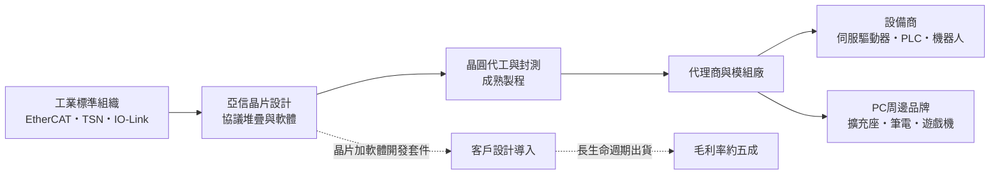
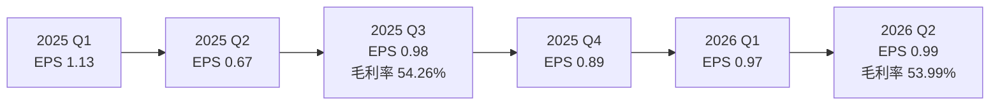
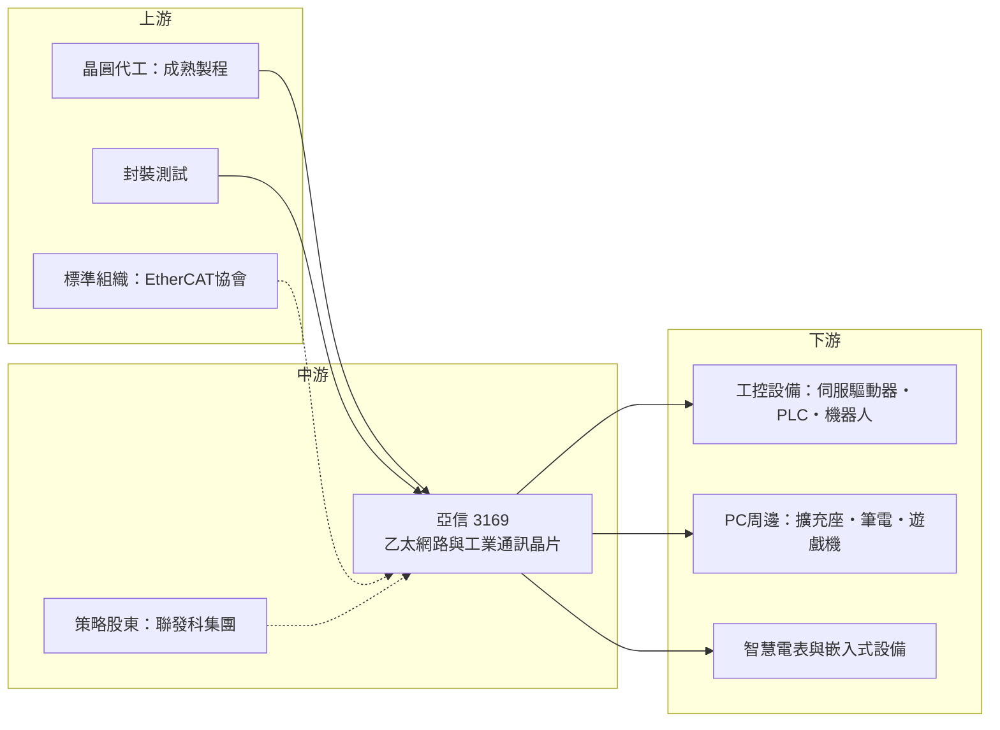

# 3169 亞信

> 上櫃｜[[產業索引-半導體業|半導體業]]｜上市（櫃）日期 2009/11/24

# 第一章：企業模式與商業藍圖

> [!info] 撰寫說明
> 本文由 Claude 依公開資料整理，架構比照 [[2330台積電]] 的四章研究，資料截至 2026-10-07。財務數字來源：亞信 2025 年 11 月法說會整理（poorstock）、工商時報 2025 年 11 月與 2023 年 4 月報導、nstock 公司資料頁、Yahoo 股市 EPS 頁、Winvest 營收快訊、蕃新聞 2025 年 12 月 EtherCAT 技術報導；產業描述為整理性內容，尚未逐條比對原始文件。#待校對

在評估單一個股的長期投資價值時，首要步驟是拆解企業的底層獲利邏輯。本章針對亞信電子（股票代號：3169，以下簡稱亞信）的商業模式進行定性分析，說明一家營收規模不到新台幣 10 億元的網通 IC 設計公司，如何靠工業通訊的利基晶片維持五成以上的毛利率，並連續 25 年獲利。

## 一、核心定位：工業與嵌入式乙太網路晶片的專業設計公司

亞信成立於 1995 年 5 月，是 [[Fabless]] IC 設計公司，專注於「讓各種裝置接上網路」的晶片。產品可分為三條線：

* **乙太網路控制晶片：** 包括 USB 轉乙太網路晶片（筆電與擴充座用）、嵌入式乙太網路控制器（讓 [[MCU]] 接上網路），以及工業乙太網路晶片（[[EtherCAT]]、[[TSN]]）。
* **介面橋接晶片：** PCIe 橋接、USB 橋接、UART 收發器，以及工業感測器常用的 [[IO-Link]] 通訊協議軟體。
* **微控制器與 SoC：** USB KVM 切換器 SoC、乙太網路 SoC，以及結合 EtherCAT 從站控制與雙核 MCU 的工控晶片。

亞信的定位不是跟 [[2379瑞昱]] 或博通比拚高速網通的出貨量，而是在「量不大、規格門檻高、生命週期長」的工業網路晶片中建立地位。公司自 2000 年以來連續 25 年獲利，2021 年 [[2454聯發科]]集團取得約 20% 股權，成為重要的策略股東。

## 二、終端應用／產品板塊：從 PC 周邊轉向工業物聯網

依 2025 年 11 月法說會，亞信的應用市場分為三大塊（各自營收比重未查得，因此不繪製圓餅圖）：

* **工業物聯網：** 人形機器人、協作型機器人、EtherCAT 系統、馬達控制與智慧電表，是公司最強調的成長領域。
* **PC 及周邊：** USB 擴充座、筆電網路轉接、POS 機與車載系統。2023 年報導提到客戶包括 [[AAPL蘋果]]、任天堂 Switch 周邊與前五大筆電品牌，這部分屬消費性需求，波動較大。
* **智慧家庭與辦公：** 印表機、網路攝影機等需要嵌入式網路功能的設備。

產品重心正在移動。2023 年第一季營收年減 43.3%，主因是消費性客戶去化庫存；此後公司把研發集中在工業乙太網，2025 年前三季營收約 6.5 億元、年增 13%，毛利率反而提升到 53%，顯示工控產品的占比與單價都在提高。

## 三、資本轉化邏輯（營運模式）：高毛利、低資本的利基 IC 模式

* **晶片加軟體：** 工業通訊晶片的價值不只在硬體，還包括通訊協議堆疊、驅動程式與參考設計。亞信的 AX58400 雙核 MCU 支援 STM32 生態系統，讓客戶可以沿用既有開發工具，縮短設計時間。
* **一次導入、長期出貨：** 工控設備的產品壽命常達 10 年以上，客戶一旦採用某顆 EtherCAT 晶片，後續多年都會持續採購，這是亞信毛利率能長期維持在五成上下的原因。
* **輕資產：** 晶圓製造與封測全部委外，資本額約 6.33 億元，營運需要的主要是研發人力。

## 四、企業長期藍圖：機器人與 TSN

* **人形機器人與靈巧手：** 人形機器人需要數十到上百個馬達同步運作，EtherCAT 的低延遲與菊花鏈拓樸適合這類應用。亞信的 AX58101 分歧器在 8 埠設計中只需 3 顆晶片搭配 2 顆外接 PHY，傳統方案則需至少 6 顆 EtherCAT 晶片與 6 顆 PHY，可降低體積與成本。
* **新一代 EtherCAT 與 TSN：** 法說會表示 2026 年推出新一代 EtherCAT 產品；TSN（時間敏感網路）則是把工業即時通訊整合進標準乙太網的下一代技術。
* **USB PTP 時間戳：** 2025 年工業自動化展發表 USB 精確時間協議（PTP）時間戳技術，讓 USB 網路介面也能支援工業時間同步。
* **聯發科集團綜效：** 聯發科集團持股帶來的合作空間，包括晶圓產能與產品整合（具體合作內容未查得）。

# 第二章：護城河深度與競爭優勢

在長期價值投資中，「護城河」指企業抵禦競爭、維持超額利潤的保護機制。本章分析亞信的護城河構成、主要競爭對手，以及它能否在大廠環伺的網通市場守住工業利基。

## 一、護城河的核心組成要素

* **1. 工業協議認證與相容性：** EtherCAT、IO-Link 等工業協議需要通過協會的相容性測試，晶片商還要長期維護協議堆疊。這些投入金額不大，但需要時間累積，新進者短期內難以複製。
* **2. 長生命週期的設計綁定：** 伺服驅動器、PLC 與機器人關節模組一旦採用某顆通訊晶片，重新設計要再跑一次驗證，客戶轉換成本高，這讓亞信享有穩定的價格。
* **3. 專注小眾市場：** 大型網通廠的主力在消費性與資料中心，工業乙太網的總市場對它們吸引力有限，亞信因此能在利基市場維持五成以上毛利率。

## 二、全球主要競爭對手格局

| 對手 | 定位 | 對亞信的威脅 |
|---|---|---|
| Beckhoff 與其 EtherCAT 從站控制晶片 | EtherCAT 技術發起者，提供 ET1100 等 ESC 晶片 | 標準制定者，在 EtherCAT 從站晶片具先天優勢 |
| [[2379瑞昱]] | 台灣網通 IC 大廠，USB 轉乙太網晶片市占高 | 消費性 USB 網卡價格競爭 |
| Microchip、德州儀器、瑞薩 | 國際 MCU 與類比大廠，產品含乙太網 PHY、EtherCAT MCU | 可以把工業通訊整合進自家 MCU，整包供貨 |
| Hilscher、Infineon 等 | 多協議工業通訊晶片與模組 | 在歐洲工控客戶擁有長期關係 |

註：對手名單依產品線推估，各家在工業乙太網的市占未查得。

## 三、優勢轉化：守得住、守不住與觀察重點

* **守得住：** EtherCAT 從站與分歧器、IO-Link、嵌入式乙太網控制器等工業產品。這些市場重視協議成熟度與長期供貨，亞信累積了多年認證與客戶。
* **守不住：** 消費性 USB 轉乙太網晶片。這塊市場價格透明、競爭者多，景氣下行時客戶砍單快，2023 年營收大幅衰退即是例子。
* **觀察重點：** 人形機器人與協作機器人是否真正進入量產階段、新一代 EtherCAT 晶片的導入速度，以及國際 MCU 大廠是否把 EtherCAT 功能直接整合進主控晶片，壓縮獨立通訊晶片的空間。

# 第三章：財務體質與盈利規模

資料日期：2026-10-07。數字取自亞信法說會整理、工商時報、nstock、Yahoo 股市 EPS 頁與 Winvest 營收快訊，表格是撰寫當時的快照；最新月營收、毛利率、累計 EPS 由自動排程寫在本筆記的屬性欄位（月營收、毛利率、累計EPS 等）。#待校對

財務報表是檢驗護城河是否真實存在的最終標準。本章用三率、ROE、現金流與資本報酬，檢視亞信的獲利品質。

## 一、獲利能力的基石：三率

| 項目 | 2025 全年 | 2025 前三季 | 2025 Q3 | 2026 Q1 | 2026 Q2 |
|---|---|---|---|---|---|
| 營收（新台幣） | 約 9.3 億 | 約 6.5 億 | 2.27 億 | 未查得 | 未查得 |
| [[毛利率]] | 未查得 | 53% | 54.26% | 未查得 | 53.99% |
| [[營業利益率]] | 未查得 | 28% | 未查得 | 未查得 | 26.66% |
| EPS（元） | 3.67（四季加總） | 2.78 | 0.98 | 0.97 | 0.99 |

註：2026 年 1 至 9 月累計營收約 7.6 億元，年增 6.63%；8 月單月 8,790.8 萬元、年增 9.62%。

* **[[毛利率]]：** 2025 年前三季 53%，比前一年同期提高 3 個百分點；2026 年第二季 53.99%。一家營收不到 10 億元的公司能維持這種毛利率，反映工業網路晶片的定價能力。
* **[[營業利益率]]：** 2025 年前三季 28%、2026 年第二季 26.66%，研發費用占營收比重高，但毛利足以支撐。
* **[[淨利率]]：** 2025 年前三季約 25%。2025 年第二季 EPS 只有 0.67 元，與匯兌損失有關（推估，當季新台幣大幅升值）。

從長期看，亞信 2021 至 2022 年單季 EPS 在 1.4 至 2.0 元之間，是疫情期間 PC 周邊與遠距工作需求的高峰；2023 年後回落到單季約 0.7 至 1.1 元，目前穩定在約 1 元。

## 二、[[ROE]]：資本效率

亞信資本額約 6.33 億元，2025 年每股盈餘約 3.67 元。公司幾乎沒有負債，2025 年第三季流動比率高達 1,125%，持有大量現金，因此 ROE 被高現金部位稀釋，推估落在一成上下（具體數字未查得）。若扣除超額現金，本業的資本報酬率會明顯更高。

## 三、資本支出與自由現金流

* **[[CapEx]]：** Fabless 模式下資本支出很小，主要是研發設備與軟體授權。
* **營運資金：** 2025 年第三季應收帳款周轉天數 28 天、存貨周轉天數 58 天，年比都縮短三成以上，但第三季存貨金額 8,025 萬元、季增 59%，可能是為新產品備貨。
* **[[自由現金流]]與股利：** 營業現金流大部分可轉為自由現金流。2025 年配發現金股利 3.2 元，近五年平均現金股利約 4.04 元，配息率高，是典型的現金股利型小型 IC 設計股。

## 四、[[ROIC]] 與 [[WACC]]：價值創造利差

扣除現金後，亞信投入營運的資本主要是存貨與應收帳款，金額不大，而營業利益率接近三成，推估 ROIC 明顯高於 WACC，屬於持續創造價值的企業。限制在於成長性：營收規模多年在 8 至 10 億元區間，價值創造的「量」有限，未來能否擴大取決於機器人等新應用的規模。

# 第四章：總體風險與地緣政治

任何企業都無法脫離宏觀環境獨立存在。本章分析亞信未來必須面對的地緣政治、產業週期與營運風險。

## 一、地緣政治

* **中國工控市場：** 中國是全球最大的工業自動化與機器人市場，若中國推動工控晶片國產化，亞信在當地的設計導入可能受影響。
* **關稅與供應鏈重組：** PC 周邊與工控設備的組裝地點正從中國移往東南亞與墨西哥，客戶的生產移轉可能造成短期訂單遞延。
* **台灣代工集中：** 晶圓製造與封測集中在台灣（推估），與其他台灣 IC 設計公司面臨相同的兩岸風險。

## 二、產業週期與市場結構

* **工控庫存週期：** 工業自動化設備對景氣敏感，2023 至 2024 年全球工控經歷庫存調整，2025 年起才逐步回升。工控需求通常落後消費電子，週期也較長。
* **消費性 PC 周邊：** USB 網卡與擴充座需求跟著 PC 換機潮起伏，[[長鞭效應]]明顯，2023 年第一季營收年減 43.3% 就是例子。
* **規模限制：** 營收規模小，單一大客戶下單或砍單都會使季度營收明顯波動。

## 三、營運環境的隱性風險

* **匯率：** 以美元報價、新台幣計帳，新台幣升值會壓縮毛利與產生匯兌損失。
* **人才與研發：** 工業通訊需要同時懂硬體、協議與軟體的工程師，與大型 IC 設計公司爭奪人才。
* **存貨：** 2025 年第三季存貨季增 59%，若新產品放量不如預期，可能產生跌價損失。

## 四、科技或法規演進

* **整合趨勢：** 國際 MCU 大廠把 EtherCAT、TSN 功能整合進主控晶片，可能取代獨立通訊晶片的需求。
* **標準演進：** TSN 若成為主流，工業網路會走向標準乙太網整合，亞信須確保在 TSN 世代仍有領先產品。
* **網路安全法規：** 歐盟網路韌性法案等法規要求聯網設備具備資安功能，晶片需支援加密與安全開機，增加研發投入。

# 專有名詞解析

## 半導體

- **[[MCU]]**：微控制器，把處理器、記憶體與周邊介面整合在一顆晶片，用於家電、工控與車用的控制。
- **[[Fabless]]**：只做 IC 設計、晶圓製造全部委外的半導體公司經營模式。

## 應用

- **[[人形機器人]]**：外形仿人、具備雙手雙腳的機器人，關節馬達數量多，需要高速同步的內部通訊網路。

## 金融

- **[[毛利率]]**：毛利除以營收，反映產品定價能力與成本控制。
- **[[營業利益率]]**：營業利益除以營收，扣除研發、銷售與管理費用後的本業獲利能力。
- **[[自由現金流]]**：營業活動現金流減去資本支出，代表企業可自由用於配息、還債或併購的現金。
- **[[長鞭效應]]**：終端需求的小幅變動，沿供應鏈往上游傳遞時被逐級放大，造成上游庫存與訂單劇烈波動。

## 產業

- **[[EtherCAT]]**：德國 Beckhoff 發起的即時工業乙太網協議，傳輸延遲低、同步精準，廣泛用於伺服馬達與機器人控制。
- **[[TSN]]**：時間敏感網路，在標準乙太網上加入時間同步與流量排程，讓同一條網路可傳輸即時控制訊號。
- **[[IO-Link]]**：連接感測器與致動器的點對點工業通訊標準，讓工廠設備可回傳診斷資料。
- **[[PTP]]**：精確時間協議，讓網路上的設備把時鐘同步到微秒以下，是工業自動化與 TSN 的基礎。
- **[[PHY]]**：實體層晶片，負責把數位資料轉成網路線上的電氣訊號，通常與網路控制器搭配使用。

# 核心供應鏈

## 1. 上游：晶圓代工與封裝測試
- 晶圓代工（推估，實際代工廠未查得）：[[2330台積電]]、[[2303聯電]]
- 封裝測試（推估）：[[3711日月光投控]]

## 2. 中游：亞信本身與策略股東
- 乙太網路控制、工業通訊、介面橋接晶片設計
- 策略股東：[[2454聯發科]]集團持股約 20%

## 3. 下游：主要客戶與應用
- PC 與遊戲周邊：[[AAPL蘋果]]、任天堂周邊、前五大筆電品牌（2023 年報導）
- 工業自動化：伺服驅動器、PLC、人形機器人與協作機器人廠商
- MCU 生態系：與 STM32 開發環境相容

## 4. 同業
- [[2379瑞昱]]、Microchip、Beckhoff、德州儀器

延伸閱讀：[[聯發科供應鏈]]

## 最新新聞
<!-- news:start（自動產生，請勿手動編輯此範圍） -->
- 2026-10-08 🏛️ 重訊 13:44｜115年第3季財務報告董事會預計召開日期為115年10月19日｜[觀測站](https://mops.twse.com.tw/mops/#/web/t05st01)

完整紀錄：[[3169亞信 新聞]]
<!-- news:end -->

## 相關連結
- [公開資訊觀測站](https://mopsov.twse.com.tw/mops/web/t05st03?step=1&firstin=1&co_id=3169)
- [Goodinfo](https://goodinfo.tw/tw/StockDetail.asp?STOCK_ID=3169)
- [Yahoo 股市](https://tw.stock.yahoo.com/quote/3169)
- [鉅亨網新聞](https://www.cnyes.com/twstock/3169/news)
