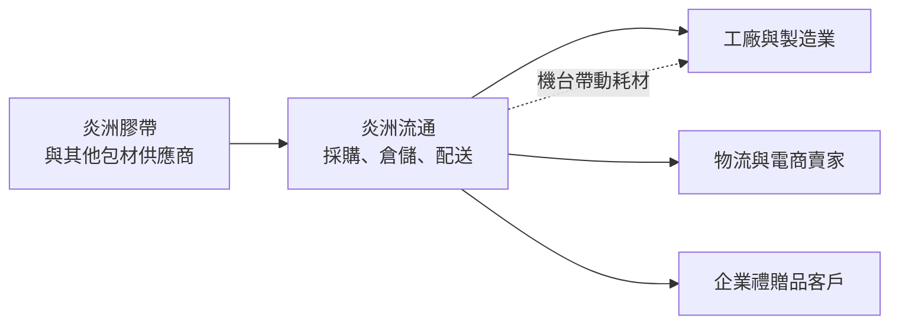
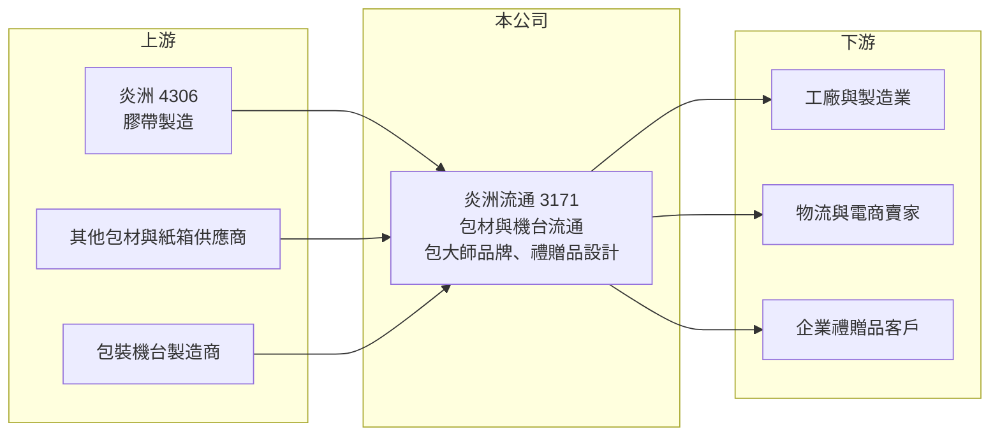

# 3171 炎洲流通

> 上櫃｜[[產業索引-居家生活|居家生活]]｜上市（櫃）日期 2004/09/17

# 第一章：企業模式與商業藍圖

> [!info] 撰寫說明
> 本文由 Claude 依公開資料整理，架構比照 [[2330台積電]] 的四章研究，資料截至 2026-10-08。財務數字來源：Goodinfo 台灣股市資訊網年度經營績效、MoneyDJ 公司基本資料（富邦證券版）、櫃買中心開放資料（本筆記 _data 快照）、時報資訊新聞標題；集團架構參考本庫 [[4306炎洲]] 筆記（整理自炎洲法說會）。公開資料有限，併購標的名稱與產品細項比重未查得，產業描述為整理性內容，尚未逐條比對原始文件。#待校對

在評估單一個股的長期投資價值時，首要步驟是拆解企業的底層獲利邏輯。本章說明炎洲流通（股票代號：3171）這家炎洲集團旗下的包材通路商，如何把膠帶、包材與包裝機台賣給成千上萬的中小企業，以及 2025 年的併購如何改變它的規模。

## 一、核心定位：炎洲集團的包材流通事業

炎洲流通成立於 1990 年，總部位於台北內湖，2004 年在櫃買中心掛牌，是膠帶大廠 [[4306炎洲]] 的上櫃子公司。依炎洲法說會的事業群分類，炎洲流通負責集團的「流通事業」，業務包括包裝材料買賣、包裝機台買賣，以及禮贈品設計，並經營「包大師」品牌。

炎洲流通的角色是通路商。它向母公司炎洲與其他供應商採購膠帶、緩衝材、紙箱、封箱機等產品，再賣給工廠、物流業者、電商賣家與一般企業。對母公司而言，炎洲流通是直接接觸中小企業客戶的管道；對客戶而言，它提供一站式採購，讓客戶不必分別向多家供應商叫貨。

## 二、產品板塊：包裝材料為唯一主業

依 MoneyDJ 整理的 2025 年營收比重，包裝材料占 100%。這裡的包裝材料是廣義分類，依集團資料包括：

* **膠帶與包材：** 封箱膠帶、緩衝材、紙箱、捆包帶、拉伸膜等消耗性包材。包材是企業出貨時每天都要用的耗材，需求穩定、回購頻率高。
* **包裝機台：** 封箱機、捆包機、打包設備等，單價較高，可以帶動後續的耗材銷售。
* **禮贈品設計：** 替企業設計與製作客製化禮品與包裝，屬於附加價值較高的服務。

## 三、資本轉化邏輯：耗材通路的周轉生意

* **毛利率中等、靠周轉獲利：** 毛利率長期在 22% 至 28%，屬於通路商的典型水準；營業利益率在 5% 至 9% 之間，對通路商來說算是不錯，代表費用控制與品項組合良好。
* **耗材的穩定性：** 包材需求跟著製造業與電商出貨量變動，但每家企業都需要包裝，客戶分散，單一客戶的影響小。
* **機台帶動耗材：** 先賣出包裝機台，後續就能持續銷售對應的膠帶與捆包材料，這種「機台加耗材」的模式能提高客戶黏著度。

## 四、企業長期藍圖：併購擴大規模

* **2025 年併購：** 依時報資訊標題，炎洲流通受惠於併購效益，2025 年前三季合併營收 13.22 億元、EPS 3.11 元；依炎洲法說會資料，併購發生在 2025 年第三季。2026 年第二季資產負債表出現約 1.36 億元的非控制權益，推估被併購的公司並非 100% 持有。併購讓營收從 2024 年的 14.4 億元成長到 2025 年的 19.1 億元。
* **集團協同：** 母公司掌握膠帶製造，炎洲流通掌握通路，兩者合作能提高集團在包材市場的覆蓋率。
* **資本配置習慣：** 2019 至 2025 年度現金股利分別為 1.58、1.85、1.57、1.00、2.00、3.00、4.64 元。2025 年度股利 4.64 元高於 EPS 4.30 元，配息率超過 100%（推算），屬於積極的現金回饋。另外，2024 至 2025 年淨利由 1.11 億元增加到 1.43 億元，EPS 卻由 2.12 元增加到 4.30 元，推估期間股本縮小（可能為減資），需對照公告確認。

# 第二章：護城河深度與競爭優勢

在長期價值投資中，「護城河」指企業抵禦競爭、維持超額利潤的保護機制。本章分析炎洲流通的通路優勢、主要對手，以及包材通路的競爭格局。

## 一、護城河的核心組成要素

炎洲流通的護城河屬於窄護城河，主要來自集團支援與客戶基礎。

* **1. 母公司的製造後盾：** 炎洲在台灣膠帶市場經營近五十年，炎洲流通可以取得穩定的貨源與較好的進貨條件，這是一般包材經銷商不具備的優勢。
* **2. 廣大的中小企業客戶基礎：** 包材客戶數量多、單筆金額小，通路商需要長期累積客戶名單與配送網路。這種分散的客戶基礎，新進者不容易短期建立。
* **3. 一站式採購與服務：** 從膠帶、紙箱到包裝機台與維修都能提供，讓客戶省去管理多家供應商的麻煩，提高轉換成本。

## 二、主要競爭對手格局

| 對手 | 定位 | 對炎洲流通的威脅 |
|---|---|---|
| 地方包材行與經銷商 | 在地服務、價格彈性 | 在區域市場搶中小客戶（推估） |
| 電商包材賣家 | 低價、網路下單 | 搶標準化耗材（推估） |
| 其他膠帶製造商的直銷通路 | 製造商直接供貨 | 搶大型工廠客戶（推估） |

## 三、優勢轉化：守得住／守不住／觀察重點

* **守得住：** 需要機台、維修與穩定供貨的工廠與物流客戶，以及客製化的禮贈品業務。
* **守不住：** 標準化的封箱膠帶與紙箱，這類商品容易在網路比價。
* **觀察重點：** 長期可以觀察三件事：併購後的營收能否持續維持在 19 億元以上；營業利益率能否維持在 8% 以上；以及併購子公司的整合效益，例如共同採購與交叉銷售。

# 第三章：財務體質與盈利規模

資料日期：2026-10-08。數字取自 Goodinfo 年度經營績效、MoneyDJ 與櫃買中心開放資料快照，表格是撰寫當時的快照；最新月營收、毛利率、累計 EPS 由自動排程寫在本筆記的屬性欄位（月營收、毛利率、累計EPS 等）。#待校對

財務報表是檢驗護城河是否真實存在的最終標準。本章用多年度的三率、ROE 與資本報酬，檢視炎洲流通的獲利品質。

## 一、獲利能力的基石：三率

| 年度 | 營收（新台幣） | [[毛利率]] | [[營業利益率]] | EPS（元） | [[ROE]] |
|---|---|---|---|---|---|
| 2018 | 14.8 億 | 22.9% | 4.7% | 1.09 | 8.8% |
| 2019 | 14.3 億 | 25.2% | 8.6% | 1.75 | 13.2% |
| 2020 | 15.6 億 | 26.2% | 8.5% | 2.12 | 14.2% |
| 2021 | 18.4 億 | 22.2% | 5.6% | 1.64 | 11.2% |
| 2022 | 16.7 億 | 23.8% | 7.7% | 1.83 | 12.4% |
| 2023 | 14.1 億 | 28.3% | 9.0% | 2.08 | 13.2% |
| 2024 | 14.4 億 | 28.0% | 8.4% | 2.12 | 12.4% |
| 2025 | 19.1 億 | 26.4% | 9.2% | 4.30 | 19.0% |

* **[[毛利率]]：** 在 22% 至 28% 之間。2021 年營收最高、毛利率卻最低，推估與原物料上漲時進貨成本先增加、售價後調整有關；2023 年後毛利率提升到 28% 左右。
* **[[營業利益率]]：** 2019 年後多數年份在 7.7% 至 9.2%，相當穩定，顯示費用控制良好。
* **長期指標：** 2020 至 2025 年營收年複合成長率約 4.1%（推算），2025 年前營收大致在 14 至 18 億元之間，成長主要來自併購。2021 至 2025 年五年平均 ROE 約 13.6%（推算）。

## 二、[[ROE]]：資本效率

ROE 長期在 11% 至 14%，2025 年在併購與股本變動下提升到 19%。依 2026 年第二季資產負債表，總資產約 18.4 億元、總負債約 11.4 億元（幾乎都是流動負債）、權益約 7.0 億元（含非控制權益 1.36 億元），負債比約 62%。通路商的流動負債多為應付帳款與短期借款，負債比偏高是營運模式的特性。

## 三、資本支出與自由現金流

* **[[CapEx]]：** 通路業務以倉儲與配送設備為主，資本支出小，具體數字未查得。
* **[[自由現金流]]：** 獲利穩定、資本支出小，推估自由現金流多數年份為正，並支撐每年 1.5 元以上的現金股利；2025 年併購屬於一次性的投資支出，逐年數字未查得。

## 四、[[ROIC]] 與 [[WACC]]：價值創造利差

有息負債金額未查得，以權益近似投入資本。以 2025 年為例，營業利益約 1.75 億元（營收 19.1 億元 × 營業利益率 9.17%），扣除 20% 稅率後約 1.40 億元，以權益約 7.0 億元計算，ROIC 約 20%（推算）。若流動負債中有部分短期借款，實際 ROIC 會較低，但以 2019 至 2024 年 ROE 多在 12% 以上判斷，ROIC 長期推估在 10% 以上。

WACC 以 CAPM 推估：台灣 10 年期公債約 1.5% 至 2%，市場風險溢酬約 6%。MoneyDJ 所列 β 為 0.28，推估受交易量偏低影響，改採通路與包材股常見的 0.6 至 0.8（假設），股東權益成本約 5.1% 至 6.8%。考量短期借款、負債成本假設約 2.5%，WACC 約 4.5% 至 6%（推算）。

ROIC 長期高於 WACC，代表炎洲流通這個輕資產的通路生意持續創造價值。併購後能否維持相同的資本報酬，是未來幾年的觀察重點。

# 第四章：總體風險與地緣政治

任何企業都無法脫離宏觀環境獨立存在。本章分析炎洲流通長期必須面對的景氣、原料與營運風險。

## 一、地緣政治與貿易

* **製造業外移：** 台灣製造業若持續外移，國內工廠的包材需求可能減少。
* **進口包材競爭：** 中國與東南亞的低價包材進口，會壓低標準化產品的價格。

## 二、產業週期與市場結構

* **製造業與電商景氣：** 包材需求跟著出貨量變動，製造業景氣循環與電商成長速度，都會影響營收。
* **[[長鞭效應]]：** 客戶在景氣好時多備包材，景氣轉弱時去化庫存，會放大通路商的營收波動。

## 三、營運環境的隱性風險

* **[[原物料]]價格：** 膠帶與包材的原料來自石化與紙漿，價格上漲時，通路商的進貨成本會先增加，售價調整有時間落差。
* **併購整合：** 併購後的人員、系統與客戶整合需要時間，若整合不順，可能無法達到預期效益。
* **集團關係：** 與母公司炎洲的交易屬於關係人交易，交易條件需要透明合理，以保障小股東權益。

## 四、科技或法規演進

* **環保包材：** 塑膠減量與包材回收法規趨嚴，客戶轉向紙質或可回收包材，通路商需要調整商品組合。
* **自動化包裝：** 物流業與工廠導入自動化包裝設備，是機台銷售的機會，但也需要提升技術服務能力。

# 專有名詞解析

## 金融

- **[[長鞭效應]]**：終端需求的小幅變動，沿供應鏈往上游傳遞時被逐級放大，造成上游庫存與訂單劇烈波動。
- **[[ROIC]]**：投入資本報酬率，稅後營業利益除以投入資本，衡量本業運用資金創造報酬的能力。
- **[[WACC]]**：加權平均資金成本，股東與債權人要求報酬率的加權平均，是 ROIC 要超過的門檻。

## 產業

- **[[原物料]]**：生產所需的基礎材料，價格波動會直接影響製造業的成本與毛利率。

# 核心供應鏈

## 1. 上游：供應商
- 母公司：[[4306炎洲]]（膠帶）
- 其他包材、紙箱與包裝機台供應商，名單未揭露

## 2. 本公司：炎洲流通
- 包材買賣、包裝機台買賣、禮贈品設計，品牌「包大師」
- 2025 年第三季完成併購，擴大流通規模

## 3. 下游：客戶
- 工廠、物流業者、電商賣家與一般企業

## 4. 同業
- 地方包材經銷商、電商包材賣家（推估）

## 最新新聞
<!-- news:start -->
<!-- news:end -->

## 相關連結
- [公開資訊觀測站](https://mopsov.twse.com.tw/mops/web/t05st03?step=1&firstin=1&co_id=3171)
- [Goodinfo](https://goodinfo.tw/tw/StockDetail.asp?STOCK_ID=3171)
- [Yahoo 股市](https://tw.stock.yahoo.com/quote/3171)
- [鉅亨網新聞](https://www.cnyes.com/twstock/3171/news)
