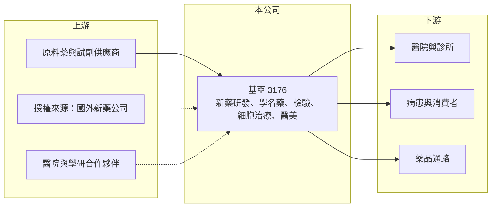

# 3176 基亞

> 上櫃｜[[產業索引-生技醫療業|生技醫療業]]｜上市（櫃）日期 2011/11/23

# 第一章：企業模式與商業藍圖

> [!info] 撰寫說明
> 精簡版，由 Claude 依公開資料整理，架構比照 [[2330台積電]] 的四章研究，資料截至 2026-10-08。來源：Goodinfo 年度經營績效頁（2020 至 2025 年）、櫃買中心開放資料（基本資料、2026 年第二季資產負債與綜合損益）、nStock 公司介紹；子公司結構與研發管線憑既有知識撰寫，已標「待校對」。公開資料有限。#待校對

基亞生物科技（股票代號：3176，以下簡稱基亞）是一家從新藥研發起家、後來發展成多角化生技集團的公司。理解它的重點在於分清楚兩件事：本業的穩定收入來自哪裡，以及財報上的大幅波動來自哪些轉投資。

- **核心業務：** 基亞 1999 年底設立、2011 年 11 月上櫃，董事長為張世忠（櫃買中心開放資料）。依公司自述，營業項目包括生物製藥研發、[[細胞治療]]、高階核酸檢驗、[[學名藥]]、醫美產品與疫苗相關產品的生產與銷售（nStock 公司介紹）。換句話說，基亞已不是單一新藥公司，而是以多個事業與轉投資組成的生技集團。
- **營收結構：** 各事業的營收比重本次未查得。合併資產負債表中，非控制權益約 32.3 億元，高於歸屬母公司的權益 14.8 億元（2026 年第二季底，櫃買中心開放資料），代表基亞合併了持股未達百分之百、但規模相當大的子公司，合併營收與損益有很大一部分屬於其他股東。
- **研發歷史：** 基亞早年以肝癌術後輔助新藥 PI-88 聞名，2014 年第三期臨床期中分析未達預期，是台灣生技股重要的一課（商業周刊 2014 年報導）。#待校對 之後公司引進溶瘤病毒新藥 OBP-301 等研發項目，並投入細胞治療與檢驗服務，把收入來源從單一新藥分散到多個事業。#待校對
- **長期方向：** 基亞的長期價值取決於兩點：一是學名藥、檢驗、醫美等現有事業能否穩定獲利，讓集團不再依賴募資；二是細胞治療與新藥項目能否取得藥證或授權收入。2025 年營收 15.8 億元、營業虧損率收斂到 9.92%（Goodinfo），顯示本業規模正在擴大，但尚未轉為穩定獲利。

# 第二章：護城河深度與競爭優勢

基亞的競爭力來自多元的生技事業組合與研發經驗，但多數事業規模不大，護城河仍在建立中。

- **競爭優勢：** 基亞同時擁有新藥研發、學名藥生產、檢驗服務與細胞治療的能力，可以在集團內互相支援，例如檢驗與細胞治療共享實驗室與法規經驗。2025 年毛利率 54.2%（Goodinfo），表示現有產品與服務的毛利水準不差，虧損主要來自研發與營業費用。
- **主要對手：** 細胞治療有眾多新創公司與醫院團隊投入，市場相當分散；學名藥有 [[1795美時]]、[[4114健喬]] 等大型藥廠；新藥研發則要面對國際藥廠的競爭。#待校對 基亞在每一個領域都不是規模最大的業者。
- **觀察重點：** 第一，營業利益率能否由負轉正並維持；第二，細胞治療在台灣《再生醫療法》架構下的收入能否擴大；第三，新藥項目是否有明確的臨床或授權里程碑。只有在這些里程碑出現時，研發投入才會轉為股東價值。

# 第三章：財務體質與盈利規模

資料日期：2026-10-08，表格是撰寫當時的快照；最新月營收、毛利率、累計 EPS 由自動排程寫在本筆記的屬性欄位（月營收、毛利率、累計EPS 等）。#待校對

基亞的財報波動極大，閱讀時要特別留意合併範圍與一次性收入，不能只看單一年度。

| 年度 | 營收（新台幣） | [[毛利率]] | [[營業利益率]] | EPS（元） | [[ROE]] |
|---|---|---|---|---|---|
| 2020 | 6.16 億 | 42.6% | -148% | -2.43 | -23.6% |
| 2021 | 39.2 億 | 65.1% | 20.1% | -0.38 | 19.6% |
| 2022 | 10.6 億 | 8.28% | -158% | -4.86 | -30.0% |
| 2023 | 11.6 億 | 53.3% | -107% | -4.03 | -25.6% |
| 2024 | 13.7 億 | 54.9% | -15.8% | -1.47 | -4.43% |
| 2025 | 15.8 億 | 54.2% | -9.92% | -0.78 | -6.07% |
| 2026 上半年 | 5.46 億 | 56.5% | -8.6% | -0.57 | 未查得 |

- **營收規模：** 2021 年營收跳升到 39.2 億元、營業利益率轉正，2022 年又掉回 10.6 億元且毛利率只有 8.28%。推估與當時合併的疫苗相關子公司在疫情期間的銷售與後續存貨跌價有關（推估，待校對）。同年 EPS 為負、ROE 卻為正，代表合併淨利中有相當部分屬於非控制權益（推估）。2023 年以後的數字較能代表目前的本業。
- **獲利：** 2023 至 2025 年營業虧損率由 107% 收斂到 9.92%，2026 年上半年為 -8.6%（櫃買中心開放資料），本業正在逐步接近損益兩平。但六年中只有 2021 年營業利益為正，EPS 全部為負。
- **財務特色：** 2026 年第二季底總資產約 69.0 億元、總負債約 21.9 億元，權益總計約 47.1 億元，其中歸屬母公司僅約 14.8 億元，保留盈餘為負（櫃買中心開放資料）。近五年沒有配發股利（nStock）。

**[[ROIC]] 與 [[WACC]]：**
- ROIC（推算）：2025 年營業利益約 15.8 億元 × -9.92% ≈ -1.57 億元；投入資本以權益總計 47.1 億元加上推估的有息負債約 10 億元（非流動負債 15.1 億元的一部分，假設），合計約 57 億元，ROIC 約 -2.7%（推算）。ROIC 為負，代表本業仍在消耗資本。
- WACC（推算）：無風險利率 1.75%、市場風險溢酬 6%，β 取生技研發股常見值 1.2（假設），股東權益成本約 9.0%；負債成本 2.5%、稅後 2.0%，負債占比約 18%，WACC 約 7.7%（推算）。
- 結論：ROIC 遠低於 WACC，基亞目前並未創造經濟價值。對研發型生技公司而言這並不罕見，投資判斷的重點在於研發與子公司事業能否在可預見的時間內轉為正的 ROIC。

# 第四章：總體風險與地緣政治

基亞的風險具有典型研發型生技公司的特徵：研發結果不確定、需要持續募資，以及集團結構複雜。

- **產業週期：** 生技股的資金環境受利率與市場情緒影響很大，資金緊縮時研發型公司募資困難，可能被迫縮減研發或稀釋股權。疫情期間的疫苗與檢測需求已證明是一次性的，不能當作長期收入。
- **營運風險：** 新藥與細胞治療的臨床試驗可能失敗或延誤，PI-88 的經驗說明單一新藥失敗對公司價值的衝擊有多大。#待校對 合併子公司眾多，母公司股東實際享有的獲利比合併報表顯示的少，閱讀財報時要以歸屬母公司的數字為準。
- **其他風險：** 細胞治療受《再生醫療法》與相關法規的審查要求影響，法規細節與健保給付政策的變化，會直接影響收入能否放量。學名藥則面臨健保藥價調降的長期壓力。

# 專有名詞解析

## 金融

- **[[ROIC]]**：投入資本報酬率，稅後營業利益除以股東權益與有息負債的合計，衡量本業對所有資金提供者的報酬。
- **[[WACC]]**：加權平均資金成本，依股東權益與負債的比重加權計算的資金成本，ROIC 高於它才代表創造價值。

## 產業

- **[[學名藥]]**：原廠藥專利到期後，其他藥廠依相同成分與劑型生產的藥品，價格通常較低。
- **[[細胞治療]]**：取出並培養、改造人體細胞後再輸回患者體內的治療方式，台灣以《再生醫療法》規範。
- **[[溶瘤病毒]]**：經改造後專門感染並破壞癌細胞的病毒，同時可刺激免疫系統攻擊腫瘤。
- **[[非控制權益]]**：合併子公司中不屬於母公司的股東權益，代表子公司其他股東的份額。

# 核心供應鏈

- 上游：原料藥、試劑與檢驗耗材供應商；新藥授權來源（如 OBP-301 的原開發公司）；合作執行臨床試驗與細胞治療的醫院。#待校對
- 下游／客戶：醫院、診所、醫美通路與藥品經銷商。
- 同業：細胞治療與新藥研發業者、學名藥廠如 [[1795美時]]、[[4114健喬]]。#待校對

## 最新新聞
<!-- news:start（自動產生，請勿手動編輯此範圍） -->
- 2026-10-08 📰 媒體 19:51｜營收速報 - 基亞(3176)9月營收2.55億元年增率高達49.6％｜[鉅亨網](https://news.cnyes.com/news/id/6625874)

完整紀錄：[[3176基亞 新聞]]
<!-- news:end -->

## 相關連結
- [公開資訊觀測站](https://mopsov.twse.com.tw/mops/web/t05st03?step=1&firstin=1&co_id=3176)
- [Goodinfo](https://goodinfo.tw/tw/StockDetail.asp?STOCK_ID=3176)
- [Yahoo 股市](https://tw.stock.yahoo.com/quote/3176)
- [鉅亨網新聞](https://www.cnyes.com/twstock/3176/news)
